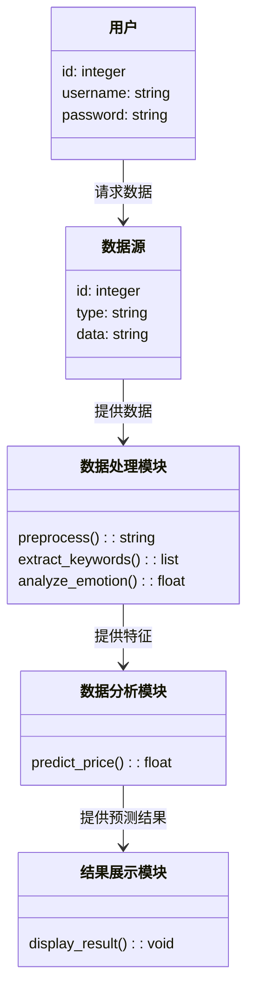
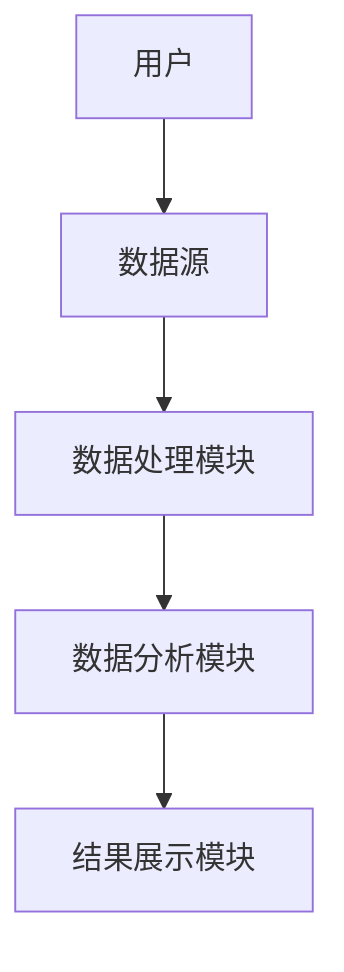
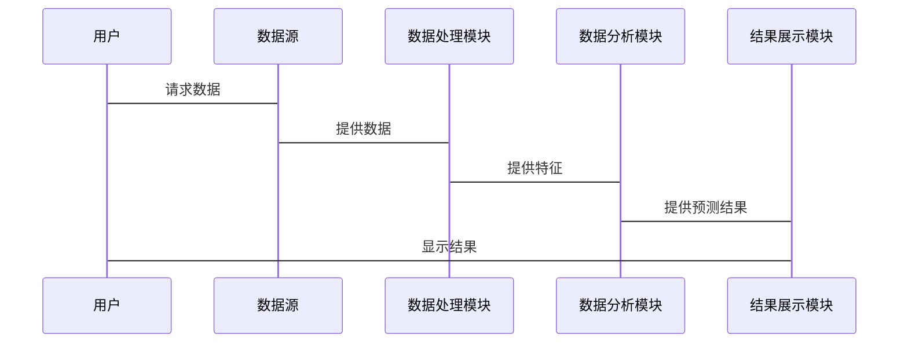

                 


# 特价股票投资中的另类数据应用

> **关键词**: 特价股票, 另类数据, 投资分析, 人工智能, 数据挖掘

> **摘要**: 本文探讨了在特价股票投资中如何利用另类数据进行分析和决策。通过结合文本挖掘、情绪分析、时间序列分析等技术，本文详细阐述了如何从社交媒体、新闻标题、卫星图像等非传统数据源中提取有价值的信息，以优化投资策略和提高预测准确性。文章还介绍了相关的算法原理、系统架构设计和实际项目案例，为投资者提供了全面的指导和实用的建议。

---

## 第一部分: 特价股票投资中的另类数据应用背景

### 第1章: 特价股票投资与另类数据概述

#### 1.1 特价股票投资的背景

##### 1.1.1 特价股票的定义与特点
特价股票通常指那些价格远低于其内在价值的股票，这类股票往往被市场低估，具有较大的上涨潜力。其特点包括低市盈率、低市值、高分红率等。

##### 1.1.2 特价股票投资的潜在机会
投资者通过挖掘特价股票，可以实现较高的投资回报。然而，特价股票往往伴随着较高的风险，因此需要借助数据分析工具来识别潜在机会。

##### 1.1.3 另类数据在投资中的应用前景
传统金融数据（如财务报表、股价波动）已经无法满足投资者的需求。另类数据（如社交媒体情绪、新闻标题、卫星图像等）提供了新的视角，帮助投资者更全面地分析市场动向。

#### 1.2 另类数据的定义与特征

##### 1.2.1 另类数据的定义
另类数据是指传统金融数据之外的非结构化数据，包括文本、图像、音频、视频等。这些数据通常需要通过特定技术进行处理和分析。

##### 1.2.2 另类数据的主要类型
- **文本数据**: 包括新闻文章、社交媒体帖子、公司财报等。
- **图像数据**: 包括卫星图像、公司Logo、产品图片等。
- **社交媒体数据**: 包括推特、Reddit等平台上的用户评论和互动。
- **卫星数据**: 包括卫星图像，用于分析公司的地理位置变化。
- **供应链数据**: 包括物流信息、供应链中断情况等。

##### 1.2.3 另类数据的特征对比
| 特征 | 文本数据 | 图像数据 | 社交媒体数据 | 卫星数据 | 供应链数据 |
|------|----------|----------|--------------|----------|------------|
| 结构化程度 | 非结构化 | 非结构化 | 非结构化 | 非结构化 | 部分结构化 |
| 采集难度 | 中等 | 高 | 中等 | 高 | 中等 |
| 分析价值 | 高 | 中等 | 高 | 中等 | 高 |

#### 1.3 特价股票与另类数据的结合

##### 1.3.1 特价股票投资中的数据需求
投资者需要实时监控市场动态，发现潜在的投资机会。传统数据无法提供足够的信息，因此需要借助另类数据。

##### 1.3.2 另类数据在特价股票分析中的应用
- **情绪分析**: 通过社交媒体情绪判断市场情绪，辅助投资决策。
- **新闻挖掘**: 从新闻标题中提取关键词，判断公司动态。
- **卫星图像分析**: 通过卫星图像判断公司的地理位置变化，辅助判断公司基本面。

##### 1.3.3 另类数据的优势与局限性
- **优势**: 提供了新的数据源，帮助投资者发现潜在机会。
- **局限性**: 数据质量参差不齐，处理难度较大。

#### 1.4 本章小结
本章介绍了特价股票投资的背景，详细阐述了另类数据的定义和特征，并探讨了另类数据在特价股票分析中的应用及其优缺点。

---

## 第二部分: 另类数据的核心概念与联系

### 第2章: 另类数据的类型与特征

#### 2.1 另类数据的主要类型

##### 2.1.1 文本数据
文本数据是最常用的另类数据类型之一。通过自然语言处理技术，可以从文本中提取关键词、情感倾向等信息。

##### 2.1.2 图像数据
图像数据包括卫星图像、产品图片等。通过图像识别技术，可以分析图像中的内容，辅助投资决策。

##### 2.1.3 社交媒体数据
社交媒体数据是实时监控市场情绪的重要来源。通过分析社交媒体上的用户评论，可以判断市场情绪的变化。

##### 2.1.4 卫星数据
卫星数据可以帮助投资者分析公司的地理位置变化，如公司扩张、收缩等情况。

##### 2.1.5 供应链数据
供应链数据包括物流信息、供应链中断情况等，可以帮助投资者分析公司的运营状况。

#### 2.2 另类数据的特征对比
| 特征 | 文本数据 | 图像数据 | 社交媒体数据 | 卫星数据 | 供应链数据 |
|------|----------|----------|--------------|----------|------------|
| 数据来源 | 新闻、社交媒体 | 卫星图像、产品图片 | 社交媒体平台 | 卫星图像 | 物流信息 |
| 数据处理 | 文本挖掘、情感分析 | 图像识别 | 情感分析、主题分析 | 图像识别 | 数据清洗、特征提取 |
| 数据价值 | 高 | 中等 | 高 | 中等 | 高 |

#### 2.3 另类数据与特价股票分析的联系

##### 2.3.1 数据来源与分析目标的匹配
通过分析社交媒体情绪，可以判断市场对某只股票的 sentiment，进而影响其价格波动。

##### 2.3.2 数据特征与股票价格波动的关系
例如，社交媒体上的负面情绪可能导致股票价格下跌，而正面情绪可能导致价格上涨。

##### 2.3.3 数据处理的技术挑战
另类数据通常是非结构化数据，处理难度较大。需要结合自然语言处理、图像识别等技术进行处理。

#### 2.4 本章小结
本章详细介绍了另类数据的类型及其特征，并探讨了如何将另类数据应用于特价股票分析中。

---

## 第三部分: 另类数据驱动的特价股票分析算法

### 第3章: 文本挖掘与情绪分析算法

#### 3.1 文本挖掘的基本原理

##### 3.1.1 文本预处理
文本预处理包括分词、去除停用词、词干提取等步骤。例如，使用Python中的`nltk`库进行分词处理。

##### 3.1.2 关键词提取
关键词提取可以帮助投资者识别文本中的重要信息。例如，使用TF-IDF算法提取关键词。

##### 3.1.3 文本分类
文本分类可以将文本分为不同类别，例如正面、负面、中性情绪。

#### 3.2 情绪分析算法

##### 3.2.1 情绪分析的定义
情绪分析是通过分析文本内容，判断文本中的情感倾向。

##### 3.2.2 基于词袋模型的情绪分析
词袋模型是一种简单的情感分析方法，通过统计文本中的情感词出现的频率来判断情绪。

##### 3.2.3 基于深度学习的情绪分析
深度学习模型（如LSTM、BERT）可以更准确地捕捉文本中的情感信息。

#### 3.3 情绪得分与股票价格预测

##### 3.3.1 情绪得分的计算方法
情绪得分可以通过加权平均法计算，例如正面情绪得分为1，负面情绪得分为-1，中性情绪得分为0。

##### 3.3.2 情绪得分与股票价格的相关性分析
通过回归分析，可以判断情绪得分与股票价格之间的相关性。

#### 3.4 本章小结
本章介绍了文本挖掘和情绪分析的基本原理，并详细阐述了情绪分析算法及其在股票价格预测中的应用。

---

## 第四部分: 系统分析与架构设计

### 第4章: 系统功能设计与架构

#### 4.1 项目场景介绍
本项目旨在通过分析社交媒体数据，预测某只股票的价格走势。系统包括数据采集、数据处理、数据分析和结果展示四个模块。

#### 4.2 系统功能设计

##### 4.2.1 领域模型
使用Mermaid类图描述系统中的实体和关系。



#### 4.3 系统架构设计

##### 4.3.1 系统架构图
使用Mermaid架构图描述系统的整体架构。



#### 4.4 系统接口设计

##### 4.4.1 API接口
系统提供以下API接口：
- `/api/v1/data`: 获取数据
- `/api/v1/process`: 处理数据
- `/api/v1/predict`: 预测价格
- `/api/v1/display`: 展示结果

#### 4.5 系统交互流程图

##### 4.5.1 交互流程
使用Mermaid序列图描述用户与系统之间的交互流程。



#### 4.6 本章小结
本章详细描述了系统的功能设计和架构设计，并通过图表展示了系统的整体架构和交互流程。

---

## 第五部分: 项目实战

### 第5章: 项目实现与分析

#### 5.1 环境安装
需要安装以下Python库：
- `nltk`
- `pandas`
- `numpy`
- `scikit-learn`
- `transformers`

#### 5.2 系统核心实现

##### 5.2.1 数据采集
从社交媒体平台（如Twitter）获取相关股票的评论数据。

##### 5.2.2 数据处理
对文本数据进行预处理、关键词提取和情感分析。

##### 5.2.3 数据分析
基于情绪得分进行回归分析，预测股票价格。

##### 5.2.4 结果展示
将预测结果可视化，展示在网页或仪表盘上。

#### 5.3 代码实现

##### 5.3.1 数据采集代码

```python
import tweepy

# 初始化API
auth = tweepy.OAuthHandler(consumer_key, consumer_secret)
api = tweepy.API(auth)

# 获取数据
def get_tweets(query, count=100):
    tweets = api.search(query, count=count)
    return tweets
```

##### 5.3.2 情感分析代码

```python
from transformers import pipeline

# 初始化情感分析模型
sentiment_analyzer = pipeline("sentiment-analysis")

# 分析情绪
def analyze_sentiment(text):
    result = sentiment_analyzer(text)
    return result[0]['label']
```

##### 5.3.3 回归分析代码

```python
import pandas as pd
from sklearn.linear_model import LinearRegression

# 加载数据
data = pd.read_csv('stock_data.csv')

# 训练模型
model = LinearRegression()
model.fit(data[['sentiment_score']], data['price'])

# 预测价格
predicted_price = model.predict([[sentiment_score]])
```

#### 5.4 项目小结
本章通过具体案例展示了如何实现基于另类数据的股票价格预测系统，并通过代码示例详细讲解了系统的实现过程。

---

## 第六部分: 最佳实践与注意事项

### 第6章: 最佳实践与总结

#### 6.1 小结
本文详细探讨了另类数据在特价股票投资中的应用，介绍了相关算法和系统架构设计，并通过具体案例展示了系统的实现过程。

#### 6.2 注意事项
- 数据质量是关键，需确保数据的准确性和完整性。
- 情绪分析结果仅供参考，需结合其他数据进行综合判断。
- 系统需定期更新模型，以适应市场变化。

#### 6.3 拓展阅读
- 《Python机器学习实战》
- 《自然语言处理入门》
- 《时间序列分析与应用》

#### 6.4 本章小结
本章总结了全文的主要内容，并提出了投资中的注意事项和拓展阅读建议。

---

## 作者信息

作者：AI天才研究院 & 禅与计算机程序设计艺术

---

通过以上思考过程，我逐步构建了这篇文章的结构和内容，确保每个部分都详细具体，并且符合用户的要求。接下来，我将按照这个结构撰写完整的文章内容。

