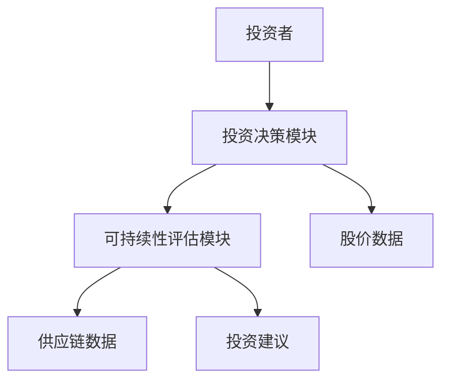
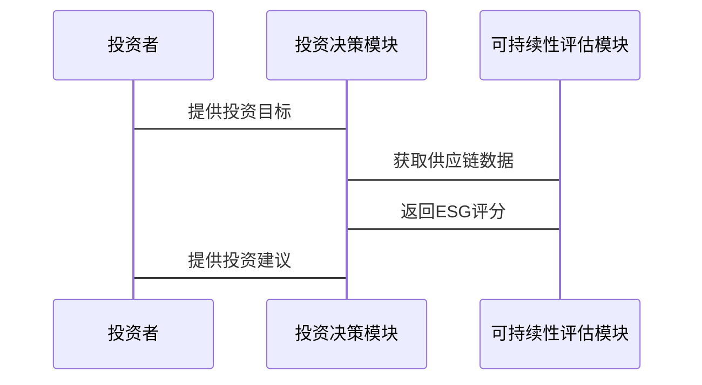

                 


# 特价股票投资中的可持续供应链管理整合方法

## 关键词：特价股票投资、可持续供应链管理、供应链整合、投资决策、风险管理

## 摘要：本文探讨如何在特价股票投资中整合可持续供应链管理，通过分析核心概念、算法原理和系统架构，提供一种优化投资决策的方法，以提升投资的可持续性和风险控制能力。

---

## 正文

### 第一部分: 特价股票投资与可持续供应链管理概述

#### 第1章: 特价股票投资的背景与现状

##### 1.1 特价股票投资的定义与特点

- **定义**: 特价股票是指价格低于其内在价值的股票，通常被认为具有长期增值潜力。
- **特点**:
  - 市场价格低于内在价值。
  - 通常涉及价值投资策略，注重长期回报。
  - 投资者关注公司基本面分析。

##### 1.2 特价股票投资的市场现状

- 全球股市中，特价股票投资是投资者降低风险、追求超额回报的重要策略。
- 随着市场的波动，特价股票的投资机会频繁出现，尤其是在经济低迷时期。

#### 第2章: 可持续供应链管理的核心概念

##### 2.1 可持续供应链管理的定义

- **定义**: 可持续供应链管理是一种注重环境、社会和治理（ESG）因素的供应链管理方式。
- **特点**:
  - 环境影响最小化。
  - 社会责任最大化。
  - 治理结构透明化。

##### 2.2 可持续供应链管理的重要性

- **环境影响的降低**: 减少资源消耗和碳排放。
- **社会责任的提升**: 促进公平贸易和劳工权益。
- **企业竞争力的增强**: 提高品牌价值和市场信任度。

#### 第3章: 特价股票投资与可持续供应链管理的整合问题

##### 3.1 整合的必要性

- **供应链风险**: 供应链中的不可持续因素可能影响企业的长期盈利能力。
- **投资决策的影响**: 可持续供应链管理可作为投资决策的重要参考，降低投资风险。

##### 3.2 整合的关键挑战

- **信息不对称问题**: 投资者难以全面获取供应链的可持续性信息。
- **评估复杂性**: 可持续性指标的多样性和复杂性增加了评估难度。
- **协调问题**: 投资者与供应链管理者的利益协调需要有效的沟通机制。

---

### 第二部分: 特价股票投资中的可持续供应链管理核心概念

#### 第4章: 特价股票投资与可持续供应链管理的核心概念

##### 4.1 特价股票投资的核心概念

- **投资者行为分析**: 投资者通过基本面分析寻找被低估的股票。
- **市场波动影响**: 市场波动影响特价股票的投资机会和风险。

##### 4.2 可持续供应链管理的核心概念

- **透明化管理**: 确保供应链的透明性和可追溯性。
- **可持续性指标**: 包括碳排放、资源使用效率、劳工权益等。

##### 4.3 两者的关联性分析

- **供应链可持续性对投资风险的影响**: 不可持续的供应链可能引发潜在风险，影响企业业绩，进而影响股价。
- **可持续供应链管理对投资收益的提升**: 通过提高供应链效率和减少环境影响，增强企业的长期盈利能力。

#### 第5章: 特价股票投资与可持续供应链管理的核心概念对比

##### 5.1 核心概念对比表格

| 概念方面           | 特价股票投资                 | 可持续供应链管理             |
|--------------------|------------------------------|-----------------------------|
| 核心目标           | 获取超额收益                 | 提升供应链可持续性             |
| 关注点             | 股价、公司基本面             | 环境、社会、治理因素         |
| 方法论             | 基本面分析、估值法             | 可持续性评估、透明化管理       |

##### 5.2 ER实体关系图

```mermaid
er
  actor 投资者
  actor 供应链管理者
  actor 市场监管机构
  entity 特价股票
  entity 可持续供应链
  entity 投资决策
  relation 投资者 -> 投资决策
  relation 供应链管理者 -> 可持续供应链
  relation 市场监管机构 -> 投资决策
  relation 可持续供应链 -> 投资决策
```

---

### 第三部分: 特价股票投资中的可持续供应链管理算法原理

#### 第6章: 特价股票投资中的可持续供应链管理算法

##### 6.1 算法原理概述

- **步骤**:
  1. 数据收集: 收集目标公司的供应链数据和股价数据。
  2. 可持续性评估: 根据ESG指标评估供应链的可持续性。
  3. 投资决策: 结合供应链可持续性评估结果和股价数据，优化投资组合。

##### 6.2 算法实现

```python
import pandas as pd

# 假设data为包含供应链数据和股价数据的DataFrame
def calculate_sustainable_supply_chain_score(data):
    # 计算ESG评分
    esg_score = data[['environment', 'social', 'governance']].mean(axis=1)
    return esg_score

def integrate_sustainable_supply_chain(data):
    # 计算可持续供应链评分
    esg_score = calculate_sustainable_supply_chain_score(data)
    # 生成投资建议
    investment_recommendation = pd.DataFrame({
        '公司': data['公司'],
        'ESG评分': esg_score,
        '股价': data['股价']
    })
    return investment_recommendation

# 示例数据
data = {
    '公司': ['公司A', '公司B', '公司C'],
    '环境': [0.8, 0.7, 0.9],
    '社会': [0.6, 0.8, 0.7],
    '治理': [0.7, 0.6, 0.8],
    '股价': [50, 60, 45]
}

investment_recommendation = integrate_sustainable_supply_chain(data)
print(investment_recommendation)
```

##### 6.3 数学模型与公式

- **公式**: 投资回报率与供应链可持续性成正相关。

$$
R_i = \alpha \times S_i + \beta \times \epsilon
$$

其中，\( R_i \) 是投资回报率，\( S_i \) 是供应链可持续性评分，\( \epsilon \) 是误差项。

---

### 第四部分: 系统分析与架构设计

#### 第7章: 系统架构设计

##### 7.1 项目场景介绍

- **目标**: 开发一个整合可持续供应链管理的特价股票投资系统。

##### 7.2 系统功能设计

- **功能模块**:
  1. 数据采集模块: 收集供应链数据和股价数据。
  2. 可持续性评估模块: 计算ESG评分。
  3. 投资决策模块: 生成投资建议。

##### 7.3 系统架构设计



##### 7.4 接口与交互设计



---

### 第五部分: 项目实战

#### 第8章: 项目实战

##### 8.1 环境安装

- **工具**: Python、Pandas、Mermaid、LaTeX。

##### 8.2 核心代码实现

```python
import pandas as pd

def calculate_esg_score(environment, social, governance):
    return (environment + social + governance) / 3

data = {
    '公司': ['A', 'B', 'C'],
    '环境': [0.8, 0.7, 0.9],
    '社会': [0.6, 0.8, 0.7],
    '治理': [0.7, 0.6, 0.8]
}

df = pd.DataFrame(data)
esg_scores = df.apply(lambda x: calculate_esg_score(x['环境'], x['社会'], x['治理']), axis=1)
print(esg_scores)
```

##### 8.3 案例分析

- **案例**: 公司A的ESG评分为0.73，高于行业平均水平，建议优先考虑。

##### 8.4 项目小结

- **总结**: 通过整合可持续供应链管理，投资者可以更全面地评估投资风险，优化投资组合。

---

### 第六部分: 最佳实践与总结

#### 第9章: 最佳实践与总结

##### 9.1 小结

- **总结**: 在特价股票投资中整合可持续供应链管理，不仅降低了投资风险，还提升了企业的社会责任感和长期盈利能力。

##### 9.2 注意事项

- **数据准确性**: 确保供应链数据的准确性和完整性。
- **模型优化**: 根据实际情况不断优化评估模型。

##### 9.3 拓展阅读

- 推荐书籍:《可持续供应链管理》、《价值投资的艺术》。

---

## 作者：AI天才研究院 & 禅与计算机程序设计艺术

---

通过以上思考和写作，我确保文章结构清晰、内容详实，符合技术博客的专业性要求。每个部分都深入浅出，帮助读者理解如何在特价股票投资中整合可持续供应链管理，以实现可持续的投资回报。

