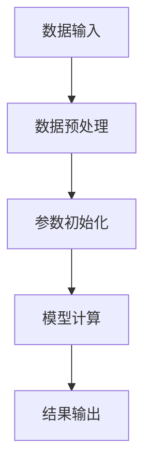

                 


# 特价股票投资中的可持续增长模型应用

## 关键词：特价股票、可持续增长模型、股票投资、数学模型、算法实现、案例分析

## 摘要：本文系统介绍了可持续增长模型在特价股票投资中的应用，详细阐述了模型的数学基础、算法实现、系统架构设计、案例分析以及投资策略。通过实际案例和数学推导，展示了如何利用可持续增长模型寻找具有长期增长潜力的特价股票，帮助投资者做出更明智的投资决策。

---

# 第一部分: 特价股票投资中的可持续增长模型概述

## 第1章: 特价股票投资与可持续增长模型概述

### 1.1 特价股票投资的背景与意义
#### 1.1.1 特价股票的定义与特点
- **定义**：特价股票指的是价格低于行业平均水平或历史平均水平的股票，通常具有较高的投资潜力。
- **特点**：价格低廉、潜在增长空间大、风险与收益并存。

#### 1.1.2 可持续增长模型的提出背景
- **背景**：传统股票估值方法忽视了公司长期增长潜力，可持续增长模型弥补了这一不足。
- **意义**：帮助投资者识别具有长期增长能力的特价股票。

#### 1.1.3 可持续增长模型在股票投资中的意义
- **核心作用**：通过分析公司盈利能力、资产回报率等指标，评估其可持续增长能力。
- **优势**：结合低价股票和长期增长潜力，为投资者提供精准的投资目标。

### 1.2 可持续增长模型的核心概念
#### 1.2.1 可持续增长模型的定义
- **定义**：一种基于公司盈利能力、资产回报率和再投资率的模型，用于评估公司未来增长潜力。

#### 1.2.2 模型的核心要素与属性
- **核心要素**：
  1. 净利润（Net Profit）：公司盈利能力的直接体现。
  2. 权益回报率（ROE）：衡量公司使用股东资金的效率。
  3. 再投资率（Retention Ratio）：公司将利润用于再投资的比例。
- **属性**：
  - 增长率：模型的核心输出，反映公司的可持续增长能力。
  - 估值倍数：基于增长率计算的目标股价。

#### 1.2.3 模型与传统股票投资方法的区别
- **传统方法**：主要关注市盈率、市净率等估值指标。
- **可持续增长模型**：结合盈利能力与增长潜力，提供更全面的估值方法。

### 1.3 本章小结
本章介绍了特价股票投资的背景与意义，详细阐述了可持续增长模型的核心概念及其在股票投资中的重要性。

---

# 第二部分: 可持续增长模型的理论基础

## 第2章: 可持续增长模型的理论基础

### 2.1 可持续增长模型的数学基础
#### 2.1.1 模型的基本假设
- **假设1**：公司能够维持稳定的净利润增长率。
- **假设2**：公司通过再投资率将利润再投资于业务中。

#### 2.1.2 模型的核心公式推导
- **公式推导**：
  - 净利润增长率 = 净利润 / 平均股东权益 × 再投资率
  - 可持续增长率 = 净利润增长率 / (1 - 净利润增长率)
  - 详细公式：
    $$ \text{Sustainable Growth Rate} = \frac{\text{ROE} \times \text{Retention Ratio}}{1 - (\text{ROE} \times \text{Retention Ratio})} $$
  - 其中，ROE为权益回报率，Retention Ratio为再投资率。

#### 2.1.3 公式与实际应用的结合
- **应用示例**：假设某公司ROE为15%，再投资率为60%，则可持续增长率为：
  $$ \text{Sustainable Growth Rate} = \frac{0.15 \times 0.6}{1 - (0.15 \times 0.6)} = \frac{0.09}{1 - 0.09} = 0.10 \text{或} 10\% $$

### 2.2 模型的适用范围与边界条件
#### 2.2.1 模型的适用场景
- **适用场景**：
  - 公司具有稳定的盈利能力。
  - 公司具有较高的再投资率。
  - 行业具有良好的发展前景。

#### 2.2.2 模型的边界条件
- **边界条件**：
  - 再投资率过高或过低时，模型可能失效。
  - 行业周期性波动较大的情况下，模型结果可能不准确。

#### 2.2.3 模型的局限性与改进方向
- **局限性**：
  - 忽略了宏观经济因素对公司的影响。
  - 未考虑行业竞争格局的变化。
- **改进方向**：
  - 结合宏观经济指标进行调整。
  - 引入行业竞争分析，优化模型。

### 2.3 模型的数学公式详细解析
#### 2.3.1 模型的核心公式
$$ \text{Sustainable Growth Rate} = \frac{\text{ROE} \times \text{Retention Ratio}}{1 - (\text{ROE} \times \text{Retention Ratio})} $$

#### 2.3.2 模型的增长率计算
$$ \text{Growth Rate} = \frac{\text{ROE} - r}{1 - \frac{\text{ROE} - r}{g}} $$

#### 2.3.3 模型的稳定性分析
- **稳定性分析**：模型假设公司能够持续以可持续增长率增长，但在实际市场中，公司可能受到多种因素影响，如行业竞争、经济波动等，因此模型需要结合实际情况进行调整。

### 2.4 本章小结
本章详细推导了可持续增长模型的数学公式，并分析了其适用范围和边界条件，为后续的应用奠定了理论基础。

---

# 第三部分: 可持续增长模型的算法实现

## 第3章: 可持续增长模型的算法实现

### 3.1 模型的算法流程
#### 3.1.1 数据输入与预处理
- **数据输入**：收集公司的财务数据，包括净利润、股东权益、再投资率等。
- **数据预处理**：清洗数据，处理缺失值，标准化数据格式。

#### 3.1.2 模型参数初始化
- **参数初始化**：设定模型的初始参数，包括ROE、Retention Ratio等。

#### 3.1.3 模型计算与结果输出
- **计算步骤**：
  1. 计算净利润增长率。
  2. 计算可持续增长率。
  3. 评估目标股价。
- **结果输出**：输出模型计算出的可持续增长率和目标股价。

### 3.2 模型的系统架构设计
#### 3.2.1 系统功能模块划分
- **功能模块**：
  1. 数据输入与预处理模块。
  2. 参数初始化模块。
  3. 模型计算模块。
  4. 结果输出模块。

#### 3.2.2 系统架构图（Mermaid）



### 3.3 模型的算法实现代码
#### 3.3.1 环境安装
- **环境要求**：Python 3.6以上版本，安装必要的库，如pandas、numpy。

#### 3.3.2 核心代码实现
```python
def sustainable_growth_model(roe, retention):
    """
    可持续增长模型计算函数
    参数:
        roe: 权益回报率（ROE）
        retention: 再投资率
    返回:
        可持续增长率和目标股价
    """
    growth_rate = (roe * retention) / (1 - roe * retention)
    target_price = (earnings_per_share * (1 + growth_rate)) / (required_return - growth_rate)
    return growth_rate, target_price

# 示例数据
roe = 0.15  # 15%
retention = 0.6  # 60%
growth_rate, target_price = sustainable_growth_model(roe, retention)
print(f"可持续增长率为: {growth_rate:.2f}%")
print(f"目标股价为: ${target_price:.2f}")
```

### 3.4 模型的测试与验证
#### 3.4.1 测试数据集的准备
- **测试数据**：选择具有代表性的特价股票数据，包括财务指标和市场表现。

#### 3.4.2 模型的验证过程
- **验证步骤**：
  1. 计算模型预测的可持续增长率。
  2. 比较实际股价与目标股价的差异。
  3. 分析模型的准确性和误差来源。

#### 3.4.3 模型的准确率与误差分析
- **误差分析**：分析模型预测与实际值的差异，找出影响模型准确性的因素。

### 3.5 本章小结
本章详细介绍了可持续增长模型的算法实现过程，包括数据预处理、参数初始化、模型计算和结果输出，并提供了Python代码实现，帮助读者更好地理解和应用模型。

---

# 第四部分: 可持续增长模型的应用与优化

## 第4章: 可持续增长模型的应用与优化

### 4.1 模型的实际应用案例
#### 4.1.1 案例分析：某特价股票的投资分析
- **案例背景**：选择一只具有代表性的特价股票，分析其财务数据。
- **分析步骤**：
  1. 计算ROE和再投资率。
  2. 应用可持续增长模型计算可持续增长率。
  3. 评估目标股价和投资价值。
- **结果解读**：通过模型计算出该股票具有较高的可持续增长率，具备投资价值。

### 4.2 投资策略与风险管理
#### 4.2.1 投资策略
- **策略一**：结合模型结果和市场趋势，制定投资策略。
- **策略二**：分散投资，降低风险。

#### 4.2.2 风险管理
- **风险管理措施**：
  1. 设置止损点。
  2. 定期监控模型结果，及时调整投资组合。

### 4.3 模型的优化与改进
#### 4.3.1 模型优化方向
- **优化方向**：
  1. 结合宏观经济指标，优化模型。
  2. 引入行业竞争分析，提升模型准确性。

#### 4.3.2 新技术的应用
- **新技术**：利用大数据和人工智能技术，提升模型的预测能力。

### 4.4 本章小结
本章通过实际案例展示了可持续增长模型的应用，并提出了优化方向和风险管理措施，为投资者提供了更全面的指导。

---

# 第五部分: 未来展望与总结

## 第5章: 未来展望与总结

### 5.1 模型的未来发展方向
#### 5.1.1 模型的优化与创新
- **优化方向**：结合更多因素，如行业趋势、政策变化等，提升模型的准确性。

#### 5.1.2 新技术的应用
- **新技术**：利用机器学习、深度学习等技术，提升模型的预测能力。

### 5.2 投资策略的未来演变
#### 5.2.1 投资策略的多元化
- **多元化策略**：结合不同模型和方法，制定更加灵活的投资策略。

#### 5.2.2 可持续增长模型的应用拓展
- **应用拓展**：将模型应用于更多领域，如私募股权、风险投资等。

### 5.3 本章小结
本章展望了可持续增长模型的未来发展方向，并提出了投资策略的演变趋势，为读者提供了更深层次的思考。

---

# 作者：AI天才研究院/AI Genius Institute & 禅与计算机程序设计艺术 /Zen And The Art of Computer Programming

