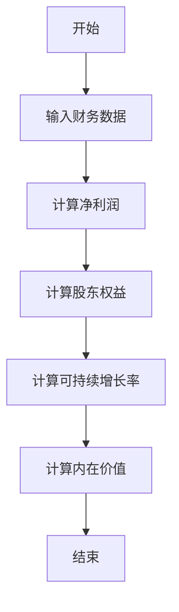
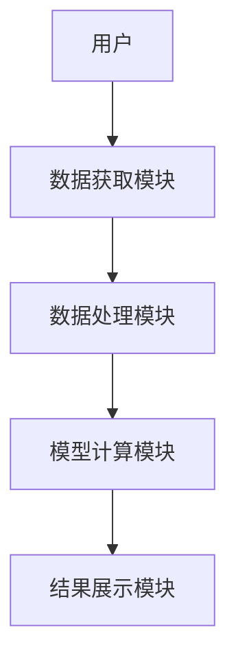

                 


# 特价股票投资中的可持续增长模型应用

> **关键词**：可持续增长模型、股票估值、价值投资、财务分析、投资策略  
> **摘要**：本文深入探讨了特价股票投资中的可持续增长模型应用，通过详细分析模型的数学原理、系统架构和实际案例，帮助投资者理解如何利用该模型进行股票估值和投资决策。文章结合专业技术语言和通俗易懂的解释，为读者提供了从理论到实践的全面指导。

---

## 第一部分: 特价股票投资与可持续增长模型概述

### 第1章: 特价股票投资的基本概念

#### 1.1 特价股票投资的定义与特点
- **1.1.1 什么是特价股票投资**  
  特价股票投资是指以低于公司内在价值的价格买入股票，寻找市场低估的投资机会。这种投资策略强调安全边际，即买入价格与内在价值的差距越大，安全边际越高。

- **1.1.2 特价股票投资的核心原则**  
  - 价值发现：识别市场低估的公司。  
  - 安全边际：买入价格低于内在价值。  
  - 长期持有：等待市场重新评估公司价值。  

- **1.1.3 特价股票投资与价值投资的区别**  
  特价股票投资是价值投资的一种形式，但更注重价格与价值的差距。价值投资更广泛，涵盖分析公司基本面和内在价值的各个方面。

#### 1.2 可持续增长模型的背景与意义
- **1.2.1 可持续增长模型的定义**  
  可持续增长模型（Sustainable Growth Model）是基于公司净利润和股东权益增长的模型，用于估算股票的内在价值。它假设公司可以以可持续的增长率增长，而不会过度依赖外部融资。

- **1.2.2 可持续增长模型的应用场景**  
  - 适用于成长型公司，尤其是那些净利润和股东权益同步增长的企业。  
  - 用于股票估值，帮助投资者判断价格是否合理。  

- **1.2.3 可持续增长模型与股票估值的关系**  
  通过模型计算出的内在价值与市场价格对比，可以帮助投资者判断股票是否被低估或高估。

---

### 第2章: 可持续增长模型的核心概念

#### 2.1 可持续增长模型的基本原理
- **2.1.1 净利润与股东权益的关系**  
  净利润是公司盈利能力的体现，而股东权益是公司资本的积累。可持续增长模型假设净利润的增长会转化为股东权益的增加。

- **2.1.2 可持续增长率的计算公式**  
  可持续增长率 = 净利润增长率 = 股东权益增长率  
  公式推导：  
  净利润增长率 = (净利润_{t+1} - 净利润_t) / 净利润_t  
  股东权益增长率 = (股东权益_{t+1} - 股东权益_t) / 股东权益_t  

- **2.1.3 可持续增长模型的核心假设**  
  - 公司净利润和股东权益同步增长。  
  - 不再需要外部融资，依靠内部利润再投资。  

#### 2.2 可持续增长模型的数学公式
- **2.2.1 净利润增长率的计算**  
  $$ 净利润增长率 = \frac{净利润_{t+1} - 净利润_t}{净利润_t} $$  

- **2.2.2 股东权益增长率的计算**  
  $$ 股东权益增长率 = \frac{股东权益_{t+1} - 股东权益_t}{股东权益_t} $$  

- **2.2.3 可持续增长率的公式推导**  
  由于净利润增长率 = 股东权益增长率，因此：  
  $$ 净利润增长率 = 股东权益增长率 $$  

---

### 第3章: 可持续增长模型与股票估值

#### 3.1 可持续增长模型在股票估值中的应用
- **3.1.1 通过可持续增长率计算内在价值**  
  内在价值公式：  
  $$ P = \frac{E_1}{g_s - r} $$  
  其中，E_1 是第一年的净利润，g_s 是可持续增长率，r 是折现率。  

- **3.1.2 内在价值与市场价格的对比**  
  - 如果市场价格 < 内在价值，股票被低估。  
  - 如果市场价格 > 内在价值，股票被高估。  

- **3.1.3 估值误差的来源与控制**  
  - 数据误差：财务数据的准确性影响估值。  
  - 假设误差：可持续增长率的假设可能不成立。  

#### 3.2 可持续增长模型的优缺点
- **3.2.1 优点：简单易懂，易于计算**  
  模型假设清晰，计算步骤简单，适合初学者使用。  

- **3.2.2 缺点：假设条件的严格性**  
  - 假设净利润和股东权益同步增长。  
  - 假设公司不再需要外部融资。  

- **3.2.3 实际应用中的注意事项**  
  - 结合其他估值方法（如市盈率、市净率）进行验证。  
  - 定期更新财务数据，重新计算内在价值。  

---

## 第二部分: 可持续增长模型的算法原理与实现

### 第4章: 可持续增长模型的算法流程

#### 4.1 算法流程概述
1. 数据输入与处理：获取公司最近几年的财务数据。  
2. 计算净利润增长率：  
   $$ 净利润增长率 = \frac{净利润_{t+1} - 净利润_t}{净利润_t} $$  
3. 计算股东权益增长率：  
   $$ 股东权益增长率 = \frac{股东权益_{t+1} - 股东权益_t}{股东权益_t} $$  
4. 计算可持续增长率：净利润增长率 = 股东权益增长率。  
5. 计算内在价值：  
   $$ P = \frac{E_1}{g_s - r} $$  
6. 对比市场价格与内在价值，判断股票是否被低估。  

#### 4.2 算法流程图


---

### 第5章: 可持续增长模型的数学模型

#### 5.1 净利润增长率的计算
- **定义**：净利润增长率是净利润的年增长率。  
- **公式**：  
  $$ 净利润增长率 = \frac{净利润_{t+1} - 净利润_t}{净利润_t} $$  

#### 5.2 股东权益增长率的计算
- **定义**：股东权益增长率是股东权益的年增长率。  
- **公式**：  
  $$ 股东权益增长率 = \frac{股东权益_{t+1} - 股东权益_t}{股东权益_t} $$  

---

### 第6章: 系统分析与架构设计方案

#### 6.1 系统功能设计
- **数据获取模块**：从数据库或API获取公司财务数据。  
- **模型计算模块**：计算净利润增长率、股东权益增长率和内在价值。  
- **结果展示模块**：将计算结果可视化，对比市场价格与内在价值。  

#### 6.2 系统架构设计


---

### 第7章: 项目实战

#### 7.1 环境安装
- 安装Python和必要的库（如pandas、numpy）。  
- 安装数据分析工具（如Yahoo Finance API）。  

#### 7.2 核心代码实现
```python
import pandas as pd
import numpy as np

# 示例数据
data = {
    '净利润': [100, 110, 121],
    '股东权益': [500, 550, 605]
}

df = pd.DataFrame(data)

# 计算净利润增长率
net_profit_growth = df['净利润'].pct_change().iloc[-1]
# 计算股东权益增长率
equity_growth = df['股东权益'].pct_change().iloc[-1]

# 可持续增长率
g_s = net_profit_growth

# 计算内在价值
E_1 = df['净利润'].iloc[-1]
r = 0.1  # 假设折现率为10%
P = E_1 / (g_s - r)

print(f"内在价值：{P:.2f}")
```

---

### 第8章: 最佳实践

#### 8.1 小结
- 可持续增长模型是一种简单有效的股票估值方法。  
- 在实际应用中，需结合其他估值方法和市场情况。  

#### 8.2 注意事项
- 数据准确性对估值结果影响较大。  
- 模型假设可能与实际情况不符，需灵活调整。  

#### 8.3 拓展阅读
- 《股票投资实战策略》  
- 《价值投资的奥秘》  

---

**作者：AI天才研究院/AI Genius Institute & 禅与计算机程序设计艺术 /Zen And The Art of Computer Programming**

