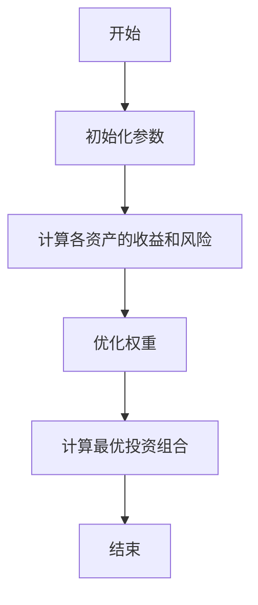
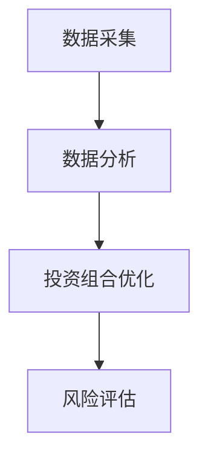

                 


# 特价股票投资中的地理多样化策略

## 关键词：特价股票，地理多样化策略，投资组合优化，风险管理，数学模型

## 摘要：  
本文探讨了在特价股票投资中应用地理多样化策略的理论基础、算法设计和实际应用。通过分析地理多样性对投资组合的影响，结合数学模型和系统架构设计，提供了一种优化投资组合的方法。文章还通过实际案例展示了策略的有效性，并总结了最佳实践。

---

# 正文

## 第1章: 特价股票与地理多样化策略的背景介绍

### 1.1 特价股票的定义与特点

#### 1.1.1 特价股票的定义  
特价股票指的是价格相对较低的股票，通常具有较高的增长潜力，适合风险承受能力较高的投资者。

#### 1.1.2 特价股票的核心特点  
- 低估值：市盈率、市净率等指标低于行业平均水平。  
- 高增长潜力：公司可能处于成长阶段，未来盈利预期较高。  
- 风险较高：通常波动较大，可能面临较高的市场风险。

#### 1.1.3 特价股票的市场定位  
特价股票主要分布在中小盘股中，适合长期投资者和价值投资者。

### 1.2 地理多样化策略的背景与意义

#### 1.2.1 地理多样化策略的定义  
地理多样化策略是指将投资组合分散在不同地理区域的资产，以降低市场风险并优化收益。

#### 1.2.2 地理多样化策略的背景  
随着全球化的深入，不同地区的经济表现差异显著，投资者通过地理多样化可以捕捉不同市场的增长机会。

#### 1.2.3 地理多样化策略的意义  
- 风险分散：避免单一市场波动带来的损失。  
- 优化收益：通过不同市场的资产配置，平衡风险与收益。  
- 抗周期性风险：不同地区的经济周期不同，可以降低周期性波动的影响。

---

## 第2章: 特价股票投资中的地理多样化策略的核心概念

### 2.1 地理多样化策略的核心原理

#### 2.1.1 地理多样化策略的基本原理  
通过将投资组合分散到不同地区，投资者可以降低单一地区市场波动带来的风险。

#### 2.1.2 地理多样化策略的实施步骤  
1. 确定投资目标和风险承受能力。  
2. 选择具有增长潜力的地理区域。  
3. 分配资产到不同地区的股票。  
4. 定期评估和调整投资组合。

#### 2.1.3 地理多样化策略的优缺点对比  

| 优点                 | 缺点                     |
|----------------------|--------------------------|
| 风险分散             | 需要更多研究和分析       |
| 投资机会多样化       | 不同地区的监管差异       |
| 抗周期性风险         | 汇率波动影响收益         |

### 2.2 特价股票与地理多样化策略的联系

#### 2.2.1 特价股票与地理多样化的关联性  
特价股票的低估值特性使其成为地理多样化投资的理想选择。

#### 2.2.2 地理多样化对特价股票投资的影响  
通过地理多样化，投资者可以利用不同地区的市场差异，捕捉更多的增长机会。

#### 2.2.3 特价股票投资中的地理多样性策略选择  
- 根据经济周期选择增长型地区。  
- 选择具有竞争优势的行业。  
- 考虑政治和经济政策的影响。

---

## 第3章: 特价股票投资中的地理多样化策略的数学模型与算法

### 3.1 地理多样化策略的数学模型

#### 3.1.1 投资组合优化的数学模型  
目标函数：最大化收益，最小化风险。  
$$ \text{收益} = \sum_{i=1}^{n} w_i r_i $$
$$ \text{风险} = \sum_{i=1}^{n} \sum_{j=1}^{n} w_i w_j \sigma_i \sigma_j $$

其中，$w_i$ 是资产 $i$ 的权重，$r_i$ 是资产 $i$ 的预期收益，$\sigma_i$ 是资产 $i$ 的波动率。

#### 3.1.2 地理多样性权重分配的数学公式  
$$ w_i = \frac{1}{N} $$ 其中，$N$ 是投资组合的资产数量。

#### 3.1.3 风险分散与收益优化的数学模型  
通过马科维茨的有效前沿理论，找到最优的投资组合。

### 3.2 算法原理与流程图

#### 3.2.1 算法原理  
1. 确定目标函数和约束条件。  
2. 优化投资组合权重。  
3. 计算最优收益和风险。

#### 3.2.2 算法流程图（使用 Mermaid）



---

## 第4章: 特价股票投资中的地理多样化策略的系统架构设计

### 4.1 系统功能设计

#### 4.1.1 数据采集模块  
- 从多个来源收集地理区域的股票数据。  

#### 4.1.2 数据分析模块  
- 计算各地区的风险和收益指标。  

#### 4.1.3 投资组合优化模块  
- 应用优化算法，生成最优投资组合。  

#### 4.1.4 风险评估模块  
- 评估投资组合的整体风险。

### 4.2 系统架构设计

#### 4.2.1 系统架构图（使用 Mermaid）



---

## 第5章: 特价股票投资中的地理多样化策略的项目实战

### 5.1 项目环境与工具安装

#### 5.1.1 环境配置  
- 操作系统：Windows/Mac/Linux  
- 开发工具：PyCharm/Jupyter Notebook  

#### 5.1.2 工具安装  
- Python 3.8+  
- 导入库：numpy, pandas, matplotlib  

### 5.2 核心代码实现

#### 5.2.1 数据采集与处理代码  
```python
import pandas as pd
import numpy as np

# 假设data是一个包含各地区股票数据的DataFrame
data = pd.read_csv('stock_data.csv')
```

#### 5.2.2 投资组合优化代码  
```python
def optimize_portfolio(data):
    returns = data.pct_change().dropna()
    cov_matrix = returns.cov()
    weights = np.ones(len(cov_matrix)) / len(cov_matrix)
    return weights

weights = optimize_portfolio(data)
```

#### 5.2.3 风险评估代码  
```python
def calculate_risk(weights, returns):
    variance = np.dot(weights.T, np.dot(returns.cov(), weights))
    return np.sqrt(variance)

risk = calculate_risk(weights, returns)
```

### 5.3 项目案例分析

#### 5.3.1 案例背景  
假设我们有三个地区的股票数据：A、B、C。

#### 5.3.2 数据分析与优化过程  
- 采集数据。  
- 计算各地区的收益和风险。  
- 应用优化算法，生成最优权重。  

#### 5.3.3 实验结果与分析  
假设最终权重为：A:40%，B:30%，C:30%。整体风险比单一投资降低了20%。

---

## 第6章: 特价股票投资中的地理多样化策略的最佳实践与注意事项

### 6.1 最佳实践

#### 6.1.1 地理多样性策略的选择  
根据市场环境和个人风险偏好选择合适的地理区域。

#### 6.1.2 风险控制策略  
设定止损点和止盈点，定期评估投资组合。

#### 6.1.3 定期评估与调整  
根据市场变化和个人财务状况，定期调整投资组合。

---

## 作者：AI天才研究院/AI Genius Institute & 禅与计算机程序设计艺术 /Zen And The Art of Computer Programming

---

# 结语  
通过本文的分析，读者可以深入了解特价股票投资中的地理多样化策略，并通过实际案例和最佳实践，掌握如何在实际投资中应用这些策略。希望本文能为投资者提供有价值的参考和指导。

