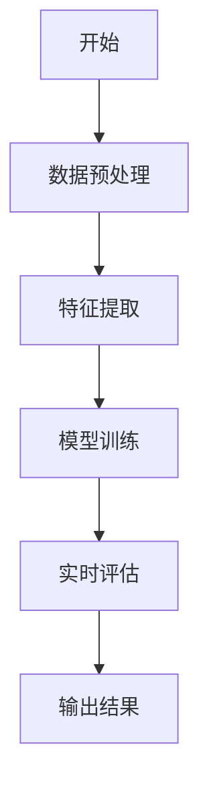
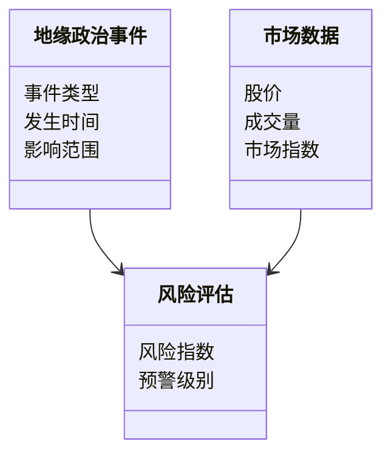
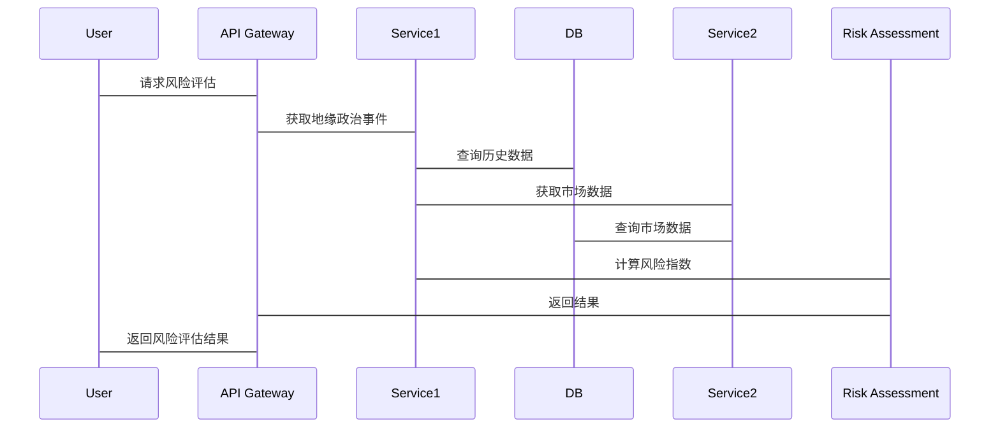

                 


# 特价股票投资中的地缘政治风险动态评估策略

> 关键词：特价股票投资、地缘政治风险、动态评估、风险管理、投资策略

> 摘要：本文探讨了在特价股票投资中，地缘政治风险的动态评估策略。通过分析地缘政治事件对股票市场的潜在影响，结合动态评估方法，提出了一套有效的风险管理框架。文章详细阐述了动态评估的核心概念、算法设计和系统架构，并通过实战案例和最佳实践，为投资者提供了实用的指导。

---

# 第1章: 特价股票投资概述

## 1.1 特价股票投资的基本概念

### 1.1.1 特价股票的定义与特点
特价股票是指在特定市场环境下，价格波动较大、交易活跃的股票。其特点是价格波动快、风险高、收益潜力大。

### 1.1.2 特价股票投资的常见策略
1. **短线交易策略**：利用短期价格波动进行获利。
2. **事件驱动策略**：基于特定事件（如并购、政策变化）进行投资。
3. **套利策略**：利用价格差异进行无风险或低风险投资。

### 1.1.3 特价股票投资的市场环境分析
市场环境包括宏观经济状况、政策环境、行业趋势等因素，这些都会影响特价股票的价格波动。

---

## 1.2 地缘政治风险的基本概念

### 1.2.1 地缘政治风险的定义
地缘政治风险是指因地理位置、国家关系、政策变化等因素引发的政治风险，可能对市场产生重大影响。

### 1.2.2 地缘政治风险的主要类型
1. **国际冲突风险**：如战争、军事冲突。
2. **政策变化风险**：如贸易政策、货币政策的调整。
3. **主权风险**：如国家违约、政权更迭。

### 1.2.3 地缘政治风险对股票市场的影响
地缘政治风险可能导致市场恐慌、股价暴跌或剧烈波动。

---

## 1.3 特价股票投资与地缘政治风险的关系

### 1.3.1 地缘政治风险对特价股票投资的影响
1. **短期价格波动**：地缘政治事件可能导致股价快速变化。
2. **市场情绪影响**：投资者情绪波动会影响交易决策。
3. **投资机会**：某些事件可能带来短期获利机会。

### 1.3.2 特价股票投资中的地缘政治风险特征
1. **突发性**：事件往往不可预测。
2. **放大性**：风险可能迅速放大市场波动。
3. **多样性**：不同事件对不同行业的影响差异显著。

---

# 第2章: 地缘政治风险的动态评估策略

## 2.1 地缘政治风险动态评估的核心概念

### 2.1.1 动态评估的定义
动态评估是指根据实时数据和市场变化，持续更新风险评估结果。

### 2.1.2 动态评估的基本原理
通过实时数据分析和模型计算，捕捉地缘政治事件的潜在影响。

### 2.1.3 动态评估的关键要素
1. **事件类型**：识别事件的性质和严重程度。
2. **市场反应**：分析市场对事件的即时反应。
3. **历史数据**：参考历史事件对市场的类似影响。

---

## 2.2 地缘政治风险动态评估的框架设计

### 2.2.1 评估框架的总体思路
1. **数据采集**：收集相关地缘政治事件和市场数据。
2. **事件分析**：对事件进行分类和影响程度评估。
3. **风险计算**：结合市场反应计算风险指数。
4. **结果输出**：提供风险预警和投资建议。

### 2.2.2 评估框架的具体步骤
1. 数据采集与清洗。
2. 事件特征提取。
3. 风险评估模型计算。
4. 风险结果可视化。

---

## 2.3 地缘政治风险动态评估的指标体系

### 2.3.1 指标体系的设计原则
1. **相关性**：指标应与地缘政治风险密切相关。
2. **可量化**：指标应可量化和可计算。
3. **实时性**：指标应能反映实时市场变化。

### 2.3.2 主要评估指标的选取
1. **事件影响指数**：反映事件的严重程度。
2. **市场波动指数**：反映市场对事件的反应程度。
3. **行业影响指数**：反映特定行业受事件影响的程度。

### 2.3.3 指标权重的确定方法
1. **层次分析法（AHP）**：用于确定各指标的权重。
2. **回归分析**：通过历史数据确定指标的影响力。

---

# 第3章: 地缘政治风险对特价股票投资的影响机制

## 3.1 地缘政治事件对市场情绪的影响

### 3.1.1 市场情绪的定义与测量
市场情绪指投资者的总体情绪状态，可通过市场成交量、股价波动等指标衡量。

### 3.1.2 地缘政治事件对市场情绪的冲击
1. **恐慌情绪**：事件发生后，投资者可能恐慌性抛售股票。
2. **乐观情绪**：事件解决后，投资者可能恢复信心。

### 3.1.3 市场情绪与股票价格的关系
市场情绪通过影响投资者行为间接影响股票价格。

---

## 3.2 地缘政治风险对股票流动性的影响

### 3.2.1 流动性定义
流动性指资产快速变现而不影响价格的能力。

### 3.2.2 地缘政治风险对流动性的影响
1. **流动性下降**：投资者恐慌导致交易量减少。
2. **流动性溢价**：高风险资产要求更高的风险溢价。

---

## 3.3 机器学习在地缘政治风险评估中的应用

### 3.3.1 机器学习模型简介
1. **监督学习**：用于分类和回归任务。
2. **无监督学习**：用于聚类分析。

### 3.3.2 基于机器学习的地缘政治风险预测
1. **特征工程**：提取地缘政治事件的特征。
2. **模型训练**：使用历史数据训练预测模型。
3. **预测结果**：输出风险概率和影响程度。

---

# 第4章: 动态评估算法设计与实现

## 4.1 算法设计

### 4.1.1 算法概述
基于地缘政治事件的特征和市场反应，构建风险评估模型。

### 4.1.2 算法步骤
1. 数据预处理：清洗和特征提取。
2. 模型训练：使用历史数据训练模型。
3. 实时评估：计算当前事件的风险指数。

---

## 4.2 算法实现

### 4.2.1 Python代码实现
```python
import numpy as np
from sklearn.linear_model import LinearRegression

# 示例数据
events = np.array([[1, 2, 3], [4, 5, 6], [7, 8, 9]])
labels = np.array([0.5, 0.7, 0.3])

# 模型训练
model = LinearRegression()
model.fit(events, labels)

# 预测新事件的风险指数
new_event = np.array([[10, 11, 12]])
predicted = model.predict(new_event)
print(predicted)
```

### 4.2.2 算法流程图


---

# 第5章: 系统分析与架构设计方案

## 5.1 项目背景与目标

### 5.1.1 项目背景
开发一个实时的地缘政治风险评估系统，帮助投资者做出决策。

### 5.1.2 项目目标
实现一个动态的地缘政治风险评估系统，提供实时风险预警。

---

## 5.2 系统功能设计

### 5.2.1 功能模块
1. **数据采集模块**：实时采集地缘政治事件和市场数据。
2. **风险评估模块**：计算风险指数并生成预警。
3. **用户界面模块**：展示风险评估结果和投资建议。

### 5.2.2 领域模型


---

## 5.3 系统架构设计

### 5.3.1 系统架构图


---

## 5.4 接口与交互设计

### 5.4.1 接口设计
1. **API接口**：提供风险评估数据的接口。
2. **用户接口**：提供给投资者使用。

### 5.4.2 交互流程


---

# 第6章: 项目实战

## 6.1 环境安装

### 6.1.1 安装Python
```bash
pip install numpy scikit-learn matplotlib
```

---

## 6.2 系统核心实现

### 6.2.1 数据采集与处理
```python
import pandas as pd
import requests

# 数据采集
url = "https://api.example.com/events"
response = requests.get(url)
data = response.json()
df = pd.DataFrame(data)
```

### 6.2.2 风险评估模型
```python
from sklearn.model_selection import train_test_split
from sklearn.metrics import mean_squared_error

X = df.drop('risk_index', axis=1)
y = df['risk_index']

X_train, X_test, y_train, y_test = train_test_split(X, y, test_size=0.2)
model = LinearRegression()
model.fit(X_train, y_train)

predicted = model.predict(X_test)
print(mean_squared_error(y_test, predicted))
```

---

## 6.3 实战案例分析

### 6.3.1 案例分析
假设发生某地缘政治事件，使用模型计算其风险指数。

### 6.3.2 代码实现
```python
new_event = df.iloc[-1].drop('risk_index')
predicted_index = model.predict([new_event])
print(predicted_index)
```

---

## 6.4 案例总结

### 6.4.1 投资建议
根据风险指数，投资者可以决定是否参与或规避特定股票的投资。

### 6.4.2 经验教训
及时更新模型和数据，以提高评估的准确性。

---

# 第7章: 最佳实践与总结

## 7.1 投资建议

### 7.1.1 短期投资策略
1. **关注热点事件**：及时了解可能的地缘政治事件。
2. **分散投资**：避免过度集中投资。
3. **设置止损**：控制风险敞口。

### 7.1.2 风险管理策略
1. **动态调整**：根据风险评估结果调整投资组合。
2. **情景分析**：提前制定应对不同风险的情景策略。

---

## 7.2 注意事项

### 7.2.1 数据质量问题
确保数据的准确性和及时性。

### 7.2.2 模型局限性
模型可能存在预测偏差，需结合实际情况进行调整。

---

## 7.3 拓展阅读

### 7.3.1 相关书籍
1. 《风险管理与投资组合》
2. 《地缘政治学入门》

### 7.3.2 在线资源
1. [风险管理协会](https://www.risk.org)
2. [地缘政治分析网站](https://www.geopolitical.com)

---

# 结语

地缘政治风险是特价股票投资中不可忽视的重要因素。通过动态评估策略，投资者可以更好地应对这些风险，制定科学的投资决策。本文提供了理论支持和实践指导，帮助投资者在复杂多变的市场环境中把握机会、规避风险。

---

作者：AI天才研究院/AI Genius Institute & 禅与计算机程序设计艺术 /Zen And The Art of Computer Programming

