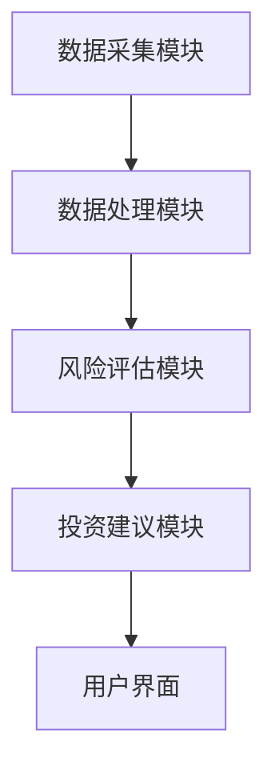
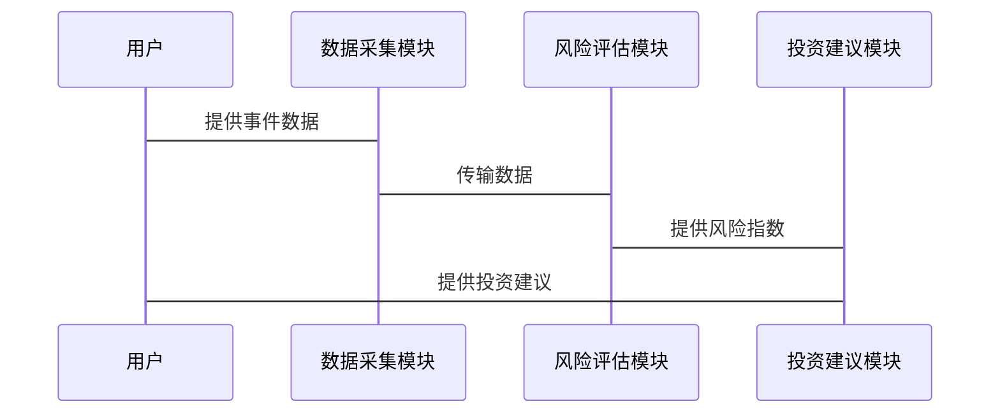

                 


# 特价股票投资中的地缘政治风险评估

> 关键词：特价股票投资，地缘政治风险，投资策略，量化模型，风险管理

> 摘要：本文探讨了地缘政治风险对特价股票投资的影响，通过分析不同类型地缘政治风险及其对市场的影响，构建了量化评估模型，并结合实际案例，提出了风险管理策略。文章内容涵盖风险评估的基本原理、量化方法、系统架构设计及项目实战，为投资者提供科学的决策支持。

---

## 第1章 引言

### 1.1 背景介绍

#### 1.1.1 特价股票投资的基本概念

特价股票投资是指在特定市场条件下，投资者寻找价格被低估的股票进行投资。这类投资通常基于市场波动、突发事件或公司基本面改善等因素，旨在以低于市场价值的价格买入股票，待价格上涨时卖出获利。

#### 1.1.2 地缘政治风险的定义

地缘政治风险是指因政治、经济、军事等事件引发的不确定性，可能影响市场稳定性和公司运营。常见的地缘政治风险包括经济制裁、贸易摩擦、军事冲突、政治选举和公共卫生事件等。

#### 1.1.3 两者关联性

地缘政治风险对市场产生重大影响，可能引发市场波动，影响公司业绩和股价。特价股票投资者需评估这些风险，以避免损失或抓住短期机会。

### 1.2 研究意义

分析地缘政治风险对特价股票投资的影响，有助于投资者制定科学的投资策略，降低风险，提高收益。

### 1.3 目标与结构

本文目标是构建地缘政治风险评估模型，帮助投资者做出决策。结构包括背景、风险类型、评估方法、系统设计和案例分析。

---

## 第2章 地缘政治风险的类型与影响

### 2.1 风险类型

- **经济制裁**：限制贸易或金融交易，影响相关公司收入和股价。
- **贸易摩擦**：关税变化影响出口企业，导致股价波动。
- **军事冲突**：地区战争引发市场恐慌，影响整体股市表现。
- **政治选举**：政策变化可能影响行业，如能源或科技股。
- **公共卫生事件**：如疫情导致供应链中断，影响企业业绩。

### 2.2 对市场的影响

- **直接市场反应**：风险事件发生后，相关股票价格波动。
- **行业影响**：特定行业如能源或航空受地缘政治影响较大。
- **长期影响**：政策变化可能导致行业结构调整，影响长期走势。

---

## 第3章 风险评估的核心概念与联系

### 3.1 评估框架

- **事件识别**：识别潜在的地缘政治风险事件。
- **影响分析**：评估事件对市场和个股的影响程度。
- **风险量化**：通过数学模型量化风险等级。

### 3.2 风险与股价关系

- **股价波动**：风险事件引发股价短期波动。
- **长期影响**：持续政策影响可能导致股价长期变化。

---

## 第4章 算法原理

### 4.1 模型构建

使用事件影响概率和影响程度的乘积作为风险指数，公式为：

$$
\text{风险指数} = \sum (\text{事件概率} \times \text{影响程度})
$$

### 4.2 Python实现

```python
import pandas as pd

def calculate_geo_risk(impact_events):
    risk_index = 0
    for event in impact_events:
        probability = event['probability']
        impact = event['impact']
        risk_index += probability * impact
    return risk_index

impact_events = [
    {'event': '贸易摩擦', 'probability': 0.8, 'impact': 0.6},
    {'event': '军事冲突', 'probability': 0.2, 'impact': 0.8}
]

risk = calculate_geo_risk(impact_events)
print(f"风险指数: {risk}")
```

### 4.3 案例分析

假设某公司受到贸易摩擦影响，概率0.8，影响程度0.6，风险指数为0.48，属于中等风险，投资者需谨慎考虑。

---

## 第5章 系统架构设计

### 5.1 功能设计

- **数据采集**：收集地缘政治事件数据和股价数据。
- **风险评估**：计算风险指数，提供预警。
- **投资建议**：基于风险评估，推荐投资策略。

### 5.2 架构图



### 5.3 接口设计

- **输入接口**：接收事件数据和股价数据。
- **输出接口**：提供风险指数和投资建议。

### 5.4 交互流程



---

## 第6章 项目实战

### 6.1 环境搭建

- **工具安装**：安装Python、Pandas和Matplotlib。
- **数据来源**：使用Yahoo Finance获取股价数据，Twitter API获取事件数据。

### 6.2 核心代码实现

```python
import pandas as pd
import matplotlib.pyplot as plt

# 数据获取
def get_stock_data(ticker):
    data = pd.read_csv(f'data/{ticker}.csv')
    return data['Adj Close']

# 风险评估
def assess_geo_risk(events):
    risk = 0
    for event in events:
        prob = event['probability']
        impact = event['impact']
        risk += prob * impact
    return risk

# 可视化
def plot_risk(risk_scores):
    plt.figure(figsize=(10, 6))
    plt.bar(range(len(risk_scores)), risk_scores)
    plt.title('地缘政治风险指数')
    plt.xlabel('事件编号')
    plt.ylabel('风险指数')
    plt.show()

# 示例运行
events = [
    {'event': '贸易摩擦', 'probability': 0.8, 'impact': 0.6},
    {'event': '军事冲突', 'probability': 0.2, 'impact': 0.8}
]
risk_scores = [assess_geo_risk([events[0]]), assess_geo_risk([events[1]])]
plot_risk(risk_scores)
```

### 6.3 案例分析

分析某公司因贸易摩擦导致股价下跌15%，风险指数为0.48，建议投资者规避风险或等待市场稳定。

### 6.4 项目总结

项目实现了地缘政治风险评估系统，提供了量化方法和可视化工具，帮助投资者做出明智决策。

---

## 第7章 最佳实践与小结

### 7.1 投资策略建议

- **多元化投资**：分散投资以降低单一风险影响。
- **实时监控**：关注地缘政治事件，及时调整投资组合。
- **风险对冲**：使用衍生工具对冲特定风险。

### 7.2 风险管理注意事项

- **定期评估**：定期更新风险模型，适应市场变化。
- **数据质量**：确保数据来源可靠，提升模型准确性。

### 7.3 拓展阅读

推荐书籍和资源，如《风险管理与投资组合优化》、《地缘政治经济学》等。

---

## 作者信息

作者：AI天才研究院/AI Genius Institute & 禅与计算机程序设计艺术 /Zen And The Art of Computer Programming

---

本文通过系统分析和实际案例，详细探讨了地缘政治风险对特价股票投资的影响，提供了科学的评估方法和投资建议，帮助投资者在复杂市场中做出明智决策。

