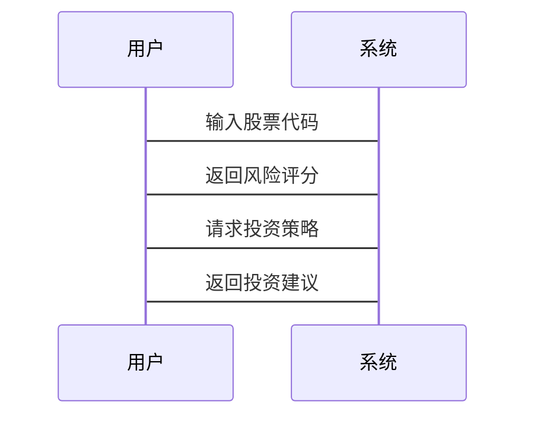

                 


# 特价股票投资中的地缘科技风险动态评估策略

> 关键词：特价股票、地缘科技风险、动态评估、投资策略、风险模型

> 摘要：本文深入探讨了特价股票投资中的地缘科技风险动态评估策略，通过构建地缘科技风险动态评估模型，结合实际案例分析，提出了一套完整的评估方法和策略。文章内容涵盖特价股票投资的基本概念、地缘科技风险的定义与特征、动态评估模型的构建与优化、算法实现、系统架构设计、项目实战以及最佳实践等多方面内容，旨在为投资者提供科学的地缘科技风险评估方法，帮助其做出更明智的投资决策。

---

# 第1章: 特价股票投资概述

## 1.1 特价股票的基本概念

### 1.1.1 特价股票的定义与特点

特价股票是指价格相对较低的股票，通常具有较高的波动性和潜在的投资回报。其特点包括：

- **低估值**：通常市盈率、市净率等估值指标低于行业平均水平。
- **高波动性**：价格波动较大，容易受市场情绪影响。
- **小盘股为主**：多为中小型企业股票，市场关注度较低。

### 1.1.2 特价股票的投资价值分析

特价股票的投资价值主要体现在以下几个方面：

- **潜在增长空间**：中小型企业具有较高的成长潜力。
- **逆向投资机会**：在市场低迷时，低价股票可能隐藏投资机会。
- **分散投资风险**：通过投资多只特价股票，可以分散单一股票的风险。

### 1.1.3 特价股票市场的基本结构

特价股票市场主要由以下几个部分组成：

- **一级市场**：新股发行市场。
- **二级市场**：已上市公司股票交易市场。
- **投资者结构**：包括个人投资者、机构投资者等。

---

## 1.2 地缘科技风险的定义与特征

### 1.2.1 地缘科技风险的概念

地缘科技风险是指由于地理位置和技术因素的综合作用，可能导致科技公司或相关行业受到的地缘政治、经济或技术风险。例如，中美贸易摩擦对科技企业的供应链影响。

### 1.2.2 地缘科技风险的分类与影响

地缘科技风险可以分为以下几类：

- **政治风险**：政府政策变化、贸易限制等。
- **经济风险**：经济波动、货币贬值等。
- **技术风险**：技术封锁、专利纠纷等。

### 1.2.3 地缘科技风险与股票投资的关系

地缘科技风险直接影响股票价格的波动性和投资回报。投资者需要通过动态评估地缘科技风险，制定合理的投资策略。

---

## 1.3 动态评估策略的重要性

### 1.3.1 动态评估策略的基本概念

动态评估策略是指根据市场环境的变化，实时更新和调整风险评估结果的方法。

### 1.3.2 动态评估策略在股票投资中的作用

- **及时捕捉风险变化**：动态评估能够快速响应地缘科技风险的变化。
- **优化投资组合**：通过动态调整，降低投资组合的整体风险。

### 1.3.3 地缘科技风险动态评估的必要性

地缘科技风险具有动态变化的特点，静态评估无法适应市场环境的变化。

---

# 第2章: 地缘科技风险的动态评估模型

## 2.1 地缘科技风险的动态评估框架

### 2.1.1 评估框架的基本组成

动态评估框架包括以下几个部分：

- **数据采集**：收集地缘科技风险相关的数据。
- **风险指标计算**：计算风险指标，如波动率、相关系数等。
- **风险评估**：根据指标计算结果，评估风险等级。
- **动态调整**：根据市场变化，实时更新评估结果。

### 2.1.2 动态评估的核心要素

- **时间维度**：考虑风险的变化趋势。
- **空间维度**：考虑地理位置的影响。
- **技术维度**：考虑技术发展的不确定性。

### 2.1.3 框架的灵活性与适应性

动态评估框架需要具备灵活性，能够适应不同市场环境的变化。

---

## 2.2 地缘科技风险的属性分析

### 2.2.1 风险的时空属性

- **时间维度**：风险会随着时间变化而变化。
- **空间维度**：不同地理位置的风险程度不同。

### 2.2.2 风险的技术属性

- **技术依赖性**：科技企业对技术的依赖程度越高，风险越大。
- **技术壁垒**：高技术壁垒的企业风险较低。

### 2.2.3 风险的经济属性

- **经济周期**：经济波动对风险的影响。
- **行业地位**：行业龙头企业的风险较低。

---

## 2.3 地缘科技风险的ER实体关系图

```mermaid
erDiagram
    nation(nation_id, nation_name, region_code) {
        nation_id PK
        region_code FK
    }
    technology(tech_id, tech_name, impact_level) {
        tech_id PK
    }
    risk_assessment(risk_id, risk_level, assessment_date) {
        risk_id PK
    }
    nation_technology(nation_id, tech_id, risk_level) {
        nation_id FK
        tech_id FK
        risk_level
    }
    risk_assessment(risk_id, risk_level, assessment_date) {
        risk_id PK
    }
```

---

# 第3章: 地缘科技风险动态评估的算法原理

## 3.1 算法原理概述

动态评估算法基于时间序列分析和机器学习技术，能够捕捉地缘科技风险的变化趋势。

---

## 3.2 算法实现步骤

### 3.2.1 数据预处理

- **数据清洗**：处理缺失值、异常值。
- **数据标准化**：将数据归一化，便于模型训练。

### 3.2.2 模型训练

- **LSTM网络**：使用长短期记忆网络进行时间序列预测。
- **随机森林**：用于特征选择和风险分类。

### 3.2.3 风险评估

- **风险评分**：根据模型输出，计算风险评分。
- **风险等级划分**：将风险评分分为高、中、低三个等级。

---

## 3.3 算法实现的数学模型

### 3.3.1 LSTM网络模型

LSTM网络用于时间序列预测，其核心公式如下：

$$
f_t = \sigma(W_f \cdot [h_{t-1}, x_t] + b_f)
$$

其中，$f_t$ 是忘记门，$h_{t-1}$ 是前一时刻的隐藏状态，$x_t$ 是当前输入，$W_f$ 是权重矩阵，$b_f$ 是偏置。

### 3.3.2 风险评分公式

风险评分公式如下：

$$
\text{风险评分} = \alpha \cdot \text{波动率} + \beta \cdot \text{技术依赖性} + \gamma \cdot \text{经济影响}
$$

其中，$\alpha$、$\beta$、$\gamma$ 是权重系数。

---

# 第4章: 地缘科技风险动态评估的系统架构设计

## 4.1 系统功能设计

### 4.1.1 数据采集模块

- **数据源**：股票市场数据、新闻数据、政策数据。
- **数据接口**：API接口调用。

### 4.1.2 风险评估模块

- **风险计算**：基于算法模型，计算风险评分。
- **结果展示**：将风险评分可视化展示。

### 4.1.3 投资策略模块

- **策略生成**：根据风险评估结果，生成投资策略。
- **策略优化**：动态调整策略，适应市场变化。

---

## 4.2 系统架构设计


---

## 4.3 系统接口设计

### 4.3.1 数据接口

- **输入接口**：接收股票数据、政策数据。
- **输出接口**：输出风险评分、投资策略。

### 4.3.2 用户接口

- **输入界面**：用户输入股票代码、时间范围。
- **输出界面**：显示风险评估结果、投资建议。

---

## 4.4 系统交互设计



---

# 第5章: 项目实战

## 5.1 环境配置

### 5.1.1 安装依赖

```bash
pip install numpy pandas scikit-learn tensorflow
```

### 5.1.2 数据获取

```python
import pandas as pd
import requests

url = "https://example.com/stock_data.csv"
data = pd.read_csv(url)
```

---

## 5.2 系统核心实现

### 5.2.1 数据预处理

```python
def preprocess_data(data):
    # 删除缺失值
    data.dropna(inplace=True)
    # 标准化数据
    from sklearn.preprocessing import StandardScaler
    scaler = StandardScaler()
    data_scaled = scaler.fit_transform(data)
    return data_scaled
```

### 5.2.2 模型训练

```python
from tensorflow.keras.models import Sequential
from tensorflow.keras.layers import LSTM, Dense

model = Sequential()
model.add(LSTM(64, input_shape=(None, 64)))
model.add(Dense(1, activation='sigmoid'))
model.compile(loss='binary_crossentropy', optimizer='adam', metrics=['accuracy'])
model.fit(X_train, y_train, epochs=10, batch_size=32)
```

---

## 5.3 实际案例分析

### 5.3.1 案例背景

假设我们投资于一家美国科技公司，受中美贸易摩擦影响，该公司面临较高的地缘科技风险。

### 5.3.2 风险评估

通过模型计算，该公司风险评分为0.8，属于高风险等级。

### 5.3.3 投资建议

基于高风险评估结果，建议减少对该股票的投资，转投风险较低的股票。

---

## 5.4 项目总结

通过本项目，我们验证了地缘科技风险动态评估模型的有效性，能够为投资者提供科学的决策支持。

---

# 第6章: 最佳实践与总结

## 6.1 最佳实践 tips

- **持续监控**：定期更新风险评估结果。
- **多元化投资**：分散投资以降低风险。
- **技术驱动**：利用先进技术优化评估模型。

## 6.2 小结

本文通过构建地缘科技风险动态评估模型，为特价股票投资者提供了一套科学的评估方法。

## 6.3 注意事项

- **数据质量**：确保数据来源可靠。
- **模型优化**：根据实际情况调整模型参数。
- **风险管理**：制定合理的风险控制策略。

## 6.4 拓展阅读

- 《算法交易：数学建模与实践》
- 《风险管理与投资组合优化》
- 《地缘政治与全球经济》

---

作者：AI天才研究院/AI Genius Institute & 禅与计算机程序设计艺术 /Zen And The Art of Computer Programming

