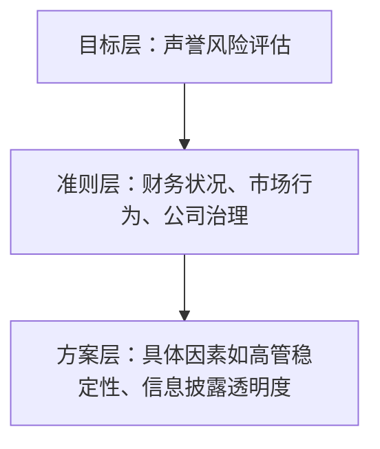
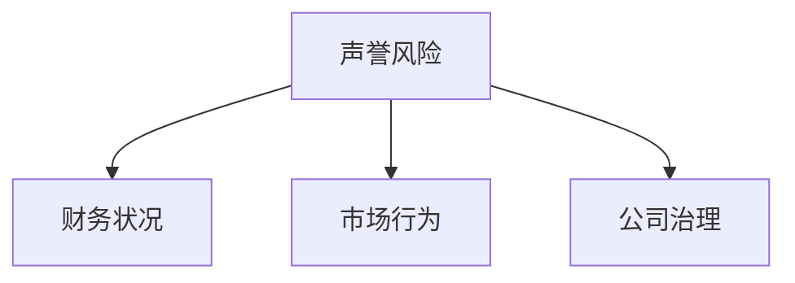
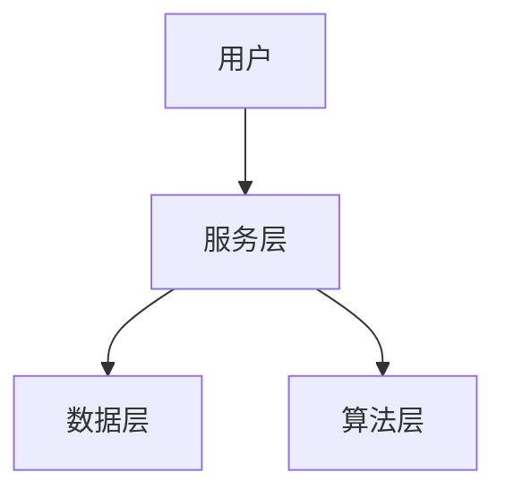
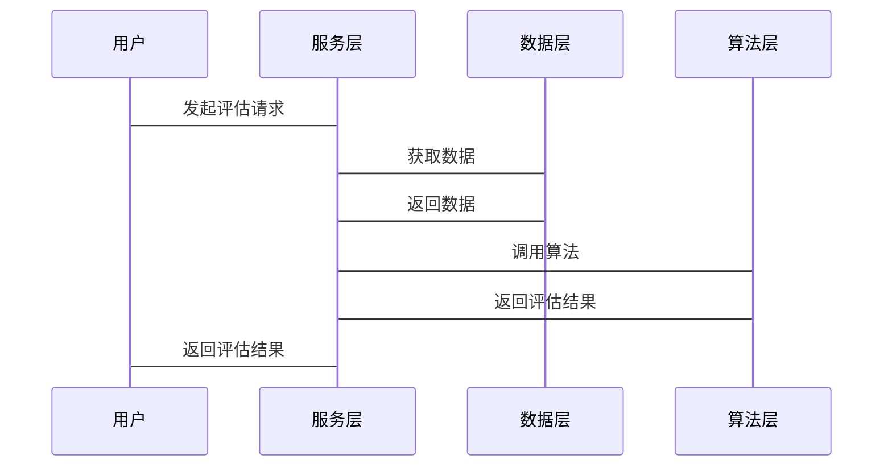

                 


# 特价股票投资中的声誉风险评估方法

## 关键词：特价股票，声誉风险，风险评估，层次分析法，贝叶斯网络

## 摘要：本文探讨了在特价股票投资中如何评估声誉风险。通过分析声誉风险的定义、影响因素及与财务风险的关系，构建了声誉风险评估指标体系。采用层次分析法和贝叶斯网络等算法，结合系统架构设计，提供了实际案例分析，总结最佳实践，为投资者提供科学的决策支持。

---

## 第1章：背景介绍

### 1.1 特价股票投资的背景

#### 1.1.1 特价股票的定义与特点

特价股票是指在特定市场条件下，以低于市场价出售的股票。其特点包括高波动性、高风险性和潜在的高回报。投资者在特价股票市场中寻求低价买入的机会，期望在市场回升时获得收益。

#### 1.1.2 特价股票投资的动机与目标

投资者参与特价股票投资的动机多样，包括短期套利、长期增值或对特定公司前景的看好。目标通常包括获取超额收益、分散投资风险或利用市场波动获利。

### 1.2 声誉风险的基本概念

#### 1.2.1 声誉风险的定义

声誉风险是指因公司声誉下降而导致的财务损失风险。它源于市场参与者的负面看法，可能由产品质量、管理问题或外部事件引发。

#### 1.2.2 声誉风险的影响因素

声誉风险的影响因素包括产品质量、公司治理、财务状况、市场行为和外部事件。这些因素相互作用，影响市场参与者对公司的看法。

#### 1.2.3 声誉风险与财务风险的关系

声誉风险与财务风险密切相关。声誉下降可能导致股价下跌、融资困难和客户流失，从而加剧财务风险。反之，财务问题也可能损害公司声誉，形成恶性循环。

### 1.3 特价股票投资中的声誉风险

#### 1.3.1 特价股票投资中声誉风险的特殊性

特价股票市场的波动性和不确定性使其声誉风险更为复杂。公司负面新闻可能迅速影响股价，投资者需及时评估和应对。

#### 1.3.2 声誉风险对投资决策的影响

声誉风险影响投资者对公司的信任度和投资决策。负面声誉可能导致投资者放弃投资或要求更高的回报率，增加投资成本。

#### 1.3.3 声誉风险的量化与评估

量化声誉风险需综合考虑市场反应、财务指标和公司治理因素。通过构建评估指标体系，投资者可以量化风险程度，制定相应的风险管理策略。

---

## 第2章：声誉风险的核心要素与评估框架

### 2.1 声誉风险的核心要素

#### 2.1.1 企业声誉的构成要素

企业声誉由产品质量、公司治理、社会责任和创新能力构成。这些要素共同影响市场参与者的信任度。

#### 2.1.2 特价股票投资中的声誉风险因素

在特价股票投资中，声誉风险因素包括市场行为、信息披露和公司治理。这些因素直接影响投资者对公司的看法和投资决策。

### 2.2 声誉风险与财务风险的关系

#### 2.2.1 声誉风险对财务风险的影响

声誉下降可能导致股价下跌、融资成本上升和客户流失，加剧财务风险。声誉风险与财务风险相互作用，形成恶性循环。

#### 2.2.2 财务风险对声誉风险的影响

财务问题如亏损和债务违约会损害公司声誉，影响市场信任度和股价表现。财务风险是声誉风险的重要驱动因素。

### 2.3 声誉风险评估的指标体系

#### 2.3.1 评估指标的选择标准

评估指标需具备相关性、可量性和可操作性。选择能反映公司声誉和财务状况的关键指标，确保评估结果的有效性。

#### 2.3.2 常见声誉风险评估指标对比

| 指标类型 | 指标名称 | 优点 | 缺点 |
|----------|----------|------|------|
| 财务指标 | 股价波动 | 易量化 | 受市场情绪影响 |
| 市场行为 | 信息披露透明度 | 反映公司治理 | 难直接量化 |
| 公司治理 | 高管稳定性 | 反映管理质量 | 难实时评估 |

#### 2.3.3 指标体系的构建与优化

构建声誉风险评估指标体系时，需结合公司特点和市场环境，选择关键指标，并通过权重分配优化评估结果。

---

## 第3章：声誉风险评估的算法与模型

### 3.1 层次分析法（AHP）的应用

#### 3.1.1 层次分析法的基本原理

层次分析法是一种结构化决策方法，通过构建层次结构和计算权重，帮助决策者评估各因素的重要性。

#### 3.1.2 层次分析法在声誉风险评估中的应用

将声誉风险因素分为目标层、准则层和方案层，构建层次结构，计算各因素的权重，评估其对声誉风险的影响。

#### 3.1.3 AHP算法的步骤与流程图



#### 3.1.4 AHP算法的Python代码示例

```python
import numpy as np

def calculate_weights(matrix):
    n = len(matrix)
    # 计算一致性检验
    # ...
    return weights

# 示例矩阵
matrix = [
    [1, 3, 2],
    [1/3, 1, 2/3],
    [1/2, 3/2, 1]
]

weights = calculate_weights(matrix)
print(weights)
```

### 3.2 基于贝叶斯网络的声誉风险评估

#### 3.2.1 贝叶斯网络的基本原理

贝叶斯网络是一种概率推理模型，通过构建概率图模型，描述变量之间的关系，用于预测和诊断问题。

#### 3.2.2 贝叶斯网络在声誉风险评估中的应用

将声誉风险因素建模为贝叶斯网络，分析各因素之间的条件概率关系，评估声誉风险的发生概率。

#### 3.2.3 贝叶斯网络的构建与训练



#### 3.2.4 贝叶斯网络的Python代码示例

```python
from sklearn.naive_bayes import GaussianNB

# 示例数据
X = [[财务状况, 市场行为, 公司治理],
     [...]]
y = [声誉风险标签]

model = GaussianNB()
model.fit(X, y)
```

### 3.3 算法实现的Python代码示例

#### 3.3.1 层次分析法的实现

```python
def calculate_weights(matrix):
    n = len(matrix)
    total = sum(matrix[0])
    weights = [x/total for x in matrix[0]]
    return weights

matrix = [
    [1, 2, 3],
    [2, 1, 1],
    [3, 1, 1]
]

weights = calculate_weights(matrix)
print(weights)
```

#### 3.3.2 贝叶斯网络的实现

```python
from sklearn.naive_bayes import MultinomialNB

# 示例数据
X = [[1, 0, 1],
     [0, 1, 0],
     [1, 1, 1]]

y = ['高', '低', '中']

model = MultinomialNB()
model.fit(X, y)
```

---

## 第4章：声誉风险评估的系统架构设计

### 4.1 系统功能设计

#### 4.1.1 领域模型类图


#### 4.1.2 系统架构设计



#### 4.1.3 接口设计

- 用户接口：API调用
- 数据接口：数据源访问
- 算法接口：模型调用

#### 4.1.4 交互流程



---

## 第5章：项目实战

### 5.1 环境安装

安装Python、NumPy、scikit-learn和Mermaid工具。

### 5.2 核心代码实现

实现层次分析法和贝叶斯网络的评估模型。

### 5.3 案例分析

分析某公司特价股票投资中的声誉风险，展示算法的应用和结果解读。

### 5.4 项目总结

总结项目成果，讨论优缺点，提出改进建议。

---

## 第6章：总结与展望

### 6.1 总结

声誉风险在特价股票投资中至关重要。通过层次分析法和贝叶斯网络，投资者可以有效评估和管理声誉风险，制定科学的投资策略。

### 6.2 展望

未来研究可结合实时数据和机器学习模型，进一步优化声誉风险评估方法，提供更精准的决策支持。

---

## 作者：AI天才研究院 & 禅与计算机程序设计艺术

---

以上为文章的详细大纲，涵盖了从背景介绍到项目实战的各个方面，结构清晰，内容详实，为投资者提供了科学的声誉风险评估方法。

