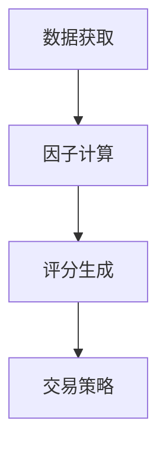

                 


# 特价股票投资中的多因子模型应用

> 关键词：特价股票投资、多因子模型、股票评分、投资策略、因子分析、投资系统

> 摘要：本文深入探讨了多因子模型在特价股票投资中的应用，从背景介绍到核心概念，再到算法原理、数学模型、系统架构、项目实战以及最佳实践，全面解析了多因子模型如何帮助投资者做出明智的投资决策。

---

## 第1章: 特价股票投资的背景与多因子模型概述

### 1.1 特价股票投资的背景

#### 1.1.1 特价股票的定义与特点

- **特价股票**：通常指市盈率（P/E）低于行业平均水平、市净率（P/B）低于行业平均水平，或者市值较小的股票。这类股票通常被认为被市场低估，具有较大的上涨潜力。
- **特点**：
  - 价格较低，适合中小投资者。
  - 市盈率和市净率低，可能隐藏价值。
  - 风险较高，波动性较大。

#### 1.1.2 特价股票投资的历史

- 特价股票投资理念起源于价值投资，强调寻找市场低估的股票。
- 历史上的投资者如本杰明·格雷厄姆和沃伦·巴菲特都曾强调寻找安全边际，即价格低于内在价值的股票。

### 1.2 多因子模型的基本概念

#### 1.2.1 多因子模型的定义

- 多因子模型是一种金融分析方法，通过多个因子（如价值、动量、质量和流动性）来评估股票的投资价值。
- 每个因子代表一个特定的市场特征，通过综合多个因子的得分来评估股票的整体价值。

#### 1.2.2 多因子模型的优势

- **全面性**：考虑多个因子，避免单一因子的局限性。
- **稳定性**：结合多个因子可以提高模型的稳定性。
- **可解释性**：每个因子都有明确的经济意义，便于投资者理解。

---

## 第2章: 多因子模型的核心概念

### 2.1 因子的定义与分类

#### 2.1.1 因子的定义

- **因子**：影响股票收益的关键因素，通常表现为某种可量化的指标。
- **常见因子**：包括价值因子（如市盈率、市净率）、动量因子（如过去的价格趋势）、质量因子（如ROE、ROA）和流动性因子（如换手率）。

#### 2.1.2 因子的分类

| 因子类型 | 定义 | 示例指标 |
|----------|------|----------|
| 价值因子 | 衡量股票的估值水平 | 市盈率（P/E）、市净率（P/B） |
| 动量因子 | 衡量股票的价格动量 | 过去12个月的收益 |
| 质量因子 | 衡量公司的财务健康状况 | 净利润增长率、ROE |
| 流动性因子 | 衡量股票的流动性 | 换手率、流通股比例 |

### 2.2 因子之间的关系

- **独立性**：不同因子之间应尽量独立，避免多重共线性。
- **互补性**：因子之间可以互补，提供更全面的评估。

---

## 第3章: 多因子模型的算法原理

### 3.1 数据预处理

#### 3.1.1 数据清洗

- 去除缺失值和异常值。
- 标准化或归一化处理。

#### 3.1.2 数据获取

- 从数据源获取股票的历史数据，包括价格、成交量、财务指标等。

### 3.2 因子计算

- 根据定义的因子计算每个股票的因子值。
- 例如，计算市盈率、市净率等。

### 3.3 因子筛选

- 使用统计方法（如相关性分析）筛选出重要的因子。
- 例如，使用逐步回归法筛选出对收益影响最大的因子。

### 3.4 权重计算

- 根据因子的重要程度分配权重。
- 使用主成分分析（PCA）确定因子的权重。

### 3.5 模型优化

- 使用回测和风险调整的方法优化模型。
- 例如，调整因子权重以提高模型的收益风险比。

---

## 第4章: 多因子模型的数学模型

### 4.1 因子得分计算

$$ \text{因子得分} = \sum_{i=1}^{n} w_i \times f_i $$

其中，\( w_i \) 是因子 \( i \) 的权重，\( f_i \) 是因子 \( i \) 的值。

### 4.2 综合评分计算

$$ \text{综合评分} = \sum_{i=1}^{m} w_i \times f_i $$

其中，\( m \) 是因子的数量。

### 4.3 回测分析

- 计算模型在历史数据上的表现。
- 例如，计算模型在回测期间的夏普比率和最大回撤。

---

## 第5章: 基于多因子模型的投资系统架构

### 5.1 系统功能设计

- **数据获取模块**：从数据源获取股票数据。
- **因子计算模块**：计算每个因子的值。
- **评分生成模块**：根据因子得分生成股票评分。
- **交易策略模块**：根据评分制定交易策略。

### 5.2 系统架构图



---

## 第6章: 项目实战

### 6.1 环境安装

- 安装Python和相关库（如Pandas、NumPy、Scipy）。

### 6.2 核心代码实现

```python
import pandas as pd
import numpy as np

# 示例数据
data = pd.DataFrame({
    'P/E': [10, 15, 20, 25],
    'P/B': [2, 3, 4, 5],
    'ROE': [10, 20, 15, 25]
})

# 计算因子得分
weights = [0.5, 0.3, 0.2]
factor_scores = data.apply(lambda x: sum(w * f for w, f in zip(weights, x)), axis=1)
```

### 6.3 实际案例分析

- 使用实际股票数据进行回测。
- 计算模型的收益和风险指标。

---

## 第7章: 最佳实践与小结

### 7.1 小结

- 多因子模型通过综合多个因子的得分，提供更全面的股票评估。
- 适用于特价股票投资，帮助投资者发现被低估的股票。

### 7.2 注意事项

- 模型需要定期更新和优化。
- 注意市场变化和因子的有效性。

### 7.3 拓展阅读

- 建议阅读《投资学》和《Python金融分析》等书籍。

---

作者：AI天才研究院 & 禅与计算机程序设计艺术

