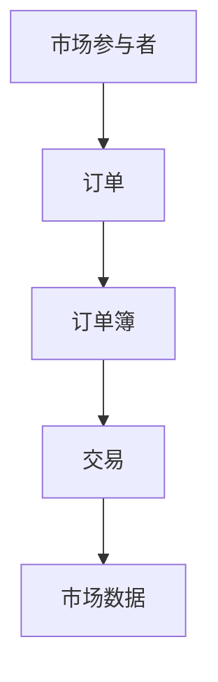
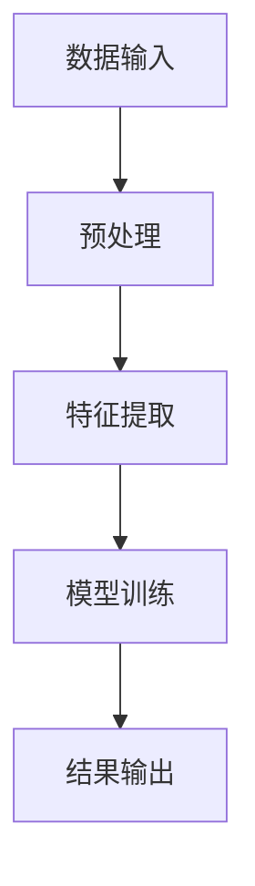
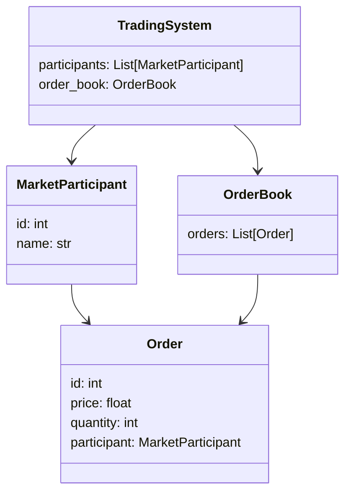
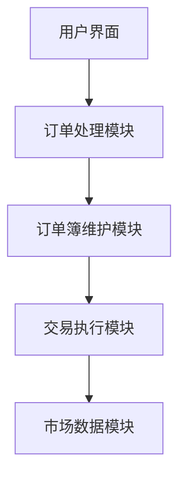
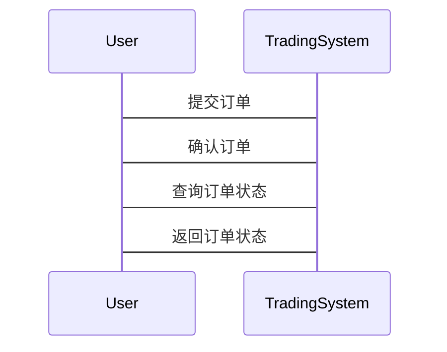

                 


# 特价股票投资中的市场微观结构分析

> 关键词：特价股票、市场微观结构、订单流分析、算法交易、投资策略

> 摘要：本文深入探讨了特价股票投资中的市场微观结构分析，通过详细分析市场参与者、订单流、交易机制等核心要素，揭示了市场微观结构对投资决策的影响。文章结合理论与实践，提出了基于订单流的预测模型，并通过实际案例分析，展示了如何利用市场微观结构信息优化投资策略。

---

# 第1章: 特价股票投资的背景与概念

## 1.1 特价股票的定义与特征

### 1.1.1 特价股票的定义  
特价股票通常指价格低于市场平均水平的股票，通常具有较高的波动性和不确定性。这类股票可能属于小盘股，流动性较低，但潜在回报较高。

### 1.1.2 特价股票的市场特征  
- 价格波动大  
- 交易量小  
- 市场参与者多样性  

### 1.1.3 特价股票与普通股票的区别  
| 特性 | 特价股票 | 普通股票 |
|------|----------|----------|
| 价格 | 低于市场平均 | 符合市场平均水平 |
| 流动性 | 较低 | 较高 |
| 波动性 | 高 | 中等 |

## 1.2 市场微观结构的基本概念

### 1.2.1 市场微观结构的定义  
市场微观结构是指市场中参与者、订单流、交易机制等要素的构成和相互关系。

### 1.2.2 市场微观结构的核心要素  
- 市场参与者：机构投资者、个人投资者、做市商等  
- 订单簿：记录未成交订单的集合  
- 交易机制：撮合订单的规则  

### 1.2.3 微观结构与宏观市场的关系  
微观结构影响市场的整体波动性和流动性，宏观市场则为微观结构提供运行环境。

## 1.3 特价股票投资的动机与挑战

### 1.3.1 投资者参与特价股票的原因  
- 寻找低估资产  
- 投机性收益  

### 1.3.2 特价股票市场的特殊性与复杂性  
- 信息不对称严重  
- 市场操纵风险高  

### 1.3.3 投资者面临的挑战与风险  
- 流动性风险  
- 价格波动风险  

## 1.4 本章小结  
本章介绍了特价股票的定义和特征，分析了市场微观结构的核心要素及其与宏观市场的关系，最后探讨了投资者在特价股票市场中面临的挑战和风险。

---

# 第2章: 市场微观结构的核心要素分析

## 2.1 市场微观结构的构成要素

### 2.1.1 市场参与者  
市场参与者包括机构投资者、个人投资者、做市商等，不同参与者的行为模式和目标不同。

### 2.1.2 订单簿与交易数据  
订单簿记录了市场参与者提交的买入和卖出订单，交易数据反映了实际成交情况。

### 2.1.3 交易机制与规则  
交易机制决定了订单如何匹配成交，常见的机制包括订单簿匹配和拍卖机制。

## 2.2 市场微观结构的动态特征

### 2.2.1 市场深度与流动性  
市场深度反映了市场参与者愿意在特定价格水平上交易的数量，流动性是市场深度的体现。

### 2.2.2 市场波动性与不稳定性  
市场波动性指价格在短时间内剧烈变化，不稳定性可能导致市场参与者行为变化。

### 2.2.3 市场微观结构的时间依赖性  
市场微观结构在不同时间周期内的表现不同，高频交易依赖于秒级数据。

## 2.3 特价股票市场中的特殊现象

### 2.3.1 小盘股的波动特性  
小盘股价格波动较大，容易受市场参与者行为影响。

### 2.3.2 特价股票的流动性溢价  
由于流动性较低，特价股票可能具有流动性溢价。

### 2.3.3 市场操纵与异常交易行为  
市场操纵可能导致虚假的价格信号，增加投资风险。

## 2.4 本章小结  
本章分析了市场微观结构的构成要素，探讨了其动态特征，并结合特价股票市场，分析了其中的特殊现象。

---

# 第3章: 市场微观结构分析的核心概念与联系

## 3.1 核心概念的原理分析

### 3.1.1 市场微观结构的数学模型  
市场微观结构可以用数学模型描述，例如订单流模型。

### 3.1.2 市场参与者的博弈关系  
市场参与者通过博弈决定订单提交和成交价格。

### 3.1.3 市场信息的不对称性  
信息不对称可能导致市场定价偏差。

## 3.2 核心概念的属性对比

### 3.2.1 市场参与者属性对比表  
| 属性 | 机构投资者 | 个人投资者 |
|------|------------|------------|
| 目标 | 稳定收益 | 投机收益 |
| 交易频率 | 低 | 高 |

### 3.2.2 交易机制的对比分析  
| 机制 | 市场订单 | 限价订单 |
|------|------------|------------|
| 特性 | 竞价成交 | 等待成交 |

### 3.2.3 市场数据特征的对比  
| 特性 | 高频交易 | 低频交易 |
|------|------------|------------|
| 时间粒度 | 秒 | 分钟 |

## 3.3 实体关系图（ER图）分析



## 3.4 本章小结  
本章通过核心概念的原理分析和属性对比，揭示了市场微观结构的内在联系，并通过实体关系图展示了各要素之间的关系。

---

# 第4章: 市场微观结构分析的算法原理

## 4.1 算法原理概述

### 4.1.1 基于订单流的预测模型  
订单流分析是预测市场走势的重要方法。

### 4.1.2 市场微观结构的特征提取  
特征提取是算法的核心步骤，包括订单簿深度、成交时间间隔等。

### 4.1.3 算法的适用场景与限制  
适用于高频交易和小盘股市场，但对大数据环境要求较高。

## 4.2 算法流程图



## 4.3 算法实现代码

```python
def process_data(data):
    # 数据预处理代码
    pass

def extract_features(data):
    # 特征提取代码
    pass

def train_model(features, labels):
    # 模型训练代码
    pass
```

## 4.4 算法的数学模型

### 4.4.1 事件时间模型  
$$ t_i = \text{订单提交时间} $$

### 4.4.2 价格变化模型  
$$ p_{i+1} = p_i + \Delta p $$

## 4.5 本章小结  
本章详细讲解了基于订单流的预测模型，包括算法流程、实现代码和数学模型，为后续分析奠定了基础。

---

# 第5章: 系统分析与架构设计

## 5.1 问题场景介绍  
我们设计了一个基于市场微观结构分析的投资系统，目标是优化特价股票的投资策略。

## 5.2 系统功能设计

### 5.2.1 领域模型类图



### 5.2.2 系统架构图



### 5.2.3 接口设计  
接口定义了用户输入、订单处理和交易执行的交互方式。

### 5.2.4 交互流程图



## 5.3 本章小结  
本章通过系统分析与架构设计，展示了如何构建一个基于市场微观结构分析的投资系统。

---

# 第6章: 项目实战

## 6.1 环境安装  
安装Python、Pandas、NumPy等依赖库。

## 6.2 核心代码实现

```python
import pandas as pd
import numpy as np

def process_data(data):
    return data.dropna()

def extract_features(data):
    features = data.rolling(5).mean()
    return features

def train_model(features, labels):
    from sklearn.

