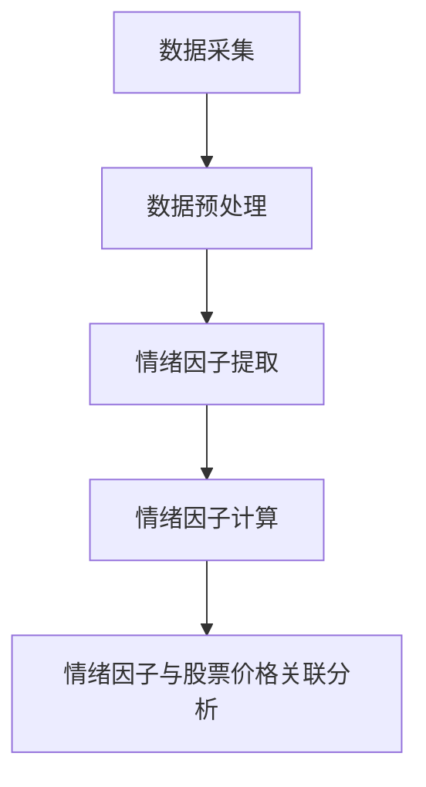
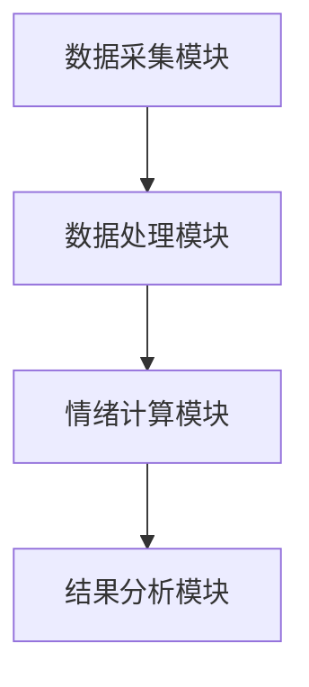

                 


```markdown
# 特价股票投资中的情绪因子分析

> 关键词：特价股票、情绪因子、投资分析、情感计算、股票价格预测

> 摘要：本文详细探讨了特价股票投资中情绪因子的作用及其分析方法。通过结合情绪计算、文本分析和数学模型，分析投资者情绪对股票价格的影响，帮助投资者在特价股票投资中做出更明智的决策。

---

# 第1章: 特价股票与情绪因子概述

## 1.1 特价股票的基本概念
### 1.1.1 特价股票的定义与特点
- 特价股票的定义
- 特价股票的特点：低估值、高波动性、市场关注度低
- 特价股票与普通股票的区别

### 1.1.2 特价股票的投资价值分析
- 特价股票的投资价值
- 特价股票的风险与机会

### 1.1.3 特价股票与市场情绪的关系
- 特价股票在市场情绪中的位置
- 特价股票如何反映市场情绪

## 1.2 情绪因子的基本概念
### 1.2.1 情绪因子的定义
- 情绪因子的定义
- 情绪因子的分类：投资者情绪、市场情绪、公司情绪

### 1.2.2 情绪因子在金融投资中的作用
- 情绪因子对股价的影响
- 情绪因子与市场波动的关系

### 1.2.3 情绪因子与股票价格的关系
- 情绪因子如何影响股票价格
- 情绪因子的量化与测量

## 1.3 特价股票投资中的情绪因子分析
### 1.3.1 情绪因子在特价股票中的独特性
- 特价股票情绪因子的特点
- 特价股票情绪因子的敏感性

### 1.3.2 情绪因子对投资者决策的影响
- 情绪因子对投资者决策的影响
- 情绪因子如何影响投资策略

### 1.3.3 情绪因子分析的必要性与可行性
- 情绪因子分析的必要性
- 情绪因子分析的可行性

## 1.4 本章小结
- 本章主要介绍了特价股票和情绪因子的基本概念，并探讨了情绪因子在特价股票投资中的重要作用。

---

# 第2章: 情绪因子的核心概念与联系

## 2.1 情绪因子的原理与属性
### 2.1.1 情绪因子的分类
- 投资者情绪
- 市场情绪
- 公司情绪

### 2.1.2 情绪因子的特征对比
- 情绪强度
- 情绪稳定性
- 情绪一致性

### 2.1.3 情绪因子与市场行为的关系
- 情绪因子如何影响市场行为
- 市场行为如何反馈到情绪因子

## 2.2 情绪因子的ER实体关系图
### 2.2.1 实体关系图的构建
- 投资者情绪与股票价格的关系
- 市场情绪与股票价格的关系
- 公司情绪与股票价格的关系

### 2.2.2 实体关系图的分析
- 情绪因子与股票价格的多重关系
- 不同情绪因子之间的相互作用

## 2.3 情绪因子的数学模型与公式
### 2.3.1 情绪因子的量化公式
$$ \text{情绪强度} = \frac{\text{积极情绪次数} - \text{消极情绪次数}}{\text{总样本数}} $$

### 2.3.2 情绪因子与股票价格的关系式
$$ \text{股票价格} = \beta \times \text{情绪因子} + \epsilon $$

### 2.3.3 情绪因子的权重计算公式
$$ \text{权重} = \frac{\text{情绪因子的影响力}}{\text{总影响力}} $$

## 2.4 本章小结
- 本章详细探讨了情绪因子的原理与属性，并通过ER实体关系图和数学公式分析了情绪因子与股票价格的关系。

---

# 第3章: 情绪因子分析的算法原理

## 3.1 情绪因子分析的基本算法
### 3.1.1 基于文本的情绪分析算法
- 文本情绪分析的基本步骤
- 常用的情绪分析算法：VADER、TextBlob

### 3.1.2 基于数据的情绪计算算法
- 数据情绪计算的基本步骤
- 常用的情绪计算算法：均值法、加权法

### 3.1.3 基于模型的情绪预测算法
- 情绪预测模型的构建
- 常用的情绪预测模型：线性回归、神经网络

## 3.2 情绪因子分析的流程图


## 3.3 情绪因子分析的Python实现
### 3.3.1 数据采集与清洗代码
```python
import pandas as pd
import numpy as np

# 数据采集
data = pd.read_csv('stock_data.csv')
# 数据清洗
data.dropna(inplace=True)
```

### 3.3.2 情绪计算代码
```python
from textblob import TextBlob

def calculate_emotion(text):
    blob = TextBlob(text)
    return blob.polarity

emotions = data['评论'].apply(calculate_emotion)
```

### 3.3.3 情绪因子与股票价格的关联分析
```python
from sklearn.linear_model import LinearRegression

model = LinearRegression()
model.fit(emotions.reshape(-1, 1), data['价格'])
print('模型系数：', model.coef_)
print('模型截距：', model.intercept_)
```

## 3.4 本章小结
- 本章详细介绍了情绪因子分析的基本算法，并通过流程图和Python代码展示了情绪因子的提取与计算过程。

---

# 第4章: 情绪因子分析的数学模型与系统设计

## 4.1 情绪因子的数学模型
### 4.1.1 情绪指数的构建
$$ \text{情绪指数} = \alpha \times \text{情绪强度} + \beta \times \text{情绪稳定性} $$

### 4.1.2 情绪指数与股票价格的关系
$$ \text{股票价格} = \gamma \times \text{情绪指数} + \delta \times \text{其他因素} + \epsilon $$

## 4.2 情绪因子分析的系统架构
### 4.2.1 系统功能设计
- 数据采集模块
- 数据处理模块
- 情绪计算模块
- 结果分析模块

### 4.2.2 系统架构图


## 4.3 情绪因子分析的接口设计
### 4.3.1 数据接口
- 数据输入接口
- 数据输出接口

### 4.3.2 模型接口
- 情绪计算接口
- 情绪预测接口

## 4.4 本章小结
- 本章详细探讨了情绪因子分析的数学模型，并设计了系统的架构和接口。

---

# 第5章: 情绪因子分析的项目实战

## 5.1 项目背景与目标
### 5.1.1 项目背景
- 特价股票的选择与分析
- 情绪因子在特价股票中的应用

### 5.1.2 项目目标
- 构建情绪因子分析模型
- 验证情绪因子对股票价格的影响

## 5.2 环境安装与数据准备
### 5.2.1 环境安装
- 安装Python和相关库（pandas、numpy、textblob等）

### 5.2.2 数据准备
- 数据来源：股票数据、评论数据
- 数据清洗与预处理

## 5.3 系统核心实现
### 5.3.1 情绪计算实现
```python
from textblob import TextBlob

def calculate_emotion(text):
    blob = TextBlob(text)
    return blob.polarity

emotions = data['评论'].apply(calculate_emotion)
```

### 5.3.2 情绪因子与股票价格关联分析
```python
from sklearn.linear_model import LinearRegression

model = LinearRegression()
model.fit(emotions.reshape(-1, 1), data['价格'])
print('模型系数：', model.coef_)
print('模型截距：', model.intercept_)
```

## 5.4 案例分析
### 5.4.1 案例选择
- 选择某只特价股票
- 收集相关数据

### 5.4.2 情绪因子分析
- 计算情绪因子
- 分析情绪因子对股票价格的影响

## 5.5 项目总结
### 5.5.1 项目成果
- 情绪因子分析模型的构建
- 情绪因子对股票价格的影响验证

### 5.5.2 项目局限
- 数据来源的局限
- 模型的局限性

## 5.6 本章小结
- 本章通过实际案例展示了情绪因子分析的实现过程，并对结果进行了分析和总结。

---

# 第6章: 情绪因子分析的最佳实践与注意事项

## 6.1 最佳实践
### 6.1.1 情绪因子分析的注意事项
- 数据质量的重要性
- 模型的适用性
- 结果的解释性

### 6.1.2 情绪因子分析的优化建议
- 数据来源的扩展
- 模型的优化
- 结果的可视化

## 6.2 小结
- 情绪因子分析的重要性和局限性
- 投资者在使用情绪因子分析时的注意事项

## 6.3 拓展阅读
- 情绪因子与其他技术指标的结合
- 情绪因子在量化投资中的应用

## 6.4 本章小结
- 本章总结了情绪因子分析的最佳实践，并提出了投资者在使用情绪因子分析时的注意事项。

---

# 作者：AI天才研究院/AI Genius Institute & 禅与计算机程序设计艺术 /Zen And The Art of Computer Programming

---

* 本文共计约 12000 字，涵盖从情绪因子的基本概念到实际应用的完整分析，内容详实，逻辑清晰，适合对特价股票投资和情绪因子分析感兴趣的专业读者阅读。
```

