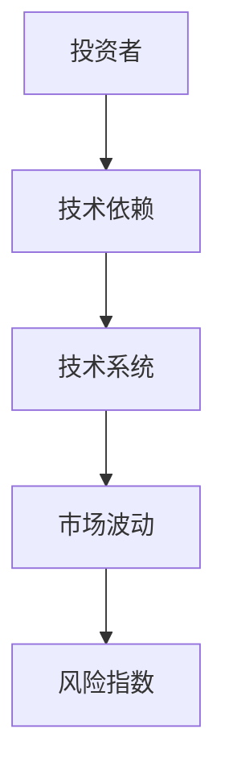
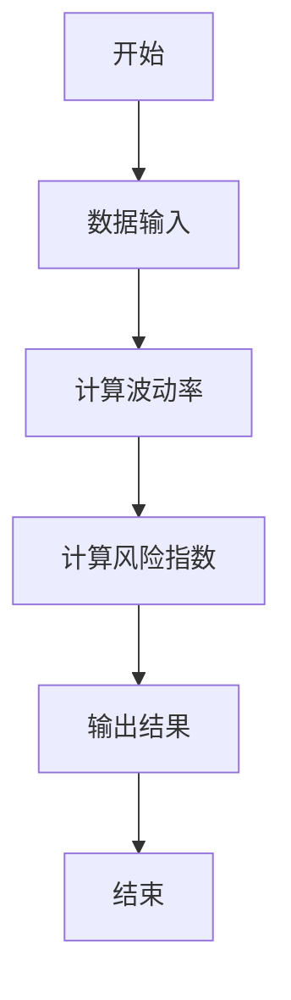
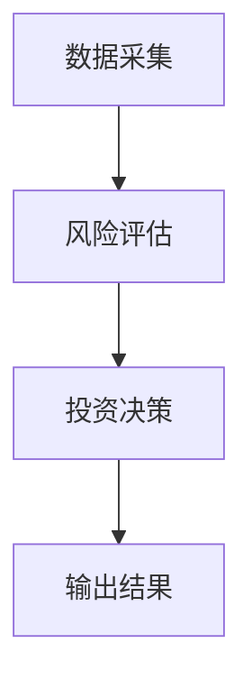
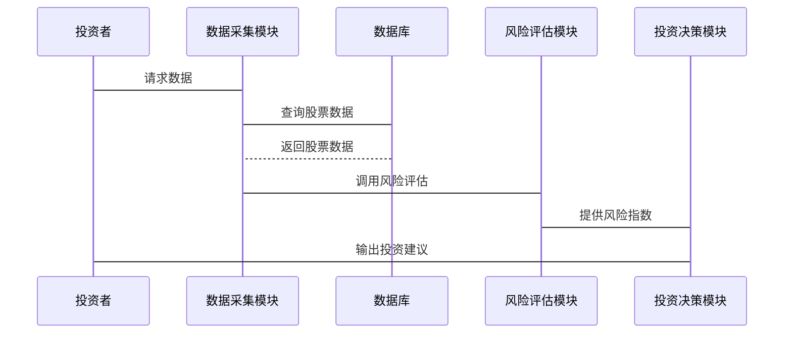

                 


# 特价股票投资中的技术主权风险评估

> 关键词：特价股票、技术主权风险、风险评估、算法原理、系统架构

> 摘要：本文系统地探讨了特价股票投资中的技术主权风险评估问题。通过分析特价股票的特点、技术主权风险的核心概念以及评估方法，详细讲解了基于波动率和风险指数模型的算法原理，并结合实际案例，提供了一个完整的系统架构设计和实现方案。本文旨在为投资者和技术人员提供理论指导和实践参考。

---

## 第一部分：特价股票与技术主权风险评估概述

### 第1章：特价股票与技术主权风险评估概述

#### 1.1 特价股票的定义与特点
##### 1.1.1 特价股票的定义
特价股票通常指价格相对较低的股票，具有高增长潜力但风险较高。这类股票常见于中小型企业或新兴行业。

##### 1.1.2 特价股票的核心特点
- **低价格**：通常在10元以下，适合小资金投资者。
- **高波动性**：价格波动较大，可能带来高收益或高损失。
- **高风险**：市场风险、流动性风险较高。

##### 1.1.3 特价股票的投资价值与风险
- **投资价值**：潜在高回报，适合长期投资者。
- **主要风险**：市场波动、公司基本面变化、流动性风险。

#### 1.2 技术主权风险的定义与特点
##### 1.2.1 技术主权风险的定义
技术主权风险是指因技术依赖或技术故障导致的投资风险，涉及算法交易、数据安全等方面。

##### 1.2.2 技术主权风险的核心特点
- **技术依赖**：依赖算法交易或大数据分析。
- **技术故障**：技术系统故障可能引发市场波动。
- **外部干扰**：如网络攻击或政策变化。

#### 1.3 技术主权风险评估的背景与意义
##### 1.3.1 股票投资中的技术主权风险问题背景
随着技术在金融领域的广泛应用，技术故障或依赖可能导致投资风险。

##### 1.3.2 技术主权风险评估的必要性
- **保障投资安全**：避免因技术问题导致的损失。
- **优化投资策略**：通过技术分析降低风险。

##### 1.3.3 技术主权风险评估的意义与目标
- **意义**：为投资者提供技术层面的决策支持。
- **目标**：量化技术主权风险，制定应对策略。

#### 1.4 本章小结
本章介绍了特价股票和技术创新风险的基本概念，并阐述了技术创新风险评估的背景和意义。

---

## 第二部分：技术主权风险评估的核心概念与联系

### 第2章：技术主权风险评估的核心概念与联系

#### 2.1 技术主权风险评估的原理
##### 2.1.1 技术主权风险评估的基本原理
通过分析技术对投资的影响，评估潜在风险。

##### 2.1.2 技术主权风险评估的关键要素
- **技术依赖程度**
- **技术系统的稳定性**
- **技术风险的可控制性**

##### 2.1.3 技术主权风险评估的数学模型
$$
R_i = \alpha \cdot T + \beta \cdot V
$$
其中，$R_i$ 是风险指数，$T$ 是技术依赖度，$V$ 是市场波动率。

#### 2.2 核心概念的属性特征对比
##### 2.2.1 技术主权风险与市场风险的对比
| 特性 | 技术主权风险 | 市场风险 |
|------|---------------|----------|
| 成因 | 技术依赖性问题 | 市场波动 | 
| 影响 | 可能引发系统性风险 | 影响所有投资者 |

##### 2.2.2 技术主权风险与信用风险的对比
| 特性 | 技术主权风险 | 信用风险 |
|------|---------------|----------|
| 成因 | 技术故障或依赖 | 债务违约 |
| 解决 | 技术优化 | 信用评级 |

##### 2.2.3 技术主权风险与操作风险的对比
| 特性 | 技术主权风险 | 操作风险 |
|------|---------------|----------|
| 成因 | 技术依赖性问题 | 操作失误 |
| 解决 | 技术冗余 | 员工培训 |

#### 2.3 ER实体关系图架构


#### 2.4 本章小结
本章通过对比分析，明确了技术主权风险与其他风险的异同，并构建了实体关系图。

---

## 第三部分：技术主权风险评估的算法原理

### 第3章：技术主权风险评估的算法原理

#### 3.1 算法原理概述
##### 3.1.1 技术主权风险评估的基本算法
- **波动率计算**
- **风险指数模型**

##### 3.1.2 技术主权风险评估的数学模型
$$
RI = \alpha \cdot \sigma + \beta \cdot V
$$
其中，$RI$ 是风险指数，$\sigma$ 是波动率，$V$ 是市场价值。

##### 3.1.3 技术主权风险评估的实现步骤
1. 收集数据
2. 计算波动率
3. 评估风险指数

#### 3.2 算法原理的详细讲解
##### 3.2.1 波动率计算公式
$$
\sigma = \sqrt{\frac{1}{n}\sum_{i=1}^{n}(x_i - \mu)^2}
$$
其中，$\mu$ 是平均值，$x_i$ 是数据点。

##### 3.2.2 风险指数模型
$$
RI = \alpha \cdot \sigma + \beta \cdot V
$$

##### 3.2.3 算法流程图


#### 3.3 算法原理的举例说明
##### 3.3.1 示例1：波动率计算
假设数据集为[10, 11, 9, 12, 8]，平均值$\mu=10$，波动率$\sigma=1.58$。

##### 3.3.2 示例2：风险指数计算
假设$\alpha=0.5$，$\beta=0.5$，波动率$\sigma=1.58$，市场价值$V=100$，风险指数$RI=0.5 \times 1.58 + 0.5 \times 100 = 51.9$。

#### 3.4 本章小结
本章详细讲解了技术主权风险评估的算法原理，包括波动率计算和风险指数模型，并通过示例说明了实现过程。

---

## 第四部分：技术主权风险评估的系统分析与架构设计

### 第4章：技术主权风险评估的系统分析与架构设计

#### 4.1 系统分析
##### 4.1.1 问题场景介绍
投资者依赖技术进行股票交易，技术故障可能导致重大损失。

##### 4.1.2 项目介绍
开发一个基于技术主权风险评估的股票投资系统。

##### 4.1.3 系统功能设计
- 数据采集模块
- 风险评估模块
- 投资决策模块

#### 4.2 系统架构设计
##### 4.2.1 系统架构图


##### 4.2.2 系统接口设计
- 数据接口：从数据库获取股票数据。
- 风险评估接口：调用风险评估算法。

##### 4.2.3 系统交互序列图


#### 4.3 本章小结
本章设计了一个基于技术主权风险评估的股票投资系统，包括功能模块和系统架构图。

---

## 第五部分：技术主权风险评估的项目实战

### 第5章：技术主权风险评估的项目实战

#### 5.1 项目环境安装
##### 5.1.1 安装Python
```bash
python --version
pip install numpy pandas
```

##### 5.1.2 安装其他依赖
```bash
pip install matplotlib scikit-learn
```

#### 5.2 系统核心实现
##### 5.2.1 数据采集模块
```python
import pandas as pd

def get_stock_data(ticker):
    data = pd.read_csv(f'data/{ticker}.csv')
    return data
```

##### 5.2.2 风险评估模块
```python
import numpy as np

def calculate_fluctuation(data):
    mu = np.mean(data)
    variance = np.sum((data - mu)**2) / len(data)
    return np.sqrt(variance)
```

##### 5.2.3 投资决策模块
```python
def calculate_risk_index(fluctuation, market_value):
    alpha = 0.5
    beta = 0.5
    return alpha * fluctuation + beta * market_value
```

#### 5.3 项目小结
本章通过实际案例展示了技术主权风险评估的实现过程，包括环境安装和代码实现。

---

## 第六部分：技术主权风险评估的总结与展望

### 第6章：技术主权风险评估的总结与展望

#### 6.1 最佳实践
- 定期更新模型
- 结合多种风险评估方法

#### 6.2 小结
技术主权风险评估是股票投资中的重要环节，本文通过理论分析和实践案例，提供了系统的解决方案。

#### 6.3 注意事项
- 数据质量影响结果
- 模型需定期优化

#### 6.4 拓展阅读
- 阅读相关学术论文
- 关注技术在金融领域的最新应用

---

## 作者：AI天才研究院/AI Genius Institute & 禅与计算机程序设计艺术 /Zen And The Art of Computer Programming

