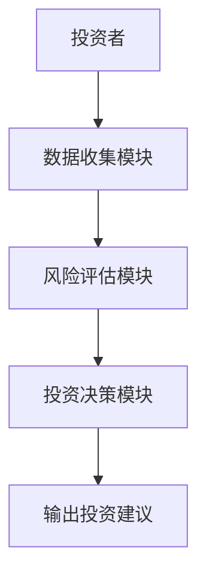
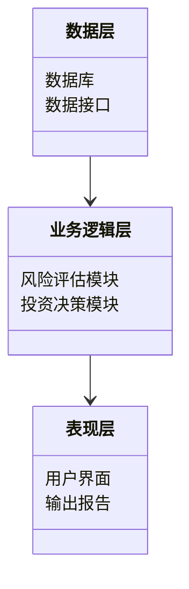

                 


# 特价股票投资中的数据主权与网络安全风险动态评估方法

> 关键词：数据主权，网络安全，动态评估，特价股票，风险评估

> 摘要：本文探讨了在特价股票投资中，数据主权与网络安全风险动态评估的重要性。通过分析数据主权的核心概念和网络安全风险的分类，提出了一个基于概率论和统计学的动态风险评估模型，结合系统架构设计和项目实战案例，展示了如何在实际投资中应用这些方法，确保投资决策的准确性和安全性。

---

# 第一部分: 特价股票投资中的数据主权与网络安全风险动态评估背景

# 第1章: 特价股票投资与数据主权概述

## 1.1 特价股票投资的定义与特点

### 1.1.1 特价股票的定义

特价股票是指价格低于市场平均价或行业标准价的股票，通常具有较高的投资潜力。这些股票可能因为市场波动、公司短期问题或未被充分挖掘的价值而被低估。

### 1.1.2 特价股票投资的核心特点

- 价格低廉：相比市场平均水平，特价股票的价格较低，适合资金有限的投资者。
- 投资潜力大：低估的股票往往有较大的上涨空间。
- 风险较高：由于价格低，公司可能面临财务困境或其他风险。

### 1.1.3 特价股票投资的市场定位

特价股票主要集中在中小盘股或周期性行业，投资者需要关注市场周期和公司基本面。

## 1.2 数据主权的定义与重要性

### 1.2.1 数据主权的定义

数据主权是指数据的拥有者对数据的控制权，包括存储、处理和使用的权利。在跨国投资中，数据主权尤为重要，因为不同国家对数据的监管政策不同。

### 1.2.2 数据主权的核心要素

- 数据所有权：数据的归属权。
- 数据控制权：对数据的管理和操作权限。
- 数据存储地：数据存储的地理位置。

### 1.2.3 数据主权与国家安全的关系

数据主权直接关系到国家的经济安全和信息安全。特别是在投资领域，数据的跨境流动需要遵守相关国家的法律法规。

## 1.3 网络安全风险的定义与分类

### 1.3.1 网络安全风险的定义

网络安全风险是指由于网络攻击、数据泄露或其他恶意行为导致的信息系统安全威胁。

### 1.3.2 网络安全风险的主要分类

- 人为攻击：如黑客攻击、钓鱼邮件等。
- 系统漏洞：软件或硬件的缺陷被利用。
- 内部威胁：员工或合作伙伴的恶意行为。

### 1.3.3 网络安全风险对企业的影响

- 造成经济损失：数据泄露可能导致罚款和赔偿。
- 损害企业声誉：泄露敏感信息会影响客户信任。
- 影响投资决策：数据泄露可能影响投资者对公司的信心。

## 1.4 特价股票投资中的数据主权与网络安全风险动态评估的必要性

### 1.4.1 特价股票投资中的数据主权问题

在跨国投资中，数据主权问题可能导致法律纠纷和合规风险。投资者需要确保数据的合法性和安全性。

### 1.4.2 网络安全风险对投资决策的影响

网络安全事件可能影响公司的财务状况和市场表现，进而影响股票价格。

### 1.4.3 动态评估方法的必要性

动态评估方法能够实时监测数据主权和网络安全风险的变化，帮助投资者及时调整投资策略。

## 1.5 本章小结

本章介绍了特价股票投资的定义和特点，分析了数据主权和网络安全风险的重要性，并强调了动态评估方法在投资决策中的必要性。

---

# 第2章: 数据主权与网络安全风险的核心概念与联系

## 2.1 数据主权与网络安全风险的属性对比

### 2.1.1 数据主权的属性特征

- **拥有权**：数据的归属权。
- **控制权**：对数据的管理权限。
- **存储地**：数据的物理位置。

### 2.1.2 网络安全风险的属性特征

- **威胁来源**：包括外部攻击和内部威胁。
- **影响范围**：可能影响公司运营和财务状况。
- **应对措施**：如防火墙、加密技术等。

### 2.1.3 数据主权与网络安全风险的对比分析

通过对比分析，可以发现数据主权更多关注数据的合法性和控制权，而网络安全风险更关注数据的安全性和完整性。

## 2.2 数据主权与网络安全风险的实体关系图

### 2.2.1 数据主权与网络安全风险的ER图

```mermaid
erDiagram
    actor 投资者 {
        <oid> id
        <string> name
    }
    actor 数据提供方 {
        <oid> id
        <string> name
    }
    entity 数据 {
        <oid> id
        <string> 类型
        <string> 所有权
        <string> 存储地
    }
    entity 风险 {
        <oid> id
        <string> 类型
        <string> 影响程度
    }
   投资者 --> 数据提供方: 传输数据
    数据提供方 --> 数据: 提供
    数据 --> 风险: 评估
```

### 2.2.2 实体关系图的详细说明

- **投资者**：作为数据的拥有者，需要确保数据的合法性和安全性。
- **数据提供方**：提供数据的机构，需要遵守数据主权的法律法规。
- **数据**：包括投资者和数据提供方的交互，涉及数据的类型、所有权和存储地。
- **风险**：评估数据主权和网络安全风险的影响程度。

## 2.3 数据主权与网络安全风险的核心要素

### 2.3.1 数据主权的核心要素

- 数据所有权：明确数据的归属权。
- 数据控制权：对数据的管理和操作权限。
- 数据存储地：数据的物理位置，影响法律合规性。

### 2.3.2 网络安全风险的核心要素

- 威胁来源：包括外部攻击和内部威胁。
- 影响范围：可能影响公司运营和财务状况。
- 应对措施：如防火墙、加密技术等。

### 2.3.3 数据主权与网络安全风险的交互关系

通过交互关系，可以发现数据主权问题可能引发网络安全风险，而网络安全风险的应对措施又会影响数据主权的实现。

## 2.4 本章小结

本章通过属性对比和ER图分析，详细阐述了数据主权与网络安全风险的核心概念及其相互关系。

---

# 第3章: 数据主权与网络安全风险动态评估的算法原理

## 3.1 动态风险评估的基本原理

### 3.1.1 动态风险评估的定义

动态风险评估是一种实时监测和评估风险的方法，能够根据市场变化和数据更新及时调整评估结果。

### 3.1.2 动态风险评估的核心思想

- 实时性：动态评估需要实时更新数据和风险指标。
- 综合性：考虑多种因素，如市场波动、公司基本面、网络安全事件等。
- 可视化：通过图表和报告的形式直观展示风险评估结果。

### 3.1.3 动态风险评估的数学模型

动态风险评估模型可以表示为：

$$
R(t) = \alpha \cdot S(t) + \beta \cdot F(t) + \gamma \cdot N(t)
$$

其中：
- \( R(t) \) 表示在时间 \( t \) 的风险值。
- \( S(t) \) 表示数据主权风险。
- \( F(t) \) 表示网络安全风险。
- \( N(t) \) 表示市场波动风险。
- \( \alpha, \beta, \gamma \) 是权重系数，根据实际情况调整。

### 3.1.4 动态风险评估的实现步骤

1. 数据收集：收集股票价格、公司财务数据、网络安全事件等信息。
2. 风险计算：根据数学模型计算风险值。
3. 结果分析：根据风险值制定投资策略。

### 3.1.5 动态风险评估的实现代码

```python
import pandas as pd
import numpy as np

# 假设我们有一个数据框 df，包含股票价格和网络安全事件的数据
df = pd.DataFrame({
    'price': [10, 11, 9, 12, 10],
    'event': [0, 1, 0, 1, 0]
})

# 计算网络安全风险指数
df['network_risk'] = np.where(df['event'] == 1, 0.8, 0.2)

# 计算综合风险值
alpha = 0.5
beta = 0.3
gamma = 0.2

df['total_risk'] = alpha * df['price'] + beta * df['network_risk'] + gamma * df['event']

print(df)
```

---

# 第4章: 数据主权与网络安全风险动态评估的系统架构设计

## 4.1 系统功能设计

### 4.1.1 功能模块划分

- 数据收集模块：收集股票价格、网络安全事件等数据。
- 风险评估模块：根据数学模型计算风险值。
- 投资决策模块：根据风险评估结果制定投资策略。

### 4.1.2 功能流程图



## 4.2 系统架构设计

### 4.2.1 架构选择

采用分层架构，包括数据层、业务逻辑层和表现层。

### 4.2.2 系统架构图



---

# 第5章: 数据主权与网络安全风险动态评估的项目实战

## 5.1 环境配置

### 5.1.1 安装必要的软件和库

- Python 3.8+
- Pandas, NumPy, Matplotlib等库。

## 5.2 核心实现代码

### 5.2.1 数据收集与处理

```python
import pandas as pd
import requests

# 下载股票数据
url = 'https://example.com/stock_data.csv'
data = pd.read_csv(url)
print(data.head())
```

### 5.2.2 风险评估与分析

```python
# 计算网络安全风险
data['network_risk'] = data['event'].apply(lambda x: 0.8 if x == 1 else 0.2)

# 计算综合风险值
data['total_risk'] = alpha * data['price'] + beta * data['network_risk'] + gamma * data['event']

print(data['total_risk'])
```

## 5.3 应用解读与分析

### 5.3.1 实际案例分析

以某公司为例，分析其网络安全风险和数据主权问题，并根据模型计算其风险值。

### 5.3.2 模型的优缺点

- 优点：能够实时更新数据，评估结果准确。
- 缺点：需要大量数据支持，计算复杂。

---

# 第6章: 总结与展望

## 6.1 本章总结

本文通过分析特价股票投资中的数据主权和网络安全风险，提出了动态评估方法，并通过代码实现和案例分析展示了其应用。

## 6.2 未来展望

未来研究可以进一步优化模型，引入更多因素，如宏观经济指标和市场情绪分析，以提高评估的准确性。

---

作者：AI天才研究院 & 禅与计算机程序设计艺术

