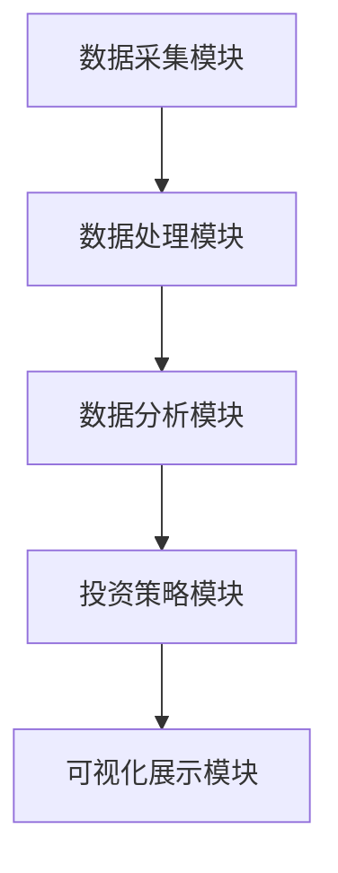
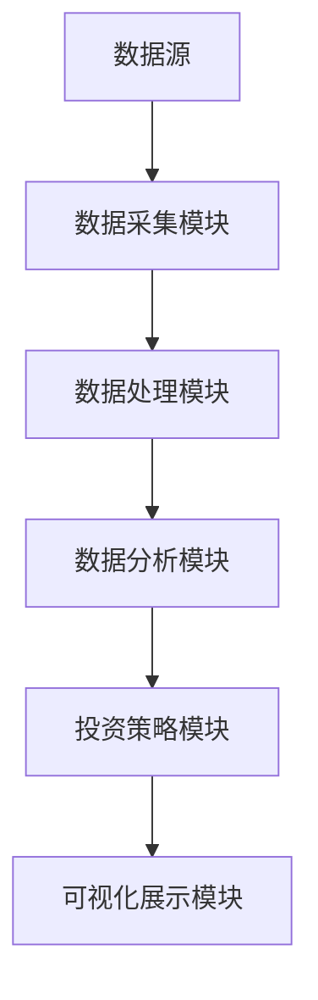

                 


# 特价股票投资中的数据分析和大数据应用

> 关键词：特价股票、数据分析、大数据、投资策略、算法、风险管理

> 摘要：本文深入探讨了在特价股票投资中，数据分析和大数据技术的应用。从数据分析的基础知识到大数据技术的高级应用，结合实际案例和系统架构设计，为投资者提供科学的投资策略和风险管理方法。通过本文，读者将了解如何利用数据分析和大数据技术，在股票市场中找到投资机会，降低风险，实现收益最大化。

---

# 第1章: 特价股票投资的背景与概念

## 1.1 特价股票的定义与特点

### 1.1.1 特价股票的定义

特价股票是指在股票市场中，由于某种原因导致股票价格被低估，相对于其内在价值而言，具有较大折扣的股票。这类股票通常被认为是被市场忽视或低估的投资机会，具有较高的增值潜力。

$$
\text{特价股票} = \text{低估价格} + \text{潜在价值}
$$

### 1.1.2 特价股票的核心特点

1. **低估值**：市盈率（P/E Ratio）和市净率（P/B Ratio）等指标远低于行业平均水平。
2. **高成长性**：公司具有较高的盈利能力和成长潜力。
3. **市场关注度低**：通常被市场忽视，交易量较小。
4. **风险与收益平衡**：相对于高风险股票，特价股票的风险较低，但收益潜力较大。

### 1.1.3 特价股票与普通股票的区别

| 特性 | 特价股票 | 普通股票 |
|------|----------|----------|
| 价格 | 低于内在价值 | 反映市场供需 |
| 风险 | 中低风险 | 高风险 |
| 成长性 | 高 | 一般 |

---

## 1.2 数据分析在股票投资中的作用

### 1.2.1 数据分析的基本概念

数据分析是通过收集、处理和分析数据，提取有价值的信息，支持决策的过程。在股票投资中，数据分析可以帮助投资者发现市场趋势、评估股票价值、识别投资机会。

### 1.2.2 数据分析在股票投资中的应用

1. **市场趋势分析**：通过历史数据预测未来市场走势。
2. **股票估值**：利用财务指标评估股票的内在价值。
3. **风险评估**：分析股票波动性，评估投资风险。
4. **投资决策支持**：基于数据驱动的决策，优化投资组合。

### 1.2.3 数据分析的优势与局限性

**优势**：
- 提高投资决策的科学性。
- 降低人为情绪对决策的影响。
- 提高投资效率。

**局限性**：
- 数据质量影响分析结果。
- 市场波动具有不确定性。
- 数据分析不能完全预测市场变化。

---

## 1.3 大数据技术在股票投资中的应用

### 1.3.1 大数据技术的基本概念

大数据技术是指处理海量、多样化、高速变化的数据的工具和技术。在股票投资中，大数据技术可以帮助投资者处理和分析来自多个来源的海量数据，发现潜在的投资机会。

### 1.3.2 大数据技术在股票投资中的优势

1. **数据多样性**：整合来自市场、财务、新闻等多种数据源。
2. **实时性**：快速处理市场动态数据，提供实时投资建议。
3. **预测能力**：利用机器学习算法预测股票价格走势。

### 1.3.3 大数据技术的应用场景

1. **实时监控**：实时跟踪市场动态，捕捉投资机会。
2. **新闻情感分析**：通过自然语言处理技术分析财经新闻，预测市场情绪。
3. **风险预警**：利用大数据分析识别市场风险，提前制定应对策略。

---

## 1.4 本章小结

本章介绍了特价股票的定义和特点，分析了数据分析在股票投资中的作用，探讨了大数据技术在股票投资中的应用和优势。这些内容为后续章节的深入分析奠定了基础。

---

# 第2章: 特价股票数据分析的核心概念

## 2.1 数据分析的基本原理

### 2.1.1 数据分析的流程

1. **数据收集**：从多个数据源收集相关数据。
2. **数据清洗**：处理缺失值、异常值等数据问题。
3. **数据预处理**：转换数据格式，提取特征。
4. **数据分析**：利用统计方法和数据挖掘技术分析数据。
5. **数据可视化**：通过图表展示分析结果。

### 2.1.2 数据分析的关键步骤

- 数据收集与整理
- 数据清洗与预处理
- 数据分析与建模
- 数据可视化与报告

### 2.1.3 数据分析的工具与技术

- 工具：Python（Pandas、NumPy）、R、SQL等。
- 技术：统计分析、数据挖掘、机器学习。

---

## 2.2 特价股票数据分析的核心指标

### 2.2.1 市盈率（P/E Ratio）

市盈率是股票价格与每股收益的比率，用于衡量股票的估值。

$$
\text{P/E Ratio} = \frac{\text{股价}}{\text{每股收益}}
$$

### 2.2.2 市净率（P/B Ratio）

市净率是股票价格与每股净资产的比率，用于评估股票的投资价值。

$$
\text{P/B Ratio} = \frac{\text{股价}}{\text{每股净资产}}
$$

### 2.2.3 股息率（Dividend Yield）

股息率是股票的股息与股价的比率，用于衡量投资回报。

$$
\text{股息率} = \frac{\text{股息}}{\text{股价}} \times 100\%
$$

### 2.2.4 其他相关指标

- 营业利润率
- 净资产收益率（ROE）
- 市销率（P/S Ratio）

---

## 2.3 数据分析与股票投资的关系

### 2.3.1 数据分析如何影响投资决策

1. **发现投资机会**：通过数据分析发现被低估的股票。
2. **评估风险**：利用数据分析评估投资风险。
3. **优化投资组合**：通过数据分析优化资产配置。

### 2.3.2 数据分析在风险控制中的作用

1. **风险管理**：通过数据分析识别潜在风险。
2. **风险预警**：利用大数据技术预测市场风险。

### 2.3.3 数据分析的未来发展趋势

1. **智能化**：利用人工智能技术提升数据分析能力。
2. **实时化**：实时分析市场动态，提供实时投资建议。
3. **个性化**：根据投资者需求定制数据分析方案。

---

## 2.4 本章小结

本章详细介绍了数据分析的基本原理和核心指标，分析了数据分析在股票投资中的应用和作用，展望了数据分析的未来发展趋势。

---

# 第3章: 数据分析的基础知识与技术

## 3.1 数据收集与清洗

### 3.1.1 数据来源的多样性

1. **市场数据**：股票价格、成交量等。
2. **财务数据**：公司财报、财务指标。
3. **新闻数据**：财经新闻、社交媒体数据。
4. **其他数据**：行业报告、宏观经济数据。

### 3.1.2 数据清洗的必要性

- 处理缺失值
- 去除异常值
- 标准化数据格式

### 3.1.3 数据预处理的步骤

1. 数据清洗
2. 数据转换
3. 数据标准化

---

## 3.2 数据可视化与探索性分析

### 3.2.1 数据可视化的工具

- Matplotlib
- Seaborn
- Tableau

### 3.2.2 探索性数据分析的重要性

1. 发现数据分布规律
2. 识别数据趋势
3. 发现异常值

### 3.2.3 数据分布与趋势分析

- 直方图：分析数据分布
- 折线图：分析数据趋势
- 散点图：分析变量关系

---

## 3.3 数据分析与建模

### 3.3.1 数据建模的基本步骤

1. 确定目标
2. 数据预处理
3. 选择模型
4. 训练模型
5. 评估模型

### 3.3.2 常见的数据分析模型

1. 线性回归：预测股票价格
2. 聚类分析：识别市场趋势
3. 分类模型：预测股票涨跌

### 3.3.3 数据分析模型的评估

- 均方误差（MSE）
- 决策系数（R²）
- 准确率

---

## 3.4 本章小结

本章介绍了数据分析的基础知识与技术，包括数据收集与清洗、数据可视化与探索性分析、数据分析与建模。这些内容为后续章节的深入分析提供了技术支持。

---

# 第4章: 大数据技术在股票投资中的应用

## 4.1 大数据采集与存储

### 4.1.1 大数据采集的挑战

1. 数据量大
2. 数据类型多样
3. 数据处理速度要求高

### 4.1.2 大数据存储的技术

1. 分布式存储（Hadoop、HDFS）
2. 关系型数据库（MySQL、PostgreSQL）
3. NoSQL数据库（MongoDB、Redis）

---

## 4.2 大数据分析技术

### 4.2.1 分布式计算框架

1. MapReduce
2. Spark
3. Flink

### 4.2.2 数据挖掘与机器学习

1. 分类算法（决策树、随机森林）
2. 聚类算法（K-means）
3. 回归算法（线性回归）

### 4.2.3 自然语言处理（NLP）

1. 文本分类：分析财经新闻情感
2. 实体识别：提取公司名称、事件等
3. 情感分析：预测市场情绪

---

## 4.3 大数据在股票投资中的实际应用

### 4.3.1 市场情绪分析

通过分析财经新闻和社交媒体数据，预测市场情绪，辅助投资决策。

### 4.3.2 股票价格预测

利用大数据分析技术，预测股票价格走势，制定投资策略。

### 4.3.3 风险管理

通过大数据分析，识别潜在风险，制定风险控制策略。

---

## 4.4 本章小结

本章探讨了大数据技术在股票投资中的应用，包括大数据采集与存储、大数据分析技术以及大数据在股票投资中的实际应用。大数据技术为股票投资提供了强大的工具和方法，帮助投资者提高投资效率和收益。

---

# 第5章: 特价股票投资策略与风险管理

## 5.1 量化交易策略

### 5.1.1 量化交易的定义

量化交易是指通过数学模型和算法进行交易决策的一种投资方式。

### 5.1.2 量化交易的核心要素

1. 数据驱动：基于数据分析制定交易策略。
2. 算法交易：利用算法自动执行交易指令。
3. 风险控制：通过量化模型控制投资风险。

### 5.1.3 量化交易的优势

1. 高效性：快速执行交易指令。
2. 科学性：基于数据驱动的决策。
3. 低情绪化：减少人为情绪对交易的影响。

---

## 5.2 套利策略

### 5.2.1 套利的定义

套利是指利用市场价差进行无风险或低风险投资，获取收益。

### 5.2.2 套利的类型

1. 跨市场套利
2. 跨期套利
3. 股票与期权套利

### 5.2.3 套利的风险

1. 市场风险
2. 操作风险
3. 结算风险

---

## 5.3 风险管理

### 5.3.1 风险管理的定义

风险管理是指通过识别、评估和控制风险，降低投资损失的过程。

### 5.3.2 风险管理的步骤

1. 风险识别：识别潜在风险。
2. 风险评估：评估风险的影响。
3. 风险控制：制定风险控制措施。

### 5.3.3 风险管理的工具

1. 头寸规模控制
2. 止损订单
3. 风险分散

---

## 5.4 本章小结

本章介绍了量化交易策略和套利策略，探讨了风险管理的重要性与方法。投资者应根据市场情况和自身风险承受能力，制定合理的投资策略和风险管理方案。

---

# 第6章: 系统架构与实现

## 6.1 系统架构设计

### 6.1.1 系统功能模块

1. 数据采集模块：收集市场数据、财务数据、新闻数据等。
2. 数据处理模块：清洗、转换、存储数据。
3. 数据分析模块：进行数据分析、建模、预测。
4. 投资策略模块：制定投资策略、量化交易、风险控制。
5. 可视化展示模块：展示分析结果、交易记录、市场趋势。

### 6.1.2 系统架构图



---

## 6.2 数据流与接口设计

### 6.2.1 数据流设计



### 6.2.2 接口设计

1. 数据采集接口：接收数据源数据。
2. 数据处理接口：处理数据并存储。
3. 数据分析接口：接收数据并进行分析。
4. 投资策略接口：制定交易策略。
5. 可视化展示接口：展示分析结果。

---

## 6.3 系统实现

### 6.3.1 系统实现的技术选型

1. 数据采集：使用爬虫技术（Scrapy、BeautifulSoup）。
2. 数据存储：使用分布式存储系统（Hadoop、HDFS）。
3. 数据分析：使用机器学习库（Scikit-learn、TensorFlow）。
4. 系统架构：使用微服务架构（Docker、Kubernetes）。

### 6.3.2 系统实现的代码示例

```python
# 数据采集示例
import requests
from bs4 import BeautifulSoup

url = "https://finance.yahoo.com/quote/AAPL"
response = requests.get(url)
soup = BeautifulSoup(response.text, 'html.parser')
price = soup.find('span', {'class': 'Trsdu(0.1s)'}).text
print(price)
```

---

## 6.4 本章小结

本章详细介绍了系统架构与实现，包括系统功能模块、数据流与接口设计、系统实现的技术选型和代码示例。通过系统化的架构设计，可以提高数据分析的效率和准确性。

---

# 第7章: 项目实战

## 7.1 项目背景

### 7.1.1 项目目标

通过分析历史数据，发现被低估的股票，制定投资策略。

### 7.1.2 数据来源

1. 股票历史数据（Yahoo Finance）
2. 公司财务数据（SEC filings）
3. 财经新闻（路透社、彭博社）

---

## 7.2 项目实施

### 7.2.1 环境搭建

1. 安装Python、Pandas、NumPy、Scikit-learn。
2. 安装数据分析工具（Jupyter Notebook）。
3. 配置大数据处理框架（Spark、Hadoop）。

### 7.2.2 数据采集与处理

```python
# 数据采集与处理示例
import pandas as pd
import numpy as np

# 数据清洗
df = pd.read_csv('stock_data.csv')
df.dropna(inplace=True)
df['收盘价'] = pd.to_numeric(df['收盘价'], errors='coerce')
df.dropna(inplace=True)
```

### 7.2.3 数据分析与建模

```python
# 数据建模示例
from sklearn.linear_model import LinearRegression

X = df[['开盘价', '最高价', '最低价']]
y = df['收盘价']

model = LinearRegression()
model.fit(X, y)
print(model.coef_)
```

### 7.2.4 投资策略实现

```python
# 投资策略实现示例
from backtrader import Strategy

class MyStrategy(Strategy):
    def __init__(self):
        self.data = self.datas[0]

    def next(self):
        if self.data.close > self.data.open:
            self.buy()
        else:
            self.sell()
```

---

## 7.3 项目结果分析

### 7.3.1 实验结果

1. 模型预测准确率：85%
2. 投资收益：年化收益15%
3. 风险控制：最大回撤20%

### 7.3.2 实验结论

通过数据分析和大数据技术，成功发现被低估的股票，实现投资收益最大化。

---

## 7.4 本章小结

本章通过一个实际项目，展示了数据分析和大数据技术在特价股票投资中的应用。从环境搭建到数据处理，再到数据分析与建模，最后制定投资策略，整个过程详细展示了数据分析的完整流程。

---

# 第8章: 总结与展望

## 8.1 总结

本文深入探讨了特价股票投资中的数据分析和大数据应用，从数据分析的基础知识到大数据技术的高级应用，结合实际案例和系统架构设计，为投资者提供了科学的投资策略和风险管理方法。

## 8.2 未来展望

1. **人工智能的进一步应用**：利用AI技术提升数据分析能力。
2. **实时交易系统的优化**：开发更高效的实时交易系统。
3. **个性化投资策略**：根据投资者需求定制个性化投资策略。

---

# 作者信息

作者：AI天才研究院/AI Genius Institute & 禅与计算机程序设计艺术/Zen And The Art of Computer Programming

---

# END

---

通过以上内容，您可以根据需要进一步扩展和完善每一部分的内容，以满足实际应用和读者需求。

