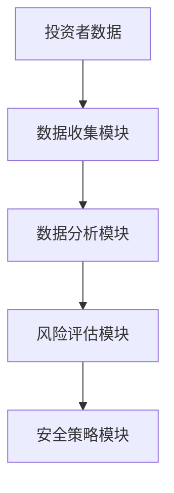

                 


# 特价股票投资中的数据隐私与网络安全风险评估方法

## 关键词

- 特价股票投资
- 数据隐私
- 网络安全
- 风险评估
- 数据安全
- 网络威胁

## 摘要

在当前数字化投资时代，特价股票投资因其高收益潜力吸引了大量投资者，但也带来了显著的数据隐私与网络安全风险。本文系统性地分析了特价股票投资中的数据隐私与网络安全风险，提出了基于数据隐私保护与网络安全防御的双重维度的风险评估方法。文章首先阐述了数据隐私与网络安全的基本概念，随后分析了特价股票投资中的数据隐私风险和网络安全威胁，接着提出了基于数学模型的双维度风险评估方法，并通过实际案例分析验证了方法的有效性。最后，本文总结了数据隐私与网络安全在特价股票投资中的重要性，并提出了相应的安全防护建议。

---

## 第1章: 特价股票投资与数据隐私概述

### 1.1 特价股票投资的定义与特点

#### 1.1.1 特价股票的定义

特价股票是指价格相对较低、市场流动性较低的股票，通常具有较高的成长潜力。这类股票适合长期投资者，尤其是那些能够承受较高风险的投资者。

#### 1.1.2 特价股票投资的核心特点

- **低估值**：价格低于其实际价值。
- **高波动性**：价格波动较大，风险较高。
- **高潜力**：潜在回报较高。

#### 1.1.3 特价股票投资的市场定位与目标群体

- 市场定位：中长期投资，寻找被市场低估的股票。
- 目标群体：机构投资者、高净值个人投资者。

---

### 1.2 数据隐私与网络安全的基本概念

#### 1.2.1 数据隐私的定义与范围

数据隐私是指个人或组织对其数据的控制权和使用权。在投资领域，数据隐私涉及投资者的交易记录、身份信息、财务数据等。

#### 1.2.2 网络安全的核心要素

- **身份验证**：确保用户身份的真实性。
- **数据加密**：保护数据在传输和存储过程中的安全性。
- **访问控制**：限制未经授权的访问。

#### 1.2.3 特价股票投资中数据隐私与网络安全的特殊性

- **高敏感性**：涉及投资者的财务信息和交易策略。
- **高风险性**：黑客可能通过攻击获取敏感数据。

---

## 第2章: 特价股票投资中的数据隐私风险分析

### 2.1 数据隐私风险的来源

#### 2.1.1 内部数据泄露风险

- **员工疏忽**：员工泄露敏感数据。
- **内部人员作案**：员工故意泄露数据。

#### 2.1.2 外部攻击与数据窃取风险

- **网络攻击**：黑客通过技术手段入侵系统。
- **钓鱼攻击**：通过钓鱼邮件获取投资者信息。

#### 2.1.3 数据处理过程中的隐私泄露风险

- **数据存储**：数据存储不合规导致泄露。
- **数据传输**：数据传输过程中被截获。

---

### 2.2 数据隐私风险的分类与评估

#### 2.2.1 数据隐私风险的分类

- **物理风险**：设备丢失或被盗。
- **技术风险**：数据被窃取或篡改。
- **管理风险**：内部管理不善导致的风险。

#### 2.2.2 数据隐私风险的评估指标

- **风险概率**：事件发生的可能性。
- **风险影响**：事件对投资决策的影响程度。

#### 2.2.3 数据隐私风险的量化方法

使用概率加权法：
$$ R_p = \sum (P_i \times I_i) $$

其中：
- \( P_i \) 是第 \( i \) 个风险的发生的概率。
- \( I_i \) 是第 \( i \) 个风险的影响程度。

---

## 第3章: 特价股票投资中的网络安全风险分析

### 3.1 网络安全风险的定义与分类

#### 3.1.1 网络安全风险的定义

网络安全风险是指在网络安全领域内可能发生的威胁或漏洞，可能导致数据泄露、系统瘫痪等问题。

#### 3.1.2 网络安全风险的分类

- **网络攻击风险**：包括病毒、木马、DDoS攻击等。
- **数据泄露风险**：数据被未经授权的第三方获取。
- **系统漏洞风险**：由于系统漏洞被攻击者利用。

---

### 3.2 网络安全威胁的来源与表现形式

#### 3.2.1 黑客攻击

- **目标**：窃取数据或破坏系统。
- **手段**：利用系统漏洞进行攻击。

#### 3.2.2 病毒与恶意软件

- **目标**：破坏系统或窃取数据。
- **手段**：通过恶意软件感染目标系统。

#### 3.2.3 内部员工的不当行为

- **目标**：可能故意或无意中泄露数据。
- **手段**：员工访问敏感数据后进行不当操作。

#### 3.2.4 第三方服务的安全风险

- **目标**：通过第三方服务漏洞进行攻击。
- **手段**：利用第三方服务的弱点进行攻击。

---

### 3.3 网络安全风险的评估方法

#### 3.3.1 风险评估的流程与步骤

1. 确定目标：明确需要评估的系统或数据。
2. 识别威胁：列出可能的网络安全威胁。
3. 评估漏洞：分析系统的漏洞。
4. 计算风险：评估每个威胁的发生概率和影响。
5. 制定策略：根据评估结果制定安全策略。

#### 3.3.2 风险评估的工具与技术

- **漏洞扫描工具**：如Nmap、OpenVAS。
- **渗透测试工具**：如Metasploit。
- **加密工具**：如SSL/TLS加密。

---

## 第4章: 特价股票投资中的数据隐私与网络安全风险评估方法

### 4.1 风险评估的核心概念与原理

#### 4.1.1 风险评估的基本原理

- **数据隐私保护**：确保投资者数据不被泄露。
- **网络安全防御**：防止网络攻击。

#### 4.1.2 数据隐私与网络安全的评估框架

- **数据分类**：根据数据敏感性进行分类。
- **风险矩阵**：结合风险概率和影响程度进行评估。

---

### 4.2 数据隐私与网络安全风险评估的算法原理

#### 4.2.1 数据隐私风险评估的算法流程

1. 数据收集：收集投资者数据。
2. 数据分析：分析数据的敏感性。
3. 风险评估：评估数据泄露的可能性。
4. 保护措施：制定保护措施。

#### 4.2.2 网络安全风险评估的算法流程

1. 网络拓扑分析：分析网络结构。
2. 漏洞扫描：扫描网络漏洞。
3. �威肋评估：评估每个漏洞被攻击的可能性。
4. 安全策略制定：根据评估结果制定安全策略。

---

## 第5章: 系统架构与项目实战

### 5.1 系统架构设计

#### 5.1.1 系统功能设计

- **数据收集模块**：收集投资者数据。
- **数据分析模块**：分析数据的敏感性。
- **风险评估模块**：评估数据泄露风险。
- **安全策略模块**：制定保护措施。

#### 5.1.2 系统架构图



---

### 5.2 项目实战

#### 5.2.1 环境配置

- 操作系统：Linux
- 开发工具：Python、Django
- 数据库：MySQL

#### 5.2.2 核心代码实现

```python
def assess_risk(data):
    # 数据分类
    classified_data = classify(data)
    # 风险评估
    risk_score = calculate_risk(classified_data)
    return risk_score

def calculate_risk(classified_data):
    # 风险计算公式
    risk = sum(p * i for p, i in zip(probabilities, impacts))
    return risk
```

---

## 第6章: 总结与展望

### 6.1 总结

本文系统性地分析了特价股票投资中的数据隐私与网络安全风险，提出了基于数据隐私保护与网络安全防御的双重维度的风险评估方法。通过数学模型和实际案例分析，验证了方法的有效性。

### 6.2 展望

未来，随着人工智能和大数据技术的发展，数据隐私与网络安全的保护将更加重要。建议进一步研究如何利用新技术提升数据隐私保护和网络安全防御能力。

---

## 作者

作者：AI天才研究院/AI Genius Institute & 禅与计算机程序设计艺术 /Zen And The Art of Computer Programming

