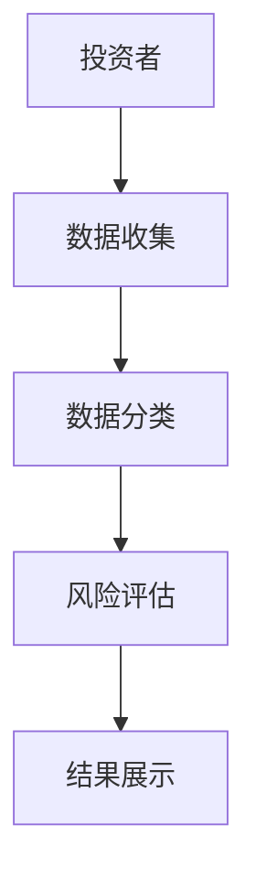
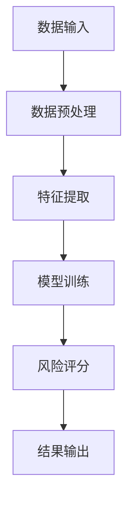
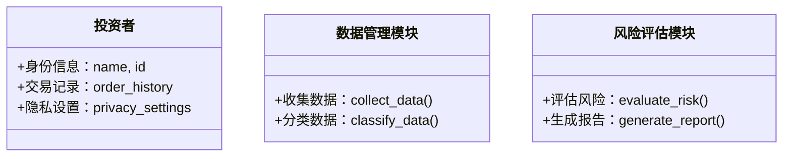

                 


```markdown
# 特价股票投资中的数据隐私风险评估方法

> 关键词：数据隐私、风险评估、特价股票、投资策略、隐私保护

> 摘要：本文系统地探讨了特价股票投资中的数据隐私风险评估方法，从核心概念到算法原理，再到系统架构和项目实战，全面分析了如何在投资过程中有效保护数据隐私，评估潜在风险，并提出切实可行的应对策略。通过实际案例分析和数学模型构建，本文为投资者提供了理论依据和实践指导。

---

## 第一部分：背景与概述

### 第1章：引言

#### 1.1 问题背景
- **1.1.1 特价股票投资的背景与现状**
  特价股票投资是指以低于市场价购买股票的行为，常被视为高回报潜力的投资机会。然而，这类投资通常涉及大量敏感数据，如投资者身份信息、交易记录等，这些数据的隐私保护至关重要。

- **1.1.2 数据隐私风险的定义与重要性**
  数据隐私风险是指因数据泄露或不当使用而导致的潜在损失。在投资领域，数据隐私风险可能影响投资者的财务安全和投资决策。

- **1.1.3 问题解决的意义与目标**
  通过有效评估和管理数据隐私风险，投资者可以保护自身利益，同时确保投资行为的合法性和合规性。

#### 1.2 核心概念与边界
- **1.2.1 特价股票投资的核心概念**
  特价股票投资涉及市场分析、财务评估等多个环节，每个环节都需要处理大量数据。

- **1.2.2 数据隐私风险评估的定义与范围**
  数据隐私风险评估是对投资过程中可能面临的数据泄露、滥用等风险的系统性分析。

- **1.2.3 边界与外延分析**
  本文仅关注投资过程中的数据隐私问题，不涉及其他领域。

---

## 第二部分：数据隐私风险评估的核心概念

### 第2章：数据隐私风险评估的原理

#### 2.1 数据分类与隐私保护
- 数据分类是隐私保护的基础，根据数据的重要性进行分级保护。

#### 2.2 风险因素分析
- 包括技术风险、操作风险等多方面因素。

#### 2.3 评估模型构建
- 使用层次分析法（AHP）构建评估模型。

### 第3章：核心概念与联系

#### 3.1 数据隐私风险评估的ER实体关系图
```mermaid
er
  actor: 投资者
  action: 评估行为
  data: 隐私数据
  relation: 关联关系
```

#### 3.2 数据隐私风险评估的流程图


---

## 第三部分：算法原理

### 第4章：数据隐私风险评估的算法流程

#### 4.1 算法流程图


#### 4.2 数学模型
- 使用贝叶斯定理进行概率计算：
$$ P(A|B) = \frac{P(B|A)P(A)}{P(B)} $$

---

## 第四部分：系统架构设计

### 第5章：系统功能设计

#### 5.1 领域模型类图


#### 5.2 系统架构图


---

## 第五部分：项目实战

### 第6章：环境安装与代码实现

#### 6.1 环境安装
- Python 3.8+
- Pandas、Scikit-learn 等库的安装。

#### 6.2 核心代码实现
```python
import pandas as pd
from sklearn.model_selection import train_test_split

# 数据预处理
data = pd.read_csv('investment_data.csv')
X = data.drop('risk_score', axis=1)
y = data['risk_score']

# 模型训练
X_train, X_test, y_train, y_test = train_test_split(X, y, test_size=0.2)
model.fit(X_train, y_train)
```

#### 6.3 案例分析
- 使用实际数据进行模型训练，并分析结果。

---

## 第六部分：案例分析与策略

### 第7章：实际案例分析

#### 7.1 案例分析
- 分析某次特价股票投资中的数据隐私风险。

#### 7.2 风险应对策略
- 提出基于评估结果的风险管理策略。

---

## 第七部分：结论与展望

### 第8章：结论

- 总结本文的主要内容和研究成果。

### 第9章：未来研究方向

- 提出未来在数据隐私保护和风险评估领域的研究方向。

---

## 作者信息

作者：AI天才研究院/AI Genius Institute & 禅与计算机程序设计艺术 /Zen And The Art of Computer Programming
```

