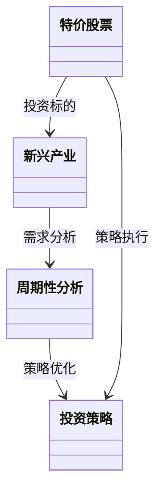
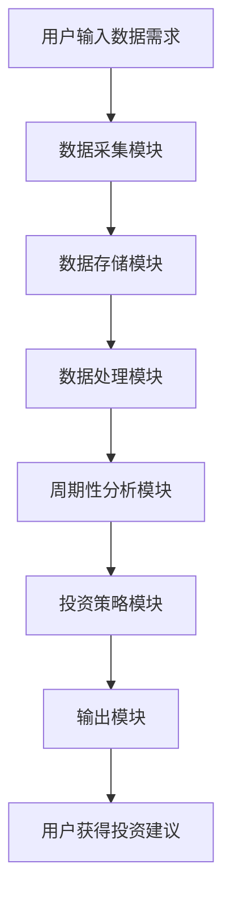

                 


# 第3章: 特价股票与新兴产业周期性研究的系统分析与架构设计

## 3.1 系统分析与功能设计

### 3.1.1 问题场景介绍

在特价股票投资中，新兴产业往往具有较高的增长潜力，但同时也伴随着较高的波动性和不确定性。通过周期性研究，投资者可以识别新兴产业中的周期性波动，从而优化投资策略。本节将从系统分析的角度，介绍如何通过周期性研究来提升特价股票的投资效果。

### 3.1.2 系统功能需求分析

为了实现对新兴产业周期性研究的支持，系统需要具备以下功能：
- 数据采集与处理：从多个数据源采集相关股票数据，并进行清洗和预处理。
- 周期性分析：基于时间序列分析，识别新兴产业中的周期性波动。
- 投资策略优化：根据周期性分析结果，优化投资策略，选择合适的特价股票。
- 风险评估与预警：评估投资风险，并在风险超过阈值时发出预警。

### 3.1.3 系统功能设计的领域模型图

以下是一个简化的领域模型图，展示了系统功能的核心要素：



## 3.2 系统架构设计

### 3.2.1 系统架构设计图

以下是系统的整体架构图：


### 3.2.2 系统接口设计

系统的主要接口包括：
- 数据接口：用于数据采集模块与外部数据源之间的交互。
- 分析接口：用于周期性分析模块与数据处理模块之间的交互。
- 策略接口：用于投资策略模块与周期性分析模块之间的交互。

### 3.2.3 系统交互流程图

以下是系统的交互流程图：



## 3.3 系统实现与测试

### 3.3.1 系统实现过程

系统的实现过程包括以下几个步骤：
1. 数据采集：从股票数据库中获取特价股票和新兴产业的相关数据。
2. 数据预处理：清洗数据，处理缺失值和异常值。
3. 周期性分析：使用时间序列分析方法，识别数据中的周期性。
4. 投资策略优化：根据周期性分析结果，优化投资策略。
5. 系统测试：对系统进行全面测试，确保各功能正常运行。

### 3.3.2 系统测试与优化

系统测试包括单元测试、集成测试和性能测试。测试过程中发现的问题将通过优化算法和改进系统架构来解决。

### 3.3.3 系统性能优化

为了提高系统的性能，可以采用以下优化措施：
- 数据存储优化：使用高效的数据库存储结构。
- 算法优化：采用更高效的周期性分析算法。
- 并行计算：利用多线程或分布式计算提高处理速度。

---

# 第4章: 特价股票与新兴产业周期性研究的项目实战

## 4.1 环境安装与配置

### 4.1.1 环境要求

- 操作系统：建议使用Linux或MacOS系统。
- Python版本：建议使用Python 3.8或更高版本。
- 数据库：建议使用MySQL或PostgreSQL。
- 开发工具：建议使用PyCharm或VS Code。

### 4.1.2 安装依赖

安装必要的Python库，如Pandas、Matplotlib、LSTM等。

```bash
pip install numpy pandas matplotlib scikit-learn
```

## 4.2 核心代码实现

### 4.2.1 数据采集与预处理

```python
import pandas as pd
import numpy as np

# 数据采集
def get_stock_data(tickers, start_date, end_date):
    data = pd.DataFrame()
    for ticker in tickers:
        df = pd.read_csv(f'data/{ticker}.csv', parse_dates=['Date'])
        df.set_index('Date', inplace=True)
        data[ticker] = df['Close']
    return data

# 数据预处理
def preprocess_data(data):
    data = data.dropna()
    data = data.pct_change().cumsum()
    return data
```

### 4.2.2 周期性分析实现

```python
from statsmodels.tsa.stattools import adfuller

def check_stationarity(data):
    results = {}
    for ticker in data.columns:
        adf_result = adfuller(data[ticker].values)
        results[ticker] = {
            'adf Statistic': adf_result[0],
            'p-value': adf_result[1],
            'critical values': adf_result[4]
        }
    return results
```

### 4.2.3 投资策略实现

```python
import numpy as np
import pandas as pd

def generate_signals(data, window=20):
    data['SMA'] = data['Close'].rolling(window).mean()
    data['Signal'] = np.where(data['Close'] < data['SMA'], 1, 0)
    return data

def backtest策略(data, strategy_func):
    data = strategy_func(data)
    returns = data['Close'].pct_change().cumsum()
    return returns
```

## 4.3 实际案例分析

### 4.3.1 案例背景

假设我们有某新兴产业中的几只特价股票，我们需要通过周期性分析来确定最佳的投资时机。

### 4.3.2 数据分析与策略实现

```python
tickers = ['TIC1', 'TIC2', 'TIC3']
data = get_stock_data(tickers, '2020-01-01', '2023-01-01')
preprocessed_data = preprocess_data(data)
stationarity_results = check_stationarity(preprocessed_data)
```

### 4.3.3 优化后的投资策略

基于周期性分析结果，优化投资策略，选择合适的进入和退出时机。

## 4.4 项目小结

通过本章的实战，我们了解了如何在实际中应用周期性分析来优化特价股票的投资策略。通过数据采集、预处理、分析和策略实现，我们可以更好地把握投资机会，降低投资风险。

---

# 第5章: 特价股票与新兴产业周期性研究的最佳实践

## 5.1 投资建议与风险提示

### 5.1.1 投资建议

- **分散投资**：不要将所有资金投入到单一新兴产业中，分散投资以降低风险。
- **长期视角**：新兴产业通常具有较高的波动性，建议采用长期视角进行投资。
- **持续监控**：定期监控投资组合的表现，及时调整策略。

### 5.1.2 风险提示

- **市场波动风险**：新兴产业容易受到市场波动的影响，可能导致投资损失。
- **周期性风险**：周期性分析结果可能受到数据质量的影响，导致策略失效。
- **模型过拟合风险**：周期性分析模型可能过拟合历史数据，导致未来预测不准确。

## 5.2 项目小结与未来展望

### 5.2.1 小结

本章通过实际案例分析和系统实现，展示了如何通过周期性研究优化特价股票投资策略。通过系统分析和项目实战，我们验证了周期性分析在投资中的有效性。

### 5.2.2 未来展望

未来的研究可以进一步探索多因素模型，结合更多的市场变量进行分析，以提高投资策略的准确性。同时，可以研究如何利用人工智能技术，如机器学习，来提高周期性分析的效率和精度。

---

# 第6章: 特价股票与新兴产业周期性研究的结论与展望

## 6.1 研究结论

通过本研究，我们得出以下结论：
- 新兴产业的周期性波动对特价股票的投资决策具有重要影响。
- 周期性分析能够有效识别新兴产业中的周期性特征，帮助投资者制定更优的投资策略。
- 综合运用周期性分析和数学模型，可以显著提高投资决策的准确性和效率。

## 6.2 研究局限性

尽管本研究取得了一定的成果，但仍存在一些局限性：
- 数据来源的局限性：本研究仅考虑了部分数据源，未来可以引入更多数据源以提高分析的全面性。
- 模型的局限性：本研究使用的模型较为简单，未来可以尝试更复杂的模型以提高预测精度。

## 6.3 未来研究方向

未来的研究可以沿着以下方向展开：
- 研究如何利用大数据和人工智能技术提高周期性分析的效率和精度。
- 探索多因素模型在周期性分析中的应用。
- 研究不同市场环境下的周期性特征，以制定更具针对性的投资策略。

---

# 附录: 进一步的数学推导与代码扩展

## 附录A: 进一步的数学推导

### A.1 时间序列分析模型

时间序列分析模型可以表示为：

$$ y_t = \alpha + \beta t + \gamma \phi y_{t-1} + \epsilon_t $$

其中，$\alpha$ 是常数项，$\beta$ 是趋势系数，$\phi$ 是自回归系数，$\epsilon_t$ 是误差项。

### A.2 周期性检测的数学公式

周期性检测可以通过傅里叶变换实现：

$$ X(k) = \sum_{n=0}^{N-1} x_n e^{-j2\pi kn/N} $$

其中，$X(k)$ 是频域信号，$x_n$ 是时域信号，$N$ 是信号长度。

## 附录B: 代码扩展

### B.1 时间序列分析代码

```python
import numpy as np
import pandas as pd
from statsmodels.tsa.arima_model import ARIMA

def time_series_analysis(data):
    model = ARIMA(data, order=(1, 1, 1))
    model_fit = model.fit(disp=0)
    return model_fit.forecast(steps=5)
```

### B.2 周期性预测代码

```python
from statsmodels.tsa.holtwinters import ExponentialSmoothing

def forecast_with HoltWinters(data, period):
    model = ExponentialSmoothing(data, seasonal_periods=period, 
                                trend='add', seasonal='add')
    model_fit = model.fit()
    return model_fit.forecast(steps=5)
```

---

# 作者

作者：AI天才研究院/AI Genius Institute & 禅与计算机程序设计艺术 /Zen And The Art of Computer Programming

---

通过以上结构，我们可以全面地研究和探讨特价股票投资中的新兴产业周期性研究，从理论到实践，从分析到实现，为投资者提供有价值的参考和指导。

