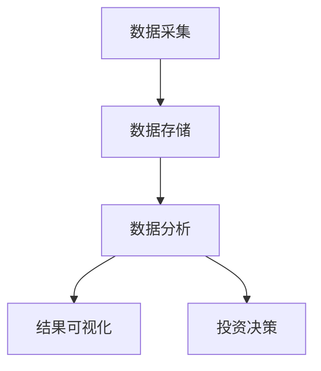

                 


# 特价股票投资中的新兴技术周期性研究

## 关键词：技术分析、周期性、大数据、人工智能、股票投资

## 摘要：  
本文探讨了特价股票投资中的周期性研究，结合技术分析和新兴技术，如大数据、人工智能等，分析股票市场的周期性特征，并提出基于这些技术的投资策略。通过系统设计和实战案例，展示了如何利用新兴技术提升股票投资的周期性分析能力，帮助投资者做出更明智的决策。

---

## 目录

1. [引言](#引言)
2. [技术分析基础](#技术分析基础)
3. [新兴技术在股票分析中的应用](#新兴技术在股票分析中的应用)
4. [周期性分析方法](#周期性分析方法)
5. [综合投资策略](#综合投资策略)
6. [系统架构设计](#系统架构设计)
7. [项目实战](#项目实战)
8. [总结与展望](#总结与展望)
9. [参考文献](#参考文献)
10. [作者信息](#作者信息)

---

## 第1章：引言

### 1.1 背景介绍
- **特价股票投资**：指在特定市场环境下，利用技术分析寻找低价股票的投资策略。  
- **技术分析**：通过价格、成交量等数据预测市场趋势。  
- **新兴技术**：如大数据、人工智能等，为股票分析提供新的工具和方法。

### 1.2 核心概念与问题描述
- **技术分析**：依赖价格和成交量数据，预测股票价格走势。  
- **周期性研究**：分析股票市场的周期性波动，寻找规律。  
- **新兴技术**：利用大数据、AI等技术提升周期性分析的精度和效率。

### 1.3 研究意义与目标
- **意义**：通过技术分析和新兴技术的结合，提高股票投资的科学性和收益性。  
- **目标**：研究周期性特征，设计基于新兴技术的投资策略，实现高效投资。

---

## 第2章：技术分析基础

### 2.1 技术分析的基本原理
- **价格与成交量**：价格走势和成交量变化是技术分析的核心。  
- **趋势与支撑位**：趋势线和支撑位是判断价格波动的重要依据。  

### 2.2 技术指标体系
- **移动平均线（MA）**：用于平滑价格波动，识别趋势。  
- **相对强弱指数（RSI）**：衡量价格超买或超卖状态。  
- **MACD**：通过指数平滑移动平均线分析价格动能。

### 2.3 周期性特征
- **周期性波动**：股票价格受市场情绪和经济周期影响，呈现周期性波动。  
- **周期性分析**：识别周期性特征，预测价格走势。

---

## 第3章：新兴技术在股票分析中的应用

### 3.1 大数据技术
- **数据采集**：利用大数据技术获取多源数据，如社交媒体、新闻等。  
- **数据挖掘**：通过机器学习算法挖掘数据中的潜在规律。

### 3.2 人工智能技术
- **预测模型**：利用神经网络、随机森林等模型预测股票价格。  
- **情感分析**：分析市场情绪，辅助投资决策。

### 3.3 机器学习算法
- **监督学习**：利用历史数据训练预测模型。  
- **无监督学习**：发现数据中的隐藏模式。

---

## 第4章：周期性分析方法

### 4.1 周期性理论
- **周期性波动**：股票价格受经济周期和市场情绪影响，呈现周期性波动。  
- **周期性分析**：识别周期性特征，预测未来价格走势。

### 4.2 技术指标与周期性
- **移动平均线（MA）**：识别趋势周期。  
- **RSI**：判断超买超卖周期。

### 4.3 周期性预测算法
- **动态时间规整（DTW）**：用于时间序列的相似性匹配。  
- **ARIMA模型**：用于时间序列预测。

---

## 第5章：综合投资策略

### 5.1 综合策略设计
- **技术分析+周期性分析**：结合技术指标和周期性特征，制定投资策略。  
- **多因子模型**：考虑多种因素，如估值、成长性等。

### 5.2 投资组合优化
- **风险控制**：通过分散投资降低风险。  
- **动态调整**：根据周期性分析结果动态调整投资组合。

---

## 第6章：系统架构设计

### 6.1 系统功能设计
- **数据采集模块**：采集股票数据、市场新闻等。  
- **分析模块**：利用技术指标和周期性分析算法进行预测。  
- **可视化模块**：展示分析结果，辅助决策。

### 6.2 系统架构图



---

## 第7章：项目实战

### 7.1 环境配置
- **Python**：安装必要的库，如Pandas、Matplotlib、Scikit-learn。

### 7.2 核心实现代码
```python
import pandas as pd
import numpy as np
from sklearn.linear_model import LinearRegression

# 示例数据加载
data = pd.read_csv('stock_data.csv')

# 移动平均线计算
data['MA_5'] = data['收盘价'].rolling(5).mean()

# 模型训练
model = LinearRegression()
model.fit(data[['MA_5']], data['收盘价'])

# 预测
predicted_price = model.predict(data[['MA_5']])
```

### 7.3 实战案例分析
- **案例选择**：选择某只股票，分析其价格走势。  
- **结果解读**：根据模型预测结果，制定投资策略。

---

## 第8章：总结与展望

### 8.1 研究总结
- **技术分析**：提供科学的投资依据。  
- **新兴技术**：提升周期性分析的精度和效率。

### 8.2 注意事项
- **风险提示**：周期性分析存在不确定性，需谨慎操作。  
- **持续学习**：关注市场变化，不断优化分析模型。

### 8.3 未来展望
- **技术进步**：新兴技术将进一步提升股票分析的精度。  
- **市场变化**：需关注全球经济形势和政策变化。

---

## 参考文献
1. 《技术分析实战指南》  
2. 《机器学习在金融中的应用》  
3. 《股票投资周期性研究》  

---

## 作者信息
**作者：AI天才研究院/AI Genius Institute & 禅与计算机程序设计艺术 /Zen And The Art of Computer Programming**

---

通过以上结构和内容，文章系统地介绍了特价股票投资中的技术分析和周期性研究，并结合新兴技术提供了具体的解决方案和实战案例，为投资者提供了科学的投资决策依据。

