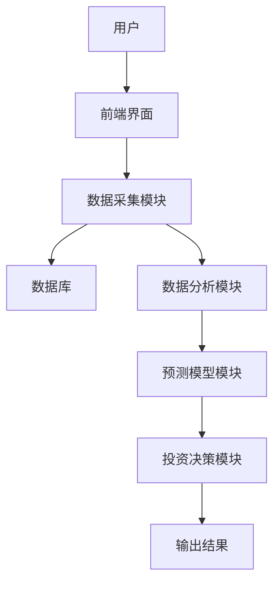

                 


# 特价股票投资中的新兴科技融合周期性研究

## 关键词：特价股票、周期性分析、新兴科技、人工智能、大数据分析、区块链技术

## 摘要：本文探讨了如何将新兴科技与周期性分析相结合，优化特价股票投资策略。通过分析经济周期对股票市场的影响，结合大数据、人工智能等技术，提出了一种创新的投资方法，帮助投资者在特价股票市场中获取超额收益。

---

## 第1章: 特价股票投资的背景与概念

### 1.1 特价股票投资的背景

#### 1.1.1 什么是特价股票
特价股票是指价格低于行业平均水平，具有较高投资潜力的股票。这些股票通常属于被市场低估的公司，具有较大的增值空间。

#### 1.1.2 特价股票投资的历史发展
特价股票投资起源于价值投资理论，早期投资者通过基本面分析寻找低估股票。随着科技的进步，投资者开始利用大数据和人工智能技术进行更精准的选股。

#### 1.1.3 特价股票投资的现状与趋势
当前，特价股票投资逐渐从传统的人工分析转向自动化、智能化的科技驱动模式。新兴科技的应用使得投资者能够更高效地发现潜在投资机会。

### 1.2 周期性研究的基本概念

#### 1.2.1 经济周期的基本理论
经济周期分为衰退、复苏、繁荣和萧条四个阶段。不同阶段对股票市场的影响不同，周期性研究帮助投资者识别市场趋势。

#### 1.2.2 周期性研究在股票投资中的应用
周期性研究通过分析经济指标预测市场走势，帮助投资者在不同经济周期中选择合适的股票投资策略。

#### 1.2.3 特价股票与周期性研究的关系
特价股票在经济衰退期通常表现不佳，但在复苏期可能迎来反弹。周期性研究帮助投资者在合适的时间点选择特价股票。

### 1.3 新兴科技对股票投资的影响

#### 1.3.1 新兴科技的定义与分类
新兴科技包括人工智能、大数据分析、区块链等技术，这些技术为股票投资提供了新的工具和方法。

#### 1.3.2 新兴科技如何影响股票市场
新兴科技改变了股票交易的方式，提高了交易效率和准确性。同时，科技公司本身也成为重要的投资标的。

#### 1.3.3 新兴科技与周期性研究的结合
通过新兴科技，投资者可以更准确地预测经济周期，优化投资策略。例如，利用人工智能分析市场情绪，预测周期性变化。

### 1.4 本章小结
本章介绍了特价股票和周期性研究的基本概念，以及新兴科技对股票投资的影响。新兴科技的应用使得特价股票投资更加精准和高效。

---

## 第2章: 经济周期与股票市场的关系

### 2.1 经济周期的基本特征

#### 2.1.1 经济周期的四个阶段
经济周期分为衰退、复苏、繁荣和萧条四个阶段。每个阶段的特点不同，对股票市场的影响也不同。

#### 2.1.2 每个阶段对股票市场的影响
- **衰退期**：股票市场下跌，投资者信心不足。
- **复苏期**：市场逐步恢复，股票价格开始回升。
- **繁荣期**：市场活跃，股票价格达到高点。
- **萧条期**：市场低迷，股票价格大幅下跌。

#### 2.1.3 经济周期对特价股票的特殊影响
特价股票在衰退期可能表现不佳，但在复苏期可能迎来反弹。周期性研究帮助投资者在合适的时间点选择特价股票。

### 2.2 特价股票在经济周期中的表现

#### 2.2.1 经济衰退期的特价股票表现
衰退期市场整体低迷，特价股票可能继续下跌，但具有较高安全边际的股票可能成为抄底机会。

#### 2.2.2 经济复苏期的特价股票表现
复苏期市场逐渐恢复，特价股票可能开始反弹，投资者可以逐步建仓。

#### 2.2.3 经济繁荣期的特价股票表现
繁荣期市场活跃，特价股票可能被市场重新评估，价格逐步回升。

### 2.3 周期性分析方法在特价股票投资中的应用

#### 2.3.1 周期性分析的基本方法
- **移动平均线法**：通过计算股票价格的移动平均线，判断市场趋势。
- **趋势分析法**：通过分析股票价格的趋势，预测未来走势。

#### 2.3.2 特价股票周期性分析的特殊性
特价股票的价格波动较大，周期性分析需要结合公司基本面和市场情绪。

#### 2.3.3 如何利用周期性分析优化投资策略
- 在衰退期选择具有防御性的特价股票。
- 在复苏期选择具有成长性的特价股票。

### 2.4 本章小结
本章分析了经济周期对股票市场的影响，特别是特价股票在不同周期中的表现。周期性分析是优化投资策略的重要工具。

---

## 第3章: 新兴科技在周期性研究中的应用

### 3.1 大数据分析在周期性研究中的应用

#### 3.1.1 大数据的基本概念
大数据是指数据量大、类型多样、处理速度快的数据集合。大数据分析通过处理这些数据，发现潜在规律。

#### 3.1.2 大数据分析在周期性研究中的具体应用
- **市场趋势预测**：通过分析历史数据，预测未来市场走势。
- **风险评估**：通过分析市场波动，评估投资风险。

#### 3.1.3 大数据分析对特价股票投资的启示
大数据分析可以帮助投资者发现市场中的潜在机会，优化投资组合。

### 3.2 人工智能在周期性研究中的应用

#### 3.2.1 人工智能的基本概念
人工智能是模拟人类智能的技术，包括机器学习、自然语言处理等。

#### 3.2.2 人工智能在周期性研究中的具体应用
- **市场情绪分析**：通过自然语言处理技术，分析社交媒体上的市场情绪。
- **预测模型构建**：通过机器学习算法，预测股票价格走势。

#### 3.2.3 人工智能对特价股票投资的影响
人工智能可以帮助投资者更准确地预测市场趋势，优化投资策略。

### 3.3 区块链技术在周期性研究中的应用

#### 3.3.1 区块链的基本概念
区块链是一种分布式账本技术，具有去中心化、不可篡改等特点。

#### 3.3.2 区块链技术在周期性研究中的具体应用
- **数据记录**：通过区块链技术，记录股票交易数据，确保数据的真实性和不可篡改性。
- **智能合约**：通过智能合约，自动执行投资协议，提高交易效率。

#### 3.3.3 区块链技术对特价股票投资的影响
区块链技术可以提高市场透明度，降低交易成本，为投资者提供更安全的交易环境。

### 3.4 本章小结
本章探讨了新兴科技在周期性研究中的应用，特别是大数据分析、人工智能和区块链技术。这些技术的应用使得周期性研究更加精准和高效。

---

## 第4章: 特价股票投资中的新兴科技融合

### 4.1 特价股票投资中的大数据分析

#### 4.1.1 大数据分析在特价股票筛选中的应用
通过大数据分析，筛选出具有投资价值的特价股票。

#### 4.1.2 数据来源与处理
- **数据来源**：包括历史股价、财务数据、市场新闻等。
- **数据处理**：通过清洗、转换和分析，提取有用的信息。

#### 4.1.3 大数据分析对投资决策的影响
大数据分析可以帮助投资者发现市场中的潜在机会，优化投资组合。

### 4.2 特价股票投资中的人工智能应用

#### 4.2.1 机器学习在特价股票预测中的应用
通过机器学习算法，预测股票价格走势，帮助投资者做出决策。

#### 4.2.2 神经网络在市场情绪分析中的应用
通过深度学习模型，分析市场情绪，预测股票价格走势。

#### 4.2.3 人工智能对投资策略的影响
人工智能可以帮助投资者更准确地预测市场趋势，优化投资策略。

### 4.3 特价股票投资中的区块链技术应用

#### 4.3.1 区块链在股票交易中的应用
通过区块链技术，确保股票交易的安全性和透明性。

#### 4.3.2 区块链在投资协议中的应用
通过智能合约，自动执行投资协议，提高交易效率。

#### 4.3.3 区块链技术对投资环境的影响
区块链技术可以提高市场透明度，降低交易成本，为投资者提供更安全的交易环境。

### 4.4 本章小结
本章探讨了新兴科技在特价股票投资中的融合应用，特别是大数据分析、人工智能和区块链技术。这些技术的应用使得特价股票投资更加精准和高效。

---

## 第5章: 系统架构与实现

### 5.1 投资分析系统的功能设计

#### 5.1.1 系统功能模块
- **数据采集模块**：采集股票数据、市场新闻等。
- **数据分析模块**：对数据进行清洗、转换和分析。
- **预测模型模块**：利用机器学习算法，预测股票价格走势。
- **投资决策模块**：根据预测结果，制定投资策略。

#### 5.1.2 系统功能流程
1. 数据采集：获取股票数据和市场新闻。
2. 数据分析：清洗、转换和分析数据。
3. 预测模型：利用机器学习算法，预测股票价格走势。
4. 投资决策：根据预测结果，制定投资策略。

### 5.2 系统架构设计

#### 5.2.1 系统架构图


#### 5.2.2 数据库设计
- **表结构**：包括股票信息表、交易记录表、预测结果表等。
- **数据关系**：通过外键关联，实现数据的关联存储。

### 5.3 系统接口设计

#### 5.3.1 API接口
- **数据接口**：提供数据采集模块的API，供其他系统调用。
- **预测接口**：提供预测模型的API，供其他系统调用。

#### 5.3.2 接口交互流程
1. 用户通过前端界面提交请求。
2. 前端界面调用数据接口，获取数据。
3. 数据接口调用数据分析模块，进行数据处理。
4. 数据分析模块调用预测模型模块，进行预测。
5. 预测模型模块返回预测结果。
6. 投资决策模块根据预测结果，制定投资策略。
7. 输出结果返回给用户。

### 5.4 本章小结
本章探讨了投资分析系统的功能设计和架构设计，特别是数据分析模块和预测模型模块的设计。系统架构的设计使得特价股票投资更加高效和精准。

---

## 第6章: 项目实战与案例分析

### 6.1 项目实战环境安装

#### 6.1.1 系统环境要求
- **操作系统**：Windows 10或更高版本。
- **编程语言**：Python 3.8或更高版本。
- **工具安装**：安装Jupyter Notebook、Pandas、NumPy、Scikit-learn等库。

#### 6.1.2 数据来源
- **股票数据**：从Yahoo Finance获取历史股价数据。
- **市场新闻**：从新闻网站获取市场新闻。

### 6.2 系统核心实现源代码

#### 6.2.1 数据采集模块
```python
import pandas as pd
import requests

def get_stock_data(symbol):
    url = f"https://query1.finance.yahoo.com/v7/finance/quote/{symbol}"
    response = requests.get(url)
    data = response.json()
    return data
```

#### 6.2.2 数据分析模块
```python
from sklearn.preprocessing import StandardScaler

def preprocess_data(data):
    # 数据清洗
    data.dropna(inplace=True)
    # 数据标准化
    scaler = StandardScaler()
    scaled_data = scaler.fit_transform(data)
    return scaled_data
```

#### 6.2.3 预测模型模块
```python
from sklearn.linear_model import LinearRegression

def build_model(X, y):
    model = LinearRegression()
    model.fit(X, y)
    return model
```

#### 6.2.4 投资决策模块
```python
def make_decision(model, new_data):
    prediction = model.predict(new_data)
    if prediction > 0.5:
        return "买入"
    else:
        return "卖出"
```

### 6.3 项目实战案例分析

#### 6.3.1 案例背景
假设我们选择了一家科技公司，股票代码为AAPL。

#### 6.3.2 数据分析
```python
import pandas as pd
import matplotlib.pyplot as plt

data = pd.read_csv("AAPL.csv")
data.plot(kind="line", y="Adj Close")
plt.show()
```

#### 6.3.3 模型预测
```python
from sklearn.metrics import accuracy_score

X = data.drop(columns=["Adj Close"])
y = data["Adj Close"]

X_train, X_test, y_train, y_test = train_test_split(X, y, test_size=0.2)

model = build_model(X_train, y_train)

y_pred = model.predict(X_test)

print("预测准确率:", accuracy_score(y_test, y_pred))
```

#### 6.3.4 投资策略
根据模型预测结果，制定买入或卖出策略。

### 6.4 项目小结
本章通过实际案例展示了如何利用新兴科技进行特价股票投资。通过数据采集、数据分析和模型预测，投资者可以更准确地制定投资策略。

---

## 第7章: 最佳实践与注意事项

### 7.1 投资策略建议
- **分散投资**：避免将所有资金投入到一只股票中。
- **长期投资**：选择具有长期增长潜力的股票。
- **定期调整**：根据市场变化，及时调整投资组合。

### 7.2 注意事项
- **风险控制**：设置止损点，避免过度亏损。
- **技术选型**：根据需求选择合适的技术和工具。
- **数据来源**：确保数据的准确性和可靠性。

### 7.3 拓展阅读
- **《算法交易》**：介绍算法交易的基本原理和实现方法。
- **《大数据投资》**：探讨大数据在投资中的应用。
- **《人工智能与金融》**：分析人工智能在金融领域的应用。

### 7.4 本章小结
本章总结了特价股票投资中的最佳实践和注意事项，帮助投资者更好地应用新兴科技进行投资。

---

## 作者：AI天才研究院/AI Genius Institute & 禅与计算机程序设计艺术/Zen And The Art of Computer Programming

---

### 总结：本文详细探讨了特价股票投资中的新兴科技融合周期性研究，通过分析经济周期对股票市场的影响，结合大数据分析、人工智能和区块链技术，提出了一种创新的投资方法。投资者可以利用这些技术优化投资策略，提高投资收益。

