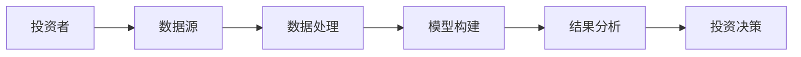
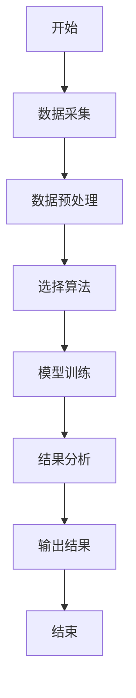
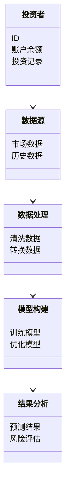
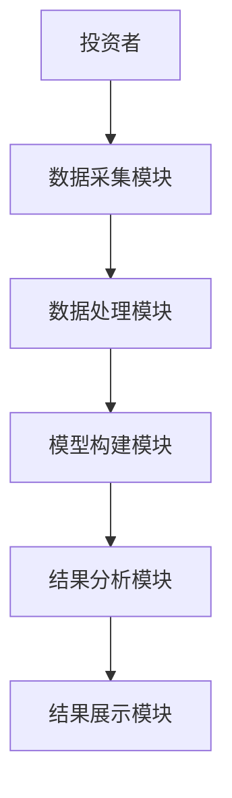
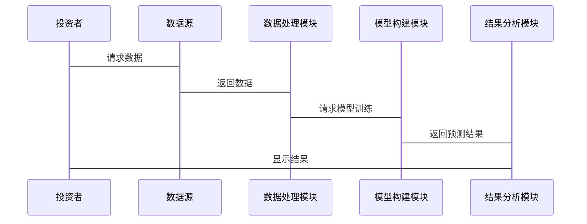

                 


# 特价股票投资中的新兴科技融合指数研究

## 关键词：特价股票投资、新兴科技、指数研究、大数据、人工智能、区块链

## 摘要：  
随着金融市场的日益复杂化和竞争的加剧，传统的股票投资方法逐渐暴露出其局限性。特价股票投资作为一种新兴的投资策略，利用新兴科技如大数据、人工智能和区块链等，通过指数研究来优化投资决策，成为当前金融领域的研究热点。本文从背景介绍、核心概念、算法原理、系统架构设计和项目实战等多个方面，深入探讨了特价股票投资中的新兴科技融合指数研究，为投资者和科技从业者提供了全新的视角和实践指导。

---

# 正文

## 第一部分：背景介绍

### 第1章：特价股票投资的背景与现状

#### 1.1 特价股票投资的定义与背景

##### 1.1.1 特价股票的定义  
特价股票通常指那些价格低于行业平均水平或具有较高增长潜力的股票，其特点是价格低廉但具有较高的增值空间。这种股票通常吸引那些追求高回报但预算有限的投资者。

##### 1.1.2 特价股票投资的背景与现状  
随着全球经济的波动，传统投资方式的收益率逐渐下降，投资者开始寻找新的投资渠道。特价股票作为一种高性价比的投资选择，逐渐受到市场关注。同时，科技的发展为股票分析提供了新的工具和方法。

##### 1.1.3 特价股票投资的市场环境分析  
本文将从市场环境、政策支持、技术进步等多个维度，分析特价股票投资的现状和未来发展趋势。

#### 1.2 新兴科技与金融的融合

##### 1.2.1 新兴科技在金融领域的应用  
大数据、人工智能、区块链等新兴技术正在逐步改变金融行业的运作模式。特别是在股票投资领域，这些技术为指数研究提供了新的可能性。

##### 1.2.2 科技融合对股票投资的影响  
通过科技手段，投资者可以更精准地分析市场趋势，优化投资组合，降低投资风险。新兴科技的引入，使得股票投资更加智能化和数据化。

##### 1.2.3 指数研究中的科技融合趋势  
指数研究是股票投资的重要组成部分，通过新兴科技的融合，指数研究的准确性和效率得到了显著提升。

#### 1.3 特价股票投资中的指数研究

##### 1.3.1 指数的基本概念与分类  
指数是衡量一组股票表现的指标，常用的指数包括股票价格指数、股票收益指数等。本文将重点探讨特价股票指数的特点和分类。

##### 1.3.2 指数在股票投资中的作用  
指数不仅能够反映市场整体走势，还可以为投资者提供投资决策的依据。在特价股票投资中，指数研究更是不可或缺的一部分。

##### 1.3.3 特价股票指数的特殊性与研究价值  
特价股票指数具有低门槛、高透明度等特点，其研究价值在于为投资者提供更精准的投资方向和风险评估。

---

### 第2章：特价股票投资中的新兴科技融合

#### 2.1 新兴科技在指数研究中的应用

##### 2.1.1 大数据技术在指数研究中的应用  
大数据技术可以对海量市场数据进行深度挖掘，提取有用的市场信息，为指数研究提供支持。

##### 2.1.2 人工智能在指数预测中的应用  
通过机器学习算法，人工智能可以对市场走势进行预测，帮助投资者制定更科学的投资策略。

##### 2.1.3 区块链技术在指数数据安全中的应用  
区块链技术可以确保指数数据的安全性和透明性，减少数据造假和篡改的风险。

#### 2.2 科技融合对指数研究的创新

##### 2.2.1 数据处理的创新  
通过新兴科技，指数研究的数据处理更加高效和精准。

##### 2.2.2 模型构建的创新  
人工智能算法的应用，使得指数预测模型更加复杂和准确。

##### 2.2.3 结果分析的创新  
科技融合使得指数研究的结果分析更加直观和易于理解。

#### 2.3 特价股票指数研究中的科技融合架构

##### 2.3.1 架构设计概述  
本文将介绍一种基于大数据、人工智能和区块链技术的科技融合架构，用于特价股票指数研究。

##### 2.3.2 数据流与计算流程  
从数据采集到模型训练，再到结果输出，本文将详细描述数据流与计算流程。

##### 2.3.3 结果展示与反馈机制  
通过可视化工具和反馈机制，投资者可以实时了解指数研究的结果，并根据反馈调整投资策略。

---

## 第二部分：核心概念与联系

### 第3章：核心概念与联系

#### 3.1 新兴科技在指数研究中的核心概念

##### 3.1.1 大数据技术的核心特征  
包括数据量大、类型多样、处理速度快等特点。

##### 3.1.2 人工智能的核心算法  
包括机器学习、深度学习等算法在指数研究中的应用。

##### 3.1.3 区块链技术的核心机制  
包括去中心化、数据不可篡改等特性。

#### 3.2 技术特征对比表格

| 技术         | 特征                | 优势                | 劣势                |
|--------------|---------------------|---------------------|---------------------|
| 大数据       | 数据量大、类型多样  | 提供全面的市场信息  | 数据处理成本高     |
| 人工智能     | 算法复杂、预测精准  | 提高预测准确性      | 对数据质量要求高   |
| 区块链       | 数据安全、透明性高  | 防止数据造假       | 系统搭建成本高     |

#### 3.3 指数研究中的实体关系图



---

## 第三部分：算法原理

### 第4章：算法原理

#### 4.1 算法原理概述

##### 4.1.1 指数计算的数学模型  
通过数学公式，计算指数的值。例如，股票价格指数的计算公式如下：

$$
\text{指数值} = \frac{\sum (\text{股票价格} \times \text{权重})}{\text{基数}}
$$

##### 4.1.2 预测模型的构建  
基于机器学习算法，构建预测模型。例如，使用线性回归模型预测股票价格：

$$
y = \beta_0 + \beta_1x + \epsilon
$$

##### 4.1.3 风险评估的数学模型  
通过方差、标准差等指标评估投资风险。

#### 4.2 算法流程图



---

## 第四部分：系统分析与架构设计

### 第5章：系统分析与架构设计

#### 5.1 项目背景与需求分析

##### 5.1.1 项目背景  
本文将通过一个实际项目，展示新兴科技在特价股票指数研究中的应用。

##### 5.1.2 项目需求  
包括数据采集、模型构建、结果分析等需求。

#### 5.2 系统功能设计

##### 5.2.1 领域模型设计  
通过Mermaid图展示系统中的实体和关系。



##### 5.2.2 系统架构设计  
通过Mermaid图展示系统架构。



#### 5.3 系统接口与交互设计

##### 5.3.1 系统接口设计  
定义系统接口，包括数据接口、模型接口等。

##### 5.3.2 系统交互流程  
通过Mermaid图展示系统交互流程。



---

## 第五部分：项目实战

### 第6章：项目实战

#### 6.1 环境安装与配置

##### 6.1.1 开发环境配置  
安装Python、Jupyter Notebook、TensorFlow等工具。

##### 6.1.2 数据源获取  
从公开数据源获取股票数据，例如Yahoo Finance。

#### 6.2 核心代码实现

##### 6.2.1 数据处理代码  
```python
import pandas as pd
import numpy as np

# 数据加载
df = pd.read_csv('stock_data.csv')

# 数据清洗
df.dropna(inplace=True)
df = df[~df.isin([np.nan, np.inf, -np.inf]).any(axis=1)]
```

##### 6.2.2 模型训练代码  
```python
import tensorflow as tf
from sklearn.model_selection import train_test_split

# 数据分割
X = df[['开盘价', '收盘价', '最高价', '最低价']]
y = df['收盘价']
X_train, X_test, y_train, y_test = train_test_split(X, y, test_size=0.2)

# 模型构建
model = tf.keras.Sequential([
    tf.keras.layers.Dense(64, activation='relu'),
    tf.keras.layers.Dense(1, activation='linear')
])
model.compile(optimizer='adam', loss='mean_squared_error')
model.fit(X_train, y_train, epochs=100, batch_size=32)
```

##### 6.2.3 结果分析代码  
```python
# 预测结果
y_pred = model.predict(X_test)

# 结果分析
from sklearn.metrics import mean_squared_error
print(mean_squared_error(y_test, y_pred))
```

#### 6.3 代码解读与分析

##### 6.3.1 数据处理代码解读  
解释数据清洗和预处理的步骤。

##### 6.3.2 模型训练代码解读  
解释神经网络模型的构建和训练过程。

##### 6.3.3 结果分析代码解读  
分析预测结果与实际值的差异，评估模型的准确性。

#### 6.4 实际案例分析

##### 6.4.1 数据来源与处理  
以实际股票数据为例，展示数据处理过程。

##### 6.4.2 模型训练与预测  
展示模型的训练过程和预测结果。

##### 6.4.3 结果分析与解读  
分析预测结果，评估模型的优缺点。

#### 6.5 项目小结

##### 6.5.1 项目总结  
总结项目的主要成果和经验教训。

##### 6.5.2 项目扩展  
提出未来可能的改进方向和扩展点。

---

## 第六部分：总结与扩展

### 第7章：总结与扩展

#### 7.1 最佳实践 Tips

##### 7.1.1 数据处理建议  
数据清洗和预处理是模型训练的关键，建议采用多种数据清洗方法。

##### 7.1.2 模型选择建议  
根据具体问题选择合适的模型，避免盲目追求复杂模型。

##### 7.1.3 结果分析建议  
注重模型的可解释性，结合实际业务场景进行结果分析。

#### 7.2 小结

##### 7.2.1 文章总结  
回顾本文的主要内容，强调新兴科技在特价股票投资中的重要作用。

##### 7.2.2 未来展望  
展望科技融合在股票投资中的未来发展，提出新的研究方向。

#### 7.3 注意事项

##### 7.3.1 数据风险  
提醒读者注意数据质量和数据安全问题。

##### 7.3.2 模型风险  
提醒读者模型的局限性和可能的过拟合问题。

##### 7.3.3 投资风险  
提醒读者投资需谨慎，注意市场波动和政策风险。

#### 7.4 拓展阅读

##### 7.4.1 推荐书籍  
推荐几本与金融、科技相关的书籍。

##### 7.4.2 推荐论文  
推荐几篇与指数研究相关的学术论文。

##### 7.4.3 推荐工具  
推荐几款常用的金融数据分析工具。

---

## 作者：AI天才研究院/AI Genius Institute & 禅与计算机程序设计艺术 /Zen And The Art of Computer Programming

