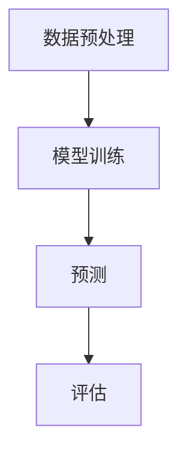
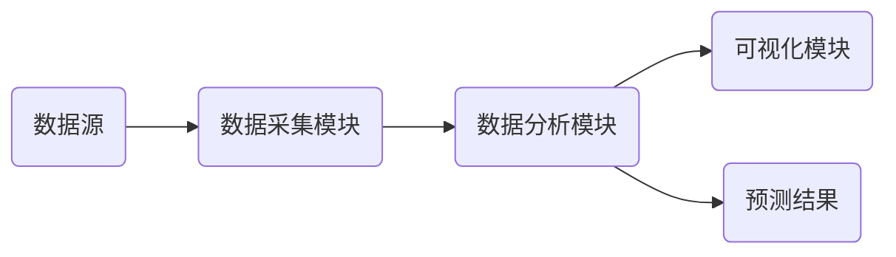

                 


# 特价股票投资中的智慧城市与数字公民参与度整合方法

> 关键词：特价股票投资、智慧城市、数字公民参与度、算法原理、系统架构

> 摘要：本文探讨了如何将特价股票投资与智慧城市建设及数字公民参与度进行整合。通过分析核心概念、设计算法模型、构建系统架构，以及提供项目实战，展示了如何利用技术手段提升投资决策的智能化水平，同时增强数字公民的参与度。

---

## 第1章: 特价股票投资概述

### 1.1 问题背景

#### 1.1.1 特价股票投资的定义与特点
特价股票投资是指以低于市场价购买股票，期望在市场波动中获利的行为。其特点包括低门槛、高波动性和高风险。

#### 1.1.2 投资者行为分析
投资者行为受市场情绪、个人风险偏好和市场趋势的影响，通常表现出非理性特征。

#### 1.1.3 市场波动性对投资决策的影响
市场波动性导致股票价格频繁变化，增加了投资决策的复杂性，需借助技术手段辅助决策。

### 1.2 智慧城市与数字公民参与度

#### 1.2.1 智慧城市的定义与核心要素
智慧城市利用数字技术优化城市运行，核心要素包括智能交通、数据共享和市民参与。

#### 1.2.2 数字公民参与度的测量指标
数字公民参与度包括在线参与度、数据贡献度和参与效果，反映了市民对智慧城市建设的贡献。

#### 1.2.3 智慧城市与数字公民的互动关系
数字公民积极参与数据采集和共享，推动智慧城市建设，同时智慧城市为数字公民提供更好的服务和参与平台。

---

## 第2章: 特价股票投资与智慧城市整合的核心概念

### 2.1 核心概念原理

#### 2.1.1 特价股票投资的策略与模型
策略包括价值投资和趋势跟踪，模型涉及时间序列分析和机器学习算法。

#### 2.1.2 智慧城市的数据驱动决策
利用大数据分析优化城市管理和公共服务，提升决策效率。

#### 2.1.3 数字公民参与度的影响因素
包括技术可及性、信任度和参与激励，影响市民参与智慧城市建设的积极性。

### 2.2 核心概念对比表格

| 概念         | 属性特征 |
|--------------|----------|
| 特价股票投资 | 低门槛、高风险 |
| 智慧城市     | 数字化、智能化 |
| 数字公民参与 | 在线参与、数据驱动 |

### 2.3 ER实体关系图

```mermaid
er
  actor: 投资者
  entity: 特价股票
  entity: 市场数据
  entity: 数字公民参与度
  relationship: 投资者 -> 特价股票: 购买
               投资者 -> 市场数据: 分析
               数字公民 -> 数字公民参与度: 贡献
```

---

## 第3章: 特价股票投资与智慧城市整合的算法原理

### 3.1 算法原理

#### 3.1.1 机器学习模型
使用随机森林和XGBoost预测股票价格，考虑市场数据和数字公民参与度。

#### 3.1.2 算法流程
1. 数据预处理：清洗和特征提取。
2. 模型训练：选择模型并优化参数。
3. 预测与评估：验证模型性能。

### 3.2 算法流程图



### 3.3 代码实现

```python
import pandas as pd
from sklearn.ensemble import RandomForestRegressor
from sklearn.metrics import mean_absolute_error

# 数据预处理
data = pd.read_csv('stock_data.csv')
X = data[['price', 'volume', 'citizen_participation']]
y = data['target_price']

# 模型训练
model = RandomForestRegressor(n_estimators=100)
model.fit(X, y)

# 预测
predictions = model.predict(X)
print(mean_absolute_error(y, predictions))
```

---

## 第4章: 特价股票投资与智慧城市整合的数学模型

### 4.1 时间序列分析

$$ ARIMA(p, d, q) $$
其中，p为自回归阶数，d为差分阶数，q为移动平均阶数。

### 4.2 回归模型

$$ y = \beta_0 + \beta_1x_1 + \beta_2x_2 + \epsilon $$

---

## 第5章: 系统架构设计

### 5.1 系统功能设计

#### 5.1.1 数据采集模块
从多个数据源收集市场数据和公民参与数据。

#### 5.1.2 数据分析模块
利用算法模型进行预测和评估。

#### 5.1.3 可视化模块
展示分析结果，辅助决策。

### 5.2 系统架构图



---

## 第6章: 项目实战

### 6.1 环境配置

安装Python和必要的库，如pandas、scikit-learn。

### 6.2 代码实现

```python
import pandas as pd
from sklearn.ensemble import RandomForestRegressor

# 数据加载
data = pd.read_csv('data.csv')

# 特征选择
X = data[['feature1', 'feature2']]
y = data['target']

# 模型训练
model = RandomForestRegressor()
model.fit(X, y)

# 预测
predictions = model.predict(X)
print(predictions)
```

### 6.3 案例分析

分析某城市数字公民参与度对股票投资的影响，展示模型的预测效果。

---

## 第7章: 总结与展望

### 7.1 小结
整合特价股票投资与智慧城市，利用技术提升投资决策和市民参与度，具有重要意义。

### 7.2 注意事项
投资者需谨慎考虑市场风险，避免过度依赖模型。

### 7.3 拓展阅读
推荐相关书籍和文献，进一步深入研究。

---

作者：AI天才研究院

