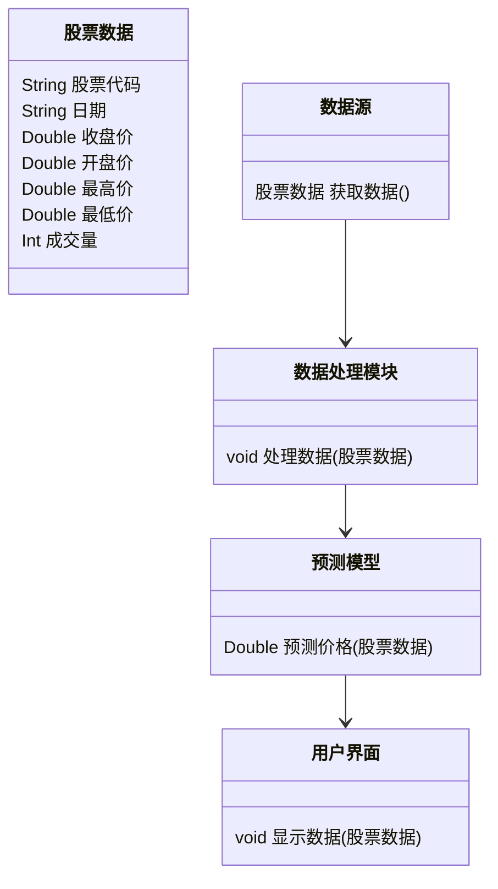
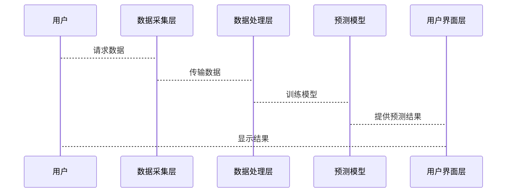

                 


# 特价股票投资中的智慧城市与数字孪生整合方法

> **关键词**: 特价股票投资，智慧城市，数字孪生，整合方法，数据驱动，人工智能，实时分析

> **摘要**: 本文探讨了如何将数字孪生技术应用于特价股票投资，并将其与智慧城市相结合。通过分析数字孪生的核心原理、整合方法，以及在股票投资中的应用场景，提出了一种基于数字孪生的股票投资模型，并详细阐述了其实现方法和应用价值。

---

# 第1章: 特价股票投资与智慧城市概述

## 1.1 特价股票投资的现状与挑战

### 1.1.1 特价股票投资的基本概念
特价股票投资是指在特定条件下，以低于市场价买入股票的投资策略。其核心在于通过市场波动、公司基本面分析以及技术分析等手段，寻找价格被低估的股票进行投资。

### 1.1.2 当前股票投资的主要挑战
- 市场波动性大，难以预测。
- 数据量庞大，分析复杂。
- 缺乏实时性，难以及时做出决策。

### 1.1.3 特价股票投资的市场机会
- 通过技术手段优化投资策略。
- 利用大数据分析提升投资决策的准确性。
- 借助人工智能技术实现自动化投资。

## 1.2 智慧城市的核心概念

### 1.2.1 智慧城市的定义与特征
智慧城市是通过物联网、大数据、人工智能等技术，将城市中的各个系统和资源进行整合，实现智能化管理的城市形态。其特征包括数据驱动、实时监测、智能决策等。

### 1.2.2 智慧城市的主要组成部分
- 智慧交通系统。
- 智慧能源管理。
- 智慧医疗系统。
- 智慧金融平台。

### 1.2.3 智慧城市与股票投资的潜在联系
- 利用智慧城市的数据资源进行股票分析。
- 借助智慧城市的技术手段优化投资策略。
- 通过数字孪生技术实现股票市场的实时模拟与预测。

## 1.3 数字孪生技术的定义与应用

### 1.3.1 数字孪生的基本概念
数字孪生是一种通过数字化手段，构建物理世界中实体的虚拟模型，并实现两者实时交互的技术。它广泛应用于制造业、建筑、医疗等领域。

### 1.3.2 数字孪生的核心技术
- 数据采集与处理技术。
- 数据融合与建模技术。
- 可视化与人机交互技术。

### 1.3.3 数字孪生在智慧城市中的应用
- 实时监测城市运行状态。
- 智能预测城市问题并提供解决方案。
- 支持城市规划与决策。

## 1.4 特价股票投资与数字孪生整合的背景

### 1.4.1 特价股票投资的数字化需求
- 需要实时数据分析支持投资决策。
- 需要高效的数据处理能力。
- 需要智能化的投资策略。

### 1.4.2 数字孪生技术在金融领域的潜力
- 提供实时市场模拟环境。
- 支持复杂金融模型的构建与优化。
- 实现金融数据的可视化分析。

### 1.4.3 整合的必要性与目标
- 提高股票投资的实时性和准确性。
- 优化投资策略，降低投资风险。
- 实现股票市场的智能化管理。

---

# 第2章: 特价股票投资中的数字孪生整合方法

## 2.1 数字孪生在股票投资中的应用场景

### 2.1.1 实时数据可视化
- 通过数字孪生技术，将股票市场的实时数据进行可视化展示，帮助投资者快速理解市场动态。

### 2.1.2 市场趋势预测
- 利用数字孪生构建的虚拟模型，对股票市场的未来走势进行预测，辅助投资者做出决策。

### 2.1.3 投资组合优化
- 基于数字孪生的实时数据分析，优化投资组合，降低风险，提高收益。

## 2.2 基于数字孪生的股票投资模型

### 2.2.1 模型构建的基本思路
- 数据驱动的实时更新。
- 多模型协同工作。
- 与物理世界的双向映射。

### 2.2.2 数据采集与处理
- 从多个数据源获取股票市场数据。
- 对数据进行清洗、转换和整合，为模型提供高质量的数据输入。

### 2.2.3 模型训练与优化
- 使用机器学习算法对数据进行训练，构建股票价格预测模型。
- 通过不断优化模型参数，提高预测的准确性和稳定性。

## 2.3 整合方法的具体实现

### 2.3.1 数据流设计
- 确定数据来源和数据流向。
- 设计数据处理流程，确保数据实时更新。

### 2.3.2 模型部署与应用
- 将构建好的模型部署到股票投资系统中。
- 实现模型的实时监控和动态调整。

### 2.3.3 系统架构设计
- 分层架构设计，包括数据采集层、数据处理层、模型层和用户界面层。
- 确保系统的可扩展性和可维护性。

---

# 第3章: 数字孪生技术的核心原理

## 3.1 数字孪生的实现原理

### 3.1.1 数据驱动的实时更新
- 通过传感器和数据采集工具，实时获取物理世界中的数据。
- 将数据传输到虚拟模型中，实现模型的实时更新。

### 3.1.2 多模型协同工作
- 结合多种模型，如机器学习模型、统计模型等，提高预测的准确性。
- 通过模型协同，实现复杂问题的综合解决方案。

### 3.1.3 与物理世界的双向映射
- 虚拟模型对物理世界的实时反馈，指导物理系统的调整。
- 物理系统的调整结果反哺虚拟模型，实现闭环控制。

## 3.2 数字孪生的关键技术

### 3.2.1 数据采集与处理技术
- 使用传感器和数据采集工具，实时获取数据。
- 对数据进行清洗、转换和整合，确保数据质量。

### 3.2.2 数据融合与建模技术
- 将多源数据进行融合，构建统一的数据模型。
- 使用机器学习和深度学习算法，训练虚拟模型。

### 3.2.3 可视化与人机交互技术
- 将虚拟模型的分析结果以直观的方式展示给用户。
- 提供人机交互界面，支持用户的实时操作和决策。

## 3.3 数字孪生与股票投资的结合点

### 3.3.1 数据的实时性要求
- 股票市场的数据需要实时更新，确保投资决策的及时性。

### 3.3.2 模型的动态调整能力
- 虚拟模型需要根据市场变化实时调整，提高预测的准确性。

### 3.3.3 可视化分析的优势
- 通过可视化技术，帮助投资者快速理解市场动态，做出决策。

---

# 第4章: 基于数字孪生的股票投资算法设计

## 4.1 算法设计的基本思路

### 4.1.1 数据流分析
- 确定数据的来源和流向。
- 设计数据处理流程，确保数据实时更新。

### 4.1.2 模型选择与优化
- 根据数据特点选择合适的机器学习算法。
- 通过参数优化和模型调优，提高预测的准确性。

### 4.1.3 算法实现步骤
- 数据预处理：清洗、转换和整合数据。
- 模型训练：使用训练数据构建预测模型。
- 模型评估：通过测试数据验证模型的准确性。
- 模型部署：将模型部署到股票投资系统中。

## 4.2 算法实现的具体步骤

### 4.2.1 数据预处理
```python
import pandas as pd

# 读取数据
data = pd.read_csv('stock_data.csv')

# 清洗数据
data = data.dropna()
data = data.drop_duplicates()

# 转换数据
data['Date'] = pd.to_datetime(data['Date'])
data.set_index('Date', inplace=True)
```

### 4.2.2 模型训练
```python
from sklearn.model_selection import train_test_split
from sklearn.linear_model import LinearRegression

# 划分训练集和测试集
X_train, X_test, y_train, y_test = train_test_split(data.drop('Price', axis=1), data['Price'], test_size=0.2)

# 训练模型
model = LinearRegression()
model.fit(X_train, y_train)

# 预测结果
y_pred = model.predict(X_test)
```

### 4.2.3 模型评估
```python
from sklearn.metrics import mean_squared_error

# 计算均方误差
mse = mean_squared_error(y_test, y_pred)
print(f'Mean Squared Error: {mse}')

# 计算决定系数
r2 = model.score(X_test, y_test)
print(f'R-squared: {r2}')
```

## 4.3 数学模型与公式

### 4.3.1 线性回归模型
$$ y = \beta_0 + \beta_1x_1 + \beta_2x_2 + \dots + \beta_nx_n + \epsilon $$

### 4.3.2 时间序列模型
$$ ARIMA(p, d, q) $$

---

# 第5章: 系统分析与架构设计

## 5.1 项目介绍

### 5.1.1 项目背景
- 项目旨在利用数字孪生技术优化股票投资策略。
- 通过构建虚拟股票市场模型，帮助投资者做出更明智的决策。

## 5.2 系统功能设计

### 5.2.1 领域模型


### 5.2.2 系统架构


### 5.2.3 接口设计
- 数据接口：提供数据采集和传输的接口。
- 模型接口：提供模型调用和预测的接口。
- 用户接口：提供用户交互和数据展示的界面。

### 5.2.4 交互序列图


---

# 第6章: 项目实战

## 6.1 环境安装

### 6.1.1 安装Python
```bash
python --version
pip install --upgrade pip
```

### 6.1.2 安装必要的库
```bash
pip install pandas numpy scikit-learn matplotlib
```

## 6.2 核心代码实现

### 6.2.1 数据预处理
```python
import pandas as pd
import numpy as np

# 读取数据
data = pd.read_csv('stock_data.csv')

# 清洗数据
data = data.dropna()
data = data.drop_duplicates()

# 转换数据
data['Date'] = pd.to_datetime(data['Date'])
data.set_index('Date', inplace=True)
```

### 6.2.2 模型训练
```python
from sklearn.model_selection import train_test_split
from sklearn.linear_model import LinearRegression

# 划分训练集和测试集
X_train, X_test, y_train, y_test = train_test_split(data.drop('Price', axis=1), data['Price'], test_size=0.2)

# 训练模型
model = LinearRegression()
model.fit(X_train, y_train)

# 预测结果
y_pred = model.predict(X_test)
```

### 6.2.3 模型评估
```python
from sklearn.metrics import mean_squared_error, r2_score

# 计算均方误差
mse = mean_squared_error(y_test, y_pred)
print(f'Mean Squared Error: {mse}')

# 计算决定系数
r2 = r2_score(y_test, y_pred)
print(f'R-squared: {r2}')
```

## 6.3 实际案例分析

### 6.3.1 数据来源
- 数据来源：股票市场的历史数据。
- 数据特征：股票代码、日期、开盘价、收盘价、最高价、最低价、成交量。

### 6.3.2 模型预测
- 使用线性回归模型对股票价格进行预测。
- 预测结果与实际数据进行对比，验证模型的准确性。

### 6.3.3 案例分析
- 分析模型在不同市场条件下的表现。
- 总结经验，优化模型参数。

## 6.4 项目小结

### 6.4.1 项目成果
- 成功构建了基于数字孪生的股票投资模型。
- 实现了模型的实时更新和预测功能。
- 提高了股票投资的决策效率和准确性。

### 6.4.2 经验总结
- 数据质量对模型性能的影响至关重要。
- 模型的实时更新能力是实现准确预测的关键。
- 可视化分析在股票投资中的作用不可忽视。

---

# 第7章: 最佳实践与注意事项

## 7.1 最佳实践

### 7.1.1 数据质量管理
- 确保数据的完整性和准确性。
- 定期更新数据，保持模型的实时性。

### 7.1.2 模型优化
- 不断优化模型参数，提高预测的准确性。
- 结合多种模型，提升预测的稳定性。

### 7.1.3 可视化分析
- 使用直观的可视化工具，帮助投资者快速理解市场动态。
- 提供个性化的数据展示，满足不同用户的需求。

## 7.2 小结

### 7.2.1 项目总结
- 通过数字孪生技术，优化了股票投资策略。
- 实现了股票市场的实时模拟与预测。
- 提高了投资决策的准确性和效率。

## 7.3 注意事项

### 7.3.1 数据隐私与安全
- 确保数据的安全性，防止数据泄露。
- 遵守相关法律法规，保护用户隐私。

### 7.3.2 模型风险
- 模型的预测结果仅供参考，投资需谨慎。
- 定期评估模型性能，及时调整和优化。

### 7.3.3 系统维护
- 定期更新系统软件和模型。
- 及时处理系统故障，确保系统的稳定运行。

## 7.4 拓展阅读

### 7.4.1 推荐书籍
- 《机器学习实战》
- 《数据驱动的金融分析》

### 7.4.2 推荐博客
- 知乎专栏：《数字孪生与智慧金融》
- CSDN博客：《基于Python的股票数据分析》

---

# 结语

通过本文的探讨，我们了解了如何将数字孪生技术应用于特价股票投资，并将其与智慧城市相结合。数字孪生技术为股票投资提供了新的思路和方法，通过实时数据可视化、市场趋势预测和投资组合优化，帮助投资者做出更明智的决策。未来，随着技术的不断发展，数字孪生在股票投资中的应用将更加广泛和深入。

---

**作者：AI天才研究院/AI Genius Institute & 禅与计算机程序设计艺术/Zen And The Art of Computer Programming**

