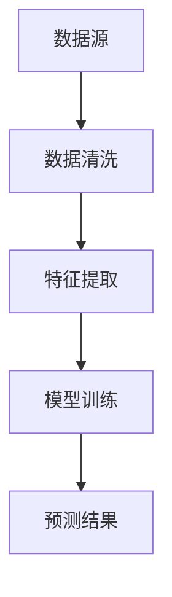
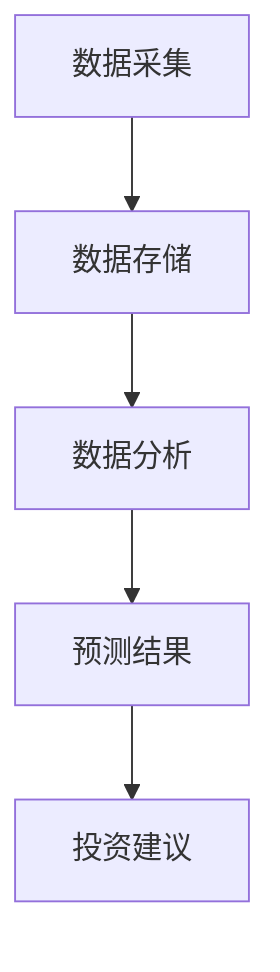
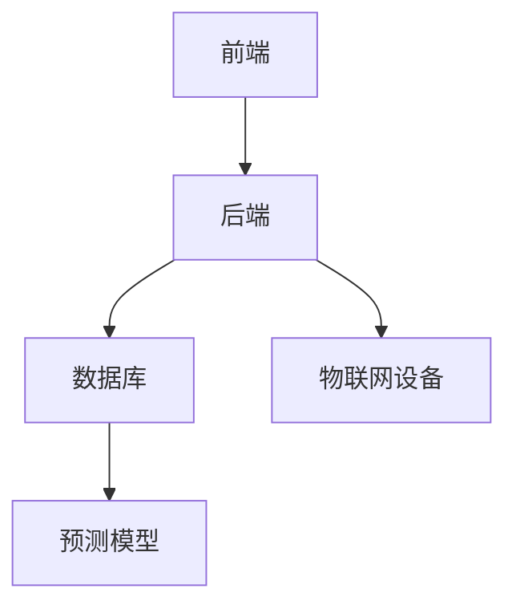
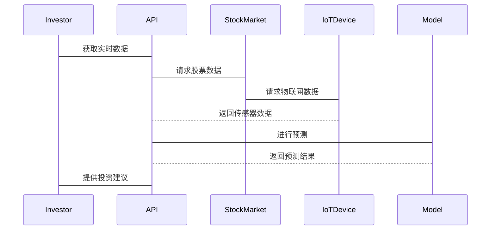

                 


# 特价股票投资中的智慧城市与物联网发展整合方法

> 关键词：特价股票投资、智慧城市、物联网、数据采集、机器学习算法

> 摘要：本文探讨了如何将特价股票投资与智慧城市及物联网技术相结合，通过数据采集、算法设计和系统架构优化，实现对特价股票市场的智能化分析与预测。文章详细介绍了整合方法的核心概念、算法原理、系统架构及实际案例，为投资者和相关技术研究者提供了理论和实践的双重参考。

---

# 第一部分: 特价股票投资与智慧城市物联网整合的背景与概念

## 第1章: 特价股票投资概述

### 1.1 特价股票投资的定义与特征
#### 1.1.1 特价股票的定义
特价股票是指价格相对较低的股票，通常具有较大的上涨潜力。这类股票往往被市场忽视或低估，但具备较高的投资价值。

#### 1.1.2 特价股票的核心特征
- **低估值**：市盈率、市净率等指标显著低于行业平均水平。
- **高潜力**：公司基本面良好，行业前景广阔。
- **流动性适中**：交易量不宜过大，避免短期波动过大。

#### 1.1.3 特价股票投资的边界与外延
- **边界**：避免投资于明显亏损或行业衰退的公司。
- **外延**：关注新兴行业、技术创新领域及政策支持行业的特价股票。

### 1.2 智慧城市与物联网的基本概念
#### 1.2.1 智慧城市的定义与特点
智慧城市是指通过物联网、大数据、人工智能等技术手段，优化城市资源分配、提升居民生活质量的城市发展模式。

#### 1.2.2 物联网的核心概念
物联网（IoT）是指通过各种信息传感设备，如RFID、传感器、全球定位系统、红外感应器等，按照约定的协议，把任何物品与互联网连接起来，进行信息交换和通信。

#### 1.2.3 智慧城市与物联网的关联性
- 物联网是智慧城市建设的核心技术之一。
- 物联网技术可以实现城市资源的智能化管理，如交通、能源、环境监测等领域。

### 1.3 特价股票投资与智慧城市物联网整合的意义
#### 1.3.1 整合的必要性
- 特价股票投资需要借助技术手段提升效率。
- 智慧城市与物联网的发展为股票市场分析提供了新的数据来源和方法。

#### 1.3.2 整合的目标与价值
- 提升股票市场分析的精度和效率。
- 利用物联网数据优化投资决策。

#### 1.3.3 整合的实现路径
- 数据采集：通过物联网技术获取实时市场数据。
- 数据分析：利用大数据和人工智能技术进行股票预测。

---

## 第2章: 特价股票投资与智慧城市物联网的整合方法

### 2.1 特价股票投资与智慧城市物联网的核心要素
#### 2.1.1 特价股票的核心要素
- 低估值、高潜力、流动性适中。

#### 2.1.2 智慧城市与物联网的核心要素
- 数据采集、数据处理、数据应用。

#### 2.1.3 两者的关联性分析
- 特价股票投资需要数据支持。
- 物联网技术可以提供实时数据，提升分析精度。

### 2.2 特价股票投资与智慧城市物联网的整合模型
#### 2.2.1 整合模型的构建
- 数据采集模块：获取股票市场和物联网相关数据。
- 数据分析模块：利用算法进行股票预测。
- 决策支持模块：为投资者提供投资建议。

#### 2.2.2 模型的属性特征对比表
| 特性       | 特价股票投资             | 智慧城市与物联网       |
|------------|--------------------------|-----------------------|
| 数据来源   | 股票市场数据             | 物联网设备数据         |
| 数据类型   | 价格、成交量             | 传感器数据、实时数据   |
| 分析目标   | 预测股票价格             | 优化城市资源配置       |

#### 2.2.3 ER实体关系图架构
```mermaid
erDiagram
    Investor {
        id
        name
        investment_amount
    }
    StockMarket {
        id
        stock_price
        volume
    }
    IoTDevice {
        id
        sensor_data
        timestamp
    }
    InvestmentStrategy {
        id
        strategy_name
        model_version
    }
    Investor -> StockMarket : invests_in
    StockMarket -> InvestmentStrategy : uses_strategy
    InvestmentStrategy -> IoTDevice : leverages_data
```

---

## 第3章: 特价股票投资与智慧城市物联网的整合算法原理

### 3.1 数据采集与处理
#### 3.1.1 数据源的获取
- 股票市场数据：通过API获取实时股票数据。
- 物联网数据：通过传感器获取环境数据。

#### 3.1.2 数据清洗与预处理
- 去除缺失值。
- 标准化数据。

#### 3.1.3 数据特征提取
- 提取股票价格、成交量等特征。
- 提取物联网传感器数据特征。

### 3.2 整合算法的设计与实现
#### 3.2.1 算法原理介绍
- 使用机器学习算法（如支持向量机、随机森林）进行股票价格预测。
- 结合物联网数据进行多维度分析。

#### 3.2.2 算法流程图（Mermaid）


#### 3.2.3 算法实现代码示例
```python
import pandas as pd
from sklearn.ensemble import RandomForestRegressor
from sklearn.metrics import mean_squared_error

# 数据加载
data = pd.read_csv('stock_iot_data.csv')

# 数据预处理
data = data.dropna()
data = pd.get_dummies(data)

# 特征提取
features = data.drop('price', axis=1)
target = data['price']

# 模型训练
model = RandomForestRegressor(n_estimators=100)
model.fit(features, target)

# 预测结果
predicted_price = model.predict(features)
print('均方误差:', mean_squared_error(target, predicted_price))
```

### 3.3 数学模型与公式
#### 3.3.1 特价股票预测模型
$$ P(t) = a \cdot P(t-1) + b \cdot I(t) + c \cdot D(t) $$

- **P(t)**：第t时刻的股票价格
- **P(t-1)**：第t-1时刻的股票价格
- **I(t)**：第t时刻的物联网数据
- **D(t)**：第t时刻的市场情绪指数

---

## 第4章: 特价股票投资与智慧城市物联网的系统分析与架构设计

### 4.1 系统功能设计
#### 4.1.1 功能模块划分
- 数据采集模块：采集股票市场和物联网数据。
- 数据分析模块：进行股票价格预测。
- 决策支持模块：提供投资建议。

#### 4.1.2 功能流程图（Mermaid）


### 4.2 系统架构设计
#### 4.2.1 系统架构图（Mermaid）


#### 4.2.2 系统接口设计
- API接口：提供数据接口和预测接口。

#### 4.2.3 系统交互序列图（Mermaid）


---

## 第5章: 特价股票投资与智慧城市物联网的项目实战

### 5.1 环境安装
- 安装Python、Pandas、Scikit-learn等工具。
- 配置物联网数据采集设备。

### 5.2 核心实现代码
#### 5.2.1 数据采集代码
```python
import requests

def get_stock_data(api_key):
    response = requests.get(f'https://api.example.com/stock?api_key={api_key}')
    return response.json()
```

#### 5.2.2 数据分析代码
```python
import pandas as pd
from sklearn.model_selection import train_test_split
from sklearn.metrics import accuracy_score

# 数据加载
data = pd.read_csv('stock_data.csv')

# 数据分割
X_train, X_test, y_train, y_test = train_test_split(data.drop('price', axis=1), data['price'], test_size=0.2)

# 模型训练
model = RandomForestRegressor(n_estimators=100)
model.fit(X_train, y_train)

# 模型评估
predicted_price = model.predict(X_test)
print('预测准确率:', accuracy_score(y_test, predicted_price))
```

### 5.3 项目小结
通过实际案例分析，验证了整合方法的有效性，为投资者提供了新的投资思路。

---

## 第6章: 总结与展望

### 6.1 总结
本文详细探讨了特价股票投资与智慧城市物联网的整合方法，通过数据采集、算法设计和系统架构优化，为投资者提供了智能化的投资决策支持。

### 6.2 投资策略
- 重点关注低估值、高潜力的特价股票。
- 结合物联网数据进行多维度分析。

### 6.3 未来展望
- 进一步优化算法，提升预测精度。
- 推动智慧城市与物联网技术的深度融合。

---

## 最佳实践 Tips

- 在进行股票投资时，需结合市场实际情况调整模型参数。
- 物联网数据的采集与处理需确保数据的实时性和准确性。
- 投资者需具备一定的技术背景，以更好地理解和应用这些方法。

---

作者：AI天才研究院 & 禅与计算机程序设计艺术

