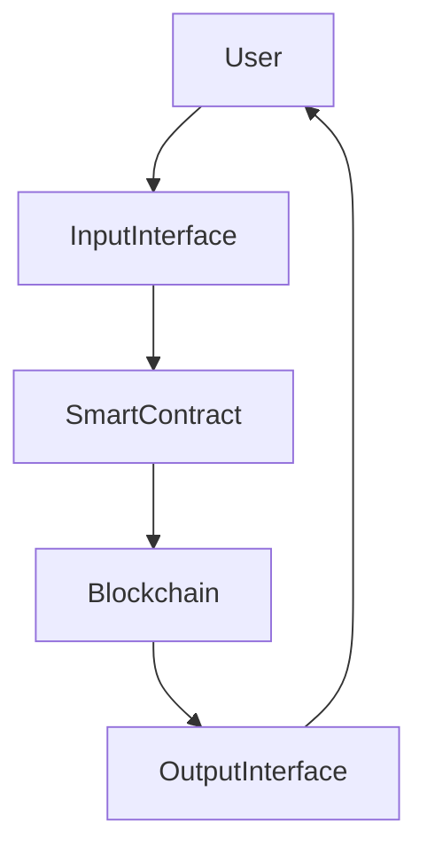

                 


```markdown
# 特价股票投资中的智能合约自动化合规策略

> 关键词：智能合约，特价股票，自动化合规，区块链，投资策略，金融监管

> 摘要：本文探讨了智能合约在特价股票投资中的应用，重点分析了如何通过智能合约实现投资策略的自动化合规。文章详细介绍了智能合约的核心原理、合规性要求，以及在实际投资中的应用案例，旨在为投资者提供一种高效、透明的合规解决方案。

---

## 第一部分：智能合约与特价股票投资的背景

### 第1章：智能合约与特价股票投资的结合

#### 1.1 特价股票投资的定义与特点
- **特价股票**：指价格低于市场平均值，具有潜在增值空间的股票。
- **特点**：
  - 价格低廉，适合中小投资者。
  - 市场波动大，风险与机会并存。
  - 需要快速决策和自动化管理。

#### 1.2 智能合约的基本原理
- **智能合约**：在区块链上运行的自动执行程序，根据预设条件自动执行交易。
- **核心特点**：
  - 去中心化：无需信任第三方，直接在区块链上执行。
  - 自动化：条件满足时自动触发交易。
  - 不可篡改：区块链上的合约无法修改。

#### 1.3 合规性在智能合约中的重要性
- **合规性定义**：符合相关法律法规的投资行为。
- **合规性要求**：
  - 防止操纵市场。
  - 避免内幕交易。
  - 确保交易透明。

### 第2章：智能合约在投资中的优势

#### 2.1 智能合约的优势
- **自动化交易**：快速响应市场变化，减少人为干预。
- **透明性**：所有交易记录在区块链上，可追溯。
- **安全性**：通过区块链技术确保合约不可篡改。

#### 2.2 智能合约在特价股票投资中的具体应用
- **自动化购买策略**：设定价格阈值，自动购买低于阈值的股票。
- **风险控制**：自动执行止损或止盈指令。

---

## 第二部分：智能合约的合规性实现

### 第3章：智能合约的合规性设计

#### 3.1 合规性规则的编码实现
- **规则编码**：将市场操纵、内幕交易等合规规则转化为智能合约代码。
- **自动化监控**：实时监控交易行为，自动触发合规性检查。

#### 3.2 合规性监控机制
- **触发条件**：当交易行为触发合规性检查时，智能合约自动执行。
- **反馈机制**：记录所有合规性检查结果，供监管机构查阅。

### 第4章：智能合约在合规性中的实际应用

#### 4.1 自动化合规性策略
- **案例分析**：假设某投资者设定一个策略，当某股票价格低于历史平均值时自动购买。
- **合规性检查**：智能合约自动检查是否存在市场操纵嫌疑。

#### 4.2 合规性评估与优化
- **评估指标**：包括交易频率、价格波动等。
- **优化建议**：根据评估结果调整合规性规则。

---

## 第三部分：系统架构与实现

### 第5章：系统架构设计

#### 5.1 系统功能设计
- **用户界面**：投资者设置策略和监控交易。
- **智能合约执行层**：处理交易指令和合规性检查。

#### 5.2 系统架构图


### 第6章：系统实现

#### 6.1 环境搭建
- **区块链平台**：以太坊或其他支持智能合约的平台。
- **开发工具**：Solidity编写合约，使用 Remix 进行调试。

#### 6.2 核心代码实现
```solidity
// 智能合约代码示例
contract StockTrader {
    function buyStock(address stockToken, uint minPrice) {
        // 自动购买低于minPrice的股票
        if (currentPrice < minPrice) {
            executeTrade(stockToken);
        }
    }
}
```

#### 6.3 实际案例分析
- **案例分析**：投资者设置购买低于$50的股票，智能合约自动执行交易。
- **结果分析**：记录交易时间和价格，确保符合合规性要求。

---

## 第四部分：最佳实践与未来展望

### 第7章：最佳实践与注意事项

#### 7.1 投资者的注意事项
- **风险控制**：确保智能合约的安全性，防止漏洞被利用。
- **合规性审查**：定期检查合规性规则，确保符合最新法规。

#### 7.2 未来展望
- **技术发展**：AI与智能合约的结合，进一步优化投资策略。
- **监管框架**：各国监管机构逐步建立智能合约相关法规。

---

## 作者简介

作者：AI天才研究院 & 禅与计算机程序设计艺术

---

通过以上内容，我们详细探讨了智能合约在特价股票投资中的应用，从理论到实践，为投资者提供了一种高效、透明的合规解决方案。
```

