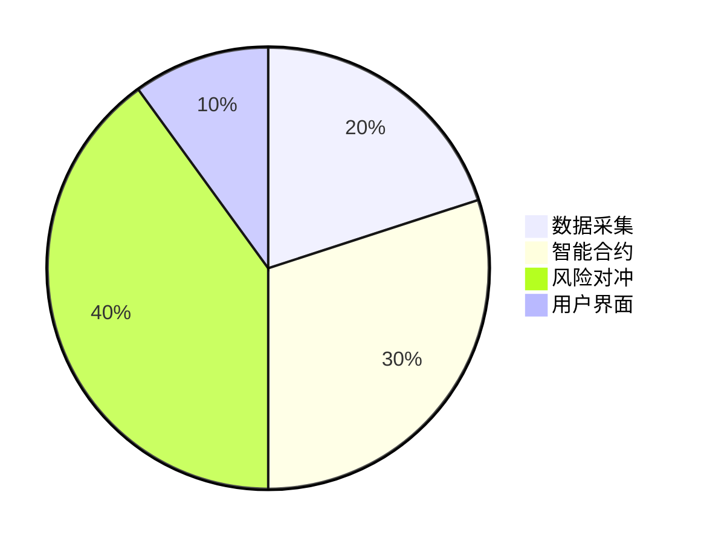

                 


```markdown
# 特价股票投资中的智能合约自动化风险对冲策略

> 关键词：智能合约，股票投资，风险对冲，自动化，区块链

> 摘要：本文深入探讨了智能合约在特价股票投资中的应用，特别是如何通过自动化风险对冲策略来优化投资组合。文章从智能合约的基本概念和区块链技术支撑出发，分析了智能合约在风险对冲中的核心作用，详细阐述了基于智能合约的风险对冲数学模型与算法，提出了系统的架构设计，并通过实际案例展示了如何实现智能合约驱动的自动化风险对冲策略。本文旨在为投资者和开发人员提供理论与实践相结合的指导，帮助他们在复杂多变的股票市场中实现更高效、更安全的投资管理。

---

## 第一部分: 特价股票投资中的智能合约基础

### 第1章: 特价股票投资与智能合约概述

#### 1.1 智能合约的基本概念
- **1.1.1 智能合约的定义**
  - 智能合约是一种自动执行的计算机协议，用于在区块链上实现多方之间的信任与自动化交易。
- **1.1.2 智能合约的核心特点**
  - 自动化：无需中间人，自动执行预设条件。
  - 可编程性：通过编写代码定义合约行为。
  - 不可篡改性：区块链上的智能合约无法被篡改。
- **1.1.3 智能合约与传统合约的区别**
  - 传统合约依赖信任和法律约束，而智能合约依赖技术实现和区块链的去中心化特性。

#### 1.2 区块链技术与智能合约的关系
- **1.2.1 区块链技术简介**
  - 区块链是一种分布式账本技术，通过去中心化和共识机制保证数据的安全性和一致性。
- **1.2.2 智能合约在区块链中的作用**
  - 智能合约是区块链生态系统的核心组件，用于实现去中心化的应用程序（dApp）和自动化交易。
- **1.2.3 智能合约的优势与局限性**
  - 优势：透明、不可篡改、自动执行。
  - 局限性：依赖区块链性能，开发复杂性较高。

#### 1.3 特价股票投资的现状与挑战
- **1.3.1 特价股票投资的基本概念**
  - 特价股票是指价格相对较低，但具有增长潜力的股票，适合中长线投资者。
- **1.3.2 当前投资中的主要风险**
  - 市场波动风险、流动性风险、信息不对称风险。
- **1.3.3 智能合约在投资中的潜在应用**
  - 自动化交易、风险管理、资产配置优化。

#### 1.4 本章小结
- 本章介绍了智能合约的基本概念、区块链技术的作用以及智能合约在特价股票投资中的潜在应用，为后续内容奠定了基础。

---

## 第二部分: 智能合约与风险对冲策略的核心概念

### 第2章: 智能合约的原理与实现

#### 2.1 智能合约的执行机制
- **2.1.1 自动执行的原理**
  - 智能合约通过预设的条件自动执行交易或支付，无需人工干预。
- **2.1.2 智能合约的编程模型**
  - 基于区块链平台（如以太坊）的智能合约编程语言（如Solidity）。
- **2.1.3 智能合约的部署与运行**
  - 合约代码部署到区块链网络，通过交易触发执行。

#### 2.2 智能合约的安全性分析
- **2.2.1 智能合约的安全威胁**
  - 代码漏洞、逻辑错误、恶意攻击。
- **2.2.2 安全性验证方法**
  - 静态分析、动态分析、形式化验证。
- **2.2.3 安全性提升策略**
  - 定期审计、代码审查、引入安全协议。

#### 2.3 智能合约的可编程性
- **2.3.1 可编程金融的概念**
  - 通过代码定义金融产品的行为和规则。
- **2.3.2 智能合约的编程语言**
  - Solidity、Vyper、Rust（用于波卡生态）。
- **2.3.3 智能合约的灵活性与扩展性**
  - 支持模块化设计，便于功能扩展和升级。

#### 2.4 本章小结
- 本章详细分析了智能合约的执行机制、安全性以及可编程性，强调了智能合约在风险对冲中的技术优势。

---

## 第三部分: 风险对冲策略的数学模型与算法

### 第3章: 风险对冲的数学模型

#### 3.1 风险对冲的基本原理
- **3.1.1 风险的定义与分类**
  - 市场风险、信用风险、流动性风险、操作风险。
- **3.1.2 对冲的基本方法**
  - 通过衍生品（如期货、期权）对冲价格波动风险。
  - 使用资产配置分散投资风险。
- **3.1.3 数学模型的构建**
  - 基于均值-方差优化（MVO）模型，构建最优投资组合。

#### 3.2 基于智能合约的风险对冲模型
- **3.2.1 模型的输入变量**
  - 股票价格数据、波动率、相关性、投资目标。
- **3.2.2 模型的输出结果**
  - 风险对冲后的投资组合配置建议。
- **3.2.3 模型的验证与优化**
  - 回测分析、参数调整、鲁棒性测试。

#### 3.3 算法原理与实现
- **3.3.1 算法流程图**
  ```mermaid
  graph TD
    A[输入数据] --> B[计算波动率]
    B --> C[计算相关性]
    C --> D[构建投资组合]
    D --> E[输出优化结果]
  ```
- **3.3.2 算法的数学公式**
  - 均值-方差优化公式：
    $$\min_w \left( w^T \Sigma w \right) \quad \text{subject to} \quad 1^T w = 1$$
  - 波动率计算公式：
    $$\sigma = \sqrt{\frac{1}{n}\sum_{i=1}^n (x_i - \mu)^2}$$
- **3.3.3 算法的实现代码**
  ```python
  import numpy as np
  from scipy.optimize import minimize

  def portfolio_optimization(returns):
      n = len(returns.columns)
      cov_matrix = returns.cov()
      def objective(weights, cov_matrix):
          return np.dot(weights.T, np.dot(cov_matrix, weights))
      cons = ({'type': 'eq', 'fun': lambda w: np.sum(w) - 1.0})
      bounds = [(0, 1) for _ in range(n)]
      result = minimize(objective, np.ones(n)/n, args=cov_matrix, constraints=cons, bounds=bounds)
      return result.x
  ```

#### 3.4 本章小结
- 本章通过数学模型和算法，展示了如何利用智能合约实现风险对冲，强调了技术与金融的结合。

---

## 第四部分: 系统架构与设计

### 第4章: 系统架构设计

#### 4.1 系统功能设计
- **4.1.1 系统功能模块划分**
  - 数据采集模块、智能合约模块、风险对冲模块、用户界面模块。
- **4.1.2 每个模块的功能描述**
  - 数据采集模块：获取实时股票数据。
  - 智能合约模块：部署并执行智能合约。
  - 风险对冲模块：根据模型计算最优投资组合。
  - 用户界面模块：展示结果并接受用户指令。
- **4.1.3 模块之间的交互关系**
  - 数据采集模块 --> 智能合约模块 --> 风险对冲模块 --> 用户界面模块。

#### 4.2 系统架构图


#### 4.3 接口设计与交互流程
- **4.3.1 系统接口的定义**
  - 数据接口：REST API。
  - 智能合约接口：区块链节点API。
- **4.3.2 接口的交互流程**
  ```mermaid
  sequenceDiagram
    participant 用户
    participant 系统
    用户 -> 系统: 发起投资请求
    系统 -> 数据采集模块: 获取实时数据
    数据采集模块 --> 智能合约模块: 部署智能合约
    智能合约模块 --> 风险对冲模块: 计算最优组合
    风险对冲模块 --> 用户界面模块: 展示结果
    用户界面模块 -> 用户: 反馈结果
  ```

#### 4.4 本章小结
- 本章通过系统架构设计，展示了如何将智能合约与风险对冲策略整合到一个完整的系统中。

---

## 第五部分: 项目实战与案例分析

### 第5章: 项目实战

#### 5.1 环境搭建与配置
- **5.1.1 开发环境的选择**
  - 使用以太坊测试网络（如Ropsten）。
  - 安装以太坊钱包（如MetaMask）。
- **5.1.2 区块链平台的搭建**
  - 安装Geth或Infura。
- **5.1.3 智能合约开发工具的安装**
  - 安装Solidity编译器、以太坊开发环境（如Brownie）。

#### 5.2 核心代码实现
- **5.2.1 智能合约的编写**
  ```solidity
  // SPDX-License-Identifier: MIT
  pragma solidity ^0.8.0;

  contract RiskHedging {
      function optimizePortfolio(uint[] memory returns_) external returns (uint[]) {
          // 实现均值-方差优化算法
      }
  }
  ```
- **5.2.2 后端系统的开发**
  - 使用Python和Flask框架搭建Web服务。
- **5.2.3 系统的集成与测试**
  - 进行功能测试、性能测试、安全测试。

#### 5.3 案例分析与详细解读
- **5.3.1 案例背景介绍**
  - 假设某投资者持有一定数量的特价股票，希望通过智能合约实现风险对冲。
- **5.3.2 案例的实现过程**
  - 数据采集：获取目标股票的历史价格和实时价格。
  - 部署智能合约：在区块链上部署优化算法。
  - 计算最优组合：根据波动率和相关性计算最优投资组合。
- **5.3.3 案例的分析与总结**
  - 对比传统投资方法，智能合约实现了自动化和高效性。
  - 突出了区块链技术在金融领域的潜力。

#### 5.4 本章小结
- 本章通过实际项目案例，展示了智能合约在风险对冲中的应用，为读者提供了实践指导。

---

## 第六部分: 总结与展望

### 第6章: 总结与展望

#### 6.1 本章总结
- 本文详细探讨了智能合约在特价股票投资中的应用，特别是如何通过自动化风险对冲策略优化投资组合。
- 提出了基于智能合约的风险对冲模型，结合数学算法和系统架构设计，为投资者提供了一个高效、安全的投资管理工具。

#### 6.2 未来展望
- 智能合约技术的进一步发展将推动金融领域的自动化和智能化。
- 随着区块链技术的进步，智能合约在风险对冲中的应用将更加广泛，尤其是在个性化投资和机构投资领域。

#### 6.3 最佳实践 Tips
- **安全性第一**：在实际应用中，必须重视智能合约的安全性，定期进行代码审计和漏洞测试。
- **数据质量**：数据是模型的核心，确保数据的准确性和实时性。
- **合规性**：遵守相关金融法规，确保智能合约的应用符合法律要求。

#### 6.4 本章小结
- 本文通过理论与实践相结合的方式，为读者提供了智能合约在风险对冲中的深度分析，同时也指出了未来的发展方向和注意事项。

---

## 作者：AI天才研究院 & 禅与计算机程序设计艺术

---

**本文通过系统化的分析与实践，深入探讨了智能合约在特价股票投资中的应用，展示了如何利用区块链技术实现自动化风险对冲策略。希望本文能为投资者和开发者提供有价值的参考，帮助他们在复杂多变的市场中实现更高效、更安全的投资管理。**
```

