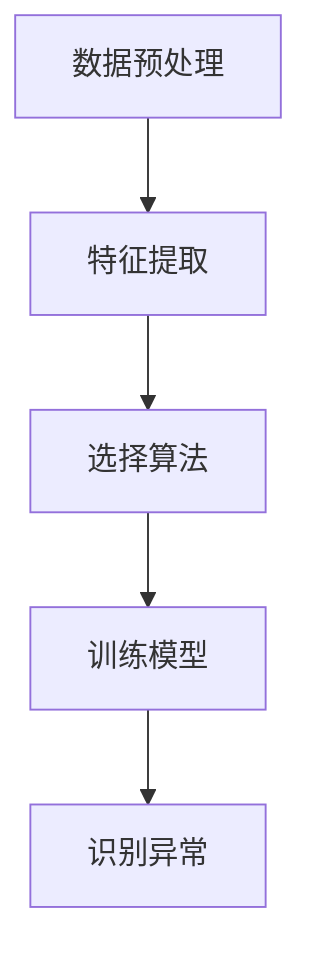
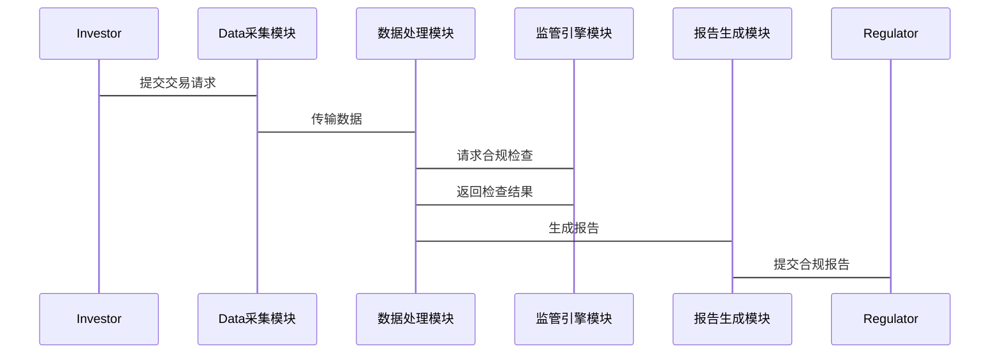

                 


# 特价股票投资中的智能监管合规策略

## 关键词：
特价股票，智能监管，合规策略，投资策略，风险管理，数据挖掘

## 摘要：
本文详细探讨了在特价股票投资中，如何利用智能监管合规策略来确保投资行为的合法性和合规性。文章从背景介绍、核心概念、算法原理、系统架构到项目实战，全面分析了智能监管合规策略在特价股票投资中的应用。通过数学建模、算法实现和系统设计，本文为投资者和监管机构提供了有效的解决方案，帮助他们在复杂多变的市场环境中做出明智的投资决策。

---

## 第一部分：背景介绍

### 第1章：特价股票投资与智能监管合规概述

#### 1.1 特价股票投资的定义与特点
特价股票通常指价格低于市场平均水平的股票，具有高波动性和高风险的特点。投资者希望通过低价买入高价卖出，实现收益最大化。然而，特价股票市场的不确定性较高，监管合规显得尤为重要。

#### 1.2 智能监管合规的背景与意义
随着金融市场的复杂化，监管合规的重要性日益凸显。智能监管合规利用人工智能技术，能够实时监控市场行为，确保投资行为的合法性，减少市场操纵和欺诈行为的发生。

#### 1.3 问题背景与问题描述
特价股票投资中存在以下问题：
- 市场操纵行为难以识别
- 投资者行为缺乏透明度
- 监管规则复杂，合规成本高
智能监管合规的目标是通过技术手段解决这些问题，确保投资行为符合监管要求。

#### 1.4 核心概念与联系
- 核心概念：数据采集、规则匹配、异常检测
- 关键要素：监管规则、投资者行为、市场数据
- 概念联系：通过数据采集获取市场信息，利用规则匹配识别合规性，结合异常检测优化监管策略。

---

## 第二部分：核心概念与联系

### 第2章：智能监管合规的核心原理

#### 2.1 智能监管合规的原理
- 数据采集：收集市场数据和投资者行为数据
- 规则匹配：对比数据与监管规则，识别违规行为
- 异常检测：通过算法发现异常市场行为

#### 2.2 核心概念对比分析
| 概念 | 定义 | 属性 |
|------|------|------|
| 数据采集 | 获取市场数据和行为数据 | 实时性、全面性 |
| 规则匹配 | 对比数据与监管规则 | 精准性、可扩展性 |
| 异常检测 | 发现异常市场行为 | 敏感性、适应性 |

#### 2.3 实体关系图（ER图）
```mermaid
erDiagram
    投资者行为
    {
        id : int
        行为时间 : datetime
        行为类型 : varchar
    }
    市场数据
    {
        stock_id : int
        stock_price : float
        transaction_time : datetime
    }
    监管规则
    {
        rule_id : int
        rule_description : text
        rule_type : varchar
    }
    投资者行为 --> 监管规则 : 遵守
    投资者行为 --> 市场数据 : 影响
```

---

## 第三部分：算法原理讲解

### 第3章：异常检测算法实现

#### 3.1 异常检测算法原理
异常检测用于识别偏离正常市场行为的数据点。常用算法包括基于统计的方法和机器学习方法。

#### 3.2 异常检测流程图


#### 3.3 基于机器学习的异常检测
- 使用Isolation Forest算法，适用于无监督学习。
- Python实现：
  ```python
  from sklearn.ensemble import IsolationForest

  # 数据预处理
  data = ... # 特价股票市场数据

  # 训练模型
  model = IsolationForest(random_state=42)
  model.fit(data)

  # 识别异常
  outliers = model.predict(data)
  ```

#### 3.4 算法数学模型
异常检测模型的数学表示：
$$
y = 1 \text{ if } x \text{ 是异常} \\
y = 0 \text{ 否则}
$$

---

## 第四部分：系统分析与架构设计

### 第4章：智能监管合规系统设计

#### 4.1 问题场景介绍
投资者在特价股票市场中进行高频交易，需要实时监控交易行为，确保符合监管规则。

#### 4.2 系统功能设计
- 数据采集模块：实时收集市场数据和投资者行为数据
- 数据处理模块：清洗和转换数据
- 监管引擎模块：执行规则匹配和异常检测
- 报告生成模块：输出合规报告和异常事件

#### 4.3 系统架构图


#### 4.4 接口设计与交互流程图


---

## 第五部分：项目实战

### 第5章：智能监管合规系统实现

#### 5.1 环境安装
- Python 3.8+
- Scikit-learn、Pandas、Matplotlib

#### 5.2 系统核心实现代码
```python
import pandas as pd
from sklearn.ensemble import IsolationForest

# 数据准备
data = pd.read_csv('market_data.csv')

# 训练异常检测模型
model = IsolationForest(random_state=42)
model.fit(data)

# 识别异常
outliers = model.predict(data)
data['outlier'] = outliers

# 保存结果
data.to_csv('outlier_results.csv', index=False)
```

#### 5.3 代码解读与分析
- 数据准备：读取市场数据
- 模型训练：使用Isolation Forest算法
- 异常识别：标记异常交易行为
- 结果保存：输出异常结果

#### 5.4 实际案例分析
分析某次市场操纵事件，通过模型识别异常交易行为，验证系统的有效性。

---

## 第六部分：最佳实践与小结

### 第6章：最佳实践与总结

#### 6.1 最佳实践
- 数据实时性：确保数据采集的及时性
- 模型更新：定期更新异常检测模型
- 风险控制：结合其他监管手段，如NLP分析

#### 6.2 注意事项
- 数据隐私：保护投资者隐私
- 模型解释性：确保模型结果可解释
- 系统稳定性：保证系统在高负载下的稳定性

#### 6.3 小结
智能监管合规策略为特价股票投资提供了有效的风险管理工具，通过技术手段确保投资行为的合规性，促进市场的健康发展。

---

## 作者：
作者：AI天才研究院/AI Genius Institute  
合作：禅与计算机程序设计艺术/Zen And The Art of Computer Programming

