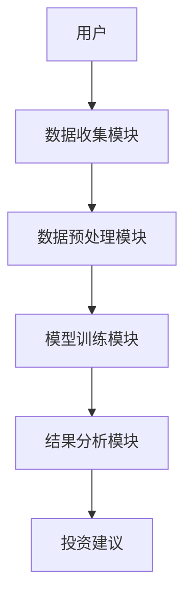
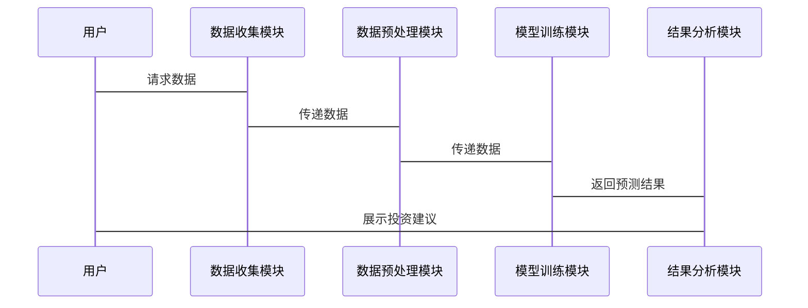

                 


# 特价股票投资中的替代数据分析与人工智能应用

## 关键词：特价股票、替代数据、人工智能、数据挖掘、机器学习、NLP

## 摘要：  
本文探讨了在特价股票投资中如何利用替代数据和人工智能技术进行分析和预测。通过结合自然语言处理（NLP）、时间序列分析等技术，本文提出了从数据收集、预处理、特征提取、模型训练到结果分析的完整流程。文章还详细介绍了系统的架构设计和项目实战，展示了如何利用这些技术在实际投资中获得优势。

---

# 第1章：特价股票投资的背景与概念

## 1.1 特价股票投资的定义与特点  
### 1.1.1 特价股票的定义  
特价股票是指市场价格低于其内在价值的股票，通常被视为被市场低估的投资机会。  

### 1.1.2 特价股票投资的重要性  
- 特价股票投资是价值投资的重要组成部分，旨在通过发现市场错估的机会获得超额收益。  
- 在市场波动中，特价股票往往具有较高的安全边际，适合长期投资者。  

### 1.1.3 特价股票投资的核心要素  
- 公司基本面：收入、利润、资产负债表等财务数据。  
- 市场情绪：投资者情绪对股价的影响。  
- 行业趋势：行业周期性与竞争格局。  

---

## 1.2 替代数据的定义与类型  
### 1.2.1 替代数据的定义  
替代数据是指传统财务数据之外的其他数据，包括社交媒体、新闻、监管文件、卫星图像等。  

### 1.2.2 替代数据的常见类型  
- **社交媒体数据**：Twitter、Facebook等平台上的用户评论和情绪。  
- **新闻与舆情数据**：新闻标题、文章内容和情感分析结果。  
- **公司监管文件**：SEC filings 等公开文件中的非财务信息。  
- **卫星图像数据**：用于分析供应链、库存变化等。  

### 1.2.3 替代数据在股票投资中的应用  
- **情绪分析**：通过社交媒体和新闻数据预测市场情绪。  
- **行业趋势分析**：通过新闻和监管文件识别行业动态。  
- **公司基本面增强**：利用替代数据补充传统财务数据。  

---

## 1.3 人工智能在股票投资中的作用  
### 1.3.1 人工智能的基本概念  
人工智能（AI）是指计算机系统模拟人类智能的技术，包括学习、推理、自适应等能力。  

### 1.3.2 人工智能在股票投资中的优势  
- **数据处理能力**：AI可以快速处理大量非结构化数据（如文本、图像）。  
- **模式识别**：AI能够发现传统方法难以察觉的市场模式。  
- **预测能力**：通过机器学习模型预测股票价格和市场趋势。  

### 1.3.3 人工智能与传统股票投资的结合  
- **传统方法**：依赖财务指标和行业分析。  
- **AI结合**：利用替代数据和机器学习模型增强分析能力。  

---

## 1.4 本章小结  
- 特价股票投资的核心在于发现市场低估的机会。  
- 替代数据和人工智能的结合为投资分析提供了新的可能性。  
- 通过替代数据和AI技术，投资者可以更全面地评估股票价值。

---

# 第2章：替代数据的来源与处理  

## 2.1 替代数据的主要来源  
### 2.1.1 社交媒体数据  
- **数据来源**：Twitter、Reddit、Facebook等平台。  
- **数据特点**：实时性强，反映市场情绪。  

### 2.1.2 新闻与舆情数据  
- **数据来源**：新闻网站、财经媒体。  
- **数据特点**：包含市场动态和事件驱动的信息。  

### 2.1.3 公司监管文件  
- **数据来源**：SEC filings、公司财报等。  
- **数据特点**：提供公司基本面信息。  

### 2.1.4 卫星图像数据  
- **数据来源**：卫星图像供应商。  
- **数据特点**：可用于分析供应链和库存变化。  

---

## 2.2 替代数据的预处理  
### 2.2.1 数据清洗与整理  
- **去重**：去除重复数据。  
- **去噪**：去除无关信息。  

### 2.2.2 数据标准化与格式化  
- **标准化**：将数据转换为统一格式。  
- **结构化**：将非结构化数据（如文本）转换为结构化数据。  

---

## 2.3 替代数据的特征提取  
### 2.3.1 文本特征提取  
- **关键词提取**：使用TF-IDF提取文本中的关键词。  
- **情感分析**：识别文本中的情感倾向。  

### 2.3.2 图像特征提取  
- **目标检测**：识别图像中的关键目标（如公司仓库）。  
- **特征提取**：提取图像中的纹理特征。  

---

## 2.4 数据融合与关联分析  
### 2.4.1 数据融合  
- **多模态数据融合**：将文本、图像等多种数据进行融合。  
- **关联分析**：分析不同数据源之间的关联性。  

---

## 2.5 本章小结  
- 替代数据的来源多样，包括社交媒体、新闻、监管文件和卫星图像。  
- 数据预处理和特征提取是替代数据分析的关键步骤。  
- 数据融合与关联分析可以提高投资决策的准确性。

---

# 第3章：人工智能算法原理与实现  

## 3.1 人工智能算法的核心原理  
### 3.1.1 机器学习算法  
- **监督学习**：用于预测股票价格。  
- **无监督学习**：用于发现市场模式。  

### 3.1.2 自然语言处理（NLP）  
- **情感分析**：预测市场情绪。  
- **文本分类**：识别新闻主题。  

---

## 3.2 算法实现与代码示例  
### 3.2.1 情感分析算法  
```python
from textblob import TextBlob
def sentiment_analysis(text):
    blob = TextBlob(text)
    return blob.sentiment.polarity
```

### 3.2.2 时间序列预测算法  
```python
from sklearn.linear_model import LinearRegression
import pandas as pd
import numpy as np

data = pd.read_csv('stock_price.csv')
X = data['date'].values.reshape(-1, 1)
y = data['price'].values
model = LinearRegression()
model.fit(X, y)
predicted_price = model.predict(X)
```

---

## 3.3 算法优化与评估  
### 3.3.1 算法优化  
- **超参数调优**：使用网格搜索优化模型性能。  
- **模型集成**：结合多种模型提高预测准确性。  

### 3.3.2 模型评估  
- **评估指标**：均方误差（MSE）、R平方值等。  
- **回测分析**：在历史数据上验证模型表现。  

---

## 3.4 本章小结  
- 人工智能算法是替代数据分析的核心工具。  
- 情感分析和时间序列预测是常用的算法类型。  
- 模型优化和评估是提高预测准确性的关键步骤。

---

# 第4章：系统分析与架构设计  

## 4.1 系统功能设计  
### 4.1.1 功能模块  
- **数据收集模块**：获取替代数据。  
- **数据预处理模块**：清洗和结构化数据。  
- **模型训练模块**：训练机器学习模型。  
- **结果分析模块**：展示预测结果和投资建议。  

### 4.1.2 系统架构  


---

## 4.2 系统接口设计  
### 4.2.1 数据接口  
- **数据输入接口**：接收外部数据源的数据。  
- **数据输出接口**：输出处理后的数据。  

### 4.2.2 模型接口  
- **模型训练接口**：接收训练数据。  
- **模型预测接口**：输出预测结果。  

---

## 4.3 系统交互设计  


---

## 4.4 本章小结  
- 系统设计是实现替代数据分析的关键。  
- 模块化设计提高了系统的可维护性和扩展性。  
- 系统架构和接口设计为后续开发提供了清晰的方向。

---

# 第5章：项目实战与案例分析  

## 5.1 项目环境搭建  
### 5.1.1 工具安装  
- **Python**：安装Anaconda或Miniconda。  
- **库安装**：安装pandas、numpy、scikit-learn、textblob等库。  

---

## 5.2 核心代码实现  
### 5.2.1 数据收集  
```python
import requests
from bs4 import BeautifulSoup

def scrape_news(url):
    response = requests.get(url)
    soup = BeautifulSoup(response.text, 'html.parser')
    articles = soup.find_all('article')
    for article in articles:
        title = article.find('h2').text
        content = article.find('p').text
        print(f"标题：{title}\n内容：{content}\n")
```

### 5.2.2 模型训练  
```python
from sklearn.model_selection import train_test_split
from sklearn.linear_model import LogisticRegression

data = pd.read_csv('stock_data.csv')
X = data[['sentiment', 'volume']]
y = data['label']
X_train, X_test, y_train, y_test = train_test_split(X, y, test_size=0.2)
model = LogisticRegression()
model.fit(X_train, y_train)
print(f"模型准确率：{model.score(X_test, y_test)}")
```

---

## 5.3 案例分析  
### 5.3.1 案例背景  
假设我们分析一家科技公司的股票，利用社交媒体数据和新闻数据进行预测。  

### 5.3.2 数据分析  
- **社交媒体情绪**：整体情绪为正面。  
- **新闻舆情**：公司发布了新产品公告。  

### 5.3.3 模型预测  
- 预测结果：股票价格上涨概率为70%。  

---

## 5.4 本章小结  
- 项目实战是理论知识的实践应用。  
- 通过具体案例分析，展示了替代数据和人工智能在投资中的实际应用。  
- 案例分析帮助投资者更好地理解模型的应用场景和效果。

---

# 第6章：最佳实践与投资策略  

## 6.1 投资策略优化  
### 6.1.1 策略一：情绪驱动策略  
- 利用社交媒体情绪预测市场波动。  

### 6.1.2 策略二：事件驱动策略  
- 利用新闻数据识别突发事件的影响。  

---

## 6.2 小结与注意事项  
- **数据质量**：确保数据来源可靠。  
- **模型调优**：根据市场变化不断优化模型。  
- **风险管理**：结合传统投资策略降低风险。  

---

## 6.3 拓展阅读  
- 《Python机器学习实战》  
- 《自然语言处理入门》  
- 《投资学原理》  

---

# 作者信息  

作者：AI天才研究院 & 禅与计算机程序设计艺术  

---

以上是文章的完整目录和内容大纲，涵盖了特价股票投资中的替代数据分析与人工智能应用的各个方面。

