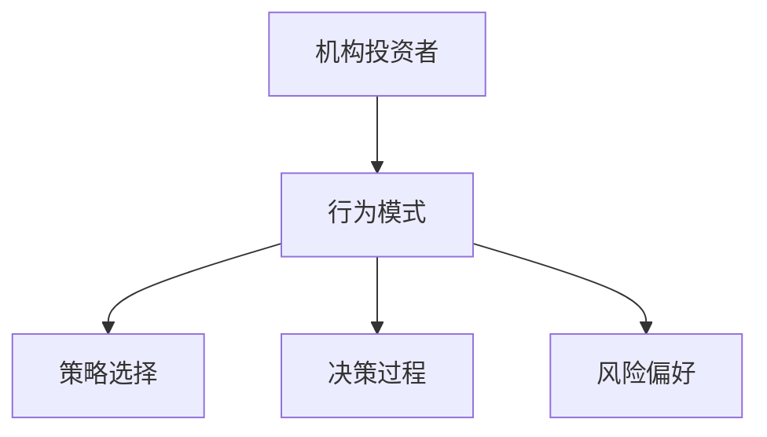
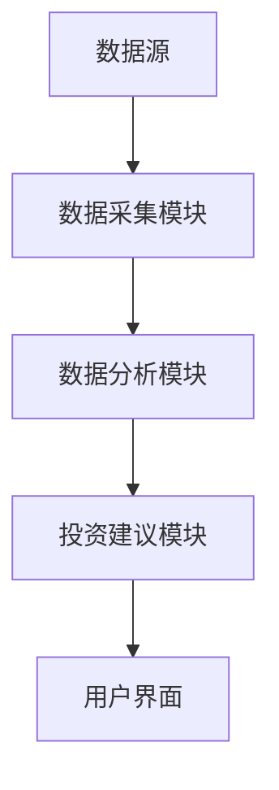
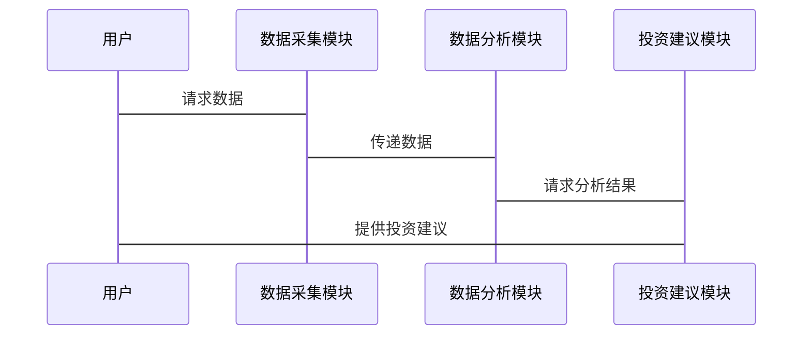

                 


# 特价股票投资中的机构投资者行为分析

## 关键词：特价股票，机构投资者，行为分析，量化分析，投资策略

## 摘要：本文系统分析了特价股票投资中的机构投资者行为，探讨了其投资策略、决策过程和行为特征，结合量化分析方法，揭示了机构投资者行为对市场的影响，并通过实际案例和项目实战，为投资者提供了深入的分析框架和实用的策略建议。

---

# 第1章: 特价股票与机构投资者概述

## 1.1 特价股票的定义与特点

### 1.1.1 特价股票的定义
特价股票通常指价格相对较低的股票，通常被认为具有较高的投资潜力。这些股票可能来自小型公司或处于困境中的企业，但具有较高的增长潜力。

### 1.1.2 特价股票的核心特点
- **低估值**：通常市盈率、市净率等指标低于行业平均水平。
- **高波动性**：价格波动较大，容易受市场情绪影响。
- **高风险**：回报高，但风险也较高。

### 1.1.3 特价股票与普通股票的区别
| 特性 | 特价股票 | 普通股票 |
|------|----------|----------|
| 价格 | 低价     | 中高价   |
| 风险 | 高       | 中等     |
| 潜力 | 高       | 中等     |

## 1.2 机构投资者的定义与类型

### 1.2.1 机构投资者的定义
机构投资者是指通过机构形式进行证券投资的主体，包括基金公司、保险公司、养老基金、券商等。

### 1.2.2 机构投资者的主要类型
- **共同基金**：通过汇集资金投资多种股票。
- **保险公司**：利用保费投资股票市场。
- **养老基金**：为退休人员管理资金。
- **对冲基金**：追求绝对收益。

### 1.2.3 机构投资者在股票市场中的角色
- 提供流动性
- 影响市场价格
- 促进市场有效性

## 1.3 机构投资者行为对市场的影响

### 1.3.1 机构投资者行为对市场流动性的贡献
- 机构投资者通过大量买入和卖出股票，增加了市场的流动性。

### 1.3.2 机构投资者行为对市场波动性的影响
- 集中交易可能导致市场波动加剧。

### 1.3.3 机构投资者行为对市场定价效率的作用
- 机构投资者通过专业分析，提高了市场的定价效率。

## 1.4 本章小结
本章介绍了特价股票和机构投资者的基本概念，并分析了机构投资者行为对市场的影响。

---

# 第2章: 特价股票投资中的机构投资者行为模式

## 2.1 机构投资者的投资策略

### 2.1.1 价值投资策略
- 寻找被市场低估的股票，长期持有。

### 2.1.2 技术分析策略
- 通过技术指标预测股票价格走势。

### 2.1.3 股票筛选策略
- 根据财务指标筛选具备投资潜力的股票。

## 2.2 机构投资者的决策过程

### 2.2.1 信息收集与分析
- 通过基本面分析和市场数据进行决策。

### 2.2.2 投资决策的制定
- 结合市场趋势和公司基本面制定投资策略。

### 2.2.3 投资组合的调整与优化
- 根据市场变化和投资目标调整投资组合。

## 2.3 机构投资者行为的特征分析

### 2.3.1 机构投资者的羊群效应
- 大量机构投资者同时买入或卖出，导致价格波动。

### 2.3.2 机构投资者的逆向投资策略
- 在市场低谷时买入，市场高点时卖出。

### 2.3.3 机构投资者的风险偏好
- 高风险偏好：追求高回报，愿意承担较高风险。
- 低风险偏好：注重稳定收益，避免高风险投资。

## 2.4 本章小结
本章分析了机构投资者在特价股票投资中的行为模式，包括投资策略和决策过程。

---

# 第3章: 机构投资者行为的核心概念与联系

## 3.1 核心概念原理

### 3.1.1 机构投资者行为的核心要素
- 投资目标
- 投资策略
- 风险偏好

### 3.1.2 机构投资者行为的驱动因素
- 市场趋势
- 公司基本面
- 市场情绪

### 3.1.3 机构投资者行为的外部环境
- 经济周期
- 政策环境
- 市场流动性

## 3.2 核心概念属性特征对比表

| 概念 | 特点 | 例子 |
|------|------|------|
| 羊群效应 | 集体行为 | 大量机构同时买入或卖出 |
| 逆向投资 | 投资与市场趋势相反 | 在市场低谷时买入 |
| 风险偏好 | 风险承受能力 | 高风险偏好 vs 低风险偏好 |

## 3.3 ER实体关系图



## 3.4 本章小结
本章通过对比和图表分析，明确了机构投资者行为的核心概念和联系。

---

# 第4章: 机构投资者行为的量化分析方法

## 4.1 量化分析的核心思想
- 利用数学模型和算法进行投资决策。

## 4.2 移动平均线策略

### 4.2.1 算法原理
- 计算股票价格的移动平均值，作为买卖决策的依据。

### 4.2.2 Python实现
```python
import pandas as pd
import numpy as np

def moving_average策略(data, window):
    data['MA'] = data['收盘价'].rolling(window).mean()
    return data

# 示例数据
data = pd.DataFrame({
    '收盘价': [10, 12, 8, 14, 10]
})

window = 3
result = moving_average策略(data, window)
print(result)
```

### 4.2.3 数学模型
$$ MA_n = \frac{1}{n} \sum_{i=1}^{n} P_i $$
其中，$P_i$ 是第i天的价格，$n$ 是窗口大小。

## 4.3 本章小结
本章介绍了量化分析方法，重点讲解了移动平均线策略及其应用。

---

# 第5章: 系统分析与架构设计

## 5.1 系统功能设计

### 5.1.1 领域模型


## 5.2 系统架构设计

### 5.2.1 架构图


## 5.3 系统接口设计
- 数据接口：从数据库获取股票数据。
- 分析接口：调用量化分析模块。

## 5.4 系统交互流程

### 5.4.1 交互流程图


## 5.5 本章小结
本章详细设计了分析机构投资者行为的系统架构和交互流程。

---

# 第6章: 项目实战与案例分析

## 6.1 项目实战

### 6.1.1 环境安装
- 安装Python和相关库（pandas、numpy、matplotlib）。

### 6.1.2 核心代码实现
```python
import pandas as pd
import matplotlib.pyplot as plt

# 数据加载
data = pd.read_csv('stock_data.csv')

# 计算移动平均线
data['MA5'] = data['收盘价'].rolling(5).mean()

# 绘制图表
plt.figure(figsize=(10, 6))
plt.plot(data['收盘价'], label='收盘价')
plt.plot(data['MA5'], label='MA5')
plt.legend()
plt.show()
```

### 6.1.3 代码解读与分析
- 加载数据
- 计算移动平均线
- 绘制价格走势和移动平均线图表

## 6.2 案例分析

### 6.2.1 案例背景
- 某特价股票的历史数据。

### 6.2.2 分析过程
- 使用移动平均线策略分析买入和卖出时机。

### 6.2.3 结果解读
- 根据移动平均线信号，做出买卖决策。

## 6.3 本章小结
本章通过项目实战和案例分析，展示了如何利用量化方法分析机构投资者行为。

---

# 第7章: 最佳实践与注意事项

## 7.1 最佳实践
- 数据来源要可靠。
- 模型要结合实际市场情况。
- 定期调整投资策略。

## 7.2 注意事项
- 风险控制至关重要。
- 避免过度依赖单一策略。
- 定期评估模型表现。

## 7.3 本章小结
本章总结了分析机构投资者行为的最佳实践和注意事项。

---

# 作者：AI天才研究院/AI Genius Institute & 禅与计算机程序设计艺术 /Zen And The Art of Computer Programming

---

**本文通过系统分析和详细讲解，为读者提供了关于特价股票投资中的机构投资者行为的深入洞察，结合量化分析和实际案例，为投资者提供了实用的策略建议。**

