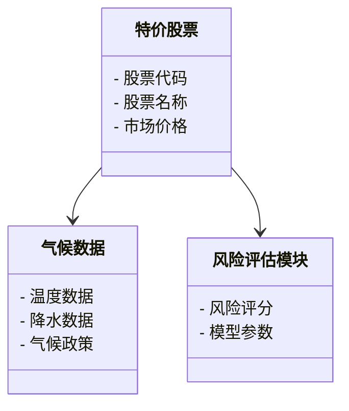
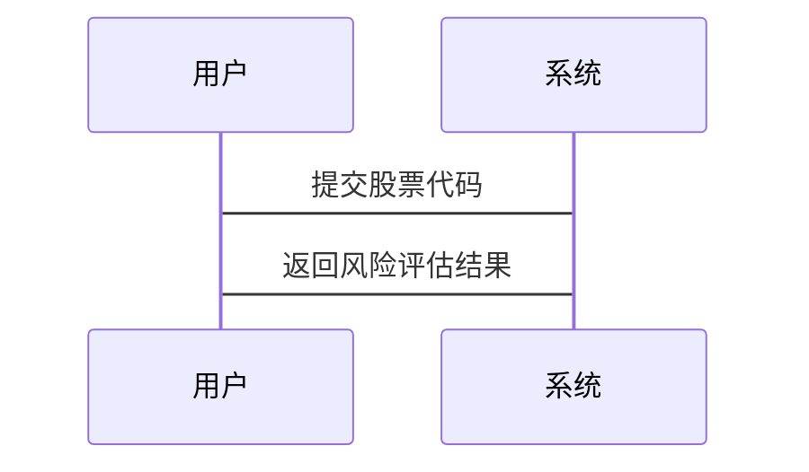

                 


# 特价股票投资中的气候变化风险评估

## 关键词：特价股票，气候变化风险，投资评估，金融模型，风险管理

## 摘要：  
随着全球气候变化的加剧，气候变化对金融市场的影响日益显著。特价股票作为一种特殊的股票投资形式，其价格波动往往与市场环境密切相关。本文将详细分析气候变化如何影响特价股票投资，探讨如何构建有效的气候变化风险评估模型，为投资者提供科学的决策支持。

---

## 第一部分：背景介绍

### 第1章：气候变化与金融市场的关系

#### 1.1 气候变化的定义与特征
- 气候变化的长期性和全球性特点
- 气候变化对经济活动的多方面影响

#### 1.2 金融市场中的气候变化风险
- 气候变化对上市公司盈利能力的影响
- 气候政策变化对股票价格的影响

#### 1.3 特价股票的定义与特点
- 特价股票的定义与分类
- 特价股票与普通股票的主要区别

### 第2章：气候变化对特价股票投资的具体影响

#### 2.1 气候变化对特价股票的直接风险
- 气候政策变化对特价股票的影响
- 行业结构调整对特价股票的影响

#### 2.2 气候变化对特价股票的间接风险
- 供应链中断对特价股票的影响
- 消费者行为变化对特价股票的影响

#### 2.3 气候变化风险的传播机制
- 风险的从上至下和从下至上的传播路径
- 风险在不同行业和地区的传导差异

---

## 第二部分：气候变化风险评估的核心概念

### 第3章：气候变化风险评估的基本原理

#### 3.1 风险评估的基本框架
- 风险识别、量化和管理的三步法

#### 3.2 风险评估的主要方法
- 情景分析法、蒙特卡洛模拟法、回归分析法

#### 3.3 风险评估的关键指标
- 市场波动性、公司敏感性、政策依赖性

### 第4章：气候变化风险的属性特征分析

#### 4.1 风险的分类与对比
- 气候变化风险与市场风险、信用风险的对比
- 不同行业中的气候变化风险特征

#### 4.2 风险的量化与度量
- 常用的风险度量指标及其计算方法

#### 4.3 风险的动态变化特征
- 时间维度上的风险变化规律
- 地区和行业的风险差异性

### 第5章：ER实体关系图架构

#### 5.1 实体关系图的基本结构
- 主体、客体、事件三要素的定义与关系

#### 5.2 实体关系图的分析工具
- 使用工具如ER/Modeler进行建模

#### 5.3 实体关系图的应用场景
- 数据库设计、风险评估模型构建中的应用

---

## 第三部分：气候变化风险评估的算法原理

### 第6章：算法原理概述

#### 6.1 情景分析法
- 情景构建的步骤与方法
- 情景分析法的优缺点

#### 6.2 蒙特卡洛模拟法
- 模拟过程的详细步骤
- 模拟结果的解读方法

#### 6.3 回归分析法
- 回归模型的构建与应用
- 模型的适用性和限制性

### 第7章：算法实现代码

#### 7.1 情景分析法的Python实现
```python
import numpy as np
import pandas as pd

def scenario_analysis(stock_data, scenarios):
    results = []
    for scenario in scenarios:
        adjusted_data = stock_data * (1 + scenario)
        results.append(adjusted_data.mean())
    return results
```

#### 7.2 蒙特卡洛模拟法的Python实现
```python
import numpy as np
import matplotlib.pyplot as plt

def monte_carlo_simulation(stock_data, iterations=1000):
    np.random.seed(42)
    simulated_prices = []
    for _ in range(iterations):
        drift = stock_data.mean()
        volatility = stock_data.std()
        sim_prices = drift + np.random.normal(0, volatility, len(stock_data))
        simulated_prices.append(sim_prices)
    return simulated_prices
```

#### 7.3 回归分析法的Python实现
```python
import statsmodels.api as sm

def regression_analysis(stock_data, predictor_vars):
    model = sm.OLS(stock_data, predictor_vars).fit()
    return model.summary()
```

### 第8章：数学模型与公式解析

#### 8.1 情景分析模型
$$ P_{final} = P_{initial} \times (1 + \text{情景调整因子}) $$

#### 8.2 蒙特卡洛模拟模型
$$ P_{t} = P_{t-1} + \mu + \sigma \times \epsilon $$

#### 8.3 回归分析模型
$$ Y = \beta_0 + \beta_1 X + \epsilon $$

---

## 第四部分：系统分析与架构设计

### 第9章：系统功能设计

#### 9.1 问题场景介绍
- 气候变化风险评估系统的建设目标
- 系统的用户群体与功能需求

#### 9.2 领域模型设计


#### 9.3 系统架构设计


### 第10章：系统接口与交互设计

#### 10.1 系统接口设计
- API接口的定义与调用方法
- 数据输入输出格式的规范

#### 10.2 系统交互流程


---

## 第五部分：项目实战与应用

### 第11章：项目实战

#### 11.1 环境安装与配置
- Python环境的搭建
- 相关库的安装（如numpy、pandas、statsmodels）

#### 11.2 核心代码实现
- 数据清洗与预处理
- 风险评估模型的实现
- 结果的可视化与解读

#### 11.3 案例分析与解读
- 具体案例的分析过程
- 结果的解读与策略建议

### 第12章：项目小结

#### 12.1 实战经验总结
- 项目实施中的关键点
- 需要注意的问题与解决方案

#### 12.2 模型优化建议
- 如何提高模型的准确性
- 可能的未来改进方向

---

## 第六部分：最佳实践与总结

### 第13章：最佳实践

#### 13.1 风险管理策略
- 如何有效降低气候变化风险
- 投资组合优化的建议

#### 13.2 模型应用中的注意事项
- 数据质量的重要性
- 模型假设的合理性

### 第14章：小结与展望

#### 14.1 本文总结
- 主要内容回顾
- 创新点与不足之处

#### 14.2 未来研究方向
- 更复杂的气候变化模型
- 多因素综合评估方法

---

## 结语

气候变化作为全球性问题，对金融市场的影响日益显著。通过本文的分析，投资者可以更好地理解气候变化对特价股票投资的影响，并利用气候变化风险评估模型做出更科学的投资决策。未来，随着气候变化问题的加剧，相关的研究与实践将更加重要。

---

## 作者：AI天才研究院 & 禅与计算机程序设计艺术

