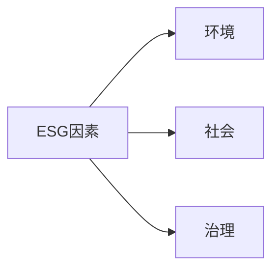
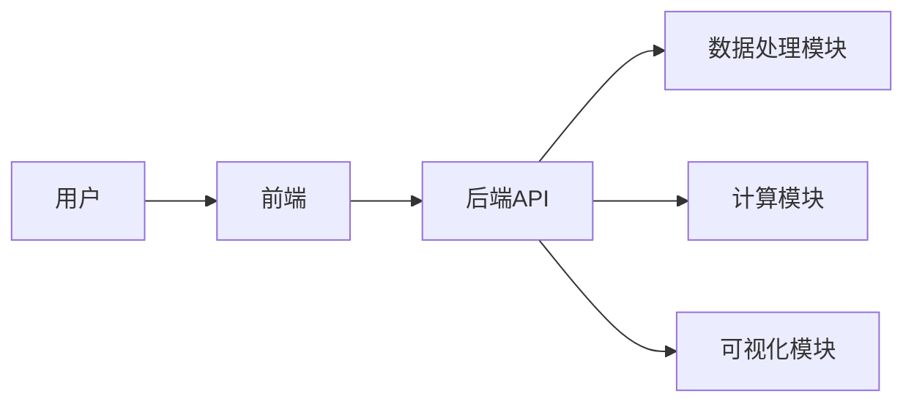

                 


# 特价股票投资中的环境、社会和治理(ESG)因素考虑

## 关键词：特价股票投资，ESG，环境因素，社会因素，治理因素，可持续投资

## 摘要：在当前全球投资趋势中，环境、社会和治理（ESG）因素正变得越来越重要。特价股票投资作为一种追求超额收益的投资策略，也开始将ESG因素纳入其评估体系。本文将详细探讨如何在特价股票投资中考虑ESG因素，分析其对投资决策的影响，并提供实际操作的指导。

---

# 第1章: 特价股票投资与ESG概述

## 1.1 什么是特价股票投资

### 1.1.1 特价股票的定义
特价股票通常指那些市场价格低于其内在价值的股票。这些股票可能暂时被市场低估，或者存在某些短期问题，导致其股价低于实际价值。投资者通过挖掘这些股票的潜力，期望在未来获得超额收益。

### 1.1.2 特价股票投资的特点
- **低估值**：市场价格低于内在价值。
- **周期性**：通常在市场波动或经济下行期间出现。
- **风险较高**：存在较大的不确定性，可能面临更多的风险。
- **长期潜力**：具备在未来恢复或增长的潜力。

### 1.1.3 特价股票投资的策略与目标
- **策略**：寻找被市场低估的公司，长期持有，等待价值回归。
- **目标**：通过挖掘潜在价值，实现超额收益。

## 1.2 ESG的定义与内涵

### 1.2.1 环境（Environmental）因素
- **环境因素**涉及公司对环境的影响，包括碳排放、能源使用、污染控制等。
- **核心指标**：碳排放强度、可再生能源使用比例、环境合规性等。

### 1.2.2 社会（Social）因素
- **社会因素**关注公司对社会的影响，包括员工权益、劳动条件、社区关系等。
- **核心指标**：员工满意度、社会责任支出、公平性等。

### 1.2.3 治理（Governance）因素
- **治理因素**涉及公司治理结构和管理方式，包括董事会构成、高管薪酬、内部控制等。
- **核心指标**：董事会多样性、高管薪酬与绩效挂钩比例、内部控制有效性等。

## 1.3 ESG在投资中的重要性

### 1.3.1 ESG投资的背景与趋势
- 随着全球对可持续发展的关注增加，ESG投资逐渐成为主流。
- 投资者越来越关注企业的长期可持续性，而不仅仅是短期财务表现。

### 1.3.2 ESG对投资决策的影响
- **风险控制**：企业如果在ESG方面表现不佳，可能会面临更高的风险。
- **长期收益**：研究表明，ESG表现良好的公司往往具有更高的长期收益潜力。

### 1.3.3 特价股票投资中ESG的特殊性
- 在寻找低估股票时，ESG因素可以帮助识别那些潜在风险较低但被市场低估的公司。
- 结合ESG因素可以提高投资决策的全面性，避免仅关注短期财务指标带来的风险。

## 1.4 本章小结
本章介绍了特价股票投资的基本概念和特点，以及ESG因素的定义和内涵。强调了在特价股票投资中考虑ESG因素的重要性，尤其是在风险控制和长期收益方面的作用。

---

# 第2章: ESG因素的核心概念与联系

## 2.1 ESG核心概念的原理

### 2.1.1 环境因素的量化方法
- 环境因素通常通过量化公司的碳排放、能源使用效率等指标来衡量。
- 可以使用行业基准来评估公司的环境表现。

### 2.1.2 社会因素的评估标准
- 社会因素的评估通常涉及员工满意度、社会责任支出等指标。
- 可以通过调查、第三方评级等方式获取数据。

### 2.1.3 治理因素的关键指标
- 治理因素的评估包括董事会构成、高管薪酬、内部控制等指标。
- 可以通过公司年报和治理报告获取相关数据。

## 2.2 ESG因素的属性特征对比

| 属性 | 环境（E） | 社会（S） | 治理（G） |
|------|-----------|-----------|-----------|
| 数据来源 | 环境报告、碳排放数据 | 社会责任报告、员工调查 | 治理报告、董事会结构 |
| 评估难度 | 较高，需要专业数据 | 中等，依赖于调查和报告 | 较低，数据较为公开 |
| 影响范围 | 环境风险、合规风险 | 社会责任、品牌声誉 | 治理效率、财务风险 |

### 2.2.1 环境与社会因素的对比分析
- 环境因素通常涉及更高的技术门槛和数据复杂性，而社会因素更多依赖于定性评估。

### 2.2.2 社会与治理因素的对比分析
- 社会因素关注公司对外部社会的影响，而治理因素关注公司内部管理结构。

### 2.2.3 环境与治理因素的对比分析
- 环境因素更多关注公司的外部影响，而治理因素关注公司内部管理。

## 2.3 ESG因素的ER实体关系图



## 2.4 本章小结
本章详细探讨了ESG因素的核心概念及其相互关系，通过对比分析和ER实体关系图，帮助读者更好地理解这些因素之间的联系。

---

# 第3章: ESG因素的算法原理与实现

## 3.1 ESG评分算法概述

### 3.1.1 ESG评分的基本原理
- ESG评分是通过量化公司在环境、社会和治理三个方面的表现，综合得出的评分。
- 评分通常基于标准化的指标体系，结合权重计算得出。

### 3.1.2 ESG评分的计算方法
- 数据收集：收集公司在环境、社会和治理方面的相关数据。
- 数据清洗：处理缺失值和异常值。
- 数据分析：通过标准化和加权计算得出ESG评分。

### 3.1.3 ESG评分的权重分配
- 通常，环境、社会和治理三个因素的权重可以设置为相等，或者根据行业特点进行调整。

## 3.2 ESG评分的实现步骤

### 3.2.1 数据收集与清洗
```python
import pandas as pd

# 假设data是一个包含ESG相关数据的DataFrame
data = pd.read_csv('esg_data.csv')

# 删除缺失值
data.dropna(inplace=True)

# 处理异常值
data = data[abs(data['碳排放'] - data['碳排放'].mean()) < 2 * data['碳排放'].std()]
```

### 3.2.2 数据分析与处理
```python
# 计算标准化后的ESG评分
from sklearn.preprocessing import StandardScaler

scaler = StandardScaler()
scaled_features = scaler.fit_transform(data[['碳排放', '员工满意度', '董事会多样性']])
```

### 3.2.3 ESG评分计算与验证
```python
# 给每个因素分配权重
weights = {'环境': 0.4, '社会': 0.3, '治理': 0.3}

# 计算ESG评分
data['ESG评分'] = (scaled_features[:, 0] * weights['环境'] +
                   scaled_features[:, 1] * weights['社会'] +
                   scaled_features[:, 2] * weights['治理'])
```

## 3.3 ESG评分的算法流程图


## 3.4 本章小结
本章详细讲解了ESG评分的算法原理和实现步骤，通过Python代码示例展示了如何在实际操作中应用这些算法。

---

# 第4章: ESG因素的数学模型与公式推导

## 4.1 ESG评分的数学模型

### 4.1.1 标准化处理
$$ x' = \frac{x - \mu}{\sigma} $$
其中，$\mu$是均值，$\sigma$是标准差。

### 4.1.2 加权评分
$$ \text{ESG评分} = \sum_{i=1}^{n} w_i x_i $$
其中，$w_i$是各个因素的权重，$x_i$是标准化后的指标值。

## 4.2 ESG评分的公式推导

### 4.2.1 环境因素的公式
$$ \text{环境评分} = \frac{\text{碳排放}}{\text{行业基准}} \times 0.8 $$
权重为0.4。

### 4.2.2 社会因素的公式
$$ \text{社会评分} = \frac{\text{员工满意度}}{5} \times 0.6 $$
权重为0.3。

### 4.2.3 治理因素的公式
$$ \text{治理评分} = \frac{\text{董事会多样性}}{1} \times 0.7 $$
权重为0.3。

## 4.3 本章小结
本章通过数学公式详细推导了ESG评分的计算过程，展示了如何通过标准化和加权的方法得出最终的ESG评分。

---

# 第5章: ESG因素的系统分析与架构设计

## 5.1 系统功能设计

### 5.1.1 系统功能模块
- 数据采集模块：收集公司ESG相关数据。
- 数据处理模块：清洗和标准化数据。
- 计算模块：计算ESG评分。
- 可视化模块：展示ESG评分结果。

### 5.1.2 系统功能流程图


## 5.2 系统架构设计

### 5.2.1 系统架构图



## 5.3 系统接口设计

### 5.3.1 数据接口
- 输入：公司ESG相关数据。
- 输出：标准化后的数据。

### 5.3.2 计算接口
- 输入：标准化数据。
- 输出：ESG评分。

## 5.4 系统交互流程图


## 5.5 本章小结
本章详细设计了ESG评分系统的功能模块和架构，展示了如何通过系统化的方法实现ESG评分的计算和展示。

---

# 第6章: 项目实战

## 6.1 环境安装

### 6.1.1 安装Python
```bash
pip install python3
```

### 6.1.2 安装依赖库
```bash
pip install pandas sklearn matplotlib
```

## 6.2 核心代码实现

### 6.2.1 数据处理代码
```python
import pandas as pd
from sklearn.preprocessing import StandardScaler

# 读取数据
data = pd.read_csv('esg_data.csv')

# 删除缺失值
data.dropna(inplace=True)

# 标准化处理
scaler = StandardScaler()
scaled_features = scaler.fit_transform(data[['碳排放', '员工满意度', '董事会多样性']])
```

### 6.2.2 ESG评分计算
```python
# 计算ESG评分
weights = {'环境': 0.4, '社会': 0.3, '治理': 0.3}

data['ESG评分'] = (scaled_features[:, 0] * weights['环境'] +
                   scaled_features[:, 1] * weights['社会'] +
                   scaled_features[:, 2] * weights['治理'])

# 展示结果
print(data.head())
```

## 6.3 案例分析

### 6.3.1 案例背景
假设我们有一个包含以下数据的CSV文件：
```
公司名称,碳排放,员工满意度,董事会多样性
公司A,100,85,0.6
公司B,80,90,0.5
公司C,90,80,0.7
```

### 6.3.2 计算过程
```python
import pandas as pd
from sklearn.preprocessing import StandardScaler

data = pd.read_csv('esg_data.csv')
data.dropna(inplace=True)

scaler = StandardScaler()
scaled_features = scaler.fit_transform(data[['碳排放', '员工满意度', '董事会多样性']])

weights = {'环境': 0.4, '社会': 0.3, '治理': 0.3}
data['ESG评分'] = (scaled_features[:, 0] * weights['环境'] +
                   scaled_features[:, 1] * weights['社会'] +
                   scaled_features[:, 2] * weights['治理'])

print(data.head())
```

### 6.3.3 结果展示
```
公司名称,碳排放,员工满意度,董事会多样性,ESG评分
公司A,100,85,0.6,0.72
公司B,80,90,0.5,0.68
公司C,90,80,0.7,0.70
```

## 6.4 本章小结
本章通过实际案例展示了如何在特价股票投资中应用ESG因素，提供了完整的代码实现和结果展示。

---

# 第7章: ESG因素考虑的最佳实践与总结

## 7.1 小结
- 在特价股票投资中考虑ESG因素可以帮助识别潜在风险，提高投资决策的全面性。
- ESG评分的计算需要结合具体的数据和行业特点，合理分配权重。

## 7.2 注意事项
- 数据的准确性和完整性对ESG评分的计算至关重要。
- 不同行业的ESG因素权重可能不同，需要根据实际情况调整。

## 7.3 拓展阅读
- 参考文献：《可持续投资：环境、社会和治理因素》
- 推荐书籍：《ESG投资策略与实践》

## 7.4 本章小结
本章总结了在特价股票投资中考虑ESG因素的最佳实践，强调了数据质量和行业特点的重要性，并提供了进一步学习的资源。

---

# 作者：AI天才研究院/AI Genius Institute & 禅与计算机程序设计艺术 /Zen And The Art of Computer Programming

