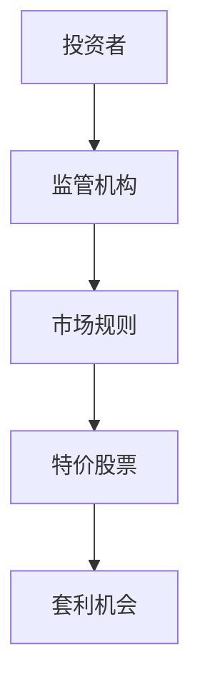
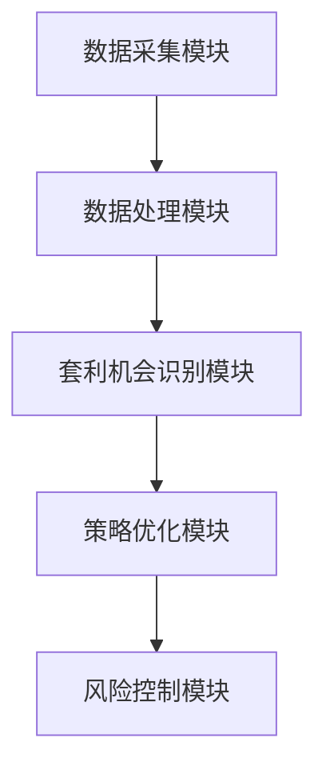

                 

# 特价股票投资中的监管套利策略

## 关键词

- 特价股票
- 监管套利
- 投资策略
- 数学模型
- 交易系统

## 摘要

本文深入探讨了特价股票投资中的监管套利策略，从背景介绍、核心概念、算法原理、系统设计到项目实战，全面解析了监管套利在特价股票投资中的应用。通过详细的数学模型和系统架构设计，展示了如何利用监管差异进行套利，同时分析了相关的风险和法律合规问题，为投资者提供了实用的建议和最佳实践。

---

# 第一部分: 特价股票投资中的监管套利策略概述

## 第1章: 特价股票与监管套利的背景介绍

### 1.1 特价股票的基本概念

#### 1.1.1 特价股票的定义
特价股票是指市场价格低于面值的股票。这种股票通常出现在市场流动性不足、公司财务状况不佳或市场情绪低迷的情况下。

#### 1.1.2 特价股票的分类与特点
特价股票可以分为以下几类：
1. **普通特价股票**：市场价低于面值，但无特别限制。
2. **优先特价股票**：具有优先权的特价股票。
3. **可转换特价股票**：可以转换为其他类型股票的特价股票。

#### 1.1.3 特价股票的市场背景与现状
当前市场中，特价股票的出现往往与公司财务问题、市场波动或监管政策变化有关。投资者需要关注市场动态和公司基本面，以抓住特价股票的投资机会。

### 1.2 监管套利的定义与原理

#### 1.2.1 监管套利的定义
监管套利是指利用不同市场或地区的监管差异，通过合法或半合法的方式进行投资或交易，以获取超额收益。

#### 1.2.2 监管套利的基本原理
监管套利的核心在于利用监管规则的差异，通过跨市场或跨产品操作，捕捉价格差异或政策漏洞。

#### 1.2.3 监管套利的合法边界与风险
监管套利的合法性取决于具体操作方式和监管机构的界定。投资者需注意法律风险和市场波动带来的潜在损失。

---

## 第2章: 特价股票投资中的监管套利策略

### 2.1 监管套利在特价股票中的应用

#### 2.1.1 特价股票市场的监管框架
特价股票市场受到严格的监管，包括价格波动限制、信息披露要求和交易权限管理。

#### 2.1.2 监管套利在特价股票中的具体表现
投资者可能通过以下方式利用监管套利：
1. **跨市场套利**：利用不同市场的价格差异。
2. **政策套利**：利用政策变化带来的价格波动。
3. **结构化套利**：通过复杂金融工具进行套利。

#### 2.1.3 监管套利的可行性与风险分析
监管套利的可行性取决于市场环境和监管政策，同时需考虑流动性风险、政策风险和市场波动风险。

### 2.2 监管套利的核心概念与联系

#### 2.2.1 监管套利的核心概念原理
监管套利的核心在于识别和利用监管差异，通过价格差异获取利润。

#### 2.2.2 监管套利与传统投资策略的对比
| 对比维度 | 监管套利 | 传统投资策略 |
|----------|----------|--------------|
| 核心目标 | 利用监管差异获利 | 追求长期资本增值 |
| 风险特征 | 高风险，依赖监管环境 | 中低风险，注重基本面分析 |

#### 2.2.3 监管套利的ER实体关系图

---

## 第3章: 特价股票投资中的监管套利算法原理

### 3.1 监管套利算法的核心原理

#### 3.1.1 套利机会的识别算法
套利机会的识别基于价格差异和市场流动性。算法流程如下：
1. 数据采集：获取不同市场的股票价格。
2. 价格差异计算：计算跨市场或跨产品的价格差异。
3. 流动性评估：判断是否存在足够的交易量。

#### 3.1.2 套利策略的优化算法
套利策略优化算法旨在最大化收益并最小化风险。优化过程包括：
1. 目标函数设计：最大化套利收益。
2. 约束条件设定：考虑市场流动性、交易成本和监管限制。
3. 算法实现：使用遗传算法或模拟退火算法进行优化。

#### 3.1.3 套利风险的评估算法
套利风险评估基于波动率、相关性和市场深度。公式如下：
$$ \text{风险} = \frac{\text{波动率} \times \text{相关性}}{\text{市场深度}} $$

### 3.2 监管套利算法的数学模型

#### 3.2.1 套利机会识别的数学公式
套利机会的识别公式为：
$$ \text{套利机会} = \max(P_{\text{市场}} - P_{\text{理论}}, 0) $$

#### 3.2.2 套利风险评估的数学公式
套利风险的评估公式为：
$$ \text{风险} = \frac{\text{波动率} \times \text{交易量}}{\text{市场深度}} $$

### 3.3 监管套利算法的实现流程

#### 3.3.1 数据采集与预处理
数据采集包括从不同市场获取股票价格和交易量数据。预处理步骤包括数据清洗和标准化。

#### 3.3.2 套利机会识别
套利机会识别通过计算跨市场的价格差异，判断是否存在套利空间。

#### 3.3.3 策略优化与风险控制
策略优化通过算法调整目标函数，风险控制通过设定止损和止盈点。

---

## 第4章: 特价股票投资中的监管套利系统设计

### 4.1 系统分析与架构设计

#### 4.1.1 系统功能模块划分
系统功能模块包括：
1. 数据采集模块：采集不同市场的股票数据。
2. 数据处理模块：清洗和标准化数据。
3. 套利机会识别模块：识别套利机会。
4. 策略优化模块：优化套利策略。
5. 风险控制模块：评估和控制风险。

#### 4.1.2 系统架构图

### 4.2 系统接口设计与交互流程

#### 4.2.1 系统接口设计
系统接口包括：
1. 数据接口：数据采集模块与外部数据源的接口。
2. 策略接口：策略优化模块与外部交易平台的接口。
3. 风险接口：风险控制模块与外部监控系统的接口。

#### 4.2.2 系统交互流程图

---

## 第5章: 特价股票投资中的监管套利项目实战

### 5.1 项目背景与目标
项目旨在通过监管套利策略，利用跨市场的价格差异，实现投资收益最大化。

### 5.2 项目核心实现

#### 5.2.1 数据采集与处理
使用Python编写数据采集脚本，从不同市场获取股票数据，并进行清洗和标准化。

#### 5.2.2 套利机会识别
通过编写算法，识别跨市场的套利机会，并计算价格差异和交易成本。

#### 5.2.3 策略优化与执行
优化套利策略，考虑市场深度和流动性，制定交易计划并执行交易。

### 5.3 项目小结
通过实战项目，验证了监管套利策略的有效性和可行性，同时积累了丰富的实战经验。

---

## 第6章: 特价股票投资中的监管套利风险管理与合规

### 6.1 监管套利的风险管理

#### 6.1.1 风险来源与特征
监管套利的风险来源包括政策风险、市场风险和操作风险。

#### 6.1.2 风险控制策略
1. 设置止损点：避免重大损失。
2. 分散投资：降低单一投资的风险。
3. 监测政策变化：及时调整投资策略。

### 6.2 监管套利的法律合规

#### 6.2.1 监管套利的法律框架
投资者需遵守相关法律法规，避免触犯市场操纵等违法行为。

#### 6.2.2 监管套利的合规建议
1. 了解相关法律法规。
2. 遵守市场规则和交易规范。
3. 建立合规的交易机制。

---

## 第7章: 特价股票投资中的监管套利最佳实践与总结

### 7.1 监管套利的最佳实践

#### 7.1.1 投资者建议
1. 保持对市场的敏感性，及时捕捉套利机会。
2. 合规操作，避免触犯法律。
3. 优化投资策略，提高套利效率。

#### 7.1.2 未来研究方向
1. 人工智能在监管套利中的应用。
2. 监管套利与量化交易的结合。
3. 全球化背景下的跨市场套利策略。

### 7.2 监管套利的总结与展望
监管套利在特价股票投资中具有重要意义，但需注意风险和合规性。未来，随着技术的发展，监管套利策略将更加智能化和高效化。

---

## 作者：AI天才研究院/AI Genius Institute & 禅与计算机程序设计艺术 /Zen And The Art of Computer Programming

---

# END

