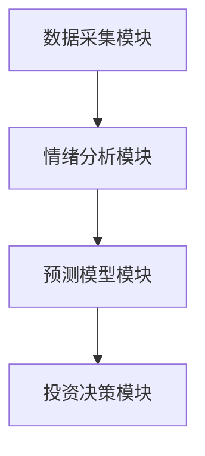

                 


# 特价股票投资中的社交媒体情绪动态分析与应用

> 关键词：特价股票投资，社交媒体情绪分析，自然语言处理，机器学习，深度学习

> 摘要：本文探讨了如何利用社交媒体上的情绪数据来辅助特价股票投资决策。通过分析社交媒体上的文本数据，结合自然语言处理和机器学习技术，构建情绪分析模型，评估市场情绪，从而优化投资策略。文章详细介绍了情绪分析的算法原理、系统架构设计以及实际应用案例，为投资者提供了一种新的决策工具。

---

## 第1章: 特价股票投资与社交媒体情绪分析的背景介绍

### 1.1 特价股票投资的背景与现状
#### 1.1.1 特价股票的定义与特点
- 特价股票是指价格低于其内在价值的股票，通常具有较高的增长潜力。
- 特点包括低估值、高成长性和高波动性。

#### 1.1.2 特价股票投资的现状与挑战
- 投资者在选择特价股票时面临信息不对称、市场波动大等问题。
- 情绪分析可以帮助投资者捕捉市场情绪变化，优化投资决策。

#### 1.1.3 社会媒体在股票投资中的作用
- 社会媒体成为投资者获取信息和交流观点的重要渠道。
- 社会媒体上的情绪数据可以反映市场参与者的看法，影响股价走势。

### 1.2 社会媒体情绪分析的背景与应用
#### 1.2.1 情绪分析的定义与分类
- 情绪分析是对文本数据进行情感倾向性分析的技术。
- 分类包括正面、负面和中性情绪。

#### 1.2.2 情绪分析的技术发展
- 从基于规则的传统方法到深度学习模型的进步。
- 当前主流模型包括LSTM和Transformer架构。

#### 1.2.3 情绪分析在金融领域的应用
- 帮助投资者识别市场情绪，预测股价走势。
- 用于风险评估和投资组合优化。

### 1.3 特价股票投资与社交媒体情绪分析的结合
#### 1.3.1 情绪驱动因素
- 投资者情绪是影响股价的重要因素。
- 社会媒体上的讨论可以揭示市场情绪的变化。

#### 1.3.2 情绪对股价的影响
- 情绪波动可能导致股价短期波动。
- 情绪分析可以帮助投资者捕捉市场拐点。

#### 1.3.3 本章小结
- 特价股票投资与社交媒体情绪分析的结合是当前研究的热点。
- 情绪分析技术为投资者提供了新的决策工具。

---

## 第2章: 社会媒体情绪动态分析的核心概念与联系

### 2.1 情绪分析的基本原理
#### 2.1.1 情绪分析的定义与分类
- 情绪分析是对文本数据进行情感倾向性分析的技术。
- 分类包括正面、负面和中性情绪。

#### 2.1.2 情绪分析的核心要素
- 文本数据、情绪标签、分析算法。
- 数据预处理、特征提取和模型训练是关键步骤。

#### 2.1.3 情绪分析与股票投资的关系
- 情绪分析可以帮助投资者识别市场情绪，预测股价走势。
- 情绪数据可以作为投资决策的辅助工具。

### 2.2 社会媒体数据的特征与属性
#### 2.2.1 数据的多样性
- 文本数据包括评论、帖子和消息等多种形式。
- 数据来源广泛，包括社交媒体平台和新闻网站。

#### 2.2.2 情感数据的特征分析
- 情感强度：文本表达的情绪强度。
- 情感类别：正面、负面或中性情绪。
- 情感一致性：文本内容的一致性程度。

#### 2.2.3 数据特征与股票情绪的关系
- 情感强度高的文本可能对股价影响较大。
- 情感一致性高的文本可能更准确地反映市场情绪。

### 2.3 情绪分析的核心算法与模型
#### 2.3.1 基于文本挖掘的情绪分析
- 使用关键词提取和情感词典进行初步分析。
- 适用于简单的文本情绪分类。

#### 2.3.2 基于机器学习的情绪分类算法
- 朴素贝叶斯算法：适用于小规模数据。
- 支持向量机算法：适合高维数据。
- 随机森林算法：适用于特征较多的情况。

#### 2.3.3 基于深度学习的情绪分析模型
- RNN模型：适用于序列数据。
- LSTM模型：适合处理长序列数据。
- Transformer模型：目前性能最优的模型。

### 2.4 情绪分析的实体关系图
#### 2.4.1 实体关系图的构建
- 包括文本数据、情绪标签、分析算法和投资决策。
- 数据流从文本数据开始，经过情绪分析，最后影响投资决策。

#### 2.4.2 实体关系图的应用
- 帮助投资者理解情绪分析的流程。
- 为系统设计提供参考。

---

## 第3章: 社会媒体情绪分析的算法原理与实现

### 3.1 情绪分析的算法流程
#### 3.1.1 数据预处理
- 文本清洗：去除停用词、标点符号和数字。
- 分词处理：将文本分割成词语或短语。
- 停用词处理：去除对情感分析无意义的词语。

#### 3.1.2 特征提取
- 词袋模型：基于词频的特征提取。
- 词嵌入模型：如Word2Vec和GloVe。
- 深度学习模型：如BERT和GPT。

#### 3.1.3 模型训练与优化
- 数据集划分：训练集、验证集和测试集。
- 模型训练：使用训练数据优化模型参数。
- 模型评估：使用验证集和测试集评估模型性能。

### 3.2 基于机器学习的情绪分类算法
#### 3.2.1 朴素贝叶斯算法
- 适用于小规模数据。
- 优势：简单高效，适合文本分类。
- 劣势：对数据分布敏感。

#### 3.2.2 支持向量机算法
- 适合高维数据。
- 优势：能够处理非线性可分问题。
- 劣势：计算复杂度较高。

#### 3.2.3 随机森林算法
- 适用于特征较多的情况。
- 优势：能够处理高维数据，模型鲁棒性好。
- 劣势：计算复杂度较高。

### 3.3 基于深度学习的情绪分析模型
#### 3.3.1 RNN模型
- 适用于序列数据。
- 优势：能够处理序列数据的时序关系。
- 劣势：训练速度较慢。

#### 3.3.2 LSTM模型
- 适合处理长序列数据。
- 优势：能够捕捉长距离依赖关系。
- 劣势：训练过程中存在梯度消失问题。

#### 3.3.3 Transformer模型
- 当前性能最优的模型。
- 优势：能够捕捉全局依赖关系，训练速度快。
- 劣势：参数量大，计算资源消耗较高。

### 3.4 情绪分析的数学模型与公式
#### 3.4.1 情感评分计算公式
$$ 情感评分 = \sum (w_i \times s_i) $$
其中，\( w_i \) 是第 \( i \) 个词的权重，\( s_i \) 是第 \( i \) 个词的情感得分。

#### 3.4.2 情感分类的损失函数
$$ 损失函数 = -\sum y_i \log(p_i) + (1 - y_i) \log(1 - p_i) $$
其中，\( y_i \) 是真实标签，\( p_i \) 是预测概率。

#### 3.4.3 情感预测的准确率计算
$$ 准确率 = \frac{正确预测的数量}{总预测数量} $$

---

## 第4章: 特价股票投资中的情绪动态分析系统架构设计

### 4.1 系统功能设计
#### 4.1.1 数据采集模块
- 从社交媒体平台获取文本数据。
- 数据预处理：清洗和分词。

#### 4.1.2 情绪分析模块
- 使用深度学习模型进行情感分类。
- 输出情感评分和情感类别。

#### 4.1.3 预测模型模块
- 基于情绪数据构建预测模型。
- 使用历史数据训练和优化模型。

#### 4.1.4 投资决策模块
- 根据预测结果生成投资建议。
- 提供买入、卖出或持有建议。

### 4.2 系统架构设计
#### 4.2.1 模块划分与交互流程
- 数据采集模块 → 情绪分析模块 → 预测模型模块 → 投资决策模块。

#### 4.2.2 系统架构的Mermaid图


#### 4.2.3 系统接口设计
- 数据接口：与社交媒体平台对接，获取文本数据。
- 模型接口：与预测模型对接，输出情感评分和类别。

### 4.3 系统交互设计
#### 4.3.1 用户界面设计
- 提供用户输入文本数据的界面。
- 展示情绪分析结果和投资建议。

---

## 第5章: 项目实战与案例分析

### 5.1 环境安装与配置
- 安装Python和相关库：numpy、pandas、scikit-learn、tensorflow、transformers。
- 配置GPU支持（如NVIDIA的CUDA和cuDNN）。

### 5.2 核心代码实现
#### 5.2.1 数据预处理代码
```python
import pandas as pd
from transformers import AutoTokenizer, AutoModelForSequenceClassification
from sklearn.model_selection import train_test_split
from sklearn.metrics import accuracy_score

# 加载预训练模型
tokenizer = AutoTokenizer.from_pretrained('bert-base-uncased')
model = AutoModelForSequenceClassification.from_pretrained('bert-base-uncased')

# 数据加载与预处理
df = pd.read_csv('data.csv')
X = df['text'].tolist()
y = df['label'].tolist()

# 划分训练集和测试集
X_train, X_test, y_train, y_test = train_test_split(X, y, test_size=0.2)
```

#### 5.2.2 情绪分析模型代码
```python
import torch
from torch import nn
from torch.utils.data import Dataset, DataLoader

class SentimentClassifier(nn.Module):
    def __init__(self, bert_model, num_classes):
        super(SentimentClassifier, self).__init__()
        self.bert = bert_model
        self.dropout = nn.Dropout(0.1)
        self.classifier = nn.Linear(bert_model.config.hidden_size, num_classes)

    def forward(self, input_ids, attention_mask):
        outputs = self.bert(input_ids=input_ids, attention_mask=attention_mask)
        pooled_output = outputs.last_hidden_state[:, 0, :]
        pooled_output = self.dropout(pooled_output)
        logits = self.classifier(pooled_output)
        return logits

# 初始化模型和优化器
model = SentimentClassifier(bert_model, num_classes=3)
optimizer = torch.optim.AdamW(model.parameters(), lr=2e-5)
criterion = nn.CrossEntropyLoss()
```

#### 5.2.3 投资决策模块代码
```python
import numpy as np
from sklearn.metrics import accuracy_score

# 定义投资策略
def investment_strategy(predicted_sentiment, current_price, target_price):
    if predicted_sentiment == 'positive':
        return 'buy'
    elif predicted_sentiment == 'negative':
        return 'sell'
    else:
        return 'hold'

# 示例数据
prices = np.array([10, 15, 20, 25, 30])
sentiments = ['negative', 'positive', 'neutral', 'positive', 'neutral']

# 执行投资决策
for i in range(len(sentiments)):
    sentiment = sentiments[i]
    decision = investment_strategy(sentiment, prices[i], prices[i+1])
    print(f'Price: {prices[i]}, Sentiment: {sentiment}, Decision: {decision}')
```

### 5.3 实际案例分析
#### 5.3.1 数据采集与处理
- 从社交媒体平台获取某只特价股票的相关评论。
- 对评论进行清洗和分词，提取情感特征。

#### 5.3.2 情绪分析与预测
- 使用预训练的情绪分析模型对评论进行分类。
- 输出情感评分和类别。

#### 5.3.3 投资决策
- 根据情绪分析结果和股价走势，生成投资建议。
- 实际案例中，情绪分析结果帮助投资者捕捉到了股价上涨的机会。

---

## 第6章: 总结与展望

### 6.1 最佳实践 tips
- 数据质量是情绪分析的关键，确保数据清洗和预处理到位。
- 选择合适的模型和参数，优化模型性能。
- 结合其他因素（如财务指标）进行综合分析。

### 6.2 小结
- 特价股票投资中的社交媒体情绪动态分析是一种有效的投资工具。
- 情绪分析技术可以帮助投资者捕捉市场情绪变化，优化投资策略。

### 6.3 注意事项
- 情绪分析结果仅供参考，不能作为投资决策的唯一依据。
- 注意模型的局限性，避免过度依赖情绪分析。

### 6.4 拓展阅读
- 推荐阅读《自然语言处理入门》和《深度学习实战》。
- 关注最新的研究成果和工具，保持技术更新。

---

## 作者
作者：AI天才研究院/AI Genius Institute  
联系邮箱：contact@ai-genius.org  
博客地址：https://ai-genius.org  

---

以上是《特价股票投资中的社交媒体情绪动态分析与应用》的技术博客文章的完整大纲和内容。

