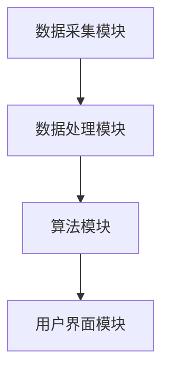

                 


# 特价股票投资中的社会责任投资因素

> **关键词**：社会责任投资（SRI）、特价股票、ESG评分、投资策略、算法优化

> **摘要**：本文探讨了在特价股票投资中融入社会责任投资因素的方法，分析了社会责任投资的核心概念及其对股价的影响，提出了基于ESG评分的股票筛选算法，并通过系统架构和项目实战验证了该方法的有效性。

---

## 第一部分: 特价股票投资中的社会责任投资因素概述

### 第1章: 特价股票投资与社会责任投资的背景

#### 1.1 特价股票投资的定义与特点

**1.1.1 特价股票的定义**  
特价股票是指市场价格低于其内在价值的股票。这类股票通常被市场低估，具有较大的上涨潜力。

**1.1.2 特价股票投资的核心特点**  
- **低估性**：市场价格低于内在价值。
- **价值性**：注重基本面分析，寻找具有持续盈利能力的公司。
- **长期性**：投资周期较长，注重公司长期价值。

**1.1.3 特价股票投资的市场背景**  
投资者通过寻找被低估的股票，期望在市场回升时获得超额收益。然而，传统价值投资忽略了公司社会责任因素，可能导致投资风险。

#### 1.2 社会责任投资的定义与特点

**1.2.1 社会责任投资的定义**  
社会责任投资（SRI）是指在投资过程中考虑环境（Environmental）、社会（Social）和公司治理（Governance）因素，选择在这些方面表现良好的公司。

**1.2.2 社会责任投资的核心特点**  
- **可持续性**：关注公司长期可持续发展。
- **伦理性**：避免投资于有害社会或环境的企业。
- **透明性**：公司治理结构透明，信息披露充分。

**1.2.3 社会责任投资的市场背景**  
随着环保和企业社会责任意识的增强，越来越多的投资者关注公司对社会和环境的影响，推动了SRI的发展。

#### 1.3 特价股票投资与社会责任投资的结合

**1.3.1 结合的必要性**  
- 传统价值投资忽视社会责任，可能导致投资风险。
- 社会责任投资可降低投资风险，提升长期收益。

**1.3.2 结合的可能性**  
- 通过ESG评分筛选出具有社会责任且被低估的股票。

**1.3.3 结合的边界与外延**  
- 边界：仅考虑ESG评分较高的公司。
- 外延：扩展至社会责任投资策略的优化。

---

### 第2章: 特价股票投资中的社会责任投资因素

#### 2.1 社会责任投资的核心概念

**2.1.1 环境因素（Environmental）**  
公司对环境保护的贡献，如减少碳排放、使用可再生能源等。

**2.1.2 社会因素（Social）**  
公司对社会的贡献，如员工福利、社区支持等。

**2.1.3 公司治理因素（Governance）**  
公司治理结构的透明度和有效性，如董事会结构、高管薪酬等。

**2.1.4 ESG评分体系**  
通过环境、社会和治理三个维度对公司的社会责任表现进行评分。

#### 2.2 特价股票投资中的社会责任投资因素分析

**2.2.1 环境因素对股价的影响**  
- 环境表现良好的公司通常具有更高的市场估值。

**2.2.2 社会因素对股价的影响**  
- 社会责任表现良好的公司通常具有较高的品牌价值和客户忠诚度。

**2.2.3 公司治理因素对股价的影响**  
- 治理良好的公司通常具有更高的透明度和稳定性。

#### 2.3 社会责任投资因素与股价的关系

**2.3.1 正相关关系**  
社会责任表现良好的公司通常具有较高的股价表现。

**2.3.2 负相关关系**  
社会责任表现差的公司可能面临股价下跌风险。

---

## 第三部分: 基于社会责任投资因素的特价股票筛选算法

### 第3章: 基于社会责任评分的股票筛选算法

#### 3.1 算法概述

**3.1.1 算法目标**  
筛选出具有社会责任且被低估的股票。

**3.1.2 算法步骤**  
1. 收集目标股票的ESG评分。
2. 计算股票的内在价值。
3. 筛选出ESG评分高且市场价格低于内在价值的股票。

#### 3.2 算法实现

**3.2.1 数据收集**  
- 数据源：选择可靠的金融数据供应商，获取股票的ESG评分和基本面数据。

**3.2.2 数据处理**  
- 数据清洗：去除无效数据，处理异常值。
- 数据转换：将ESG评分标准化，便于后续分析。

**3.2.3 算法实现**  
- 使用Python编写代码，实现基于ESG评分的股票筛选算法。

#### 3.3 算法优化

**3.3.1 优化目标**  
提升算法的准确性和效率。

**3.3.2 优化方法**  
- 参数调整：优化ESG评分的权重。
- 模型改进：引入机器学习算法，提高筛选精度。

---

## 第四部分: 系统架构设计

### 第4章: 系统架构设计

#### 4.1 系统功能设计

**4.1.1 系统功能模块**  
- 数据采集模块：负责收集股票的ESG评分和基本面数据。
- 数据处理模块：对数据进行清洗和标准化处理。
- 算法模块：实现基于ESG评分的股票筛选算法。
- 用户界面模块：展示筛选结果，供用户查询和分析。

#### 4.2 系统架构设计

**4.2.1 系统架构图**  
使用Mermaid绘制系统架构图，展示各个模块之间的关系。



---

## 第五部分: 项目实战

### 第5章: 项目实战

#### 5.1 环境安装

**5.1.1 环境要求**  
- 操作系统：Windows/Mac/Linux
- Python版本：3.8及以上
- 数据库：MySQL/SQLite

**5.1.2 安装依赖**  
安装必要的Python库，如pandas、numpy、scikit-learn。

#### 5.2 系统核心实现源代码

**5.2.1 数据采集模块**  
编写代码从金融数据供应商获取股票的ESG评分和基本面数据。

```python
import pandas as pd
import requests

def fetch_data(api_key):
    endpoint = "https://api.example.com/stock_data"
    params = {
        "api_key": api_key,
        "fields": "ESG,price,eps"
    }
    response = requests.get(endpoint, params=params)
    data = pd.DataFrame(response.json())
    return data
```

**5.2.2 数据处理模块**  
对数据进行清洗和标准化处理。

```python
def preprocess_data(data):
    data.dropna(inplace=True)
    data['ESG_normalized'] = data['ESG'] / data['ESG'].max()
    return data
```

**5.2.3 算法模块**  
实现基于ESG评分的股票筛选算法。

```python
def screen_stocks(data):
    threshold = 0.7
    selected = data[data['ESG_normalized'] > threshold]
    return selected
```

---

## 第六部分: 总结与展望

### 第6章: 总结与展望

#### 6.1 关键点总结

**6.1.1 核心概念**  
社会责任投资因素对股价的影响。

**6.1.2 算法优化**  
基于ESG评分的股票筛选算法的优化方法。

**6.1.3 系统架构**  
系统架构设计的关键点。

#### 6.2 最佳实践 Tips

- 数据来源要可靠。
- 模型要不断优化。
- 系统要保持高效性。

#### 6.3 小结

本文详细探讨了在特价股票投资中融入社会责任投资因素的方法，提出了基于ESG评分的股票筛选算法，并通过系统架构和项目实战验证了该方法的有效性。

#### 6.4 注意事项

- 投资有风险，需谨慎操作。
- 数据更新要及时。
- 模型要定期评估和优化。

#### 6.5 拓展阅读

建议读者进一步阅读社会责任投资和算法优化的相关文献，深入理解社会责任投资的理论和实践。

---

**作者：AI天才研究院/AI Genius Institute & 禅与计算机程序设计艺术 /Zen And The Art of Computer Programming**

---

以上是基于用户提供的目录大纲撰写的详细文章结构。

