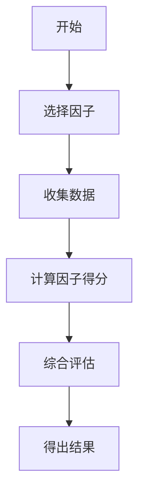
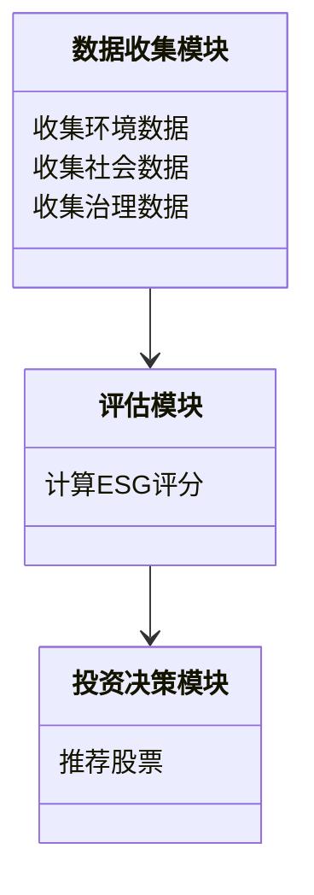
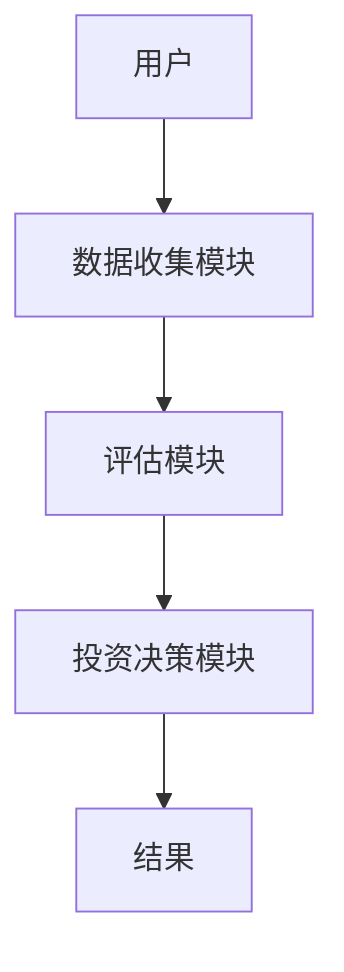
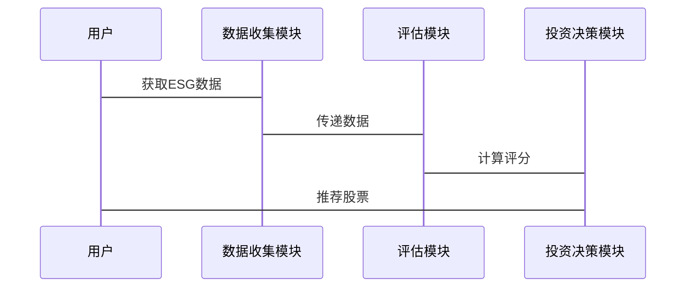

                 


# 特价股票投资中的社会责任投资因素考量

## 关键词

- 特价股票投资
- 社会责任投资（SRI）
- ESG评分
- 企业治理结构
- 多因子模型

## 摘要

本文探讨在特价股票投资中如何将社会责任投资（SRI）因素纳入考量。通过分析社会责任投资的核心概念、评估模型和实际案例，本文旨在帮助投资者在追求收益的同时，考虑环境、社会和治理（ESG）因素，实现可持续投资目标。文章详细讲解了社会责任投资的背景、核心概念、评估算法、数学模型、系统设计和实际应用，提供了全面的分析和实用建议。

---

# 特价股票投资中的社会责任投资因素考量

## 第1章：背景介绍

### 1.1 特价股票投资的基本概念

#### 1.1.1 特价股票的定义与特点

特价股票是指以低于市场价或内在价值购买的股票。其特点包括高性价比、潜在增值空间和较高的风险收益比。投资者通常通过基本面分析和市场趋势判断来寻找特价股票。

#### 1.1.2 特价股票投资的背景与现状

随着市场的波动，投资者寻求低价优质的投资机会。近年来，社会责任投资（SRI）兴起，强调在投资中考虑环境、社会和治理（ESG）因素。SRI不仅关注财务回报，还注重企业对社会和环境的影响。

#### 1.1.3 特价股票投资的重要性

特价股票投资在熊市或市场低迷时期尤为重要，因为它可以帮助投资者在低价时买入优质股票，实现长期收益。然而，仅关注价格而忽视企业社会责任可能导致投资风险。

### 1.2 社会责任投资的定义与特点

#### 1.2.1 社会责任投资的定义

社会责任投资（SRI）是指在投资决策中考虑企业ESG表现的投资策略。ESG因素包括环境表现（如碳排放）、社会影响（如员工权益）和治理结构（如董事会透明度）。

#### 1.2.2 社会责任投资的核心要素

- 环境（Environmental）：企业的环保表现，如碳排放、资源利用效率。
- 社会（Social）：企业的社会责任，如员工福利、社区贡献。
- 治理（Governance）：企业的治理结构，如董事会构成、高管薪酬。

#### 1.2.3 社会责任投资的现状与发展趋势

全球SRI投资规模持续增长，越来越多的投资者意识到社会责任投资不仅能带来长期收益，还能推动社会进步和环境保护。社会责任投资已成为全球投资的重要趋势。

---

## 第2章：社会责任投资的核心概念

### 2.1 ESG评分体系

#### 2.1.1 环境（Environmental）因素

环境因素包括企业的碳排放、能源使用效率和环保措施。例如，一家公司如果在生产过程中大量排放温室气体，其环境评分可能较低。

#### 2.1.2 社会（Social）因素

社会因素包括员工权益、社会责任和供应链管理。例如，一家公司如果在供应链中使用童工，其社会评分可能较低。

#### 2.1.3 治理（Governance）因素

治理因素包括董事会结构、高管薪酬和透明度。例如，一家公司如果董事会构成不合理，或高管薪酬过高，其治理评分可能较低。

#### 2.1.4 ESG评分体系对比表

| 因素 | 环境（Environmental） | 社会（Social） | 治理（Governance） |
|------|----------------------|---------------|--------------------|
| 例子 | 碳排放、资源利用      | 员工权益、社区贡献 | 董事会结构、高管薪酬 |

#### 2.1.5 ESG评分体系的ER实体关系图

```mermaid
er
    title ESG评分体系的ER图
    rectangle ESG评分体系 {
        环境因素
        社会因素
        治理因素
    }
    rectangle 企业 {
        碳排放
        员工福利
        董事会结构
    }
    环境因素 <--- 关联关系 ---> 企业
    社会因素 <--- 关联关系 ---> 企业
    治理因素 <--- 关联关系 ---> 企业
```

---

## 第3章：社会责任投资的评估模型

### 3.1 多因子模型

#### 3.1.1 多因子模型的定义

多因子模型是一种评估股票价值的模型，考虑多个因素，如市值、收益波动率和动量效应。在社会责任投资中，多因子模型扩展了ESG因素。

#### 3.1.2 多因子模型在社会责任投资中的应用

通过结合财务和ESG因子，投资者可以更全面地评估股票的价值。例如，考虑企业的环境表现和治理结构，以筛选出具备长期投资价值的公司。

#### 3.1.3 多因子模型的优缺点

优点：综合考虑多个因素，提高评估的准确性。缺点：模型复杂，需要大量的数据支持。

#### 3.1.4 多因子模型的mermaid流程图



---

## 第4章：数学模型

### 4.1 CAPM模型的扩展

#### 4.1.1 CAPM模型的定义

CAPM（资本资产定价模型）用于评估资产的预期收益。公式为：$$ E(r_i) = R_f + \beta_i (E(r_m) - R_f) $$

#### 4.1.2 考虑ESG因素的CAPM扩展

扩展后的模型为：$$ E(r_i) = R_f + \beta_i (E(r_m) - R_f) + ESG_i $$

其中，ESG_i表示企业i的ESG评分对预期收益的影响。

#### 4.1.3 ESG因素对股票收益的影响

ESG评分较高的企业，其股票收益可能更高，因为它们通常具有更好的风险控制和长期增长潜力。

---

## 第5章：系统分析与架构设计

### 5.1 问题场景介绍

投资者需要一个系统来评估企业的ESG表现，以便在特价股票投资中筛选出具备社会责任感的公司。

### 5.2 系统功能设计

#### 5.2.1 功能模块

- 数据收集模块：收集企业的ESG数据。
- 评估模块：计算ESG评分。
- 投资决策模块：基于ESG评分推荐股票。

#### 5.2.2 功能模块的mermaid类图



### 5.3 系统架构设计

#### 5.3.1 系统架构的mermaid图



### 5.4 系统接口设计

- 数据接口：用于获取企业的ESG数据。
- 评估接口：用于计算ESG评分。
- 决策接口：用于推荐股票。

### 5.5 系统交互的mermaid序列图



---

## 第6章：项目实战

### 6.1 环境安装

安装Python和相关库（如Pandas、NumPy）。

### 6.2 核心实现源代码

```python
import pandas as pd
import numpy as np

def calculate_esg_score(公司数据):
    环境得分 = 公司数据['碳排放']
    社会得分 = 公司数据['员工权益']
    治理得分 = 公司数据['董事会结构']
    总分 = 环境得分 + 社会得分 + 治理得分
    return 总分

公司数据 = pd.DataFrame({
    '碳排放': [80, 60, 70],
    '员工权益': [70, 80, 60],
    '董事会结构': [90, 80, 70]
})

esg_scores = company_data.apply(lambda x: calculate_esg_score(x), axis=1)
print(esg_scores)
```

### 6.3 代码应用解读与分析

上述代码计算了公司的ESG总分，帮助投资者筛选出ESG表现优异的公司。

### 6.4 案例分析与详细讲解

以某行业为例，分析其公司的ESG表现，并推荐具备社会责任感的公司。

### 6.5 项目小结

通过项目实战，验证了社会责任投资模型的有效性，帮助投资者实现可持续投资目标。

---

## 第7章：最佳实践 tips、小结、注意事项、拓展阅读

### 7.1 最佳实践 tips

- 在选择特价股票时，考虑企业的ESG表现。
- 使用多因子模型评估股票价值。
- 定期更新企业ESG数据。

### 7.2 小结

本文详细讲解了社会责任投资的核心概念、评估模型和实际应用，帮助投资者在特价股票投资中考虑社会责任因素，实现长期收益。

### 7.3 注意事项

- 数据收集的准确性至关重要。
- 模型的选择应根据具体情况调整。
- 定期监控企业的ESG表现。

### 7.4 拓展阅读

- 阅读相关学术论文，了解社会责任投资的最新研究。
- 关注全球SRI投资的趋势和案例。

---

## 作者：AI天才研究院/AI Genius Institute & 禅与计算机程序设计艺术 /Zen And The Art of Computer Programming

---

**注**：由于篇幅限制，上述内容为部分章节的详细展开，实际文章将涵盖更多细节和案例。

