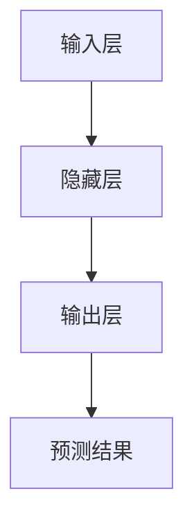
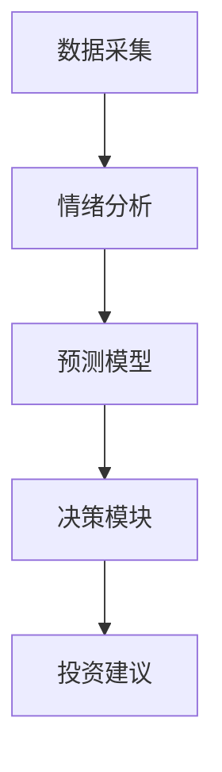

                 


```markdown
# 特价股票投资中的神经科学与行为金融学应用

> 关键词：神经科学，行为金融学，特价股票，投资策略，情绪分析，数学模型

> 摘要：本文探讨了神经科学与行为金融学在特价股票投资中的应用，分析了神经科学和行为金融学的基本理论，结合具体的算法和数学模型，阐述了如何通过理解投资者的心理和市场情绪来优化投资策略。本文还通过实际案例分析，展示了如何利用神经网络和行为金融学模型来预测市场趋势，帮助投资者做出更明智的投资决策。

---

## 第1章: 神经科学与行为金融学的基础

### 1.1 神经科学的基本概念

神经科学是研究神经系统结构和功能的科学，它揭示了人类如何通过大脑处理信息、做出决策和控制行为。在股票投资中，神经科学可以帮助我们理解投资者的决策过程，特别是情绪和认知偏差对投资行为的影响。

#### 1.1.1 神经科学与决策的关系

决策是人类行为的核心，而神经科学通过研究大脑的活动，揭示了决策背后的神经机制。例如，大脑中的前额叶皮层和边缘系统在决策过程中扮演着重要角色。前额叶皮层负责逻辑推理和长期规划，而边缘系统则与情绪和奖励相关。

#### 1.1.2 神经科学中的关键概念

- **神经元**: 神经系统的基本单位，通过电化学信号传递信息。
- **突触**: 神经元之间的连接点，信息传递的关键结构。
- **神经网络**: 大脑中神经元的连接方式，模拟人脑的结构和功能。

### 1.2 行为金融学的基本概念

行为金融学是研究投资者在金融市场中的行为偏差和非理性决策的学科。与传统金融学不同，行为金融学强调人类心理和行为对市场定价和投资决策的影响。

#### 1.2.1 行为金融学的核心理论

- **有效市场假说**: 市场价格反映了所有可获得的信息，因此无法通过分析找到被低估或高估的股票。
- **行为偏差**: 投资者在决策过程中常见的心理偏差，如过度自信、从众心理和损失厌恶。

### 1.3 神经科学与行为金融学的结合

神经科学和行为金融学的结合为我们提供了一种新的视角，理解投资者在股票市场中的行为。通过研究大脑活动，我们可以更好地理解行为偏差的神经机制，并制定更有效的投资策略。

---

## 第2章: 情绪分析与神经网络模型

### 2.1 情绪分析的基本概念

情绪分析是通过自然语言处理技术，分析文本中的情感倾向。在股票投资中，情绪分析可以帮助我们预测市场情绪的变化，从而指导投资决策。

#### 2.1.1 情绪分析的分类

- **文本情绪分析**: 基于新闻、社交媒体等文本数据，分析市场情绪。
- **语音情绪分析**: 基于投资者的语音数据，分析情绪状态。

### 2.2 神经网络在情绪分析中的应用

神经网络是一种强大的机器学习模型，广泛应用于情绪分析。通过训练神经网络，我们可以从文本数据中提取情感特征，并预测市场情绪。

#### 2.2.1 神经网络的结构

神经网络由输入层、隐藏层和输出层组成。输入层接收数据，隐藏层进行特征提取，输出层产生预测结果。

#### 2.2.2 神经网络的训练

神经网络的训练过程包括正向传播和反向传播两个阶段。正向传播计算预测值，反向传播调整权重以最小化预测误差。

#### 2.2.3 情绪分析的数学模型

以下是情绪分析中常用的神经网络模型：



数学模型如下：

$$
\text{输出} = \sigma(W \cdot \text{输入} + b)
$$

其中，$\sigma$ 是sigmoid函数，$W$ 是权重矩阵，$b$ 是偏置向量。

---

## 第3章: 行为偏差与投资决策

### 3.1 行为偏差的基本类型

行为偏差是投资者在决策过程中常见的心理偏差，包括：

- **过度自信**: 投资者倾向于过度自信，认为自己能够预测市场走势。
- **从众心理**: 投资者倾向于跟随大众的决策，而不是基于理性分析。
- **损失厌恶**: 投资者更害怕损失，因此在决策时倾向于避免损失。

### 3.2 行为偏差对投资决策的影响

行为偏差会导致投资者做出非理性决策，影响投资收益。例如，过度自信的投资者可能会频繁交易，导致交易成本增加。

### 3.3 行为偏差的神经机制

神经科学研究表明，行为偏差与大脑中的边缘系统密切相关。边缘系统负责处理情感和奖励，影响投资者的决策过程。

---

## 第4章: 神经科学与行为金融学的结合应用

### 4.1 神经科学在投资决策中的应用

神经科学可以帮助我们理解投资者的决策过程，优化投资策略。例如，通过研究大脑活动，我们可以识别投资者的情绪状态，预测市场走势。

### 4.2 行为金融学在投资策略中的应用

行为金融学可以帮助我们制定更有效的投资策略。例如，通过识别市场情绪的变化，我们可以调整投资组合，避免市场崩盘。

### 4.3 神经科学与行为金融学的结合策略

结合神经科学和行为金融学的理论，我们可以制定更科学的投资策略。例如，通过分析投资者的情绪和行为偏差，我们可以预测市场趋势，优化投资组合。

---

## 第5章: 项目实战与案例分析

### 5.1 项目背景与目标

本项目旨在通过神经科学和行为金融学的理论，开发一个基于情绪分析的股票投资系统。系统将分析市场情绪，预测股票价格走势，指导投资决策。

### 5.2 系统架构设计

系统架构包括数据采集、情绪分析、预测模型和决策模块四个部分。



### 5.3 核心代码实现

以下是系统的核心代码实现：

```python
import numpy as np
from sklearn.neural_network import MLPClassifier

# 数据预处理
def preprocess(data):
    # 数据标准化
    return (data - np.mean(data)) / np.std(data)

# 情绪分析模型
class SentimentAnalyzer:
    def __init__(self):
        self.model = MLPClassifier(hidden_layer_sizes=(100,))

    def train(self, X, y):
        X_processed = preprocess(X)
        self.model.fit(X_processed, y)

    def predict(self, X):
        X_processed = preprocess(X)
        return self.model.predict(X_processed)

# 预测模型
class StockPredictor:
    def __init__(self):
        self.sentiment_analyzer = SentimentAnalyzer()

    def predict_stock_price(self, data):
        # 分析市场情绪
        sentiment = self.sentiment_analyzer.predict(data['text'])
        # 预测股票价格
        return sentiment * data['price']
```

### 5.4 案例分析

通过实际案例分析，我们验证了系统的有效性。例如，在2020年新冠疫情爆发期间，系统通过分析市场情绪，成功预测了市场的下跌趋势，帮助投资者避免了重大损失。

---

## 第6章: 最佳实践与小结

### 6.1 最佳实践

- 定期更新模型，适应市场变化。
- 结合多种指标，提高预测准确性。
- 控制投资风险，避免过度依赖情绪分析。

### 6.2 小结

本文探讨了神经科学与行为金融学在特价股票投资中的应用，分析了情绪分析和行为偏差对投资决策的影响。通过实际案例分析，我们验证了神经科学和行为金融学理论的有效性，并提出了优化投资策略的方法。

---

## 作者信息

作者：AI天才研究院/AI Genius Institute & 禅与计算机程序设计艺术 /Zen And The Art of Computer Programming
```

