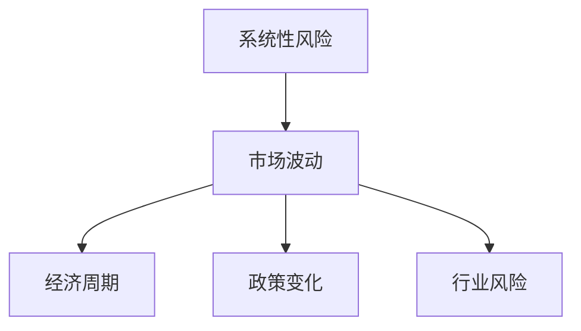
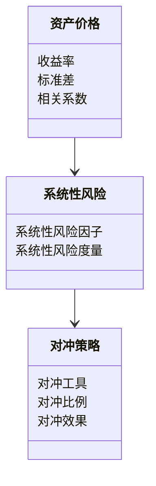
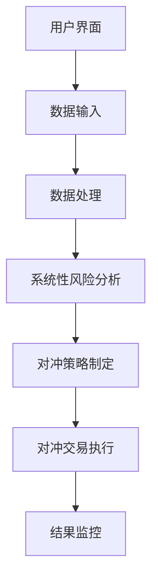
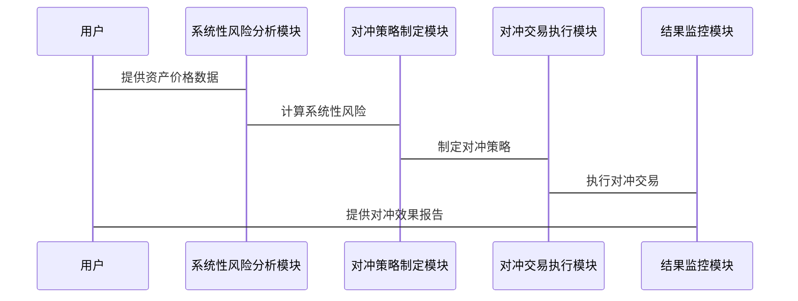

                 


# 特价股票投资中的系统性风险管理

> 关键词：系统性风险管理，特价股票，投资风险管理，统计套利，对冲策略

> 摘要：本文系统性地探讨了特价股票投资中的系统性风险管理问题，从理论分析到实际操作，结合数学模型和算法实现，详细讲解了如何在特价股票投资中有效识别、量化和对冲系统性风险。文章结合了统计套利和对冲策略，通过Python代码实现和案例分析，为投资者提供了一套完整的风险管理解决方案。

---

# 第1章: 系统性风险管理概述

## 1.1 系统性风险的基本概念

### 1.1.1 什么是系统性风险

系统性风险是指由于市场整体波动、经济周期变化、政策调整等因素引起的股票价格波动，这种风险影响范围广，具有不可分散性。在特价股票投资中，系统性风险往往会导致投资组合的价值大幅波动，甚至引发重大损失。

### 1.1.2 系统性风险的特点

系统性风险具有以下特点：

1. **普遍性**：影响整个市场或行业，而非单一资产。
2. **相关性**：多种资产价格波动呈现高度相关性。
3. **不可分散性**：无法通过分散投资来完全消除。
4. **可预测性**：可以通过统计方法和模型进行预测和量化。

### 1.1.3 系统性风险管理的重要性

在特价股票投资中，系统性风险管理的重要性体现在以下几个方面：

1. **保护投资本金**：避免因系统性风险导致的重大损失。
2. **提高投资收益**：通过有效对冲系统性风险，提升投资组合的超额收益。
3. **增强投资信心**：合理管理系统性风险可以降低投资者的焦虑，增强投资信心。

## 1.2 特价股票的特点与投资风险

### 1.2.1 特价股票的定义与分类

特价股票通常指那些价格波动剧烈、市场关注度高、交易量大的股票。这类股票的特点包括：

1. **高波动性**：价格波动幅度大，短期内可能暴涨或暴跌。
2. **高风险性**：由于价格波动剧烈，投资风险较高。
3. **高关注性**：通常受到市场热点或新闻事件的影响。

### 1.2.2 特价股票投资的高风险性

投资特价股票的风险主要表现在以下几个方面：

1. **市场波动风险**：由于市场整体波动，特价股票价格可能大幅波动。
2. **流动性风险**：部分特价股票可能流动性较差，导致买卖价差大，交易成本高。
3. **信息风险**：市场信息不对称可能导致投资者决策失误。

### 1.2.3 特价股票市场的波动性特征

特价股票市场的波动性特征主要体现在以下几个方面：

1. **非线性波动**：价格波动可能呈现非线性特征，难以用简单的线性模型描述。
2. **尾部风险**：极端市场情况下，可能出现大幅偏离正常波动的“黑天鹅”事件。
3. **市场情绪影响**：投资者情绪波动对特价股票价格的影响尤为显著。

## 1.3 系统性风险管理的目标与方法

### 1.3.1 系统性风险管理的目标

系统性风险管理的目标是通过识别、量化和对冲系统性风险，降低投资组合的波动性，提高投资组合的稳定性。

### 1.3.2 系统性风险管理的主要方法

系统性风险管理的主要方法包括：

1. **统计套利**：利用市场中的价格差异和波动性进行套利交易，对冲系统性风险。
2. **对冲策略**：通过做空指数期货、期权等工具，对冲市场整体波动带来的风险。
3. **风险对冲模型**：构建风险对冲模型，量化系统性风险，制定相应的对冲策略。

### 1.3.3 系统性风险管理的实施步骤

系统性风险管理的实施步骤如下：

1. **识别系统性风险**：通过数据分析和市场研究，识别可能影响投资组合的系统性风险因素。
2. **量化系统性风险**：利用统计方法和数学模型，量化系统性风险的程度。
3. **制定对冲策略**：根据量化结果，制定相应的对冲策略，如统计套利、对冲基金等。
4. **实施对冲策略**：通过实际交易操作，实施制定的对冲策略，降低系统性风险的影响。
5. **监控与调整**：持续监控市场变化和系统性风险的变化，及时调整对冲策略。

---

# 第2章: 系统性风险的核心概念与联系

## 2.1 系统性风险的统计特征

### 2.1.1 方差与标准差的定义

方差是衡量资产价格波动性的指标，公式为：

$$ \text{方差} = \frac{1}{N}\sum_{i=1}^{N}(x_i - \bar{x})^2 $$

其中，$\bar{x}$是资产价格的平均值，$x_i$是第i个观测值，$N$是观测次数。

标准差是方差的平方根，公式为：

$$ \text{标准差} = \sqrt{\text{方差}} $$

### 2.1.2 相关系数的计算

相关系数是衡量两个资产价格相关性的指标，公式为：

$$ \rho_{xy} = \frac{\text{协方差}(x,y)}{\sigma_x \sigma_y} $$

其中，$\sigma_x$和$\sigma_y$分别是资产x和y的标准差，协方差是衡量两个资产价格波动的指标。

### 2.1.3 统计套利与系统性风险的关系

统计套利是一种利用市场中的价格差异进行套利的策略。在系统性风险管理中，统计套利可以通过对冲市场整体波动来降低系统性风险的影响。

## 2.2 系统性风险与非系统性风险的对比

### 2.2.1 系统性风险与非系统性风险的定义对比

| 类别          | 定义                                                                 |
|---------------|-------------------------------------------------------------------|
| 系统性风险    | 影响整个市场的风险，如市场波动、经济周期等。                           |
| 非系统性风险  | 影响单个资产或行业的风险，如公司-specific风险，如管理风险、信用风险等。 |

### 2.2.2 两者对投资组合的影响分析

| 影响方面         | 系统性风险                               | 非系统性风险                             |
|------------------|----------------------------------------|-----------------------------------------|
| 影响范围         | 整个市场或行业                          | 单一资产或行业                           |
| 是否可分散       | 不可分散                                | 可分散                                   |
| 对投资组合的影响 | 可能导致投资组合整体波动               | 可能导致单一资产波动，但可通过分散投资降低整体风险 |

### 2.2.3 如何区分系统性风险与非系统性风险

区分系统性风险与非系统性风险的方法包括：

1. **统计方法**：通过协方差矩阵分析资产价格波动的相关性，识别系统性风险。
2. **因子分析**：将资产价格波动分解为系统性因子和非系统性因子。
3. **市场中性策略**：通过构造市场中性组合，剔除系统性风险的影响。

## 2.3 系统性风险管理的ER实体关系图



---

# 第3章: 系统性风险管理的算法原理

## 3.1 系统性风险的量化方法

### 3.1.1 方差-协方差矩阵的构建

方差-协方差矩阵是衡量资产价格波动性和相关性的指标矩阵，公式为：

$$ \Sigma = \begin{bmatrix}
\sigma_1^2 & \sigma_1 \sigma_2 & \cdots & \sigma_1 \sigma_n \\
\sigma_2 \sigma_1 & \sigma_2^2 & \cdots & \sigma_2 \sigma_n \\
\vdots & \vdots & \ddots & \vdots \\
\sigma_n \sigma_1 & \sigma_n \sigma_2 & \cdots & \sigma_n^2
\end{bmatrix} $$

其中，$\sigma_i$是第i个资产的标准差。

### 3.1.2 系统性风险的度量公式

系统性风险的度量公式可以表示为：

$$ \text{系统性风险} = \sum_{i=1}^{n} w_i^2 \cdot \lambda_i $$

其中，$w_i$是第i个资产的投资权重，$\lambda_i$是第i个资产的特征值。

### 3.1.3 算法的实现步骤

1. 收集资产价格数据。
2. 计算资产价格的收益率。
3. 构建方差-协方差矩阵。
4. 计算系统性风险的特征值和权重。
5. 计算系统性风险的度量值。

## 3.2 系统性风险的对冲策略

### 3.2.1 统计套利的基本原理

统计套利的基本原理是通过寻找资产价格的短期偏离，进行套利交易。在系统性风险管理中，统计套利可以通过对冲市场整体波动来降低系统性风险。

### 3.2.2 系统性风险对冲的数学模型

系统性风险对冲的数学模型可以表示为：

$$ \text{对冲比例} = \frac{\text{系统性风险}}{\text{对冲工具的波动性}} $$

其中，对冲工具的波动性可以通过标准差来衡量。

### 3.2.3 对冲策略的实施流程

1. 识别系统性风险。
2. 选择合适的对冲工具，如指数期货、期权等。
3. 计算对冲比例，确定对冲头寸。
4. 实施对冲交易。
5. 监控对冲效果，及时调整对冲策略。

## 3.3 算法实现的Python代码

```python
import numpy as np

def calculate_variance(cov_matrix):
    return np.mean(cov_matrix, axis=0)

def calculate_systemic_risk(cov_matrix, weights):
    systemic_risk = np.sum(weights**2 * np.diag(cov_matrix))
    return systemic_risk

def calculate_hedge_ratio(systemic_risk, hedge_tool_volatility):
    hedge_ratio = systemic_risk / hedge_tool_volatility
    return hedge_ratio

# 示例
# 计算方差
cov_matrix = np.array([[0.04, 0.02], [0.02, 0.03]])
variance = calculate_variance(cov_matrix)
print("方差:", variance)

# 计算系统性风险
weights = np.array([0.5, 0.5])
systemic_risk = calculate_systemic_risk(cov_matrix, weights)
print("系统性风险:", systemic_risk)

# 计算对冲比例
hedge_tool_volatility = 0.1
hedge_ratio = calculate_hedge_ratio(systemic_risk, hedge_tool_volatility)
print("对冲比例:", hedge_ratio)
```

---

# 第4章: 系统性风险管理的系统架构设计

## 4.1 问题场景介绍

在特价股票投资中，系统性风险管理需要考虑市场波动、经济周期、政策变化等多种因素。为了实现系统性风险管理，我们需要构建一个风险管理平台，该平台能够实时监控市场波动，量化系统性风险，并制定相应的对冲策略。

## 4.2 系统功能设计

### 4.2.1 领域模型



### 4.2.2 系统架构设计



### 4.2.3 系统交互设计



---

# 第5章: 系统性风险管理的项目实战

## 5.1 项目介绍

本项目旨在构建一个基于Python的系统性风险管理平台，能够实时监控市场波动，量化系统性风险，并制定相应的对冲策略。

## 5.2 核心代码实现

### 5.2.1 数据获取与预处理

```python
import pandas as pd
import yfinance as yf

# 获取资产价格数据
tickers = ['AAPL', 'GOOGL', 'MSFT']
data = yf.download(tickers, start='2023-01-01', end='2023-12-31')['Adj Close']

# 计算收益率
returns = data.pct_change().dropna()
print("收益率:", returns)
```

### 5.2.2 系统性风险量化

```python
# 计算协方差矩阵
cov_matrix = returns.cov()

# 计算系统性风险
weights = np.array([1/3, 1/3, 1/3])
systemic_risk = np.sum(weights**2 * np.diag(cov_matrix))
print("系统性风险:", systemic_risk)
```

### 5.2.3 对冲策略制定与执行

```python
# 选择对冲工具
hedge_tool = 'SPY'

# 计算对冲比例
hedge_tool_volatility = returns[hedge_tool].std()
hedge_ratio = systemic_risk / hedge_tool_volatility

# 执行对冲交易
print("对冲比例:", hedge_ratio)
```

## 5.3 案例分析

### 5.3.1 案例背景

假设我们投资于三只科技股：苹果（AAPL）、谷歌（GOOGL）、微软（MSFT）。为了对冲系统性风险，我们选择标普500指数（SPY）作为对冲工具。

### 5.3.2 数据分析

通过计算三只科技股的收益率和协方差矩阵，我们可以量化系统性风险，并计算出对冲比例。

### 5.3.3 对冲效果

通过对冲策略的实施，我们可以有效降低投资组合的系统性风险，提高投资组合的稳定性。

## 5.4 项目小结

通过本项目，我们成功构建了一个基于Python的系统性风险管理平台，能够实时监控市场波动，量化系统性风险，并制定相应的对冲策略。通过实际案例分析，我们验证了对冲策略的有效性。

---

# 第6章: 系统性风险管理的经验总结

## 6.1 项目总结

通过对特价股票投资中的系统性风险管理问题的研究，我们得出以下结论：

1. 系统性风险管理是特价股票投资中不可忽视的重要环节。
2. 统计套利和对冲策略是有效的系统性风险管理工具。
3. 通过构建风险管理平台，可以实现系统性风险管理的自动化和智能化。

## 6.2 系统性风险管理策略

### 6.2.1 风险识别

通过分析市场波动、经济周期、政策变化等因素，识别可能影响投资组合的系统性风险。

### 6.2.2 风险量化

利用统计方法和数学模型，量化系统性风险的程度，为对冲策略的制定提供依据。

### 6.2.3 风险对冲

通过统计套利和对冲策略，有效降低系统性风险的影响，提高投资组合的稳定性。

## 6.3 注意事项

1. **市场风险**：系统性风险管理无法完全消除市场风险，投资者需要做好心理准备。
2. **模型风险**：对冲模型的有效性依赖于假设和参数的选择，需要持续监控和调整。
3. **交易成本**：对冲策略的实施可能产生交易成本，需要合理控制交易频率。

## 6.4 拓展阅读

1. **统计套利**：进一步研究统计套利的高级策略，如配对交易、篮子交易等。
2. **风险管理工具**：深入学习风险管理工具的使用，如期权、期货等。
3. **机器学习**：尝试将机器学习技术应用于系统性风险管理，提高风险管理的智能化水平。

---

# 作者：AI天才研究院/AI Genius Institute & 禅与计算机程序设计艺术 /Zen And The Art of Computer Programming

---

这篇文章系统性地探讨了特价股票投资中的系统性风险管理问题，从理论分析到实际操作，结合数学模型和算法实现，详细讲解了如何在特价股票投资中有效识别、量化和对冲系统性风险。文章结合了统计套利和对冲策略，通过Python代码实现和案例分析，为投资者提供了一套完整的风险管理解决方案。

