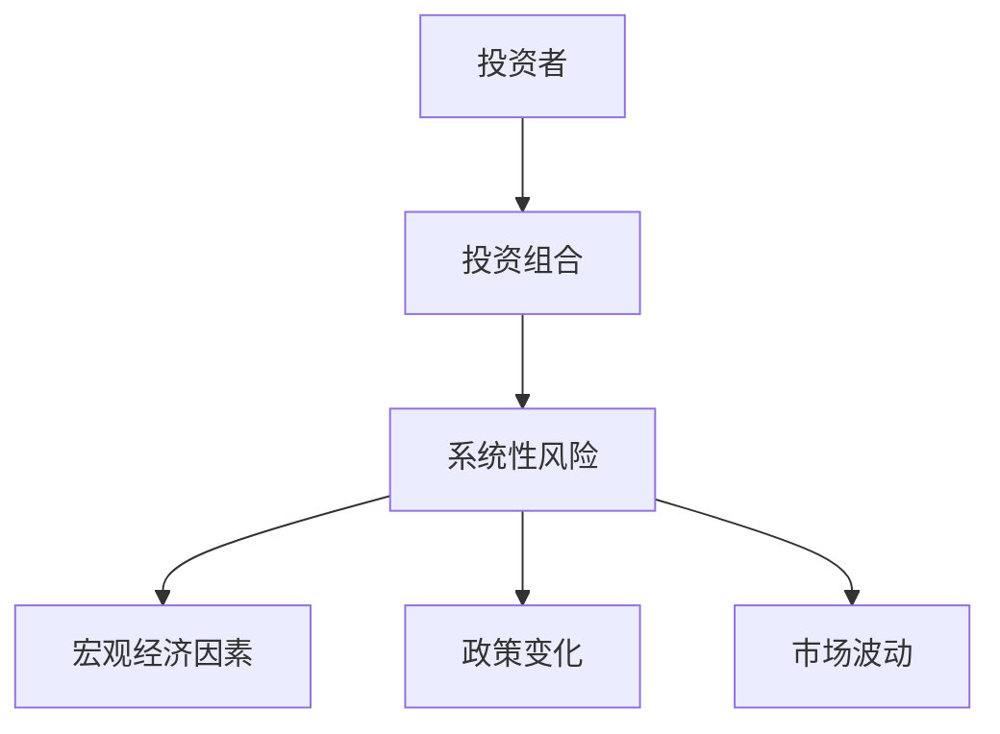
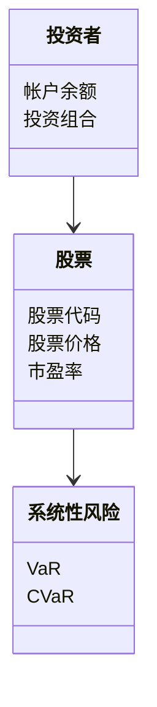
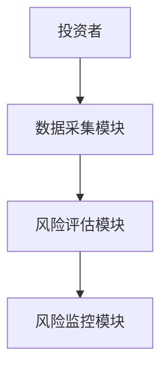
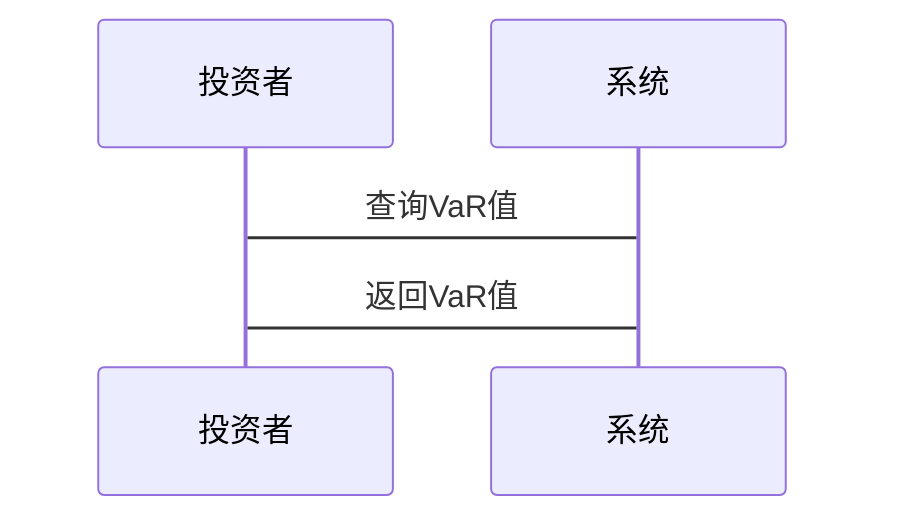

                 


# 特价股票投资中的系统性风险管理方法

**关键词：** 特价股票、系统性风险管理、算法原理、系统架构、项目实战

**摘要：**  
本文旨在探讨特价股票投资中的系统性风险管理方法，从核心概念到算法实现，系统性地分析如何在特价股票投资中有效识别和控制系统性风险。文章首先介绍特价股票投资的基本概念和系统性风险管理的重要性，随后深入分析系统性风险管理的原理、算法实现和系统架构设计。最后通过实际案例展示系统性风险管理方法的应用，并总结最佳实践。

---

# 第1章: 特价股票投资与系统性风险管理概述

## 1.1 特价股票投资的定义与特点

### 1.1.1 特价股票的定义  
特价股票通常指市场价格低于其内在价值的股票。这类股票可能因市场波动、公司短期问题或市场情绪影响而被低估，为投资者提供了潜在的盈利机会。

### 1.1.2 特价股票投资的核心特点  
1. **低估值**：市场价格低于内在价值。  
2. **潜在高回报**：一旦市场回归理性，股价可能回升，带来超额收益。  
3. **风险较高**：低估股票通常存在一定的市场风险或公司基本面问题。  

### 1.1.3 特价股票投资的潜在优势与风险  
- **优势**：  
  - 低估值提供安全边际。  
  - 市场波动时的逆向投资机会。  
- **风险**：  
  - 公司基本面恶化。  
  - 市场整体波动对低估股票的影响。  

---

## 1.2 系统性风险管理的基本概念

### 1.2.1 系统性风险的定义  
系统性风险是指影响整个市场或多个资产类别的风险，通常由宏观经济因素、政策变化或市场波动引发。

### 1.2.2 系统性风险的来源与特征  
1. **来源**：  
   - 宏观经济因素（如经济衰退、通货膨胀）。  
   - 政策变化（如监管收紧、税收调整）。  
   - 市场波动（如金融危机、市场恐慌）。  
2. **特征**：  
   - 不可分散性：无法通过多元化投资完全消除。  
   - 影响范围广：影响整个市场或多个资产类别。  

### 1.2.3 系统性风险管理的重要性  
- 通过识别和量化系统性风险，投资者可以更好地控制投资组合的整体风险敞口。  
- 系统性风险管理有助于在市场危机中减少损失，保护投资组合的稳定性。

---

## 1.3 特价股票投资与系统性风险管理的联系

### 1.3.1 特价股票投资中的系统性风险  
- 特价股票的投资收益不仅取决于个股的基本面，还受到市场整体波动的影响。  
- 系统性风险可能放大个股的波动，导致低估股票的进一步下跌。  

### 1.3.2 系统性风险管理在特价股票投资中的作用  
- 通过识别系统性风险，投资者可以避免在市场低迷时过度投资低估股票。  
- 系统性风险管理帮助投资者制定更加稳健的投资策略，减少整体投资组合的波动。  

### 1.3.3 系统性风险管理的边界与外延  
- 系统性风险管理的边界：个股的基本面风险不属于系统性风险。  
- 系统性风险管理的外延：包括宏观经济分析、市场情绪监测等。

---

## 1.4 本章小结  
本章介绍了特价股票投资的基本概念和系统性风险管理的重要性。通过分析系统性风险的来源和特征，我们理解了系统性风险管理在特价股票投资中的关键作用。

---

# 第2章: 系统性风险管理的核心概念与联系

## 2.1 系统性风险的识别与量化

### 2.1.1 系统性风险识别方法  
- **宏观经济指标**：GDP增速、通货膨胀率、利率变化等。  
- **市场情绪指标**：波动率指数、投资者情绪指数。  
- **政策变化**：政府政策、监管变化等。  

### 2.1.2 系统性风险的量化指标  
1. **波动率**：市场波动率的增加通常意味着系统性风险的上升。  
2. **VaR（Value at Risk）**：衡量投资组合在给定置信水平下的潜在损失。  
3. **CVaR（Conditional Value at Risk）**：衡量超过VaR的平均损失。  

### 2.1.3 系统性风险与非系统性风险的对比分析  
- 非系统性风险可以通过分散化投资来降低，而系统性风险无法通过分散化完全消除。  
- 非系统性风险主要影响个股，而系统性风险影响整个市场。

---

## 2.2 系统性风险管理的数学模型

### 2.2.1 系统性风险评估的数学公式  
$$VaR = \alpha \times \sigma$$  
其中，$\alpha$ 是置信水平对应的分位数，$\sigma$ 是资产收益的标准差。  

### 2.2.2 系统性风险的数学模型推导  
- 假设资产收益服从正态分布，VaR可以表示为：  
$$VaR = z \times \sigma$$  
其中，$z$ 是标准正态分布的分位数。  

### 2.2.3 系统性风险模型的优缺点分析  
- 优点：简单易懂，计算高效。  
- 缺点：假设收益服从正态分布，可能与实际情况不符。  

---

## 2.3 系统性风险管理的实体关系图



---

# 第3章: 系统性风险管理的算法原理

## 3.1 系统性风险评估的算法流程

### 3.1.1 算法输入与输出  
- 输入：历史市场数据、宏观经济指标、政策变化数据。  
- 输出：系统性风险评估结果、VaR或CVaR值。  

### 3.1.2 算法步骤分解  
1. 数据收集：收集历史市场数据和宏观经济指标。  
2. 数据预处理：清洗数据，处理缺失值。  
3. 风险因子提取：提取宏观经济因子和市场因子。  
4. 风险评估：计算VaR或CVaR值。  

### 3.1.3 算法的实现细节  
- 使用Python的pandas库进行数据处理。  
- 使用scipy库计算VaR和CVaR值。  

---

## 3.2 系统性风险评估的数学模型

### 3.2.1 系统性风险评估的公式推导  
$$CVaR = E[R \mid R \leq VaR]$$  
其中，$R$ 是资产收益，$VaR$ 是在置信水平下的VaR值。  

### 3.2.2 系统性风险的数学模型  
- 使用历史模拟法计算VaR和CVaR值。  
- 使用蒙特卡罗模拟法进行风险评估。  

---

## 3.3 算法实现的Python代码

```python
import pandas as pd
import numpy as np
from scipy.stats import norm

# 示例数据
returns = np.random.normal(0, 1, 1000)

# 计算VaR
alpha = 0.05
z = norm.ppf(alpha)
VaR = z * np.std(returns)

# 计算CVaR
def CVaR(returns, alpha):
    sorted_returns = np.sort(returns)
    index = int(alpha * len(sorted_returns))
    return sorted_returns[index]

cvar = CVaR(returns, alpha)

print(f"VaR: {VaR}")
print(f"CVaR: {cvar}")
```

---

## 3.4 算法的优缺点分析  
- 优点：计算简单，适用于大数据集。  
- 缺点：假设收益服从正态分布，可能低估极端风险。  

---

# 第4章: 系统性风险管理的系统分析与架构设计

## 4.1 系统分析

### 4.1.1 项目介绍  
本系统旨在为投资者提供系统性风险管理工具，帮助其在特价股票投资中降低系统性风险。

---

## 4.2 系统功能设计

### 4.2.1 领域模型类图  


---

## 4.3 系统架构设计

### 4.3.1 系统架构图  


---

## 4.4 系统接口设计

### 4.4.1 API接口  
- GET /risk/vaR  
- POST /risk/cVaR  

---

## 4.5 系统交互序列图

### 4.5.1 投资者查询VaR值  


---

# 第5章: 项目实战

## 5.1 环境安装与配置

### 5.1.1 安装Python
```bash
pip install numpy pandas scipy matplotlib
```

---

## 5.2 核心算法实现

### 5.2.1 VaR和CVaR计算
```python
import numpy as np
from scipy.stats import norm

# 示例数据
returns = np.random.normal(0, 1, 1000)

# 计算VaR
alpha = 0.05
z = norm.ppf(alpha)
VaR = z * np.std(returns)

# 计算CVaR
def CVaR(returns, alpha):
    sorted_returns = np.sort(returns)
    index = int(alpha * len(sorted_returns))
    return sorted_returns[index]

cvar = CVaR(returns, alpha)

print(f"VaR: {VaR}")
print(f"CVaR: {cvar}")
```

---

## 5.3 项目小结  
通过本章的实战，我们了解了系统性风险管理算法的实现过程，并通过Python代码展示了如何在实际中应用这些方法。

---

# 第6章: 最佳实践与总结

## 6.1 最佳实践

### 6.1.1 风险管理注意事项  
- 定期评估系统性风险。  
- 保持投资组合的分散性。  
- 保持充足的现金流。  

---

## 6.2 小结与展望

### 6.2.1 小结  
本文系统性地介绍了特价股票投资中的系统性风险管理方法，从理论到实践，详细讲解了如何识别、量化和管理系统性风险。

### 6.2.2 展望  
未来的研究可以进一步探讨非正态分布下的系统性风险评估方法，以及如何结合人工智能技术提升风险管理的效率。

---

# 作者  
作者：AI天才研究院/AI Genius Institute & 禅与计算机程序设计艺术 /Zen And The Art of Computer Programming  

---

希望这篇文章能满足您的需求！如果需要进一步调整或补充，请随时告知。

