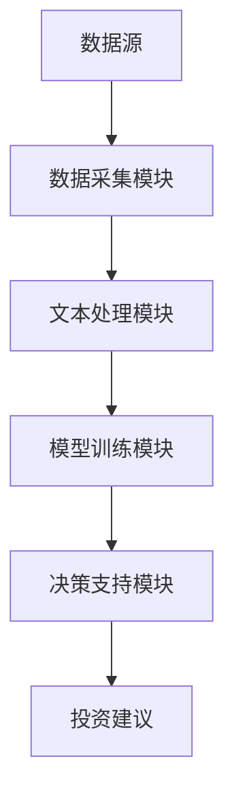
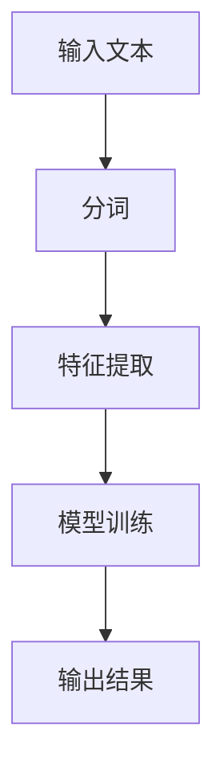

                 


# 特价股票投资中的自然语言理解辅助决策系统

## 关键词：自然语言处理、股票投资、深度学习、文本挖掘、情感分析

## 摘要：  
本文探讨了如何利用自然语言处理（NLP）技术辅助特价股票投资决策。通过分析市场新闻、社交媒体和公司公告等文本数据，NLP可以帮助投资者捕捉市场情绪、识别投资机会和风险。本文详细介绍了NLP在股票投资中的应用，从基础概念到系统设计，再到实际案例，全面解析了如何构建一个高效的自然语言理解辅助决策系统。

---

# 第一部分：自然语言处理基础

## 第1章：自然语言处理的基本概念

### 1.1 自然语言处理的定义与目标  
自然语言处理（NLP）是人工智能（AI）领域的一个重要分支，旨在让计算机能够理解和处理人类语言。其目标是通过文本数据分析，提取有用的信息，辅助决策。

### 1.2 自然语言处理的核心技术  
1. **分词（Tokenization）**：将文本分割成有意义的词语或短语。  
2. **实体识别（Named Entity Recognition,NER）**：识别文本中的专有名词，如公司名称、人名等。  
3. **情感分析（Sentiment Analysis）**：判断文本中的情感倾向，如正面、负面或中性。  
4. **文本分类（Text Classification）**：将文本归类到特定类别，如新闻类别或股票类别。  

### 1.3 自然语言处理在金融领域的应用  
1. **市场情绪分析**：通过分析新闻和社交媒体，判断市场情绪对股价的影响。  
2. **风险评估**：利用公司公告和财务报告，评估公司的风险状况。  
3. **投资决策支持**：基于文本数据，辅助投资者做出投资决策。

---

## 第2章：自然语言处理的关键技术

### 2.1 词袋模型与词嵌入  
词袋模型（Bag of Words, BoW）是一种简单的文本表示方法，将文本表示为词频向量。  
词嵌入（Word Embedding）是一种更高效的表示方法，如Word2Vec和GloVe，能够捕捉词语之间的语义关系。

### 2.2 分句与句法分析  
分句（Sentence Segmentation）将文本分割成句子。  
句法分析（Syntax Analysis）研究句子的结构，如主语、谓语等，帮助理解句子的含义。

### 2.3 情感分析与文本分类  
情感分析通过判断文本的情感倾向，帮助投资者识别市场情绪。  
文本分类将文本分为不同类别，如新闻类别或公司公告类别。

---

# 第二部分：股票投资基础

## 第3章：特价股票的定义与特点

### 3.1 特价股票的定义  
特价股票指的是价格低于市场平均水平的股票，通常被认为是低价股，具有较高的增长潜力。

### 3.2 特价股票的特点  
1. **低估值**：通常市盈率、市净率较低，被认为有较高的投资价值。  
2. **高波动性**：价格波动较大，容易受到市场情绪的影响。  
3. **风险较高**：由于价格较低，可能存在较高的市场风险。

---

## 第4章：股票市场的分析

### 4.1 市场结构分析  
分析股票市场的结构，包括上市公司、投资者、交易所等。

### 4.2 技术分析方法  
1. **K线图**：通过价格走势分析市场的买卖情况。  
2. **移动平均线**：通过计算一定时间内的平均价格，判断价格趋势。  
3. **相对强弱指数（RSI）**：衡量市场的超买或超卖状态。

### 4.3 基本面分析方法  
1. **市盈率（P/E）**：衡量股票的估值。  
2. **市净率（P/B）**：衡量股票与资产净值的比率。  
3. **股息率**：衡量股票的分红能力。

---

# 第三部分：自然语言理解在股票投资中的应用

## 第5章：市场情绪分析

### 5.1 新闻分析  
通过分析新闻标题和内容，判断市场情绪对股价的影响。  
例如，使用情感分析模型判断新闻是正面、负面还是中性。

### 5.2 社交媒体分析  
分析社交媒体上的评论和帖子，捕捉市场情绪。  
例如，使用文本分类模型识别社交媒体上的乐观或悲观情绪。

### 5.3 公司公告分析  
分析公司公告，判断公司的财务状况和经营策略。  
例如，使用实体识别模型提取公司名称和公告内容。

---

## 第6章：市场趋势识别

### 6.1 识别行业趋势  
通过分析新闻和公告，识别行业的整体发展趋势。  
例如，分析科技行业的新闻，判断行业是否处于上升期。

### 6.2 识别公司新闻  
通过分析公司公告，判断公司的重大事件，如并购、重组等。

### 6.3 识别市场波动  
通过分析社交媒体和新闻，判断市场波动的原因。

---

## 第7章：投资决策支持

### 7.1 辅助选股  
通过分析公司公告和财务报告，筛选出具有投资价值的股票。  
例如，使用文本分类模型将公司公告分为不同类别，辅助投资者选择投资标的。

### 7.2 风险预警  
通过分析市场情绪和公司公告，预警潜在的投资风险。  
例如，当市场情绪出现负面转向时，及时提示投资者规避风险。

### 7.3 投资策略优化  
通过分析文本数据，优化投资策略，如分散投资、止盈止损等。

---

# 第四部分：系统设计与实现

## 第8章：系统架构设计

### 8.1 系统功能模块  
1. **数据采集模块**：采集新闻、社交媒体和公司公告等文本数据。  
2. **文本处理模块**：对文本数据进行分词、情感分析等处理。  
3. **模型训练模块**：训练NLP模型，如情感分析模型和文本分类模型。  
4. **决策支持模块**：根据模型输出，生成投资建议。

### 8.2 系统架构图  


---

## 第9章：算法原理与实现

### 9.1 情感分析算法  
使用深度学习模型（如LSTM或BERT）进行情感分析，判断文本的情感倾向。

### 9.2 文本分类算法  
使用支持向量机（SVM）或随机森林（Random Forest）进行文本分类，将文本分为不同类别。

### 9.3 算法流程图  


---

## 第10章：系统实现与优化

### 10.1 数据流设计  
1. 数据采集：从新闻网站、社交媒体和公司公告中获取文本数据。  
2. 数据处理：对文本数据进行清洗、分词和特征提取。  
3. 模型训练：训练情感分析和文本分类模型。  
4. 系统输出：根据模型输出生成投资建议。

### 10.2 系统优化  
1. 数据预处理：使用更高效的分词工具，如spaCy。  
2. 模型优化：使用更先进的深度学习模型，如BERT。  
3. 系统性能优化：优化数据存储和查询效率。

---

# 第五部分：项目实战

## 第11章：项目环境与工具安装

### 11.1 环境搭建  
安装Python、Jupyter Notebook和相关库（如NLTK、spaCy、Keras）。  
```bash
pip install numpy
pip install pandas
pip install spacy
pip install keras
```

### 11.2 数据获取  
使用API或爬虫获取新闻、社交媒体和公司公告数据。

---

## 第12章：系统核心实现

### 12.1 情感分析模型实现  
使用Python代码实现情感分析模型。  
```python
import numpy as np
from sklearn.feature_extraction.text import TfidfVectorizer
from sklearn.svm import SVC

# 数据预处理
texts = [...]  # 文本数据
labels = [...]  # 情感标签

# 特征提取
vectorizer = TfidfVectorizer()
X = vectorizer.fit_transform(texts)

# 模型训练
model = SVC()
model.fit(X, labels)

# 模型预测
test_texts = [...]  # 测试文本
test_X = vectorizer.transform(test_texts)
predictions = model.predict(test_X)
```

### 12.2 文本分类模型实现  
使用深度学习模型（如LSTM）进行文本分类。  
```python
import keras
from keras.models import Sequential
from keras.layers import LSTM, Dense, Embedding

# 模型定义
model = Sequential()
model.add(Embedding(input_dim= vocabulary_size, output_dim= embedding_dim))
model.add(LSTM(units= lstm_units))
model.add(Dense(units= num_classes, activation='softmax'))

# 模型训练
model.compile(loss='sparse_categorical_crossentropy', optimizer='adam', metrics=['accuracy'])
model.fit(X_train, y_train, epochs= epochs, batch_size= batch_size)
```

---

## 第13章：实际案例分析

### 13.1 案例背景  
假设我们有某科技公司的新闻数据，需要判断新闻的情感倾向。

### 13.2 数据处理  
对新闻数据进行分词和特征提取，得到TF-IDF向量。

### 13.3 模型训练  
使用SVM或LSTM模型训练情感分析模型。

### 13.4 模型预测  
对测试新闻进行情感分析，输出情感倾向。

---

## 第14章：项目总结与优化

### 14.1 项目总结  
总结项目的主要成果，如成功构建了一个基于NLP的股票投资辅助决策系统。

### 14.2 系统优化  
提出进一步优化的方向，如引入更先进的模型（如BERT）、增加更多的数据源等。

### 14.3 注意事项  
提醒投资者，NLP辅助决策系统仅供参考，投资需谨慎。

---

# 结语  
通过自然语言理解技术，我们可以更高效地分析市场信息，辅助特价股票投资决策。然而，NLP技术的应用需要结合具体场景，不断优化和调整，才能更好地服务于投资决策。

---

作者：AI天才研究院

