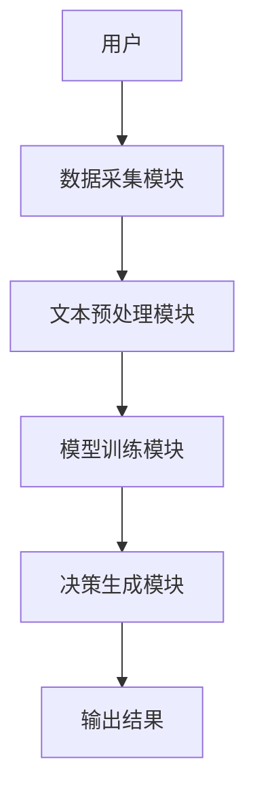

                 

# 特价股票投资中的自然语言生成辅助决策系统

> 关键词：特价股票、自然语言生成、股票投资、决策系统、NLP

> 摘要：本文探讨了自然语言生成（NLP）技术在特价股票投资中的应用，特别是如何利用NLP辅助投资者进行决策。文章详细分析了特价股票的特点、自然语言生成的核心原理及其在股票市场中的应用场景，提出了一个基于NLP的股票投资辅助决策系统架构，并通过具体案例展示了系统的实现过程和实际效果。

---

## 第一部分: 特价股票投资中的自然语言生成辅助决策系统概述

### 第1章: 特价股票投资与自然语言生成的背景介绍

#### 1.1 特价股票投资的定义与特点
- **1.1.1 特价股票的定义**  
  特价股票是指价格相对较低，但具有增长潜力的股票。这类股票通常在市场低迷或公司处于困境时出现，投资者可以通过低价买入，等待价格回升时卖出获利。

- **1.1.2 特价股票投资的核心要素**  
  - 市场分析：研究宏观经济、行业趋势和公司基本面。  
  - 估值分析：评估股票的内在价值，判断其是否被市场低估。  
  - 风险管理：控制投资风险，避免因市场波动导致的重大损失。

- **1.1.3 特价股票投资的市场现状**  
  随着市场的波动性增加，投资者越来越依赖数据和技术工具来辅助决策。特价股票的投资需要精准的市场分析和快速的决策能力，这为自然语言生成技术提供了广阔的应用空间。

---

#### 1.2 自然语言生成技术的定义与特点
- **1.2.1 自然语言生成的定义**  
  自然语言生成（NLP）是人工智能领域的一个重要分支，旨在让计算机能够理解并生成人类语言文本。它结合了语言学、机器学习和深度学习技术。

- **1.2.2 自然语言生成的核心技术**  
  - 文本预处理：包括分词、去停用词、词干提取等。  
  - 模型训练：基于深度学习的模型（如RNN、Transformer、GPT）进行训练，学习语言的分布规律。  
  - 文本生成：通过模型生成符合上下文的自然语言文本。

- **1.2.3 自然语言生成的应用领域**  
  - 金融领域：股票分析、市场报告生成、新闻摘要。  
  - 医疗领域：病历分析、用药建议生成。  
  - 教育领域：智能辅导系统、自动批改作业。

---

#### 1.3 特价股票投资中自然语言生成的应用前景
- **1.3.1 自然语言生成在股票投资中的潜在应用**  
  - 通过分析新闻、社交媒体和公司公告，生成市场情绪指标。  
  - 帮助投资者快速理解复杂的财务报告和市场动态。  
  - 自动生成投资建议，辅助投资者做出决策。

- **1.3.2 自然语言生成辅助决策的优势**  
  - 提高信息处理效率，减少人工分析时间。  
  - 通过实时生成文本，捕捉市场动态，提供及时的投资建议。  
  - 降低人为情绪干扰，提供基于数据的理性决策支持。

- **1.3.3 自然语言生成在股票投资中的挑战与机遇**  
  - 挑战：数据质量、模型泛化能力、市场波动性。  
  - 机遇：技术进步、数据量增加、应用场景多样化。

---

## 第2章: 自然语言生成辅助决策的核心概念与联系

### 2.1 自然语言生成的原理
- **2.1.1 自然语言生成的基本原理**  
  自然语言生成的核心是基于概率分布的模型，通过训练数据学习语言的规律，生成符合语法规则和上下文的文本。例如，基于RNN的生成模型会根据当前词生成下一个词的概率分布。

- **2.1.2 自然语言生成的模型结构**  
  - RNN（循环神经网络）：适合处理序列数据，但存在梯度消失问题。  
  - Transformer：基于自注意力机制，能够捕捉长距离依赖关系。  
  - GPT（生成式预训练转换器）：通过大量文本数据预训练，生成高质量的自然语言文本。

- **2.1.3 自然语言生成的关键技术**  
  - 文本预处理：清洗、分词、去停用词。  
  - 模型训练：使用大规模数据进行监督学习。  
  - 生成策略：基于贪心算法或随机采样生成文本。

---

### 2.2 自然语言生成与股票投资的联系
- **2.2.1 自然语言生成在股票市场分析中的作用**  
  - 通过分析新闻、社交媒体和公司公告，生成市场情绪指标。  
  - 帮助投资者快速理解复杂的财务报告和市场动态。  
  - 自动生成投资建议，辅助投资者做出决策。

- **2.2.2 自然语言生成与股票投资决策的关系**  
  - 自然语言生成可以辅助投资者快速获取信息，减少信息处理的时间成本。  
  - 通过生成文本摘要，帮助投资者抓住关键信息，做出更明智的决策。  
  - 提供基于文本的情感分析，预测市场趋势。

- **2.2.3 自然语言生成在股票投资中的具体应用场景**  
  - 自动生成市场报告：每天生成一份市场分析报告，总结市场动态。  
  - 生成投资建议：根据市场数据和模型预测，生成买入或卖出的建议。  
  - 实时监控新闻：通过实时生成新闻摘要，帮助投资者捕捉市场机会。

---

## 第3章: 自然语言生成辅助决策的系统架构设计

### 3.1 系统功能设计
- **3.1.1 数据采集模块**  
  - 数据来源：新闻网站、社交媒体、公司公告、财务报告。  
  - 数据清洗：去除无效数据，保留有用信息。  
  - 数据存储：将清洗后的数据存储在数据库中。

- **3.1.2 文本预处理模块**  
  - 分词：将文本分割成词语或短语。  
  - 去停用词：去除无意义的词汇（如“的”、“了”等）。  
  - 词干提取：将词语还原为基本形式。

- **3.1.3 模型训练模块**  
  - 数据加载：从数据库中加载预处理后的数据。  
  - 模型选择：选择合适的NLP模型（如GPT、BERT）。  
  - 模型训练：使用训练数据训练模型，优化参数。

- **3.1.4 决策生成模块**  
  - 输入处理：接收用户输入的查询或数据。  
  - 文本生成：通过模型生成符合要求的自然语言文本。  
  - 输出结果：将生成的文本返回给用户或系统。

---

### 3.2 系统架构设计
- **3.2.1 系统整体架构图**

- **3.2.2 数据流与模块交互关系**  
  用户输入查询或数据，数据采集模块获取相关信息，文本预处理模块对数据进行清洗和处理，模型训练模块训练生成模型，最后决策生成模块根据输入生成文本并输出结果。

---

## 第4章: 自然语言生成辅助决策的算法原理

### 4.1 文本生成模型的算法原理
- **4.1.1 基于RNN的文本生成模型**  
  RNN通过循环结构处理序列数据，每个时间步生成一个词，依赖于前面的词。

- **4.1.2 基于Transformer的文本生成模型**  
  Transformer基于自注意力机制，能够捕捉长距离依赖关系，生成更高质量的文本。

- **4.1.3 基于GPT的文本生成模型**  
  GPT通过大量文本数据预训练，生成高质量的自然语言文本，适合股票市场分析和投资建议生成。

---

### 4.2 算法实现与优化
- **4.2.1 算法实现流程**  
  1. 数据预处理：清洗、分词、去停用词。  
  2. 模型选择：选择合适的NLP模型（如GPT、BERT）。  
  3. 模型训练：使用训练数据训练模型，优化参数。  
  4. 文本生成：通过模型生成符合要求的自然语言文本。

- **4.2.2 算法优化策略**  
  - 参数调整：优化学习率、批量大小等超参数。  
  - 模型改进：引入注意力机制，提升生成质量。  
  - 数据增强：通过数据增强技术（如随机删除词）提升模型的泛化能力。

- **4.2.3 算法性能评估**  
  - 生成文本的质量：通过 BLEU、ROUGE 等指标评估生成文本的质量。  
  - 模型的运行效率：评估模型的训练时间和生成速度。  
  - 模型的稳定性：评估模型在不同数据集上的表现是否稳定。

---

### 4.3 自然语言生成的数学公式
- **交叉熵损失函数**  
  $$ \text{损失} = -\frac{1}{N} \sum_{i=1}^{N} \sum_{j=1}^{M} y_{ij} \log p(y_{ij}) $$  
  其中，$N$ 是训练数据的数量，$M$ 是词汇表的大小，$y_{ij}$ 是目标分布，$p(y_{ij})$ 是模型生成的概率。

- **梯度下降算法**  
  $$ \theta_{t+1} = \theta_t - \eta \frac{\partial L}{\partial \theta_t} $$  
  其中，$\theta_t$ 是当前参数，$\eta$ 是学习率，$L$ 是损失函数。

---

## 第5章: 自然语言生成辅助决策的项目实战

### 5.1 项目环境搭建
- **5.1.1 开发工具安装**  
  - 安装 Python 和 pip。  
  - 安装必要的库（如 TensorFlow、Keras、PyTorch）。

- **5.1.2 数据集准备**  
  - 收集股票市场的相关数据（如新闻、社交媒体评论）。  
  - 数据清洗和预处理。

- **5.1.3 环境配置与测试**  
  - 配置虚拟环境，安装依赖库。  
  - 测试代码是否可以正常运行。

---

### 5.2 系统核心实现
- **5.2.1 数据采集与预处理**  
  - 使用 API 获取新闻数据。  
  - 分词和去停用词处理。

- **5.2.2 模型训练与优化**  
  - 选择合适的模型（如 GPT）。  
  - 调整超参数，优化模型性能。

- **5.2.3 决策生成与展示**  
  - 生成投资建议。  
  - 展示生成的文本。

---

### 5.3 项目应用与分析
- **5.3.1 项目实现的效果展示**  
  通过实际案例展示系统生成的文本，如市场报告和投资建议。

- **5.3.2 项目应用的总结与分析**  
  - 系统能够有效辅助投资者进行决策。  
  - 生成的文本质量较高，具有实际应用价值。  
  - 系统运行效率较高，适合实时应用。

---

## 第6章: 总结与展望

### 6.1 总结
- 自然语言生成技术在特价股票投资中的应用前景广阔。  
- 本文提出了一个基于NLP的股票投资辅助决策系统，通过具体案例展示了系统的实现过程和实际效果。

---

### 6.2 展望
- **模型优化**：进一步优化模型，提升生成文本的质量。  
- **数据多样性**：引入更多样化的数据源，提升系统的泛化能力。  
- **实时应用**：将系统应用于实际股票交易中，验证其效果。

---

## 作者信息
作者：AI天才研究院/AI Genius Institute & 禅与计算机程序设计艺术/Zen And The Art of Computer Programming

