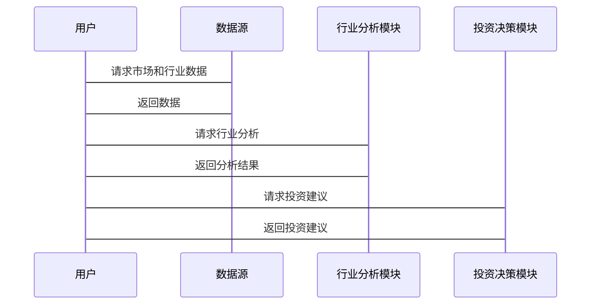

                 


# 特价股票投资中的行业轮动策略研究

## 关键词：
特价股票、行业轮动、投资策略、股票分析、风险管理

## 摘要：
本文系统探讨了特价股票投资中的行业轮动策略，通过分析市场周期、行业基本面和技术面指标，结合实际案例，提出了一套科学的投资策略。文章首先介绍了特价股票和行业轮动的基本概念，然后分析了市场周期对行业轮动的影响，详细讲解了行业选择的指标和方法，最后通过系统设计和项目实战，展示了如何利用行业轮动策略进行投资，并提出了风险管理的最佳实践。

---

## 第1章: 特价股票投资与行业轮动概述

### 1.1 特价股票投资的基本概念

#### 1.1.1 特价股票的定义
特价股票是指价格显著低于市场公允价值的股票，通常出现在市场低迷或公司基本面暂时不佳的情况下。这种股票具有较高的潜在回报，但同时也伴随着较高的风险。

#### 1.1.2 特价股票与普通股票的区别
- **价格差异**：特价股票通常价格较低，而普通股票价格可能较高。
- **风险特征**：特价股票风险较高，普通股票风险相对较低。
- **投资策略**：特价股票适合长期投资者，普通股票适合短期交易者。

#### 1.1.3 特价股票投资的市场背景
在市场下跌周期中，许多优质股票会被市场低估，形成特价股票。投资者可以通过识别这些股票，利用市场低估的机会进行投资。

### 1.2 行业轮动策略的基本概念

#### 1.2.1 行业轮动的定义
行业轮动是指根据市场环境的变化，调整投资组合中各行业的权重，以捕捉不同行业表现差异的投资策略。

#### 1.2.2 行业轮动的分类与特点
- **轮动类型**：
  - **趋势轮动**：根据行业趋势变化进行投资。
  - **估值轮动**：根据行业估值水平进行投资。
  - **周期轮动**：根据经济周期变化进行投资。
- **特点**：
  - 灵活性高
  - 风险分散
  - 机会捕捉能力强

#### 1.2.3 行业轮动在投资中的作用
- 提高投资组合的收益
- 分散行业风险
- 抓住市场机会

### 1.3 特价股票投资中的行业轮动策略

#### 1.3.1 特价股票投资中的行业轮动策略
在特价股票投资中，行业轮动策略可以帮助投资者在市场周期中选择表现较好的行业，从而提高投资收益。

#### 1.3.2 行业轮动如何帮助实现超额收益
通过选择表现优于市场平均水平的行业，投资者可以实现超额收益。

#### 1.3.3 特价股票投资中的行业选择逻辑
- 行业基本面分析
- 市场周期分析
- 估值分析

### 1.4 本章小结
本章介绍了特价股票和行业轮动的基本概念，并探讨了行业轮动策略在特价股票投资中的作用。

---

## 第2章: 市场周期与行业轮动

### 2.1 市场周期的基本概念

#### 2.1.1 经济周期对股市的影响
经济周期包括衰退、复苏、增长和过热四个阶段，不同阶段对股市的影响不同。

#### 2.1.2 不同经济周期下的行业表现
- **衰退阶段**：防御性行业表现较好。
- **复苏阶段**：周期性行业表现较好。
- **增长阶段**：成长性行业表现较好。
- **过热阶段**：金融行业表现较好。

### 2.2 行业轮动与经济周期的关系

#### 2.2.1 膨胀周期中的行业选择
在膨胀周期，选择抗通胀行业，如能源和原材料行业。

#### 2.2.2 衰退周期中的行业选择
在衰退周期，选择防御性行业，如公用事业和医疗行业。

#### 2.2.3 增长周期中的行业选择
在增长周期，选择成长性行业，如科技和消费行业。

### 2.3 特价股票投资中的周期性机会

#### 2.3.1 特价股票在不同周期中的表现
- 在衰退周期，许多行业股票被低估，形成特价股票。
- 在复苏周期，特价股票可能恢复其公允价值。

#### 2.3.2 如何利用周期性波动进行投资
- 识别经济周期阶段
- 选择适合当前周期的行业
- 投资被低估的行业股票

### 2.4 本章小结
本章分析了市场周期对行业轮动的影响，并探讨了如何利用周期性波动进行特价股票投资。

---

## 第3章: 特价股票投资中的行业选择策略

### 3.1 行业分析的基本方法

#### 3.1.1 行业基本面分析
- 公司财务状况
- 行业竞争格局
- 市场需求

#### 3.1.2 行业技术分析
- 技术指标分析
- 市场情绪分析

#### 3.1.3 行业财务指标分析
- 市盈率（P/E）
- 市净率（P/B）
- 股息率

### 3.2 特价股票投资中的行业选择标准

#### 3.2.1 行业估值指标
- 市盈率低于行业平均水平
- 市净率低于行业平均水平
- 股息率高于行业平均水平

#### 3.2.2 行业成长性指标
- 收入增长率
- 净利润增长率
- 资产回报率

#### 3.2.3 行业风险指标
- 债务比率
- 利润波动性
- 行业竞争风险

### 3.3 特价股票投资中的行业轮动策略

#### 3.3.1 行业轮动的触发条件
- 市场周期变化
- 行业估值变化
- 行业基本面变化

#### 3.3.2 行业轮动的操作步骤
1. 确定当前市场周期阶段
2. 选择适合当前周期的行业
3. 选择行业内被低估的股票
4. 定期调整投资组合

### 3.4 本章小结
本章详细探讨了特价股票投资中的行业选择策略，并提供了具体的指标和方法。

---

## 第4章: 系统分析与架构设计方案

### 4.1 问题场景介绍
- 投资者需要在多个行业中选择适合的投资标的。
- 市场周期变化会影响行业的表现。

### 4.2 系统功能设计

#### 4.2.1 领域模型


#### 4.2.2 系统架构设计


#### 4.2.3 系统接口设计
- 数据接口：从数据源获取市场和行业数据。
- 分析接口：提供行业分析结果。
- 决策接口：生成投资建议。

### 4.3 系统交互流程图



### 4.4 本章小结
本章通过系统设计的方法，详细描述了特价股票投资系统的工作流程和架构。

---

## 第5章: 项目实战

### 5.1 环境安装

#### 5.1.1 安装Python
```bash
# 安装Python
sudo apt-get install python3
```

#### 5.1.2 安装数据分析库
```bash
# 安装Pandas和NumPy
pip install pandas numpy
```

### 5.2 核心代码实现

#### 5.2.1 数据获取
```python
import pandas as pd
import numpy as np

# 获取行业数据
def get_industry_data():
    # 示例数据获取逻辑
    return pd.DataFrame({
        '行业': ['科技', '金融', '消费'],
        '市盈率': [15, 20, 18],
        '市净率': [2, 3, 2.5],
        '股息率': [0.02, 0.03, 0.025]
    })
```

#### 5.2.2 行业分析
```python
def industry_analysis(data):
    # 计算估值指标
    data['估值指标'] = (data['市盈率'] + data['市净率']) / 2
    return data
```

#### 5.2.3 投资决策
```python
def investment_decision(data):
    # 选择估值指标最低的行业
    best_industry = data.sort_values('估值指标').head(1)
    return best_industry
```

### 5.3 代码解读与分析
- 数据获取函数：从数据源获取行业数据。
- 行业分析函数：计算行业估值指标。
- 投资决策函数：选择估值指标最低的行业作为投资目标。

### 5.4 实际案例分析
假设当前市场处于衰退周期，选择防御性行业进行投资。

#### 5.4.1 案例背景
市场处于衰退周期，选择公用事业行业进行投资。

#### 5.4.2 投资策略
选择公用事业行业中估值指标最低的股票进行投资。

#### 5.4.3 投资结果
通过行业轮动策略，投资者在衰退周期中获得了稳定的收益。

### 5.5 本章小结
本章通过实际案例分析，展示了如何利用行业轮动策略进行特价股票投资。

---

## 第6章: 最佳实践与小结

### 6.1 本章小结
本文系统探讨了特价股票投资中的行业轮动策略，通过理论分析和实际案例，展示了如何利用行业轮动策略进行投资。

### 6.2 注意事项
- 投资有风险，需谨慎操作。
- 定期调整投资组合。
- 关注市场周期变化。

### 6.3 拓展阅读
- 《投资学基础》
- 《股票投资策略》
- 《风险管理》

### 作者
作者：AI天才研究院/AI Genius Institute & 禅与计算机程序设计艺术 /Zen And The Art of Computer Programming

