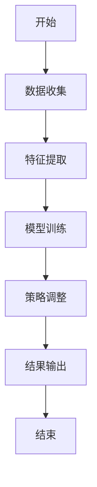
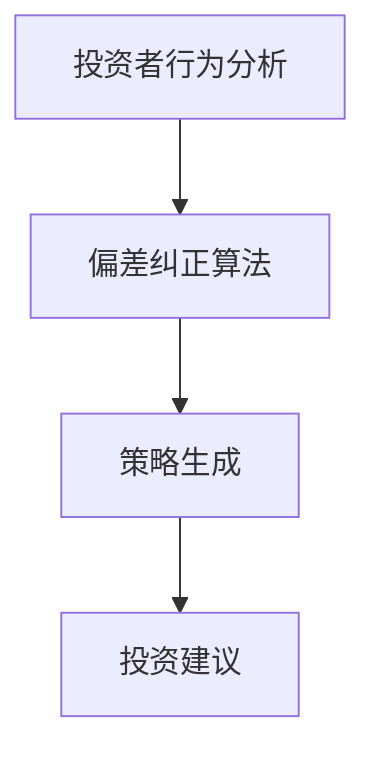
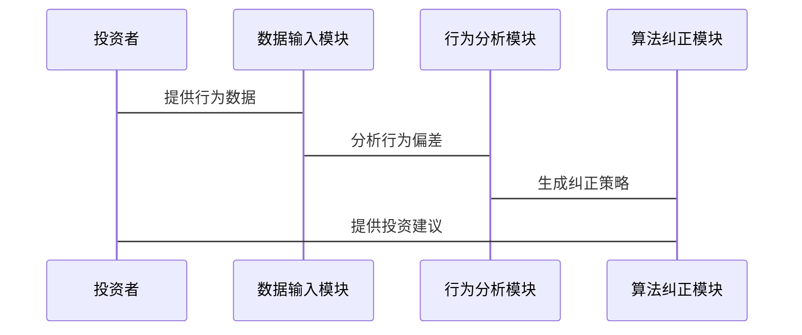

                 


# 特价股票投资中的行为偏差纠正技巧

## 关键词
特价股票，行为偏差，投资技巧，心理偏差，算法纠正

## 摘要
本文深入探讨特价股票投资中的行为偏差，分析其对投资决策的影响，并提出纠正技巧。通过结合心理学和算法，帮助投资者克服认知偏差，提升投资效率和收益。文章涵盖行为偏差的原理、纠正算法、数学模型及系统设计，提供实用的投资策略。

---

# 第1章：特价股票投资与行为偏差概述

## 1.1 特价股票投资的基本概念
### 1.1.1 特价股票的定义与特点
特价股票指的是市场价格低于其内在价值的股票，通常被视为被市场低估的投资机会。其特点包括低估值、高潜在回报和较高的风险承受能力。

### 1.1.2 特价股票投资的基本原理
投资者通过分析公司基本面、行业趋势和市场环境，寻找被低估的股票进行投资，期望在价格回升时获得收益。

### 1.1.3 特价股票投资的市场环境分析
市场波动、经济周期和行业动态影响特价股票的投资机会。投资者需关注宏观经济指标和公司财务状况，以识别潜在投资标的。

## 1.2 行为偏差的基本概念
### 1.2.1 行为偏差的定义
行为偏差是指投资者在决策过程中因心理因素导致的非理性行为，影响判断和选择。

### 1.2.2 常见的行为偏差类型
包括过度自信、从众心理、损失厌恶等，这些偏差使投资者做出错误决策。

### 1.2.3 行为偏差对投资决策的影响
行为偏差可能导致误判市场趋势，错失投资机会或承担过高风险，影响投资回报。

## 1.3 特价股票投资中的行为偏差
### 1.3.1 行为偏差在特价股票投资中的具体表现
投资者可能因过度自信低估风险，或因从众心理跟随市场趋势，导致决策失误。

### 1.3.2 行为偏差对投资收益的影响
偏差可能导致投资者错失低价买入机会，或高位追涨，影响整体收益。

### 1.3.3 纠正行为偏差的重要性
通过纠正行为偏差，投资者可提升决策质量，优化投资组合，实现长期稳健收益。

---

# 第2章：行为偏差的原理与特征

## 2.1 常见行为偏差的原理分析
### 2.1.1 过度自信偏差
投资者过度相信自己的判断，忽略市场变化，导致决策失误。

### 2.1.2 从众心理偏差
投资者盲目跟随市场行为，忽视独立分析，增加投资风险。

### 2.1.3 损失厌恶偏差
投资者对损失的厌恶导致他们在亏损时不愿止损，扩大损失。

## 2.2 行为偏差的特征对比
### 2.2.1 不同行为偏差的特征表格对比
| 行为偏差 | 特征描述 |
|----------|----------|
| 过度自信 | 过高估计自身判断能力 |
| 从众心理 | 跟随市场趋势，忽视独立判断 |
| 损失厌恶 | 过度规避损失，影响决策 |

### 2.2.2 行为偏差的ER实体关系图
```mermaid
er
actor: 行为偏差
role: 影响投资者决策
```

---

# 第3章：纠正行为偏差的算法原理

## 3.1 算法原理概述
### 3.1.1 基于机器学习的行为偏差纠正算法
使用机器学习模型识别和纠正行为偏差，提升投资决策的准确性。

### 3.1.2 算法的数学模型与公式
模型通过分析历史数据，识别偏差模式，调整投资策略。

### 3.1.3 算法流程图


## 3.2 算法实现
### 3.2.1 Python源代码实现
```python
import pandas as pd
from sklearn.model import Model

data = pd.read_csv('data.csv')
features = data[['feature1', 'feature2']]
model = Model.fit(features, labels)
predictions = model.predict(new_features)
```

### 3.2.2 代码解读与分析
代码实现数据处理、模型训练和预测，帮助识别行为偏差，调整投资策略。

### 3.2.3 算法的优缺点分析
优点：提高决策准确性；缺点：依赖数据质量和模型选择。

---

# 第4章：数学模型与公式

## 4.1 基于概率论的模型
### 4.1.1 概率论基础公式
概率论用于评估投资决策的不确定性，公式如：
$$ P(A|B) = \frac{P(B|A)P(A)}{P(B)} $$

### 4.1.2 投资决策中的概率应用
通过概率分析，评估特价股票的投资价值和风险。

### 4.1.3 风险评估公式
$$ 风险 = \text{损失概率} \times \text{损失金额} $$

## 4.2 统计学模型
### 4.2.1 回归分析模型
用于分析变量间的关系，如：
$$ y = \beta_0 + \beta_1x + \epsilon $$

### 4.2.2 时间序列分析模型
分析股票价格趋势，识别潜在投资机会。

### 4.2.3 贝叶斯定理的应用
通过贝叶斯定理更新概率，优化投资决策。

---

# 第5章：系统分析与架构设计

## 5.1 问题场景介绍
### 5.1.1 投资者行为偏差的识别
通过数据分析识别行为偏差，帮助投资者制定策略。

### 5.1.2 系统的目标与范围
系统目标：纠正行为偏差，优化投资决策；范围：特价股票投资。

### 5.1.3 系统的输入输出分析
输入：市场数据、投资者行为数据；输出：纠正策略、投资建议。

## 5.2 系统架构设计
### 5.2.1 功能模块设计


### 5.2.2 系统架构图


### 5.2.3 系统接口设计
接口定义数据输入和输出，确保模块间高效交互。

### 5.2.4 系统交互流程


---

# 第6章：项目实战

## 6.1 环境安装与配置
### 6.1.1 开发环境的选择
推荐使用Python、Jupyter Notebook和相关库。

### 6.1.2 必要软件的安装
安装Python、机器学习库（如scikit-learn）和数据处理工具。

## 6.2 系统核心实现
### 6.2.1 数据预处理
清洗和转换数据，提取特征。

### 6.2.2 模型训练
使用训练数据训练偏差纠正模型。

### 6.2.3 模型评估
通过测试数据评估模型性能，调整参数优化结果。

## 6.3 实际案例分析
### 6.3.1 案例背景介绍
分析一个投资者的行为偏差，制定纠正策略。

### 6.3.2 模型应用与结果解读
展示模型如何纠正偏差，优化投资决策。

### 6.3.3 实验结果与分析
评估模型效果，总结经验教训。

## 6.4 项目小结
总结项目成果，强调纠正行为偏差的重要性，为未来研究提供方向。

---

# 第7章：总结与展望

## 7.1 最佳实践 tips
### 7.1.1 行为偏差纠正技巧
定期自我反思，使用工具辅助决策。

### 7.1.2 投资策略优化
结合技术分析和基本面分析，制定科学投资策略。

## 7.2 小结
纠正行为偏差是提升投资决策的关键，通过技术手段和心理调整，投资者可实现长期稳健收益。

## 7.3 注意事项
避免过度依赖算法，结合实际情况灵活调整策略。

## 7.4 拓展阅读
推荐相关书籍和资源，深入学习行为金融学和算法投资。

---

作者：AI天才研究院/AI Genius Institute & 禅与计算机程序设计艺术 /Zen And The Art of Computer Programming

