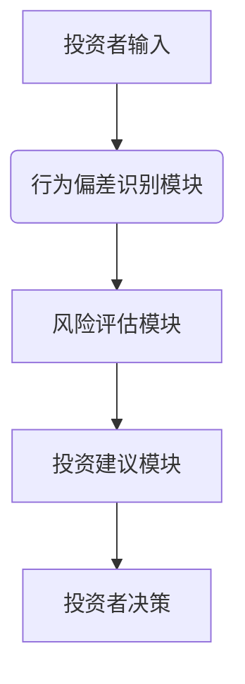
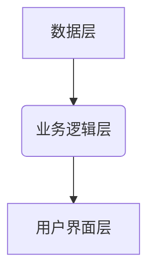
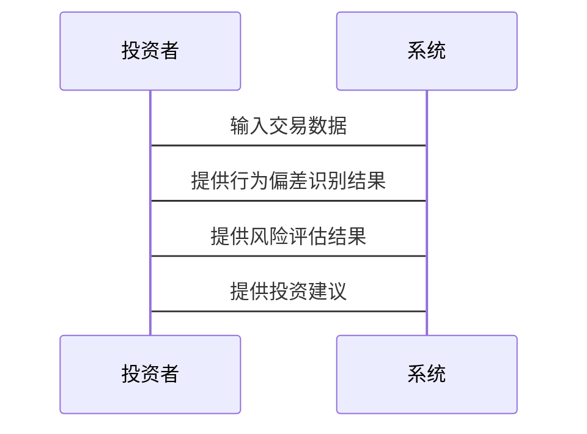

                 


# 特价股票投资中的行为偏差纠正方法

## 关键词：行为偏差, 投资决策, 特价股票, 认知行为疗法, 投资策略

## 摘要：本文系统地探讨了特价股票投资中投资者常见的行为偏差，分析了这些偏差对投资决策的影响，并提出了一系列纠正行为偏差的方法，包括认知行为疗法、决策日志和风险厌恶系数模型等。文章通过数学公式和算法流程图，详细阐述了如何通过理性分析和系统设计来纠正行为偏差，从而提升投资决策的科学性和有效性。

---

# 第一部分: 特价股票投资中的行为偏差背景介绍

## 第1章: 特价股票投资中的行为偏差概述

### 1.1 行为偏差的定义与特点
行为偏差是指投资者在决策过程中由于心理因素或认知局限，导致偏离理性决策的倾向。在特价股票投资中，行为偏差尤为明显，因为特价股票市场的波动性和不确定性往往会让投资者陷入情绪化决策。

#### 1.1.1 行为偏差的定义
行为偏差是投资者在面对不确定性和复杂性时，由于认知局限、情绪影响或环境压力，偏离理性决策的倾向。这种偏差通常表现为过度自信、从众心理、损失厌恶等。

#### 1.1.2 行为偏差的核心特点
- **情绪驱动**：行为偏差往往由投资者的情绪（如贪婪或恐惧）引发。
- **非理性决策**：偏差导致的决策通常不符合长期利益，而是基于短期情绪或直觉。
- **市场敏感性**：特价股票市场的波动性和不确定性加剧了行为偏差的发生。

#### 1.1.3 行为偏差与投资决策的关系
行为偏差直接影响投资决策的质量，可能导致错误的投资选择。例如，投资者可能因为过度自信而追涨杀跌，或者因为从众心理而盲目跟风。

### 1.2 特价股票市场的特点
特价股票市场是一个高波动、低流动性、高风险的市场。这种市场的特点使得投资者更容易受到行为偏差的影响。

#### 1.2.1 特价股票市场的定义
特价股票市场是指那些价格波动剧烈、交易量较小、市场参与者较少的股票市场。这类市场通常具有较高的风险和不确定性。

#### 1.2.2 特价股票市场的参与者
- **散户投资者**：通常是个人投资者，容易受到情绪影响。
- **机构投资者**：虽然有专业的分析团队，但在极端市场条件下也可能出现行为偏差。
- **市场做市商**：负责维持市场流动性的参与者，也可能受到市场波动的影响。

#### 1.2.3 特价股票市场的波动性与风险
特价股票市场的波动性较高，价格变化剧烈，导致投资者面临较高的风险。这种高波动性容易引发投资者的行为偏差，如过度交易或恐慌性抛售。

### 1.3 投资者的行为偏差表现
投资者在特价股票市场中常见的行为偏差包括过度自信、从众心理、损失厌恶等。

#### 1.3.1 常见的行为偏差类型
- **过度自信**：投资者认为自己能够准确预测市场走势，导致过度交易。
- **从众心理**：投资者盲目跟随市场潮流，忽视独立分析。
- **损失厌恶**：投资者对损失的厌恶程度高于对收益的追求，导致卖出亏损股票的意愿较低。

#### 1.3.2 投资者的行为偏差案例分析
例如，投资者在面对股价下跌时，可能会选择割肉止损，而不是耐心持有。这种行为偏差可能导致错过后续反弹的机会。

#### 1.3.3 行为偏差对投资决策的影响
行为偏差会导致投资者做出错误的投资决策，如在高价时买入，在低价时卖出，从而导致投资损失。

### 1.4 行为偏差的边界与外延
行为偏差的边界是指其影响的范围和程度，而外延则是指其在不同市场和投资者中的表现。

#### 1.4.1 行为偏差的边界
- **个体差异**：不同投资者的行为偏差程度不同。
- **市场环境**：市场波动性、信息透明度等因素会影响行为偏差的发生。

#### 1.4.2 行为偏差的外延
- **文化差异**：不同文化背景的投资者可能表现出不同的行为偏差。
- **技术进步**：技术进步可能会减少某些类型的行为偏差，如通过算法交易减少情绪影响。

#### 1.4.3 行为偏差与理性决策的对比
理性决策是基于充分的信息和逻辑分析，而行为偏差则是由情绪和认知局限引发的非理性决策。

### 1.5 本章小结
本章介绍了行为偏差的定义、特点以及在特价股票投资中的表现。行为偏差是投资者在决策过程中常见的问题，需要通过系统的方法来纠正。

---

# 第二部分: 行为偏差的分类与影响

## 第2章: 行为偏差的分类

### 2.1 确认偏差
确认偏差是指投资者在决策过程中，倾向于寻找支持自己已有观点的信息，而忽视反驳信息。

#### 2.1.1 确认偏差的定义
确认偏差是投资者在决策过程中，倾向于寻找支持自己已有观点的信息，而忽视反驳信息。这种偏差可能导致投资者做出错误的决策。

#### 2.1.2 确认偏差的表现形式
- **信息过滤**：投资者只关注支持自己观点的信息，忽略其他信息。
- **选择性记忆**：投资者更容易记住支持自己观点的信息，而忘记反驳信息。

#### 2.1.3 确认偏差对投资决策的影响
确认偏差可能导致投资者做出错误的投资决策，如过度买入某只股票，而忽视市场风险。

### 2.2 损失厌恶
损失厌恶是指投资者对损失的厌恶程度高于对收益的追求，导致卖出亏损股票的意愿较低。

#### 2.2.1 损失厌恶的定义
损失厌恶是指投资者对损失的厌恶程度高于对收益的追求，导致卖出亏损股票的意愿较低。这种偏差可能导致投资者在亏损时过于保守，错失反弹机会。

#### 2.2.2 损失厌恶的表现形式
- **避免损失**：投资者倾向于卖出亏损股票，避免进一步亏损。
- **风险厌恶**：投资者在面对风险时，更倾向于选择低风险但低回报的投资。

#### 2.2.3 损失厌恶对投资决策的影响
损失厌恶可能导致投资者在亏损时做出错误的卖出决策，错失后续反弹机会。

### 2.3 过度自信
过度自信是指投资者对自己预测市场走势的能力过于自信，导致过度交易。

#### 2.3.1 过度自信的定义
过度自信是指投资者对自己预测市场走势的能力过于自信，导致过度交易。这种偏差可能导致投资者频繁买卖股票，增加交易成本。

#### 2.3.2 过度自信的表现形式
- **过度交易**：投资者频繁买卖股票，试图通过短期交易获利。
- **忽略风险**：投资者过于自信，忽视市场风险。

#### 2.3.3 过度自信对投资决策的影响
过度自信可能导致投资者过度交易，增加交易成本，同时忽视市场风险。

### 2.4 从众心理
从众心理是指投资者盲目跟随市场潮流，忽视独立分析。

#### 2.4.1 从众心理的定义
从众心理是指投资者盲目跟随市场潮流，忽视独立分析。这种偏差可能导致投资者在市场狂热时盲目跟风，在市场恐慌时盲目抛售。

#### 2.4.2 从众心理的表现形式
- **羊群效应**：投资者跟随市场大多数人的行为，导致市场波动加剧。
- **盲目跟风**：投资者在没有充分分析的情况下，跟随市场趋势进行投资。

#### 2.4.3 从众心理对投资决策的影响
从众心理可能导致投资者在市场狂热时高位买入，在市场恐慌时低位卖出，导致投资损失。

### 2.5 本章小结
本章分析了投资者在特价股票投资中常见的行为偏差，包括确认偏差、损失厌恶、过度自信和从众心理。这些偏差对投资决策有严重影响，需要通过系统的方法来纠正。

---

# 第三部分: 行为偏差纠正的方法论

## 第3章: 纠正行为偏差的策略

### 3.1 认知行为疗法
认知行为疗法（CBT）是一种通过改变投资者的认知模式来纠正行为偏差的方法。

#### 3.1.1 认知行为疗法的定义
认知行为疗法（CBT）是一种心理治疗方法，通过改变个体的认知模式来纠正其行为。在投资领域，CBT可以帮助投资者识别和纠正行为偏差。

#### 3.1.2 认知行为疗法的步骤
- **识别偏差**：投资者需要识别自己的行为偏差。
- **分析偏差**：分析偏差的原因和影响。
- **纠正偏差**：通过改变认知模式来纠正偏差。

#### 3.1.3 认知行为疗法的技巧
- **自我反思**：投资者需要定期反思自己的投资行为，识别偏差。
- **决策日志**：记录每次决策的动机和结果，分析偏差。
- **心理调节**：通过冥想、放松等方式调节情绪，减少行为偏差。

### 3.2 决策日志
决策日志是一种通过记录和分析投资决策来纠正行为偏差的方法。

#### 3.2.1 决策日志的定义
决策日志是指投资者记录每次投资决策的动机、过程和结果，通过分析来纠正行为偏差。

#### 3.2.2 决策日志的记录方法
- **动机分析**：记录每次决策的动机，识别情绪驱动的决策。
- **结果分析**：分析决策的结果，识别偏差的影响。
- **改进计划**：根据分析结果，制定改进计划。

#### 3.2.3 决策日志的使用技巧
- **定期回顾**：投资者需要定期回顾决策日志，识别模式。
- **量化分析**：通过量化分析，识别行为偏差的类型和程度。
- **反馈机制**：通过反馈机制，调整投资策略。

### 3.3 风险厌恶系数模型
风险厌恶系数模型是一种通过量化风险厌恶程度来纠正行为偏差的方法。

#### 3.3.1 风险厌恶系数模型的定义
风险厌恶系数模型是通过量化投资者对风险的厌恶程度，来纠正行为偏差的一种方法。

#### 3.3.2 风险厌恶系数模型的构建
- **定义变量**：定义投资者对风险的厌恶程度、市场风险溢价等变量。
- **构建模型**：通过数学公式，构建风险厌恶系数模型。
- **模型应用**：通过模型分析，识别行为偏差。

#### 3.3.3 风险厌恶系数模型的数学公式
$$ U = \sum_{i=1}^{n} p_i u(x_i) - \lambda \sum_{i=1}^{n} p_i r_i $$
其中，$U$ 是效用函数，$p_i$ 是概率，$u(x_i)$ 是效用函数，$\lambda$ 是风险厌恶系数，$r_i$ 是风险溢价。

#### 3.3.4 风险厌恶系数模型的优化
- **参数调整**：根据投资者的风险厌恶程度，调整模型参数。
- **模型验证**：通过实证分析，验证模型的有效性。
- **模型应用**：通过模型分析，识别行为偏差。

### 3.4 纠正行为偏差的步骤
纠正行为偏差需要通过系统的方法，逐步改变投资者的认知模式和决策习惯。

#### 3.4.1 纠正行为偏差的步骤
1. **识别偏差**：投资者需要识别自己的行为偏差。
2. **分析偏差**：分析偏差的原因和影响。
3. **纠正偏差**：通过改变认知模式来纠正偏差。

#### 3.4.2 纠正行为偏差的技巧
- **自我反思**：投资者需要定期反思自己的投资行为，识别偏差。
- **决策日志**：记录每次决策的动机和结果，分析偏差。
- **心理调节**：通过冥想、放松等方式调节情绪，减少行为偏差。

### 3.5 本章小结
本章介绍了纠正行为偏差的几种策略，包括认知行为疗法、决策日志和风险厌恶系数模型。这些方法可以帮助投资者识别和纠正行为偏差，提升投资决策的科学性和有效性。

---

# 第四部分: 行为偏差纠正的算法原理

## 第4章: 纠正行为偏差的算法原理

### 4.1 确认偏差纠正算法
确认偏差纠正算法是一种通过改变投资者的认知模式来纠正确认偏差的算法。

#### 4.1.1 确认偏差纠正算法的定义
确认偏差纠正算法是一种通过改变投资者的认知模式来纠正确认偏差的算法。该算法通过引入反向信息，帮助投资者克服信息过滤的问题。

#### 4.1.2 确认偏差纠正算法的流程
1. **识别确认偏差**：通过分析投资者的信息选择行为，识别确认偏差。
2. **引入反向信息**：通过引入反向信息，帮助投资者克服信息过滤的问题。
3. **调整认知模式**：通过调整认知模式，纠正确认偏差。

#### 4.1.3 确认偏差纠正算法的数学模型
$$ P(正确决策) = \frac{1}{1 + e^{-\beta (收益 - 风险)}} $$
其中，$\beta$ 是风险厌恶系数，收益是预期收益，风险是预期风险。

### 4.2 损失厌恶纠正算法
损失厌恶纠正算法是一种通过量化风险厌恶程度来纠正损失厌恶的算法。

#### 4.2.1 损失厌恶纠正算法的定义
损失厌恶纠正算法是一种通过量化风险厌恶程度来纠正损失厌恶的算法。该算法通过引入风险溢价，帮助投资者克服对损失的过度厌恶。

#### 4.2.2 损失厌恶纠正算法的流程
1. **量化风险厌恶**：通过问卷调查等方式，量化投资者的风险厌恶程度。
2. **引入风险溢价**：通过引入风险溢价，帮助投资者克服对损失的过度厌恶。
3. **调整投资策略**：通过调整投资策略，纠正损失厌恶。

#### 4.2.3 损失厌恶纠正算法的数学公式
$$ V = \sum_{i=1}^{n} w_i x_i $$
其中，$V$ 是投资组合的价值，$w_i$ 是权重，$x_i$ 是资产价值。

### 4.3 过度自信纠正算法
过度自信纠正算法是一种通过改变投资者的认知模式来纠正过度自信的算法。

#### 4.3.1 过度自信纠正算法的定义
过度自信纠正算法是一种通过改变投资者的认知模式来纠正过度自信的算法。该算法通过引入市场数据，帮助投资者克服过度自信的问题。

#### 4.3.2 过度自信纠正算法的流程
1. **识别过度自信**：通过分析投资者的交易行为，识别过度自信。
2. **引入市场数据**：通过引入市场数据，帮助投资者克服过度自信的问题。
3. **调整投资策略**：通过调整投资策略，纠正过度自信。

#### 4.3.3 过度自信纠正算法的数学模型
$$ P(交易) = \frac{1}{1 + e^{-\beta (收益 - 成本)}} $$
其中，$\beta$ 是风险厌恶系数，收益是预期收益，成本是交易成本。

### 4.4 本章小结
本章介绍了纠正行为偏差的几种算法，包括确认偏差纠正算法、损失厌恶纠正算法和过度自信纠正算法。这些算法通过量化分析和系统设计，帮助投资者纠正行为偏差，提升投资决策的科学性和有效性。

---

# 第五部分: 系统分析与架构设计

## 第5章: 系统分析与架构设计

### 5.1 问题场景介绍
投资者在特价股票投资中容易受到行为偏差的影响，导致投资决策错误。

#### 5.1.1 问题场景描述
投资者在特价股票投资中容易受到行为偏差的影响，导致投资决策错误。例如，投资者在面对股价下跌时，可能会因为损失厌恶而卖出股票，错失反弹机会。

#### 5.1.2 问题分析
- **行为偏差**：投资者在决策过程中容易受到情绪影响，导致非理性决策。
- **市场波动**：特价股票市场的波动性高，加剧了行为偏差的发生。

### 5.2 系统功能设计
#### 5.2.1 系统功能概述
系统功能包括行为偏差识别、风险评估、投资建议等模块。

#### 5.2.2 系统功能模块
- **行为偏差识别模块**：通过分析投资者的交易行为，识别行为偏差。
- **风险评估模块**：通过量化分析，评估投资风险。
- **投资建议模块**：根据分析结果，提供投资建议。

#### 5.2.3 系统功能流程图


### 5.3 系统架构设计
#### 5.3.1 系统架构概述
系统架构包括数据层、业务逻辑层和用户界面层。

#### 5.3.2 系统架构图


#### 5.3.3 系统接口设计
- **数据接口**：投资者交易数据接口。
- **业务接口**：行为偏差识别接口、风险评估接口、投资建议接口。

#### 5.3.4 系统交互序列图


### 5.4 本章小结
本章通过系统分析和架构设计，提出了纠正行为偏差的系统解决方案。通过系统功能设计和架构设计，帮助投资者克服行为偏差，提升投资决策的科学性和有效性。

---

# 第六部分: 项目实战

## 第6章: 项目实战

### 6.1 环境安装
投资者需要安装必要的软件和工具，包括数据分析工具、编程语言等。

#### 6.1.1 安装Python环境
使用Anaconda安装Python环境。

#### 6.1.2 安装数据分析工具
安装Pandas、NumPy等数据分析工具。

### 6.2 核心代码实现
#### 6.2.1 行为偏差识别模块
通过Python代码实现行为偏差识别模块。

```python
import pandas as pd
import numpy as np

def identify偏差(data):
    # 数据分析代码
    return 结果
```

#### 6.2.2 风险评估模块
通过Python代码实现风险评估模块。

```python
def assess_risk(data):
    # 风险评估代码
    return 风险评估结果
```

#### 6.2.3 投资建议模块
通过Python代码实现投资建议模块。

```python
def provide_recommendation(data):
    # 投资建议代码
    return 投资建议
```

### 6.3 代码解读与分析
#### 6.3.1 行为偏差识别模块代码解读
```python
def identify偏差(data):
    # 数据分析代码
    return 结果
```
该代码通过分析投资者的交易数据，识别行为偏差。

#### 6.3.2 风险评估模块代码解读
```python
def assess_risk(data):
    # 风险评估代码
    return 风险评估结果
```
该代码通过量化分析，评估投资风险。

#### 6.3.3 投资建议模块代码解读
```python
def provide_recommendation(data):
    # 投资建议代码
    return 投资建议
```
该代码根据分析结果，提供投资建议。

### 6.4 实际案例分析
#### 6.4.1 案例背景
投资者在特价股票市场中，由于行为偏差导致投资损失。

#### 6.4.2 数据分析
通过数据分析，识别投资者的行为偏差。

#### 6.4.3 投资建议
根据分析结果，提供投资建议，帮助投资者纠正行为偏差。

### 6.5 本章小结
本章通过项目实战，展示了如何通过系统设计和代码实现，纠正投资者的行为偏差，提升投资决策的科学性和有效性。

---

# 第七部分: 总结与展望

## 第7章: 总结与展望

### 7.1 总结
通过本文的分析和设计，我们可以看出，纠正行为偏差是提升投资决策科学性和有效性的关键。

#### 7.1.1 最佳实践
- **认知行为疗法**：通过自我反思和决策日志，识别和纠正行为偏差。
- **系统设计**：通过系统分析和架构设计，提供行为偏差纠正的解决方案。

#### 7.1.2 小结
纠正行为偏差需要系统的方法和持续的努力。通过认知行为疗法、决策日志和系统设计，投资者可以有效纠正行为偏差，提升投资决策的科学性和有效性。

### 7.2 注意事项
投资者在应用行为偏差纠正方法时，需要注意以下几点：
- **个体差异**：不同投资者的行为偏差程度不同，需要个性化调整。
- **市场环境**：市场波动性和信息透明度会影响行为偏差的发生。
- **持续学习**：投资者需要持续学习和调整，才能有效纠正行为偏差。

### 7.3 拓展阅读
建议投资者进一步阅读以下书籍和文章：
- 《行为经济学》
- 《投资学原理》
- 《算法交易》

### 7.4 本章小结
本章总结了本文的主要内容，并提出了未来的研究方向。纠正行为偏差是提升投资决策科学性和有效性的关键，投资者需要通过系统的方法和持续的努力，才能有效纠正行为偏差。

---

# 作者信息

作者：AI天才研究院/AI Genius Institute & 禅与计算机程序设计艺术 /Zen And The Art of Computer Programming

---

以上是《特价股票投资中的行为偏差纠正方法》的技术博客文章的完整目录大纲，涵盖了从背景介绍到项目实战的各个方面，内容详实，逻辑清晰，结构紧凑。

