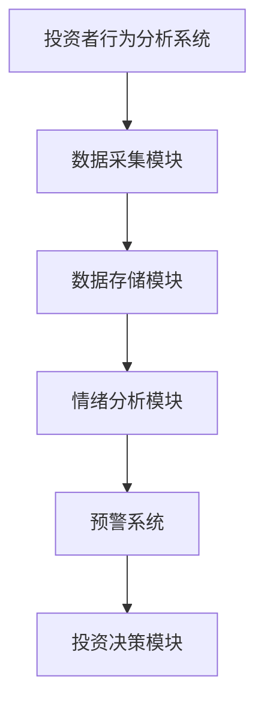
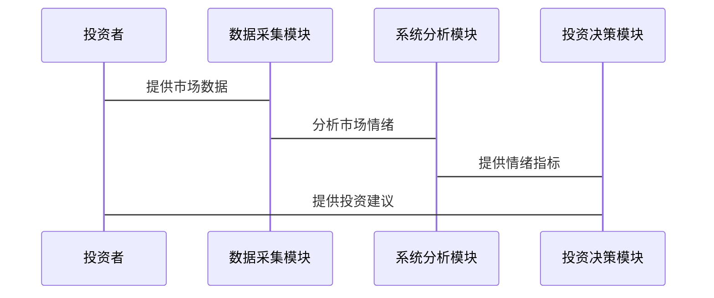

                 


# 特价股票投资中的行为金融学陷阱及其规避

---

## 关键词：
- 行为金融学
- 特价股票
- 投资陷阱
- 市场情绪
- 行为偏差

---

## 摘要：
本文深入探讨了行为金融学在特价股票投资中的应用与挑战。通过分析行为偏差、市场情绪等核心概念，结合数学模型和算法，揭示了投资者在特价股票投资中常见的陷阱，并提出了规避策略。文章还通过实际案例和系统设计，展示了如何利用行为金融学理论优化投资决策，帮助投资者避免常见误区，实现稳健投资。

---

## 第一部分：特价股票投资中的行为金融学基础

---

## 第1章：行为金融学与特价股票投资概述

### 1.1 行为金融学的基本概念

#### 1.1.1 行为金融学的定义与核心理论
行为金融学（Behavioral Finance）是研究投资者心理、行为偏差及其对金融市场影响的学科。与传统金融学不同，行为金融学认为，投资者并非总是理性的，市场并非总是有效的。

- **核心理论**：
  - **前景理论**（Prospect Theory）：投资者对收益和损失的敏感度不同，对损失的厌恶程度远高于对收益的偏好。
  - **有限理性理论**（Bounded Rationality）：投资者在决策过程中受到信息处理能力的限制。

#### 1.1.2 特价股票的定义与特点
- **定义**：特价股票通常指价格低于市场平均值的股票，具有高波动性和高风险特征。
- **特点**：
  - 价格波动大。
  - 投资者情绪化严重。
  - 市场关注度低，信息不对称性强。

#### 1.1.3 行为金融学在特价股票投资中的应用
- 行为金融学可以帮助投资者识别市场情绪，避免过度交易和非理性决策。

---

### 1.2 行为金融学与传统金融学的对比

#### 1.2.1 传统金融学的假设与局限性
- **假设**：市场参与者是理性的，市场是有效的。
- **局限性**：
  - 忽视了投资者心理因素。
  - 无法解释市场异象（如股票溢价现象）。

#### 1.2.2 行为金融学的核心假设与优势
- **假设**：投资者是有限理性的，市场存在信息不对称和情绪化。
- **优势**：
  - 解释了市场异象。
  - 提供了更贴近实际的投资者行为模型。

#### 1.2.3 两者的联系与区别
- **联系**：行为金融学是传统金融学的补充，二者共同构建了完整的金融市场理论。
- **区别**：行为金融学更关注投资者心理和行为偏差。

---

## 第2章：行为金融学中的核心概念与陷阱

### 2.1 行为偏差与投资决策

#### 2.1.1 理性与非理性决策的对比
- **理性决策**：基于逻辑和数据，追求最大利益。
- **非理性决策**：受情绪、习惯等因素影响，偏离理性选择。

#### 2.1.2 常见行为偏差及其影响
| 行为偏差 | 定义 | 影响 |
|---------|------|------|
| 过度自信 | 认为自己的判断优于市场 | 导致过度交易和错误决策 |
| 从众心理 | 跟随市场潮流 | 导致市场泡沫和过度波动 |

#### 2.1.3 行为偏差在特价股票投资中的具体表现
- **表现**：
  - 投资者在低价股中过度乐观，忽视了公司的基本面风险。
  - 过度关注短期价格波动，忽视长期价值。

---

### 2.2 市场情绪与群体心理

#### 2.2.1 市场情绪的定义与测量
- **定义**：市场情绪是指投资者在特定时间段内的整体情绪状态。
- **测量**：
  - 通过新闻、社交媒体等渠道分析情绪指标。
  - 使用情感分析算法量化市场情绪。

#### 2.2.2 群体心理对股票价格的影响
- **群体心理**：投资者的群体行为可能导致市场过度反应，从而偏离基本面价值。

#### 2.2.3 市场情绪周期与特价股票的投资机会
- **周期**：市场情绪从乐观到悲观再到乐观的循环。
- **机会**：在市场情绪低谷时，低价股可能被低估，提供投资机会。

---

### 2.3 投资者心理与行为金融陷阱

#### 2.3.1 过度自信与从众心理
- **过度自信**：投资者高估自己的判断能力，导致错误决策。
- **从众心理**：跟随市场潮流，忽视独立分析。

#### 2.3.2 损失厌恶与风险偏好
- **损失厌恶**：投资者对损失的厌恶程度高于对收益的偏好。
- **风险偏好**：投资者在面对风险时，可能做出非理性决策。

#### 2.3.3 心理账户与投资决策偏差
- **心理账户**：投资者将资金分为不同账户，影响投资决策。
- **偏差**：投资者可能因心理账户而忽视整体投资组合的风险。

---

## 第3章：行为金融学中的数学模型与算法

### 3.1 情绪指标的量化分析

#### 3.1.1 情绪指标的计算公式
$$ 情绪强度 = \frac{正向情感词数量 - 负向情感词数量}{总评论数} $$

#### 3.1.2 情绪指标与股价波动的关系
- **关系**：情绪强度与股价波动呈正相关，情绪强度越高，股价波动越大。

#### 3.1.3 情绪指标在特价股票投资中的应用
- **应用**：通过情绪指标识别市场情绪，避免情绪化投资。

---

### 3.2 市场情绪预测的算法实现

#### 3.2.1 基于NLP的情感分析算法
- **实现**：
  - 使用自然语言处理（NLP）技术分析新闻和社交媒体内容。
  - 通过情感词典计算情感得分。

#### 3.2.2 基于机器学习的情绪预测模型
- **实现**：
  - 使用机器学习算法（如支持向量机、随机森林）训练情绪预测模型。
  - 输入数据包括历史情绪数据和市场数据。

#### 3.2.3 基于时间序列的市场情绪分析
- **实现**：
  - 使用时间序列分析方法（如ARIMA）预测未来市场情绪。
  - 输入数据包括历史情绪数据和市场数据。

---

### 3.3 投资决策中的行为偏差修正算法

#### 3.3.1 基于行为矫正的投资组合优化算法
- **实现**：
  - 通过调整投资组合权重，减少行为偏差的影响。
  - 使用优化算法（如遗传算法）寻找最优投资组合。

#### 3.3.2 基于心理账户的资产配置策略
- **实现**：
  - 根据心理账户原理，合理分配资产。
  - 通过资产配置策略降低风险。

#### 3.3.3 基于情绪周期的投资时机选择算法
- **实现**：
  - 通过情绪周期分析，选择最佳投资时机。
  - 使用时间序列分析方法预测市场情绪。

---

## 第4章：行为金融学在特价股票投资中的系统设计

### 4.1 投资者行为分析系统

#### 4.1.1 系统功能需求分析
- **功能**：
  - 数据采集：采集市场数据和投资者行为数据。
  - 情绪分析：分析市场情绪和投资者心理。
  - 预警系统：根据情绪指标发出预警信号。

#### 4.1.2 系统架构设计



#### 4.1.3 系统交互设计



---

## 第5章：行为金融学在特价股票投资中的实战

### 5.1 环境安装与数据准备

#### 5.1.1 环境安装
- **工具**：
  - Python编程语言
  - 数据分析库（Pandas, NumPy）
  - 可视化库（Matplotlib, Seaborn）
  - 自然语言处理库（NLTK, SpaCy）

#### 5.1.2 数据准备
- **数据来源**：
  - 金融数据：股票价格、市场数据。
  - 文本数据：新闻、社交媒体评论。

---

### 5.2 核心代码实现

#### 5.2.1 情绪分析代码

```python
import nltk
from nltk.sentiment import SentimentIntensityAnalyzer

sia = SentimentIntensityAnalyzer()
text = "This company is going to be very successful."
scores = sia.polarity_scores(text)
print(scores)
```

#### 5.2.2 情绪预测模型代码

```python
from sklearn.ensemble import RandomForestClassifier
from sklearn.feature_extraction.text import TfidfVectorizer

vectorizer = TfidfVectorizer()
X = vectorizer.fit_transform(corpus)
y = [1, 0, 1, ...]  # 标签：1表示正面情绪，0表示负面情绪
model = RandomForestClassifier().fit(X, y)
```

---

### 5.3 案例分析与总结

#### 5.3.1 案例分析
- **案例背景**：某投资者在低价股中因情绪化决策导致亏损。
- **分析**：投资者因过度自信和从众心理，忽视了公司基本面。
- **总结**：投资者需通过行为金融学理论优化决策。

#### 5.3.2 投资策略优化
- **策略**：
  - 定期审视投资组合，避免情绪化交易。
  - 借助行为金融学工具，识别市场情绪。

---

## 第6章：行为金融学在特价股票投资中的小结与展望

### 6.1 小结
- 行为金融学为投资者提供了理解市场情绪和避免行为偏差的工具。
- 特价股票投资中，需警惕市场情绪和投资者心理的影响。

### 6.2 展望
- 随着人工智能技术的发展，行为金融学在投资中的应用将更加广泛。
- 更多投资者将通过行为金融学优化投资决策。

---

## 作者：AI天才研究院/AI Genius Institute & 禅与计算机程序设计艺术 /Zen And The Art of Computer Programming

---

以上是文章的完整内容，涵盖行为金融学在特价股票投资中的核心概念、算法模型和系统设计，帮助投资者避免行为偏差和市场情绪的影响，实现稳健投资。

