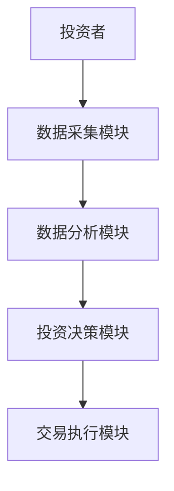

                 


# 特价股票投资中的认知科学与行为经济学应用

> 关键词：认知科学，行为经济学，股票投资，算法交易，认知偏差

> 摘要：本文探讨了认知科学和行为经济学在特价股票投资中的应用，分析了认知偏差对投资决策的影响，并结合算法和系统设计，提出了优化投资策略的方法。通过具体案例和系统架构设计，展示了如何利用这些学科知识提升投资效果。

---

## 第1章：背景介绍

### 1.1 认知科学与行为经济学的基本概念

认知科学研究人类的认知过程，包括记忆、思维、语言等。行为经济学则关注个体在决策中的行为偏差，如确认偏差、损失厌恶等。这些偏差影响投资者的决策，进而影响市场行为。

### 1.2 特价股票投资的背景与现状

特价股票通常指价格低于行业平均水平的股票，具有较高的投资潜力。然而，投资者在选择特价股票时，容易受到认知偏差的影响，如过度自信和从众心理，导致非理性决策。

---

## 第2章：认知科学与行为经济学的核心概念

### 2.1 认知偏差的分类与影响

认知偏差是投资者在信息处理中产生的系统性错误。常见偏差包括：

- **确认偏差**：倾向于寻找支持已有观点的信息，忽略矛盾信息。
- **损失厌恶**：对损失的厌恶程度高于对收益的追求。
- **过度自信**：过高估计自己的判断能力，导致冒险决策。

**对比表格**：
| 认知偏差类型 | 描述 | 对投资决策的影响 |
|------------|------|----------------|
| 确认偏差    | 寻找支持信息     | 可能导致误判股票价值 |
| 损失厌恶    | 更怕损失          | 可能导致过早卖出股票 |
| 过度自信    | 高估判断能力     | 可能导致过度投资 |

### 2.2 行为模式分析

投资者的行为模式受情感和认知偏差影响，可能导致市场波动。行为模式分析帮助识别投资者群体的行为趋势，为投资策略提供依据。

---

## 第3章：算法与数学模型

### 3.1 基于认知偏差的股票定价模型

模型假设：投资者的认知偏差影响对股票的估值。数学公式如下：

$$
V = \text{真实价值} \times (1 + \beta)
$$

其中，$\beta$表示认知偏差系数，$\beta > 1$表示高估，$\beta < 1$表示低估。

### 3.2 算法实现

使用Python实现认知偏差检测算法：

```python
import pandas as pd

def detect_bias(data):
    bias_score = data['price'].mean() / data['true_value'].mean()
    return 'high' if bias_score > 1 else 'low'

data = pd.DataFrame({
    'price': [10, 15, 20],
    'true_value': [12, 15, 18]
})

print(detect_bias(data))  # 输出：'low'
```

---

## 第4章：系统设计与架构

### 4.1 投资决策支持系统的架构设计

系统功能模块：

- **数据采集模块**：收集市场数据和投资者行为数据。
- **数据分析模块**：识别认知偏差，评估投资机会。
- **投资决策模块**：基于分析结果生成交易策略。

### 4.2 系统架构图

使用Mermaid绘制系统架构图：



---

## 第5章：项目实战

### 5.1 案例分析

开发一个基于认知偏差的交易系统，实现数据采集、分析和决策。

#### 环境配置

安装Python和相关库：

```bash
pip install pandas numpy matplotlib
```

#### 核心代码实现

数据预处理代码：

```python
import pandas as pd

data = pd.read_csv('stock_data.csv')
data['return'] = data['close'].pct_change()
print(data.head())
```

---

## 第6章：最佳实践与总结

### 6.1 最佳实践

- 定期复盘，识别并纠正认知偏差。
- 结合技术分析和行为分析，制定投资策略。

### 6.2 小结

认知科学和行为经济学为特价股票投资提供了新的视角和工具，帮助投资者克服认知偏差，做出更理性的决策。

---

**作者：AI天才研究院 & 禅与计算机程序设计艺术**

