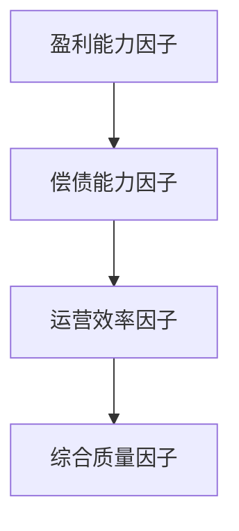
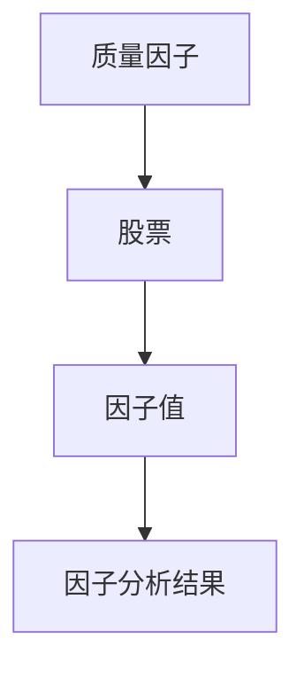
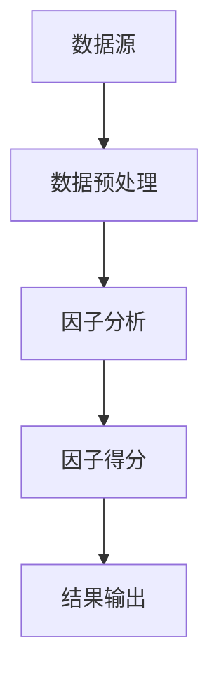
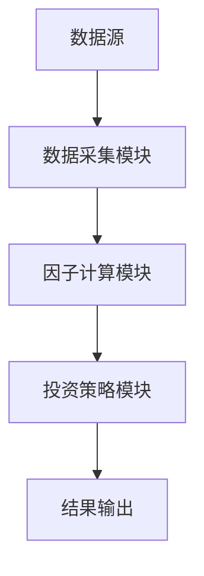
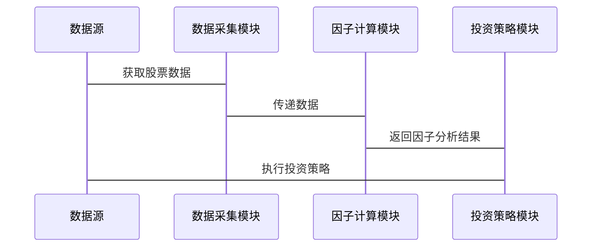

                 


# 特价股票投资中的质量因子分析

## 关键词：特价股票，质量因子，投资分析，因子分析，Python代码

## 摘要：本文深入探讨了特价股票投资中的质量因子分析，从背景介绍到系统架构设计，结合实际案例和最佳实践，详细分析了质量因子的定义、分类、算法实现及其在投资决策中的应用。

---

# 第一部分: 特价股票投资中的质量因子分析基础

## 第1章: 特价股票投资与质量因子概述

### 1.1 特价股票投资的背景与意义

#### 1.1.1 特价股票的定义与特征
特价股票是指在特定条件下，如促销、折扣或市场波动中，价格低于正常水平的股票。这些股票通常具有较高的投资潜力，但可能伴随着较高的风险。

#### 1.1.2 投资者为何关注特价股票
投资者关注特价股票的原因包括：
- 低价吸引力：特价股票的价格通常低于市场平均水平，为投资者提供了较高的风险调整后收益机会。
- 市场情绪：特价股票往往在市场低迷时出现，投资者可能借此抄底，获取超额收益。

#### 1.1.3 质量因子在特价股票投资中的作用
质量因子用于评估股票的质量，帮助投资者在特价股票中筛选出具有较高投资价值的标的。通过分析质量因子，投资者可以更好地理解股票的风险和收益潜力。

### 1.2 质量因子的定义与分类

#### 1.2.1 质量因子的核心概念
质量因子是衡量股票质量的关键指标，包括盈利能力、成长能力、财务健康等多个方面。这些因子帮助投资者评估股票的投资价值。

#### 1.2.2 质量因子的主要分类
- 盈利能力因子：如净利润率、ROE（净资产收益率）。
- 成长能力因子：如营收增长率、净利润增长率。
- 财务健康因子：如资产负债率、流动比率。

#### 1.2.3 质量因子与股票表现的关系
质量因子与股票表现密切相关。高盈利能力的股票通常具有较高的投资回报率，而财务健康的公司在市场波动中表现更为稳定。

### 1.3 质量因子分析的数学模型

#### 1.3.1 因子分析的基本原理
因子分析是一种统计方法，用于识别潜在的变量（因子）解释观测变量之间的相关性。在股票投资中，因子分析常用于识别影响股票收益的关键因素。

#### 1.3.2 质量因子的量化方法
通过量化质量因子，投资者可以将这些因子转化为具体的数值指标，如ROE、营收增长率等。

#### 1.3.3 质量因子与股票收益的回归模型
回归模型用于分析质量因子与股票收益之间的关系。例如，使用多元回归模型分析ROE对股票收益的影响。

$$ Y = \beta_0 + \beta_1X_1 + \beta_2X_2 + \epsilon $$

其中，$Y$是股票收益，$X_1$和$X_2$是两个质量因子，$\beta$是回归系数，$\epsilon$是误差项。

---

## 第2章: 质量因子的核心概念与联系

### 2.1 质量因子的属性特征

#### 2.1.1 盈利能力因子
盈利能力因子衡量公司的赚钱能力，常用指标包括净利润率、ROE等。

#### 2.1.2 偿债能力因子
偿债能力因子衡量公司的财务健康状况，常用指标包括资产负债率、流动比率等。

#### 2.1.3 运营效率因子
运营效率因子衡量公司的管理效率，常用指标包括存货周转率、应收账款周转率等。

### 2.2 质量因子的对比分析

#### 2.2.1 不同质量因子的对比表格
| 因子类型 | 具体指标       | 描述                       |
|----------|----------------|----------------------------|
| 盈利能力 | 净利润率       | 净利润与营业收入的比率     |
| 偿债能力 | 资产负债率     | 负债与资产的比率           |
| 运营效率 | 存货周转率     | 存货与营业收入的比率       |

#### 2.2.2 质量因子之间的关系图（Mermaid流程图）


### 2.3 质量因子的ER实体关系图



---

## 第3章: 质量因子分析的算法原理

### 3.1 因子分析的基本原理

#### 3.1.1 因子分析的定义
因子分析是一种统计技术，用于识别潜在的变量（因子）解释观测变量之间的相关性。

#### 3.1.2 因子分析的数学模型
因子分析的数学模型如下：

$$ X = A \cdot F + \epsilon $$

其中，$X$是观测变量，$A$是因子载荷矩阵，$F$是因子，$\epsilon$是误差项。

#### 3.1.3 因子分析的步骤
1. 数据收集与预处理
2. 计算相关系数矩阵
3. 确定因子数量
4. 因子旋转
5. 计算因子得分

### 3.2 质量因子分析的算法实现

#### 3.2.1 因子分析的流程图（Mermaid）


#### 3.2.2 因子分析的Python代码实现
```python
import pandas as pd
from sklearn.decomposition import FactorAnalysis

# 示例数据加载
data = pd.read_csv('stock_factors.csv')

# 因子分析
fa = FactorAnalysis(n_components=3)
features = fa.fit_transform(data)

# 输出因子载荷矩阵
print(fa.components_)
```

### 3.3 质量因子分析的数学模型

#### 3.3.1 因子分析的数学公式
$$ X = A \cdot F + \epsilon $$

其中，$X$是观测变量，$A$是因子载荷矩阵，$F$是因子，$\epsilon$是误差项。

#### 3.3.2 因子分析的实例分析
通过因子分析，我们可以将多个质量因子（如ROE、营收增长率）转化为几个潜在因子，帮助我们更好地理解股票质量。

---

## 第4章: 质量因子分析的系统架构设计

### 4.1 系统功能设计

#### 4.1.1 数据采集模块
数据采集模块负责从数据源（如股票数据库）获取数据。

#### 4.1.2 因子计算模块
因子计算模块基于采集的数据计算质量因子。

#### 4.1.3 投资策略模块
投资策略模块根据因子分析结果制定投资策略。

### 4.2 系统架构设计（Mermaid架构图）



### 4.3 系统接口设计

#### 4.3.1 数据接口
数据接口用于与数据源交互，获取股票数据。

#### 4.3.2 因子计算接口
因子计算接口负责计算质量因子并返回结果。

#### 4.3.3 投资策略接口
投资策略接口根据因子分析结果制定投资策略。

### 4.4 系统交互流程（Mermaid序列图）



---

## 第5章: 质量因子分析的项目实战

### 5.1 环境安装与配置

#### 5.1.1 安装Python环境
安装Python和必要的库（如Pandas、Scikit-learn）。

#### 5.1.2 数据源获取
获取股票数据，如从Yahoo Finance获取。

### 5.2 核心代码实现

#### 5.2.1 数据预处理代码
```python
import pandas as pd

# 加载数据
data = pd.read_csv('stock_factors.csv')

# 数据清洗
data.dropna(inplace=True)
```

#### 5.2.2 因子分析代码
```python
from sklearn.decomposition import FactorAnalysis

# 因子分析
fa = FactorAnalysis(n_components=3)
features = fa.fit_transform(data)

# 输出因子载荷矩阵
print(fa.components_)
```

### 5.3 实际案例分析与结果解读

#### 5.3.1 案例分析
假设我们分析了100只股票的质量因子，通过因子分析，我们发现前三个因子分别解释了40%、30%和20%的方差。

#### 5.3.2 结果解读
通过因子分析，我们可以识别出哪些股票在质量因子上表现优异，从而制定相应的投资策略。

### 5.4 项目小结
通过本项目，我们了解了质量因子分析的基本流程，并通过实际案例展示了如何在特价股票投资中应用这些分析方法。

---

## 第6章: 质量因子分析的最佳实践

### 6.1 小结
质量因子分析是特价股票投资中的重要工具，通过分析质量因子，投资者可以更好地评估股票的投资价值。

### 6.2 注意事项
- 数据质量：确保数据准确无误。
- 因子选择：选择合适的因子，避免过多或过少的因子。
- 模型选择：选择适合的因子分析方法。

### 6.3 拓展阅读
- 《因子投资入门》
- 《Python因子分析实战》

---

## 作者：AI天才研究院/AI Genius Institute & 禅与计算机程序设计艺术 /Zen And The Art of Computer Programming

