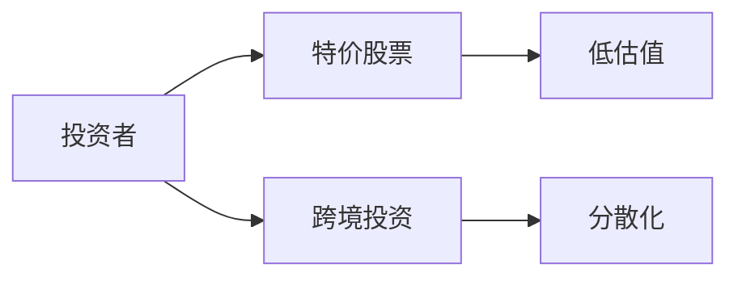
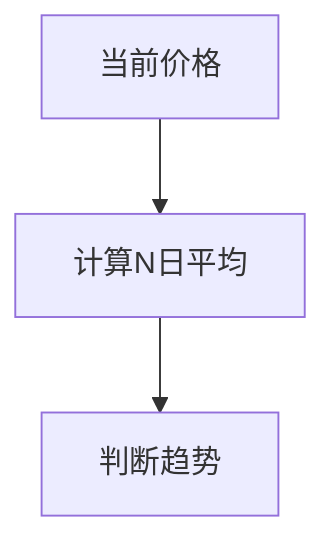

                 


# 特价股票投资中的跨境投资策略

## 关键词：
特价股票，跨境投资，量化交易，算法策略，投资策略，风险管理

## 摘要：
在当前全球化的金融市场中，特价股票和跨境投资逐渐成为投资者关注的焦点。特价股票指的是价格低于一定标准的股票，而跨境投资则是指在不同国家或地区的投资活动。本文将深入探讨特价股票在跨境投资中的策略，结合背景介绍、核心概念、算法原理、数学模型、系统架构、项目实战以及最佳实践，帮助投资者更好地理解和应用这些策略。通过分析特价股票的特性、跨境投资的优势与挑战，以及结合量化交易和风险管理的方法，本文为投资者提供一套系统化的跨境投资策略，以在复杂的市场环境中实现稳健的投资回报。

---

## 第1章：特价股票的定义与市场现状

### 1.1 特价股票的定义与特征
特价股票是指价格低于市场平均水平的股票，通常具有较高的性价比。其主要特征包括：
- 低估值：市盈率、市净率等指标显著低于行业平均水平。
- 高波动性：价格波动较大，存在短期套利机会。
- 风险较高：通常存在于基本面较差或行业低迷的公司。

### 1.2 跨境投资的背景与现状
跨境投资是指投资者在不同国家或地区的金融市场进行投资活动，主要背景包括全球化进程加速、市场分散化需求增加以及投资者寻求更高的收益。当前，跨境投资的市场规模持续扩大，投资者通过股票、基金、债券等多种形式进行跨国配置。

### 1.3 特价股票与跨境投资的结合
将特价股票与跨境投资结合，投资者可以利用不同市场的价格差异和政策差异，寻找低估的投资机会。这种策略的优势在于分散风险、捕捉全球市场的机会，但也面临汇率波动、法律风险和流动性不足的挑战。

---

## 第2章：特价股票与跨境投资的核心

### 2.1 核心概念与原理
特价股票的核心在于其低估值特性，而跨境投资则依赖于市场分散化和政策差异。两者的结合在于通过技术分析和基本面分析，识别具有潜在升值空间的特价股票。

### 2.2 核心概念对比表
| 特性       | 特价股票       | 跨境投资         |
|------------|----------------|------------------|
| 定义       | 价格低于市场平均水平的股票 | 在不同国家或地区的投资活动 |
| 优势       | 低估值、高回报潜力 | 分散风险、捕捉全球机会 |
| 风险       | 公司基本面差、波动性高 | 汇率风险、政策风险 |

### 2.3 实体关系图（Mermaid）



---

## 第3章：算法原理

### 3.1 技术分析算法
技术分析是识别特价股票的重要方法，常用算法包括移动平均线和相对强弱指数。

#### 3.1.1 移动平均线（MA）
计算股票价格的N日移动平均值，判断价格走势。



Python代码示例：

```python
import pandas as pd
data = pd.read_csv('stock.csv')
data['MA_50'] = data['Close'].rolling(50).mean()
print(data.tail())
```

### 3.2 量化交易算法
量化交易通过数学模型优化投资组合。

#### 3.2.1 均值-方差优化
目标是最小化风险，最大化收益。

数学模型：

$$
\min \sigma^2 \\
\text{s.t. } \sum w_i = 1, \sum w_i r_i = \text{max}
$$

Python代码示例：

```python
import numpy as np
returns = data['Return'].values
cov_matrix = np.cov(returns)
# 优化求解器实现
```

---

## 第4章：数学模型

### 4.1 特价股票评估模型
使用市盈率和市净率评估股票价值。

$$
\text{市盈率} = \frac{\text{股价}}{\text{每股收益}}
$$

$$
\text{市净率} = \frac{\text{股价}}{\text{每股净资产}}
$$

### 4.2 预测模型
使用时间序列分析预测股票价格。

数学模型：

$$
y_t = \alpha y_{t-1} + \beta \epsilon_t
$$

Python代码示例：

```python
from statsmodels.tsa.arima_model import ARIMA
model = ARIMA(data, order=(1, 0, 0))
model_fit = model.fit()
```

---

## 第5章：系统架构

### 5.1 数据收集模块
从多个市场获取实时数据。

### 5.2 数据分析模块
使用技术分析和量化模型进行评估。

### 5.3 决策模块
根据分析结果生成投资策略。

---

## 第6章：项目实战

### 6.1 环境配置
安装必要的库，如Pandas、NumPy、Matplotlib。

### 6.2 代码实现
编写数据抓取和分析代码。

### 6.3 案例分析
分析实际市场中的特价股票，制定投资策略。

---

## 第7章：总结与最佳实践

### 7.1 小结
本文详细探讨了特价股票和跨境投资的策略，结合技术分析和量化交易的方法，提供了系统的投资方案。

### 7.2 注意事项
投资者需注意市场风险、法律风险和流动性风险。

### 7.3 拓展阅读
推荐相关书籍和资源，供读者深入学习。

---

## 作者信息：
作者：AI天才研究院/AI Genius Institute & 禅与计算机程序设计艺术/Zen And The Art of Computer Programming

---

这篇文章系统地介绍了特价股票投资中的跨境投资策略，结合背景、算法、数学模型和系统架构，为投资者提供了实用的指导。希望对读者有所帮助。

