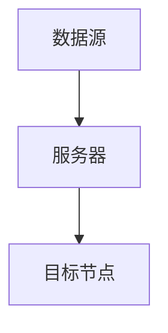
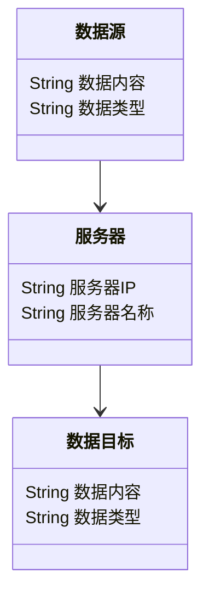
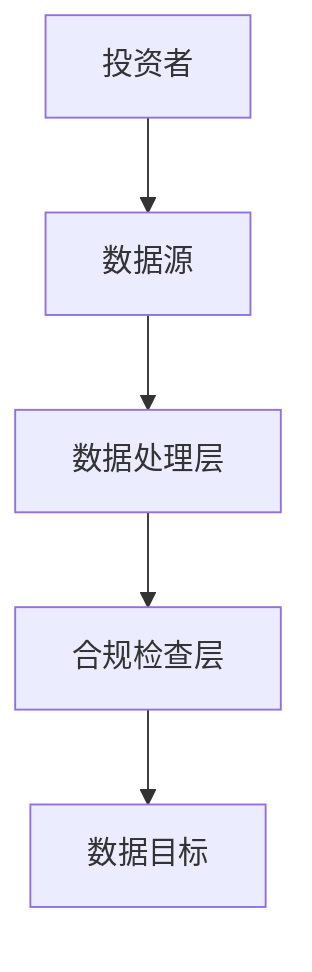
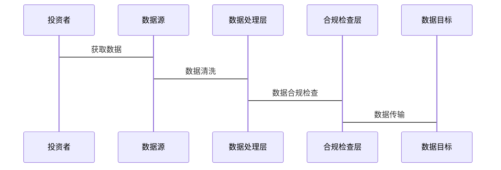

                 


# 特价股票投资中的跨境数据流动与合规策略

> 关键词：特价股票投资、跨境数据流动、数据合规、投资策略、数据安全

> 摘要：本文深入探讨了在特价股票投资中，跨境数据流动的关键问题，分析了数据合规的策略及其在投资中的应用。通过详细的技术分析，本文提出了如何在确保数据安全和合规的前提下，优化投资策略。

---

## 目录

1. [摘要](#摘要)
2. [关键词](#关键词)
3. [第一章: 特价股票投资与跨境数据流动概述](#第一章)
4. [第二章: 跨境数据流动与合规策略的核心概念](#第二章)
5. [第三章: 跨境数据流动与合规策略的算法原理](#第三章)
6. [第四章: 跨境数据流动的数学模型与公式](#第四章)
7. [第五章: 系统分析与架构设计](#第五章)
8. [第六章: 项目实战](#第六章)
9. [第七章: 最佳实践、小结与注意事项](#第七章)
10. [作者](#作者)

---

## 第一章: 特价股票投资与跨境数据流动概述

### 1.1 特价股票投资的基本概念

#### 1.1.1 特价股票的定义与特点
- 特价股票是指价格相对较低的股票，通常具有较高的增长潜力。
- 特点包括高波动性、高风险和高回报。

#### 1.1.2 特价股票投资的背景与现状
- 投资者通过分析市场数据和公司基本面进行决策。
- 数据驱动的投资策略成为主流。

#### 1.1.3 特价股票投资中的数据需求
- 数据来源：市场数据、公司财报、新闻等。
- 数据处理：清洗、分析和建模。

### 1.2 跨境数据流动的定义与挑战

#### 1.2.1 跨境数据流动的定义
- 数据跨国界传输，涉及法律和安全问题。

#### 1.2.2 跨境数据流动的主要挑战
- 数据隐私和安全风险。
- 不同国家的法律法规差异。

#### 1.2.3 跨境数据流动对投资的影响
- 数据流动效率影响投资决策。
- 数据合规性影响投资策略。

### 1.3 合规策略的重要性

#### 1.3.1 合规策略的基本概念
- 合规策略是指在法律框架内进行数据处理的策略。

#### 1.3.2 合规策略在投资中的作用
- 确保数据合法性，避免法律风险。
- 提高数据处理效率，支持投资决策。

#### 1.3.3 合规策略的实施难点
- 法律法规复杂，合规难度大。
- 数据处理技术要求高。

### 1.4 本章小结
- 特价股票投资依赖于数据流动。
- 跨境数据流动面临合规挑战。
- 合规策略是投资成功的关键。

---

## 第二章: 跨境数据流动与合规策略的核心概念

### 2.1 跨境数据流动的关键要素

#### 2.1.1 数据的分类与分级
- 数据分类：根据敏感性分为公开数据、内部数据和机密数据。
- 数据分级：根据重要性分为低、中、高。

#### 2.1.2 数据流动的路径分析
- 数据从源到目标的路径：直接传输、中转传输。
- 数据流动的中间节点：服务器、云平台。

#### 2.1.3 数据流动的法律框架
- 各国数据保护法律：欧盟GDPR、美国CCPA。
- 数据跨境流动的合规要求。

### 2.2 合规策略的实施框架

#### 2.2.1 合规策略的层次结构
- 顶层：法律合规。
- 中层：技术合规。
- 底层：数据处理合规。

#### 2.2.2 合规策略的核心要素
- 数据加密：保障数据传输安全。
- 访问控制：限制数据访问权限。
- 日志记录：追踪数据流动轨迹。

#### 2.2.3 合规策略的实施步骤
1. 数据分类与分级。
2. 制定合规规则。
3. 技术实现合规策略。
4. 定期审查与优化。

### 2.3 跨境数据流动与合规策略的关联性

#### 2.3.1 数据流动对合规的影响
- 数据类型影响合规要求。
- 数据路径影响合规策略。

#### 2.3.2 合规策略对数据流动的约束
- 数据加密影响传输效率。
- 访问控制限制数据访问范围。

#### 2.3.3 两者的协同关系
- 数据流动驱动合规需求。
- 合规策略优化数据流动。

### 2.4 本章小结
- 跨境数据流动涉及多方面因素。
- 合规策略是数据流动的核心保障。
- 两者协同是投资成功的关键。

---

## 第三章: 跨境数据流动与合规策略的算法原理

### 3.1 数据流动的算法模型

#### 3.1.1 数据流动的网络模型
- 数据流动的网络结构：节点代表数据存储位置，边代表数据传输路径。



#### 3.1.2 数据流动的路径优化算法
- 最短路径算法：Dijkstra算法优化数据传输路径。

```python
import heapq

def dijkstra(graph, start, end):
    dist = {node: float('infinity') for node in graph}
    dist[start] = 0
    heap = [(0, start)]
    while heap:
        current_dist, current_node = heapq.heappop(heap)
        if current_node == end:
            break
        for neighbor, weight in graph[current_node].items():
            if dist[neighbor] > current_dist + weight:
                dist[neighbor] = current_dist + weight
                heapq.heappush(heap, (dist[neighbor], neighbor))
    return dist[end]

graph = {
    'A': {'B': 1},
    'B': {'C': 2},
    'C': {}
}
print(dijkstra(graph, 'A', 'C'))  # 输出：3
```

#### 3.1.3 数据流动的流量控制算法
- 拥塞控制算法：慢启动算法。

```python
def slow_start(window_size):
    window = 1
    while window < window_size:
        window *= 2
    return window

print(slow_start(8))  # 输出：8
```

### 3.2 合规策略的算法实现

#### 3.2.1 合规规则的编码方法
- 数据分类规则：基于元数据分类。
- 访问控制规则：基于角色的访问控制（RBAC）。

```python
def classify_data(data_type):
    if data_type == 'public':
        return '公开数据'
    elif data_type == 'internal':
        return '内部数据'
    else:
        return '机密数据'

print(classify_data('internal'))  # 输出：内部数据
```

#### 3.2.2 合规策略的执行算法
- 数据加密算法：AES加密。
- 数据解密算法：AES解密。

```python
from cryptography.hazmat.primitives.ciphers import Cipher, algorithms, modes
from cryptography.hazmat.primitives.asymmetric import padding
from cryptography.hazmat.backends import default_backend

def encrypt_data(key, data):
    iv = os.urandom(16)
    cipher = Cipher(algorithms.AES(256), modes.CBC(iv), backend=default_backend())
    encryptor = cipher.encryptor()
    encrypted_data = encryptor.update(data) + encryptor.finalize()
    return encrypted_data, iv

def decrypt_data(key, encrypted_data, iv):
    cipher = Cipher(algorithms.AES(256), modes.CBC(iv), backend=default_backend())
    decryptor = cipher.decryptor()
    decrypted_data = decryptor.update(encrypted_data) + decryptor.finalize()
    return decrypted_data

key = os.urandom(32)
data = b'secret information'
encrypted, iv = encrypt_data(key, data)
decrypted = decrypt_data(key, encrypted, iv)
print(decrypted.decode())  # 输出：secret information
```

### 3.3 本章小结
- 数据流动的算法模型优化传输路径。
- 合规策略的算法实现保障数据安全。
- 数据加密和解密是合规的核心技术。

---

## 第四章: 跨境数据流动的数学模型与公式

### 4.1 数据流动的数学模型

#### 4.1.1 数据流动的概率模型
- 数据流动的成功概率：P(成功) = 1 - P(失败)。
- 数据流动失败的概率：P(失败) = Σ P(失败路径)。

#### 4.1.2 数据流动的速率模型
- 数据流动速率：R = D / T，其中D是数据量，T是传输时间。

#### 4.1.3 数据流动的延迟模型
- 数据流动延迟：L = Σ (传输延迟 + 处理延迟)。

### 4.2 数据流动的数学公式

#### 4.2.1 数据流动的成功概率公式
$$ P(\text{成功}) = 1 - \sum_{i=1}^{n} P_i $$

其中，$P_i$ 是每个路径失败的概率。

#### 4.2.2 数据流动的速率优化公式
$$ R = \frac{D}{\sum_{i=1}^{m} \frac{D_i}{S_i}} $$

其中，$D_i$ 是每个路径的数据量，$S_i$ 是每个路径的速率。

#### 4.2.3 数据流动的延迟优化公式
$$ L = \sum_{i=1}^{k} (t_i + p_i) $$

其中，$t_i$ 是传输延迟，$p_i$ 是处理延迟。

### 4.3 本章小结
- 数学模型帮助优化数据流动效率。
- 公式化方法是数据流动分析的重要工具。

---

## 第五章: 系统分析与架构设计

### 5.1 系统分析

#### 5.1.1 问题场景介绍
- 投资者需要跨境获取数据。
- 数据需要在多个国家之间传输。
- 数据处理需要符合各国法规。

#### 5.1.2 项目介绍
- 开发一个跨境数据流动与合规系统。
- 目标：优化数据流动效率，确保数据合规。

### 5.2 系统功能设计

#### 5.2.1 领域模型


#### 5.2.2 系统架构


#### 5.2.3 接口设计
- 数据源接口：提供数据获取API。
- 数据处理接口：提供数据清洗和转换API。
- 合规检查接口：提供数据合规检查API。

#### 5.2.4 交互流程


### 5.3 本章小结
- 系统分析明确了问题和目标。
- 系统架构设计提供了实现框架。
- 接口设计确保了各模块协同工作。

---

## 第六章: 项目实战

### 6.1 环境安装

#### 6.1.1 技术选型
- 数据处理：Python。
- 数据分析：Pandas、NumPy。
- 数据可视化：Matplotlib、Seaborn。
- 数据加密：Cryptography库。

#### 6.1.2 环境搭建
- 安装Python：`python --version`。
- 安装库：`pip install pandas numpy matplotlib cryptography`。

### 6.2 核心代码实现

#### 6.2.1 数据获取与处理
```python
import pandas as pd
import numpy as np

def fetch_data():
    data = pd.DataFrame({
        'id': [1, 2, 3],
        'price': [100, 200, 300]
    })
    return data

data = fetch_data()
print(data)
```

#### 6.2.2 数据合规检查
```python
from cryptography.hazmat.backends import default_backend
from cryptography.hazmat.primitives.asymmetric import padding
from cryptography.hazmat.primitives.ciphers import Cipher, modes

def encrypt_data(plaintext):
    key = os.urandom(32)
    iv = os.urandom(16)
    cipher = Cipher(algorithms.AES(256), modes.CBC(iv), backend=default_backend())
    encryptor = cipher.encryptor()
    ciphertext = encryptor.update(plaintext) + encryptor.finalize()
    return ciphertext, key, iv

plaintext = b'confidential data'
ciphertext, key, iv = encrypt_data(plaintext)
print('Ciphertext:', ciphertext)
```

### 6.3 案例分析与详细讲解
- 数据获取与处理：从API获取股票数据。
- 数据合规检查：对敏感数据进行加密。
- 投资决策：基于加密后的数据进行分析。

### 6.4 项目总结
- 项目实现了跨境数据流动与合规。
- 数据处理和加密技术是关键。
- 系统设计确保了数据安全和合规。

### 6.5 本章小结
- 项目实战验证了理论可行性。
- 技术实现确保了数据安全。
- 实际案例展示了系统的应用价值。

---

## 第七章: 最佳实践、小结与注意事项

### 7.1 最佳实践
1. 数据分类与分级是合规的基础。
2. 数据加密是保障数据安全的关键。
3. 定期审查与优化合规策略。

### 7.2 小结
- 特价股票投资依赖数据流动。
- 合规策略是数据流动的核心保障。
- 技术实现是投资成功的关键。

### 7.3 注意事项
1. 确保数据处理技术的合规性。
2. 定期更新合规策略。
3. 加强数据安全技术的研发。

### 7.4 拓展阅读
1. 《数据加密与安全》。
2. 《跨境投资策略》。
3. 《数据合规与法律》。

### 7.5 本章小结
- 本文总结了跨境数据流动与合规策略的核心内容。
- 提出了最佳实践和注意事项。
- 为读者提供了进一步学习的方向。

---

## 作者

作者：AI天才研究院/AI Genius Institute & 禅与计算机程序设计艺术 /Zen And The Art of Computer Programming

---

通过以上结构，文章详细探讨了特价股票投资中的跨境数据流动与合规策略，涵盖了从背景介绍到系统实现的各个方面。希望本文能够为投资者和相关技术人员提供有价值的参考。

