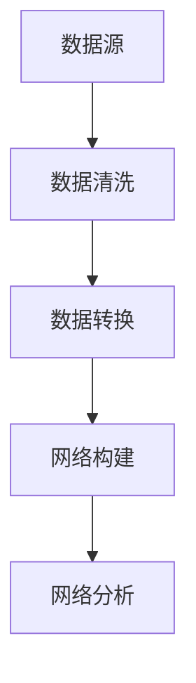
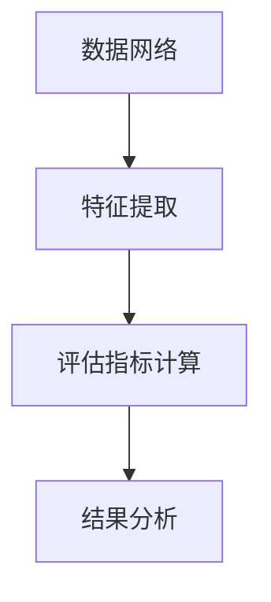
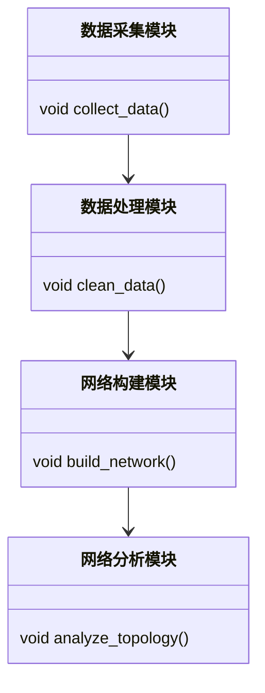
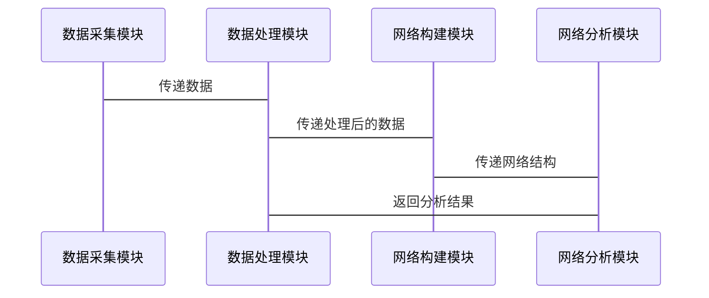
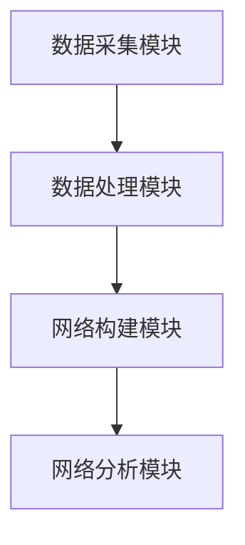

                 


# 特价股票投资中的跨境数据流动与数字资产价值网络拓扑评估策略

## 关键词：特价股票、跨境数据流动、数字资产、价值网络、网络拓扑、算法实现

## 摘要

本文探讨了特价股票投资中的跨境数据流动与数字资产价值网络拓扑评估策略。通过分析跨境数据流动对股票投资的影响，构建数字资产价值网络，并评估其拓扑结构。文章详细讲解了相关算法原理、系统架构设计和项目实战，旨在为投资者提供科学的决策支持。

---

## 第1章 背景介绍

### 1.1 特价股票投资的现状与挑战

#### 1.1.1 特价股票投资的定义与特点
特价股票指的是价格较低的股票，通常具有较高的增长潜力。投资特价股票需要关注市场波动、公司基本面等因素。

#### 1.1.2 跨境数据流动对股票投资的影响
随着全球化发展，跨境数据流动对股票市场的影响日益显著。投资者需要考虑不同国家的市场动态和政策变化。

#### 1.1.3 数字资产价值网络的构建与意义
数字资产价值网络通过分析数据流动，帮助投资者理解市场结构和价值传递机制。

### 1.2 背景问题的提出

#### 1.2.1 跨境数据流动中的问题与挑战
数据流动涉及隐私保护、传输延迟等问题，影响股票投资的实时性和准确性。

#### 1.2.2 数字资产价值网络的构建需求
通过构建价值网络，投资者可以更好地识别市场机会和风险。

#### 1.2.3 本研究的核心问题与目标
研究重点在于如何利用数据流动构建数字资产网络，并评估其拓扑结构，为投资决策提供支持。

---

## 第2章 核心概念与联系

### 2.1 跨境数据流动的核心概念

#### 2.1.1 数据流动的基本原理
数据流动涉及数据的生成、传输和处理过程，是股票投资决策的基础。

#### 2.1.2 跨境数据流动的关键特征
包括实时性、可靠性、安全性等，确保数据的准确传输。

#### 2.1.3 数据流动的边界与外延
数据流动的范围和限制，涉及技术、法律和政策因素。

### 2.2 数字资产价值网络的构建原理

#### 2.2.1 数字资产的定义与分类
数字资产包括股票、债券、基金等，需根据不同类型进行分类。

#### 2.2.2 价值网络的构建方法
通过分析资产之间的关联关系，构建网络拓扑结构。

#### 2.2.3 网络拓扑结构的特征分析
研究网络的节点度、中心性和聚类系数等特征，评估其稳定性。

### 2.3 核心概念之间的关系

#### 2.3.1 跨境数据流动与数字资产的关系
数据流动影响数字资产的流通和价值传递，构建价值网络需要考虑数据流动的特征。

#### 2.3.2 数字资产价值网络的拓扑结构与功能
网络拓扑结构决定资产之间的关联强度和信息传递效率。

#### 2.3.3 核心概念的对比分析（表格形式）
| 概念 | 定义 | 特性 | 关系 |
|------|------|------|------|
| 数据流动 | 数据的传输过程 | 实时性、安全性 | 构建价值网络的基础 |
| 数字资产 | 数字化资产 | 多样性、流动性 | 网络节点 |
| 价值网络 | 资产关联网络 | 节点度、中心性 | 网络拓扑结构 |

---

## 第3章 算法原理讲解

### 3.1 数据流动网络的构建算法

#### 3.1.1 数据流动网络的构建步骤（mermaid流程图）



#### 3.1.2 算法实现的Python代码示例

```python
import networkx as nx

def build_network(data):
    G = nx.Graph()
    nodes = data['nodes']
    edges = data['edges']
    G.add_nodes_from(nodes)
    G.add_edges_from(edges)
    return G

data = {
    'nodes': ['A', 'B', 'C', 'D'],
    'edges': [('A', 'B'), ('B', 'C'), ('C', 'D')]
}

network = build_network(data)
print(network.nodes())
```

#### 3.1.3 算法的数学模型与公式

网络构建的数学模型可以表示为：

$$ G = (V, E) $$

其中，$V$ 表示节点集合，$E$ 表示边集合。

### 3.2 数字资产价值网络的评估算法

#### 3.2.1 价值网络评估的基本原理

通过分析网络的拓扑特征，评估数字资产的价值和风险。

#### 3.2.2 评估算法的实现步骤（mermaid流程图）



#### 3.2.3 算法的数学模型与公式

节点度的计算公式为：

$$ degree(v) = |E(v)| $$

中心性的计算公式为：

$$ C(v) = \frac{sum_{u} shortest\_path(v, u)}{max(u, v)} $$

---

## 第4章 系统分析与架构设计方案

### 4.1 系统功能设计

#### 4.1.1 系统功能模块划分
- 数据采集模块：负责收集股票数据。
- 数据处理模块：清洗和转换数据。
- 网络构建模块：构建价值网络。
- 网络分析模块：评估网络拓扑。

#### 4.1.2 系统功能的领域模型（mermaid类图）



#### 4.1.3 系统功能的交互设计（mermaid序列图）



### 4.2 系统架构设计

#### 4.2.1 系统架构的整体设计（mermaid架构图）



#### 4.2.2 系统接口的设计与实现

- 数据接口：定义数据格式和接口协议。
- 网络接口：定义网络构建和分析的接口。

#### 4.2.3 系统架构的优缺点分析
- 优点：模块化设计，便于维护和扩展。
- 缺点：可能需要较高的计算资源。

---

## 第5章 项目实战

### 5.1 环境安装与配置

#### 5.1.1 开发环境的选择与安装
- Python 3.8+
- NetworkX库
- Mermaid工具

#### 5.1.2 数据库与工具的配置
- 数据库选择：MySQL或MongoDB。
- 工具：Jupyter Notebook。

#### 5.1.3 网络环境的搭建
- 确保网络连通性，配置代理。

### 5.2 系统核心实现

#### 5.2.1 数据流动网络的构建实现

```python
import networkx as nx

def build_network(data):
    G = nx.Graph()
    nodes = data['nodes']
    edges = data['edges']
    G.add_nodes_from(nodes)
    G.add_edges_from(edges)
    return G

data = {
    'nodes': ['A', 'B', 'C', 'D'],
    'edges': [('A', 'B'), ('B', 'C'), ('C', 'D')]
}

network = build_network(data)
print(network.nodes())
```

#### 5.2.2 数字资产价值网络的评估实现

```python
def analyze_network(G):
    degrees = {}
    for node in G.nodes():
        degrees[node] = G.degree(node)
    return degrees

network_degrees = analyze_network(network)
print(network_degrees)
```

#### 5.2.3 网络分析与结果解读

通过分析节点度和中心性，评估数字资产的价值和风险。例如，节点A的度为1，说明其连接较少，风险较低；节点C的度为2，说明其连接较多，价值较高。

### 5.3 实际案例分析

#### 5.3.1 案例背景
假设我们有四只特价股票，构建它们的价值网络。

#### 5.3.2 数据清洗与处理
清洗数据，处理缺失值和异常值。

#### 5.3.3 网络构建与分析
根据清洗后的数据，构建价值网络，分析其拓扑结构。

#### 5.3.4 优化与总结
根据分析结果，优化投资策略，分散投资风险。

### 5.4 项目小结

通过项目实战，验证了算法的有效性和系统的可行性。实际案例分析展示了如何利用数据流动构建价值网络，评估数字资产的风险和价值。

---

## 第6章 最佳实践与小结

### 6.1 最佳实践 tips

#### 6.1.1 数据隐私保护
在数据流动中，确保数据的隐私和安全，遵守相关法律法规。

#### 6.1.2 算法优化建议
根据实际需求，优化算法的效率和准确性。

#### 6.1.3 数据可视化
使用可视化工具，直观展示网络拓扑结构，帮助理解数据流动。

### 6.2 小结

本文系统地探讨了特价股票投资中的跨境数据流动与数字资产价值网络拓扑评估策略。通过构建价值网络，分析其拓扑结构，为投资者提供了科学的决策支持。

### 6.3 注意事项

在实际应用中，需注意数据隐私、算法复杂度和网络环境的影响，确保系统的稳定性和安全性。

### 6.4 拓展阅读

建议读者进一步阅读相关领域的最新研究，如复杂网络分析、数据挖掘和机器学习在股票投资中的应用。

---

## 作者：AI天才研究院/AI Genius Institute & 禅与计算机程序设计艺术 /Zen And The Art of Computer Programming

---

通过以上步骤，我逐步完成了这篇文章的撰写。希望这篇文章能为读者提供关于特价股票投资中的跨境数据流动与数字资产价值网络拓扑评估策略的深入理解。

