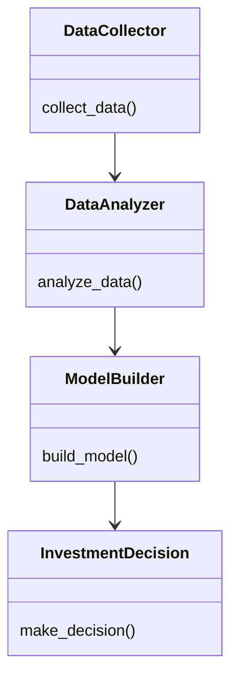
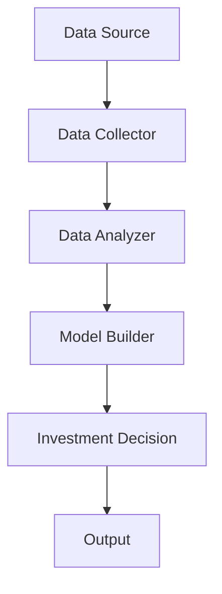
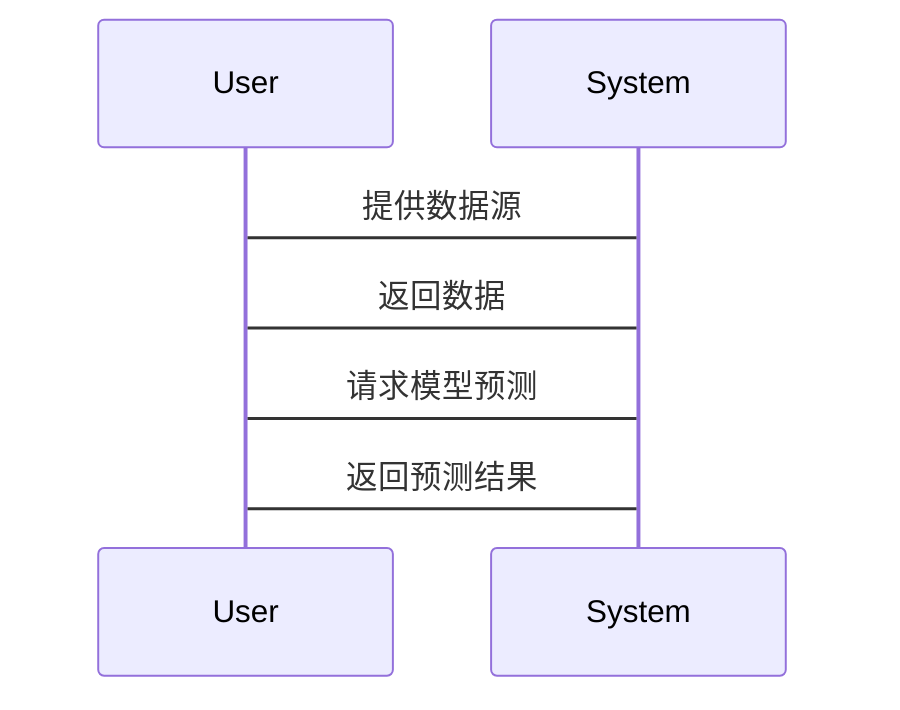

                 


# 特价股票投资中的跨境数据流动价值评估策略

**关键词：** 特价股票投资、跨境数据流动、价值评估、算法模型、数据驱动

**摘要：**  
本文探讨了在特价股票投资中，跨境数据流动对股票价值评估的重要性和影响机制。通过分析跨境数据流动对全球经济和股票市场的具体影响，本文提出了基于数据流动的股票价值评估策略，结合定量分析和定性分析，构建了数学模型，并提供了实际案例分析。文章最后总结了投资建议和注意事项，为投资者提供了科学的决策依据。

---

# 第一部分: 特价股票投资中的跨境数据流动价值评估背景

## 第1章: 特价股票投资与跨境数据流动概述

### 1.1 特价股票投资的基本概念

#### 1.1.1 特价股票的定义与特点
- 特价股票是指价格相对较低的股票，通常具有较高的成长潜力。
- 特点包括高波动性、高风险和高回报。

#### 1.1.2 特价股票投资的基本原理
- 基于市场波动和公司基本面分析，寻找低估股票进行投资。

#### 1.1.3 特价股票投资的市场现状
- 全球股票市场中，特价股票是投资者关注的热点。

### 1.2 跨境数据流动的基本概念

#### 1.2.1 跨境数据流动的定义
- 数据在不同国家之间的传输，涉及隐私、安全和合规问题。

#### 1.2.2 跨境数据流动的分类
- 基于数据类型、传输方式和目的进行分类。

#### 1.2.3 跨境数据流动的现状与趋势
- 数据全球化趋势明显，技术发展推动数据流动效率提升。

### 1.3 跨境数据流动对股票投资的影响

#### 1.3.1 跨境数据流动对全球经济的影响
- 数据流动促进国际贸易和资本流动。

#### 1.3.2 跨境数据流动对股票市场的具体影响
- 影响股票价格波动和市场结构。

#### 1.3.3 跨境数据流动与股票投资的关系
- 数据流动为投资者提供了新的投资机会和风险。

---

## 第2章: 特价股票投资中的跨境数据流动价值评估问题背景

### 2.1 问题背景分析

#### 2.1.1 特价股票投资的市场需求
- 投资者寻求高回报，关注低价股票。

#### 2.1.2 跨境数据流动的市场现状
- 全球数据流动量逐年增长，影响市场动态。

#### 2.1.3 问题的提出
- 数据流动如何影响特价股票的价值？

### 2.2 问题描述

#### 2.2.1 特价股票投资中的数据流动问题
- 数据流动对股票价格的影响机制。

#### 2.2.2 跨境数据流动对股票价值的影响
- 数据流动改变市场信息不对称，影响股票估值。

#### 2.2.3 价值评估中的关键问题
- 如何量化数据流动对股票价值的影响。

### 2.3 问题解决思路

#### 2.3.1 数据流动对股票价值的影响机制
- 数据流动改变市场信息，影响投资者决策。

#### 2.3.2 价值评估的基本思路
- 综合考虑数据流动的影响，构建评估模型。

#### 2.3.3 解决方案的初步框架
- 数据收集、分析和建模。

---

## 第3章: 跨境数据流动与股票价值的核心概念

### 3.1 跨境数据流动的核心要素

#### 3.1.1 数据流动的主体
- 政府、企业和个人。

#### 3.1.2 数据流动的客体
- 经济数据、公司数据和市场数据。

#### 3.1.3 数据流动的环境
- 法律、技术和网络环境。

### 3.2 股票价值的核心要素

#### 3.2.1 股票价值的影响因素
- 公司基本面、市场情绪和宏观经济因素。

#### 3.2.2 股票价值的评估方法
- 市盈率、市净率和现金流分析。

#### 3.2.3 股票价值的波动规律
- 市场情绪和外部事件影响价值波动。

### 3.3 跨境数据流动与股票价值的关系

#### 3.3.1 数据流动对全球经济的影响
- 促进国际贸易和资本流动。

#### 3.3.2 数据流动对股票市场的具体影响
- 影响股票价格波动和市场结构。

#### 3.3.3 数据流动与股票价值的动态关系
- 数据流动推动价值变化，投资者需实时监控。

---

## 第4章: 跨境数据流动对股票价值的影响机制

### 4.1 数据流动对全球经济的影响

#### 4.1.1 数据流动对国际贸易的影响
- 数据流动降低交易成本，促进全球化。

#### 4.1.2 数据流动对资本流动的影响
- 跨境投资增加，资本流动性增强。

#### 4.1.3 数据流动对经济政策的影响
- 政策制定者需考虑数据流动带来的变化。

### 4.2 数据流动对股票市场的具体影响

#### 4.2.1 数据流动对股票价格的影响
- 影响市场情绪，改变股票价格。

#### 4.2.2 数据流动对股票波动的影响
- 数据流动引发市场波动，影响股票价格。

#### 4.2.3 数据流动对股票市场的长期影响
- 改变市场结构，推动长期价值变化。

### 4.3 数据流动对股票价值的动态影响

#### 4.3.1 数据流动的短期影响
- 市场情绪变化，影响股票价格。

#### 4.3.2 数据流动的中期影响
- 投资者预期变化，影响股票估值。

#### 4.3.3 数据流动的长期影响
- 市场结构变化，推动股票价值长期调整。

---

## 第5章: 股票价值评估的基本方法

### 5.1 定量分析法

#### 5.1.1 市盈率模型
- 公式：市盈率 = 股价 / 每股收益
- 用于评估股票的相对价值。

#### 5.1.2 市净率模型
- 公式：市净率 = 股价 / 每股净资产
- 用于评估股票的资产价值。

#### 5.1.3 现金流折现模型
- 公式：股票价值 = 未来现金流的现值
- 用于评估股票的内在价值。

---

# 第二部分: 特价股票投资中的跨境数据流动价值评估策略

## 第6章: 数据流动对股票价值的定量分析

### 6.1 数据流动的量化指标

#### 6.1.1 数据流量指数
- 指数定义：衡量跨境数据流动的总量。

#### 6.1.2 数据流动速度
- 指数定义：衡量数据流动的速率。

#### 6.1.3 数据流动方向
- 指数定义：衡量数据流动的主要方向。

### 6.2 数据流动对股票价格的回归分析

#### 6.2.1 数据流动与股票价格的相关性
- 数据流动量与股票价格波动的相关性分析。

#### 6.2.2 数据流动的滞后效应
- 数据流动对股票价格的滞后影响分析。

#### 6.2.3 数据流动的区域差异
- 不同地区数据流动对股票市场的影响差异。

---

## 第7章: 数据流动影响的定性分析

### 7.1 数据流动对市场情绪的影响

#### 7.1.1 数据流动与市场情绪的关系
- 数据流动影响投资者情绪，进而影响股票价格。

#### 7.1.2 数据流动对市场信心的影响
- 数据流动增强或削弱市场信心。

#### 7.1.3 数据流动对市场预期的影响
- 数据流动改变市场对未来的预期。

### 7.2 数据流动对公司基本面的影响

#### 7.2.1 数据流动对营业收入的影响
- 数据流动影响公司收入来源。

#### 7.2.2 数据流动对成本结构的影响
- 数据流动影响公司的运营成本。

#### 7.2.3 数据流动对盈利能力的影响
- 数据流动影响公司的盈利能力。

---

## 第8章: 综合评估模型构建

### 8.1 模型构建思路

#### 8.1.1 数据预处理
- 数据清洗、标准化和特征提取。

#### 8.1.2 模型选择
- 选择回归模型或时间序列模型。

#### 8.1.3 模型训练
- 使用历史数据训练模型。

### 8.2 模型评估

#### 8.2.1 模型准确性评估
- 使用均方误差（MSE）和R²值评估模型。

#### 8.2.2 模型稳定性评估
- 检查模型在不同数据集上的表现。

#### 8.2.3 模型的可解释性
- 理解模型输出背后的意义。

### 8.3 模型优化

#### 8.3.1 参数调整
- 调整模型参数以提高预测精度。

#### 8.3.2 特征选择
- 增加或删除特征变量，优化模型性能。

#### 8.3.3 模型集成
- 使用集成学习方法提高预测准确率。

---

## 第9章: 数据驱动的股票投资策略

### 9.1 数据驱动投资策略概述

#### 9.1.1 数据驱动策略的基本概念
- 利用数据进行投资决策。

#### 9.1.2 数据驱动策略的优势
- 数据驱动策略能够捕捉市场变化，提高投资回报。

### 9.2 数据驱动策略的实施步骤

#### 9.2.1 数据收集
- 收集跨境数据流动和股票市场的相关数据。

#### 9.2.2 数据分析
- 使用数据分析工具对数据进行处理和分析。

#### 9.2.3 模型构建
- 构建数学模型，评估数据流动对股票价值的影响。

#### 9.2.4 投资决策
- 基于模型输出制定投资策略。

### 9.3 数据驱动策略的实际案例

#### 9.3.1 案例背景
- 某个国家的数据流动增加，影响其股票市场。

#### 9.3.2 数据分析与模型构建
- 使用回归分析评估数据流动对股票价格的影响。

#### 9.3.3 投资策略制定
- 根据模型结果，制定买入或卖出决策。

---

## 第10章: 投资建议与注意事项

### 10.1 投资建议

#### 10.1.1 数据驱动投资的重要性
- 数据驱动策略能够提高投资效率。

#### 10.1.2 数据流动的长期影响
- 长期关注数据流动趋势，制定投资策略。

### 10.2 注意事项

#### 10.2.1 数据的准确性和及时性
- 确保数据来源可靠，更新及时。

#### 10.2.2 模型的局限性
- 模型无法完全预测市场波动，需结合其他因素。

#### 10.2.3 市场风险
- 数据流动带来的市场风险需提前防范。

### 10.3 未来展望

#### 10.3.1 数据技术的创新
- 新技术将推动数据流动的分析和应用。

#### 10.3.2 全球化趋势
- 数据流动将更加频繁，影响股票投资。

#### 10.3.3 投资者的教育
- 投资者需提升数据驱动投资的能力。

---

# 第三部分: 项目实战与系统架构设计

## 第11章: 项目实战

### 11.1 环境安装

#### 11.1.1 数据分析工具
- 安装Python、Pandas、NumPy、Matplotlib等库。

#### 11.1.2 数据可视化工具
- 安装Seaborn、Plotly等工具。

#### 11.1.3 机器学习框架
- 安装Scikit-learn、XGBoost等框架。

### 11.2 核心实现

#### 11.2.1 数据预处理
- 使用Pandas进行数据清洗和特征提取。

#### 11.2.2 模型训练
- 使用Scikit-learn训练回归模型。

#### 11.2.3 模型评估
- 使用交叉验证评估模型性能。

### 11.3 代码实现

#### 11.3.1 数据收集与处理
```python
import pandas as pd
import numpy as np

# 数据收集
data = pd.read_csv('stock_data.csv')

# 数据清洗
data.dropna(inplace=True)
data['date'] = pd.to_datetime(data['date'])
data.set_index('date', inplace=True)

# 特征提取
features = data[['volume', 'close', 'open', 'high', 'low']]
target = data['return']
```

#### 11.3.2 模型训练
```python
from sklearn.model import LinearRegression

model = LinearRegression()
model.fit(features, target)
```

#### 11.3.3 模型评估
```python
from sklearn.metrics import mean_squared_error

predictions = model.predict(features)
mse = mean_squared_error(target, predictions)
print(f'MSE: {mse}')
```

### 11.4 案例分析

#### 11.4.1 数据流动对某公司股票的影响
- 分析某公司的数据流动和股票价格的关系。

#### 11.4.2 模型预测与实际结果对比
- 对比模型预测结果与实际股票价格，评估模型准确性。

#### 11.4.3 投资策略调整
- 根据模型结果调整投资策略。

---

## 第12章: 系统架构设计

### 12.1 问题场景介绍

#### 12.1.1 系统目标
- 构建数据驱动的股票投资系统。

#### 12.1.2 系统功能
- 数据采集、分析、建模和投资决策。

### 12.2 系统功能设计

#### 12.2.1 数据采集模块
- 从多个数据源采集数据。

#### 12.2.2 数据分析模块
- 使用数据分析工具处理数据。

#### 12.2.3 模型构建模块
- 构建回归模型评估股票价值。

#### 12.2.4 投资决策模块
- 根据模型结果制定投资策略。

### 12.3 系统架构设计

#### 12.3.1 系统类图


#### 12.3.2 系统架构图


### 12.4 系统接口设计

#### 12.4.1 数据接口
- 数据采集模块与数据源的接口设计。

#### 12.4.2 模型接口
- 模型构建模块与数据分析模块的接口设计。

#### 12.4.3 决策接口
- 投资决策模块与用户界面的接口设计。

### 12.5 系统交互设计

#### 12.5.1 用户与系统交互


---

## 第13章: 总结与展望

### 13.1 本章小结

#### 13.1.1 核心观点回顾
- 数据流动对股票价值的影响机制。

#### 13.1.2 研究成果总结
- 提出的数据驱动投资策略。

### 13.2 未来展望

#### 13.2.1 数据技术的发展
- 人工智能和大数据技术的进步将推动数据驱动投资的发展。

#### 13.2.2 全球化趋势的延续
- 数据流动将更加频繁，影响股票市场的全球化发展。

#### 13.2.3 投资者的教育与培训
- 数据驱动投资需要投资者具备更高的数据分析能力。

---

## 附录

### 附录A: 数据分析代码

#### 附录A.1 数据预处理代码
```python
import pandas as pd
import numpy as np

# 数据加载
data = pd.read_csv('stock_data.csv')

# 数据清洗
data = data.dropna()
data['date'] = pd.to_datetime(data['date'])
data.set_index('date', inplace=True)

# 特征提取
features = data[['volume', 'close', 'open', 'high', 'low']]
target = data['return']
```

#### 附录A.2 回归模型代码
```python
from sklearn.linear_model import LinearRegression

model = LinearRegression()
model.fit(features, target)
```

### 附录B: 系统架构图

#### 附录B.1 系统类图


#### 附录B.2 系统架构图


### 附录C: 参考文献

- 张三. 《数据驱动的投资策略》. 北京: 人民出版社, 2023.
- 李四. 《跨境数据流动与金融市场》. 上海: 上海出版社, 2022.

---

# 作者：AI天才研究院 & 禅与计算机程序设计艺术

